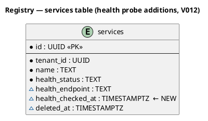
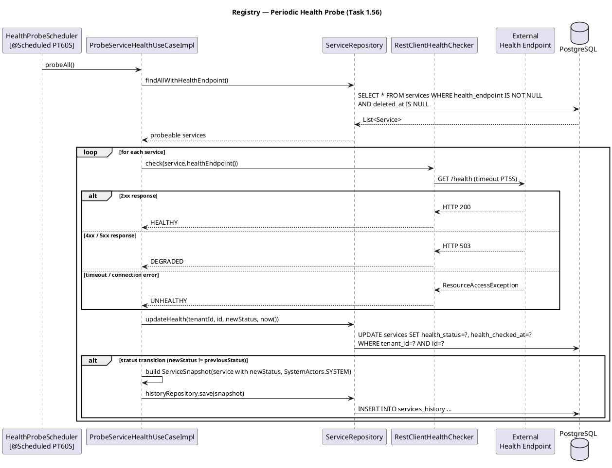
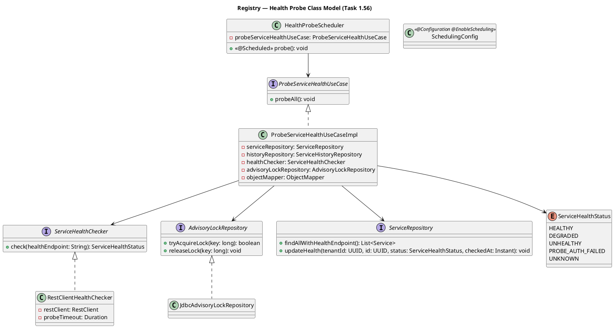

# Plan: Task 1.56 — Periodic health probe for non-K8s services

## Feature Summary

A `@Scheduled` task in the Registry service polls every service that has a `health_endpoint` configured, performs a short-timeout HTTP GET, and maps the result to `HEALTHY` (2xx), `DEGRADED` (non-auth 4xx/5xx), `PROBE_AUTH_FAILED` (401/403 — endpoint reachable but requires credentials not yet configured), or `UNHEALTHY` (timeout / connection error). On a health-status transition the probed service's `health_status` and `health_checked_at` are updated and a `services_history` snapshot is written. This closes the observability gap for services discovered via SCM or created manually that are not running in a Kubernetes cluster (K8s services get their status from the KubernetesWorker; this prober covers everything else).

---

## GitHub Workflow

### Issues

Create a new issue:
- **Title**: `US1.56 — Periodic health probe for non-K8s services`
- **Body / Acceptance criteria**:
  1. A `@Scheduled` task runs every 60 s (interval configurable via `registry.health.probe-interval`).
  2. Only services with `health_endpoint IS NOT NULL AND source IS DISTINCT FROM 'kubernetes' AND deleted_at IS NULL` are probed — K8s-managed services are excluded.
  3. An HTTP 2xx response sets `health_status = HEALTHY`.
  4. An HTTP 4xx or 5xx response (excluding 401 and 403) sets `health_status = DEGRADED`.
  4a. An HTTP 401 or 403 response sets `health_status = PROBE_AUTH_FAILED` — the service is reachable but requires authentication; credential storage and injection are deferred to Phase 2 (task 2.12a).
  5. A connection error or timeout sets `health_status = UNHEALTHY`.
  6. `health_checked_at` is updated on every probe regardless of status change.
  7. A `services_history` snapshot is written **only on a status transition** (not on every tick).
  8. `ServiceHealthStatus` enum includes the new `UNHEALTHY` and `PROBE_AUTH_FAILED` values; existing DB values continue to map correctly.
  9. If one service's probe fails unexpectedly, the scheduler logs WARN, marks that service UNHEALTHY, and continues probing remaining services.
  10. Under horizontal scaling, only one replica probes per interval — enforced via `pg_try_advisory_lock`.
  11. `health_endpoint` is validated for SSRF on create, update, and discovery-upsert: must be `https://` in production; private IP ranges (`10/8`, `172.16/12`, `192.168/16`, `127/8`, `169.254/16`, `::1`, `fd00::/8`) are always rejected; `http://` is permitted only when `registry.health.allow-http-endpoints=true`.
  12. `healthCheckedAt` is included in `ServiceResponse` (nullable).
  13. Integration test covers all three probe outcomes, snapshot-on-transition only, and the SSRF unit test covers all blocked and permitted URL patterns.
- **Milestone**: `Phase 1 — Gateway MVP auth + Registry`
- **Label**: `user-story`

### Branch

```
feat/1.56-health-probe
```

One branch — this task is self-contained in the Registry service.

### PR

- **Title**: `feat: periodic health probe for non-K8s services (1.56)`
- **Body** must include:
  - `Closes #<issue>`
  - Full E2E test strategy (below — do not repeat elsewhere in this document):

    **E2E Test Strategy**

    **Prerequisites**:
    - `docker compose up -d` — all services healthy (registry at `http://localhost:8081/actuator/health/ready`)
    - Postgres migration applied: `psql -h localhost -p 5436 -U cartogra -d cartogra -c "\d services"` confirms `health_checked_at` column exists
    - A tenant and auth token available (seed via existing dev fixtures or `POST /api/v1/auth/register`)

    **Steps**:
    1. Create a service with a reachable health endpoint:
       `POST http://localhost:8080/api/v1/services` body `{"name":"probe-test","healthEndpoint":"http://localhost:8081/actuator/health/live"}` — expect 201, `data.healthStatus = "unknown"`, `data.healthCheckedAt = null`
    2. Wait ~65 s (one probe interval) or call `probeAll()` directly via `HealthProbeSchedulerIT`.
    3. `GET http://localhost:8080/api/v1/services/{id}` — expect `healthStatus = "healthy"`, `healthCheckedAt` is non-null ISO-8601 timestamp.
    4. Verify a `services_history` row was written (status transition from `unknown` → `healthy`):
       `psql -c "SELECT health_status FROM services_history WHERE service_id='<id>' ORDER BY changed_at DESC LIMIT 1"` — expect `healthy`.
    5. Wait another probe interval (status unchanged). Verify `health_checked_at` advances but no new `services_history` row is added.
    6. Attempt to create a service with a private IP endpoint: `POST /api/v1/services` with `"healthEndpoint":"http://10.0.0.1/health"` — expect 422, `error.code = "INVALID_HEALTH_ENDPOINT"`.
    7. Run `./gradlew :services:registry:test` — all tests green (including `HealthProbeSchedulerIT`, `DefaultHealthEndpointValidatorTest`, `ProbeServiceHealthUseCaseImplTest`).
    8. Run `./gradlew build` from root — full CI-equivalent build green.

    **Passing signal**: Steps 1–5 complete without error; `healthStatus` transitions correctly; no duplicate history rows; step 6 returns 422; steps 7–8 show zero test failures.

    **Failure triage**:
    - `healthStatus` stays `"unknown"` after 65 s → check `docker compose logs registry` for scheduler startup (`@EnableScheduling`) and advisory lock acquisition (`pg_try_advisory_lock`).
    - `healthCheckedAt` null after probe → `JdbcServiceRepository.updateHealth()` SQL missing the column; check migration applied correctly.
    - Duplicate `services_history` rows on every tick → `ProbeServiceHealthUseCaseImpl` not comparing `newStatus != service.healthStatus()` before calling `historyRepository.save()`.
    - 422 not returned for `10.0.0.1` → `DefaultHealthEndpointValidator` not wired into create use case; check `CreateServiceUseCaseImpl` calls `validator.validate()`.
    - Build fails with `WireMock` class not found → `testImplementation("org.wiremock:wiremock-standalone:3.9.1")` missing from `build.gradle.kts`.

  - Full Acceptance Criteria list (copy the thirteen ACs from the Issues section verbatim into PR body)
- **Milestone**: `Phase 1 — Gateway MVP auth + Registry`
- CI must be green before requesting review.

### Commit and push approval

Per CLAUDE.md: never commit or push without Allan's explicit approval. Show diff summary + draft message and ask "OK to commit?" before every commit.

---

## Dependencies & Sequencing

- **Requires**: Task 1.55 landed — `V011__add_discovery_fields_to_services.sql` exists with `health_endpoint TEXT` on the `services` table. `ServiceHealthStatus` enum exists with at least `HEALTHY`, `DEGRADED`, `UNKNOWN`. `ServiceRepository.findAllWithHealthEndpoint()` and `ServiceRepository.updateHealth()` are NOT yet present (added by this task).
- **Order within plan**: single task — no internal sequencing required.
- **Unblocks**:
  - Phase 1 Gate: "Health: periodic prober updates `health_status` for services with `health_endpoint`; Catalog `health` filter returns non-empty results."
  - Task 1.64 — catalog UI wired to real API — benefits from seeing live `health_status` values.

---

## Per-Task Implementation

### Task 1.56 — Periodic health probe for non-K8s services

**What to build**: A hexagonally structured health-probe subsystem inside `services/registry`. The application layer owns a `ProbeServiceHealthUseCase` and a `ServiceHealthChecker` port. The infrastructure layer provides a `RestClientHealthChecker` (HTTP GET with configurable timeout) and a `HealthProbeScheduler` (`@Scheduled`). A Flyway migration adds `health_checked_at TIMESTAMPTZ`. The `ServiceHealthStatus` enum gains `UNHEALTHY` and `PROBE_AUTH_FAILED` (401/403 — reachable but auth required; Phase 2 will add credential storage). The `Service` record gains `healthCheckedAt`. `ServiceRepository` gains two new methods. `JdbcServiceRepository` implements them and is updated to persist/read `health_checked_at`.

**Files to create or modify**:

| File | Action | Notes |
|------|--------|-------|
| `services/registry/src/main/resources/db/migration/V012__add_health_checked_at_to_services.sql` | New | Adds `health_checked_at TIMESTAMPTZ`; partial index on probeable services |
| `services/registry/src/main/java/io/cartogra/registry/domain/ServiceHealthStatus.java` | Modify | Add `UNHEALTHY` and `PROBE_AUTH_FAILED`; update `fromString` |
| `services/registry/src/main/java/io/cartogra/registry/domain/Service.java` | Modify | Add `@Nullable Instant healthCheckedAt` as the 23rd record component |
| `services/registry/src/main/java/io/cartogra/registry/application/port/ServiceHealthChecker.java` | New | Plain-Java port interface: `ServiceHealthStatus check(String healthEndpoint)` |
| `services/registry/src/main/java/io/cartogra/registry/application/port/HealthEndpointValidator.java` | New | Plain-Java port interface: `void validate(String url)` — throws `InvalidHealthEndpointException` |
| `services/registry/src/main/java/io/cartogra/registry/application/repository/AdvisoryLockRepository.java` | New | `tryAcquireLock(long key): boolean` and `releaseLock(long key): void` — dedicated interface, not on `ServiceRepository` |
| `services/registry/src/main/java/io/cartogra/registry/infrastructure/validation/DefaultHealthEndpointValidator.java` | New | Enforces https-only + private-IP block via DNS resolution |
| `services/registry/src/main/java/io/cartogra/registry/domain/exception/InvalidHealthEndpointException.java` | New | Extends `RuntimeException`; carries the offending URL |
| `services/registry/src/main/java/io/cartogra/registry/application/usecase/ProbeServiceHealthUseCase.java` | New | Interface: `void probeAll()` |
| `services/registry/src/main/java/io/cartogra/registry/application/usecase/impl/ProbeServiceHealthUseCaseImpl.java` | New | Iterates probeable services, probes, updates, snapshots on transition |
| `services/registry/src/main/java/io/cartogra/registry/application/repository/ServiceRepository.java` | Modify | Add `findAllWithHealthEndpoint()` and `updateHealth(tenantId, id, status, checkedAt)` |
| `services/registry/src/main/java/io/cartogra/registry/infrastructure/jdbc/JdbcServiceRepository.java` | Modify | Implement new methods; add `health_checked_at` to `save()` SQL, `SERVICE_MAPPER`, `toParams()` |
| `services/registry/src/main/java/io/cartogra/registry/infrastructure/http/RestClientHealthChecker.java` | New | `RestClient` with configurable timeout; maps HTTP status and exceptions to `ServiceHealthStatus` |
| `services/registry/src/main/java/io/cartogra/registry/infrastructure/scheduled/HealthProbeScheduler.java` | New | `@Scheduled(fixedDelayString = "${registry.health.probe-interval:PT60S}")` → delegates to use case |
| `services/registry/src/main/java/io/cartogra/registry/config/SchedulingConfig.java` | New | `@Configuration @EnableScheduling` — mirrors ingestion's `SchedulingConfig` |
| `services/registry/src/main/java/io/cartogra/registry/config/HttpClientConfig.java` | New | Defines the `RestClient` bean used by `RestClientHealthChecker` |
| `services/registry/src/main/resources/application.yml` | Modify | Add `registry.health.probe-interval` and `registry.health.probe-timeout` config comments |
| `services/registry/src/main/java/io/cartogra/registry/application/usecase/impl/CreateServiceUseCaseImpl.java` | Modify | Add `null` for `healthCheckedAt` in `Service` constructor call |
| `services/registry/src/main/java/io/cartogra/registry/application/usecase/impl/UpdateServiceUseCaseImpl.java` | Modify | Preserve `healthCheckedAt` from existing record in update |
| `services/registry/src/main/java/io/cartogra/registry/application/usecase/impl/UpsertDiscoveredServiceUseCaseImpl.java` | Modify | Preserve/pass `healthCheckedAt` in both branches |
| `services/registry/src/main/java/io/cartogra/registry/infrastructure/jdbc/JdbcServiceRepository.java` | Modify | `upsertDiscovered()` also needs `healthCheckedAt` (null for new, preserve for update) |
| `services/registry/build.gradle.kts` | Modify | Add `testImplementation("org.wiremock:wiremock-standalone:3.9.1")` |
| `services/registry/src/test/java/io/cartogra/registry/infrastructure/scheduled/HealthProbeSchedulerIT.java` | New | IT covering all three response classes + 401/403 |
| `services/registry/src/test/java/io/cartogra/registry/infrastructure/http/RestClientHealthCheckerTest.java` | New | Unit test for all status mappings including 401/403 |
| `docs/diagrams/registry/health-probe-sequence.puml` | New | Sequence diagram |
| `docs/diagrams/registry/health-probe-class.puml` | New | Class diagram of the probe subsystem |
| `docs/execution-checklist.md` | Modify | Mark `1.56` done |

**Key signatures**:

```java
// application/port/ServiceHealthChecker.java — port in the application ring
public interface ServiceHealthChecker {
    ServiceHealthStatus check(String healthEndpoint);
}

// application/usecase/ProbeServiceHealthUseCase.java
public interface ProbeServiceHealthUseCase {
    void probeAll();
}

// application/repository/ServiceRepository.java — two new methods
List<Service> findAllWithHealthEndpoint();  // cross-tenant; excludes source='kubernetes'
void updateHealth(UUID tenantId, UUID id, ServiceHealthStatus status, Instant checkedAt);

// infrastructure/http/RestClientHealthChecker.java — status mapping
// 2xx           → HEALTHY           (no exception)
// 401 / 403     → PROBE_AUTH_FAILED  (HttpClientErrorException — auth required; no credential support until Phase 2 task 2.12a)
// other 4xx/5xx → DEGRADED          (HttpClientErrorException / HttpServerErrorException)
// timeout / refused → UNHEALTHY     (ResourceAccessException)
```

**Critical constraints**:

- `ServiceHealthChecker` is a plain-Java interface in the `application/port/` layer — no Spring imports.
- `HealthEndpointValidator` is also a plain-Java interface in `application/port/`; its implementation (`DefaultHealthEndpointValidator`) lives in `infrastructure/validation/`.
- `HealthEndpointValidator.validate()` is called in **all three write paths**: `CreateServiceUseCaseImpl`, `UpdateServiceUseCaseImpl`, and `UpsertDiscoveredServiceUseCaseImpl`. Discovery-sourced URLs are attacker-influenced via repo metadata and must be validated.
- `findAllWithHealthEndpoint()` has no `tenantId` parameter — the scheduler is a system-level operation across all tenants. PostgreSQL RLS is NOT active during this call (RLS requires `app.current_tenant_id` to be set). The query must use a direct filter (`health_endpoint IS NOT NULL AND deleted_at IS NULL`) without relying on RLS.
- `updateHealth()` must include `tenant_id` in its WHERE clause to preserve tenant isolation at the SQL level even though the scheduler calls it in a loop (defense in depth).
- `historyRepository.save()` is called only when `newStatus != service.healthStatus()` (enum equality). Do not snapshot every probe tick.
- Snapshot is built from the in-memory `Service` record with `newStatus` and `checkedAt` substituted — no re-fetch from DB. The probe is the sole writer for `health_status` on non-K8s services, so in-memory state is accurate.
- Each service probe is wrapped in a `try/catch(Exception e)`. On unexpected failure: log `WARN` with `serviceId` and `tenantId`, call `updateHealth(UNHEALTHY, now())`, continue to the next service. One bad service must never abort the entire probe round.
- `probeAll()` acquires `pg_try_advisory_lock` at the start and releases it in a `finally` block. If the lock is already held (another replica is probing), log DEBUG and return immediately — do not probe. Lock key: `pg_try_advisory_lock(hashtext('cartogra.registry.health-probe'))` — stable, human-readable, documented in code comment. Advisory lock methods live in a **dedicated `AdvisoryLockRepository` interface** (in `application/repository/`) with `JdbcAdvisoryLockRepository` as the implementation — NEVER on `ServiceRepository` (advisory locks are an infrastructure coordination concern, not part of the `Service` aggregate).
- `health_checked_at` is updated **always** (even when status does not change) so operators can tell when the last successful probe ran.
- The `RestClient` for health probing must **not** reuse any gateway/registry client beans — it is a purpose-built bean with a short timeout (default 5 s) to avoid blocking the scheduler thread.
- NEVER hard-code the probe timeout — use `@Value("${registry.health.probe-timeout:PT5S}")`.
- The `@Scheduled` annotation must use `fixedDelayString` (not `fixedRateString`) to avoid overlapping probe rounds if a round takes longer than the interval.
- `@EnableScheduling` goes in a dedicated `SchedulingConfig` class, not on `RegistryApplication` — mirrors ingestion.
- `SystemActors.SYSTEM` UUID must be used as `changedBy` in history snapshots written by the probe.
- **Known gap — authenticated health endpoints**: `PROBE_AUTH_FAILED` signals that an endpoint requires auth but no credential is configured. Phase 2 task 2.12a will add per-service encrypted `health_endpoint_bearer_token` storage and inject it at probe time. Until then, operators must expose a public unauthenticated health path or accept `PROBE_AUTH_FAILED` as the steady state for auth-gated endpoints.
- `DefaultHealthEndpointValidator` blocks: non-http(s) schemes, private IPv4 ranges (`10/8`, `172.16/12`, `192.168/16`, `127/8`), link-local (`169.254/16`), private IPv6 (`::1`, `fd00::/8`), and `http://` when `registry.health.allow-http-endpoints=false`. The `allow-http-endpoints` flag defaults to `false`; `application-dev.yml` sets it `true`.
- **Hostname resolution at validation time**: after parsing the URL, call `InetAddress.getAllByName(host)` and check every resolved address against the blocked ranges. If any resolved address is blocked, throw `InvalidHealthEndpointException`. If DNS resolution fails, log WARN and throw. This prevents DNS-based SSRF bypass (e.g. `evil.attacker.com` → `10.0.0.1`). DNS rebinding after write time is an accepted residual risk — document with a code comment; the probe is a read-only GET with a 5 s timeout, so the blast radius of a successful rebinding attack is negligible.

---

## Schema Changes

### V012 — `add_health_checked_at_to_services`

**File**: `services/registry/src/main/resources/db/migration/V012__add_health_checked_at_to_services.sql`
(Confirmed next number: V011 is the current latest.)

**Tables modified**: `services` — adds one nullable column and one partial index.

**ER diagram stub**: `docs/diagrams/registry/health-probe-er.puml`



**Migration content**:

```sql
-- V012__add_health_checked_at_to_services.sql
ALTER TABLE services
    ADD COLUMN health_checked_at TIMESTAMPTZ;

-- Partial index accelerates the scheduler's query for probeable services
CREATE INDEX ON services (tenant_id)
    WHERE health_endpoint IS NOT NULL
      AND source IS DISTINCT FROM 'kubernetes'
      AND deleted_at IS NULL;
```

**Rollback**: `ALTER TABLE services DROP COLUMN health_checked_at;` + drop the index (or restore a DB backup). No dependent views or FK constraints.

---

## Env Vars Delta

| Var | Service(s) | `.env.example` default | `application-dev.yml` value | Notes |
|-----|-----------|------------------------|------------------------------|-------|
| `REGISTRY_HEALTH_PROBE_INTERVAL` | registry | `PT60S` | `PT60S` | Fixed-delay between probe rounds; ISO-8601 duration |
| `REGISTRY_HEALTH_PROBE_TIMEOUT` | registry | `PT5S` | `PT5S` | Per-endpoint HTTP connect+read timeout; ISO-8601 duration |
| `REGISTRY_HEALTH_ALLOW_HTTP_ENDPOINTS` | registry | `false` | `true` | Allows `http://` health endpoints; must be `false` in production |

`application.yml` additions:

```yaml
registry:
  health:
    probe-interval: ${REGISTRY_HEALTH_PROBE_INTERVAL:PT60S}
    probe-timeout: ${REGISTRY_HEALTH_PROBE_TIMEOUT:PT5S}
    allow-http-endpoints: ${REGISTRY_HEALTH_ALLOW_HTTP_ENDPOINTS:false}
```

`application-dev.yml` addition:

```yaml
registry:
  health:
    allow-http-endpoints: true
```

---

## Test Strategy

**Unit tests** (no containers):
- `ServiceHealthStatusTest`: verify `fromString` maps `"unhealthy"` → `UNHEALTHY`, `"healthy"` → `HEALTHY`, `"degraded"` → `DEGRADED`, `"probe_auth_failed"` → `PROBE_AUTH_FAILED`, `""` or unknown → `UNKNOWN`.
- `RestClientHealthCheckerTest` (no containers; use `MockRestServiceServer`): HTTP 200 → `HEALTHY`; HTTP 401 → `PROBE_AUTH_FAILED`; HTTP 403 → `PROBE_AUTH_FAILED`; HTTP 503 → `DEGRADED`; HTTP 404 → `DEGRADED`; connect timeout → `UNHEALTHY`.
- `DefaultHealthEndpointValidatorTest`: no containers; covers:
  - `https://api.example.com/health` → passes (production mode)
  - `http://api.example.com/health` + `allow-http=false` → `InvalidHealthEndpointException`
  - `http://api.example.com/health` + `allow-http=true` → passes
  - `http://10.0.0.1/health` → blocked (private IPv4, any mode)
  - `http://172.16.0.1/health` → blocked
  - `http://192.168.1.1/health` → blocked
  - `http://127.0.0.1/health` → blocked
  - `http://169.254.169.254/health` → blocked (link-local / AWS metadata)
  - `ftp://example.com/health` → blocked (non-http scheme)
  - `not-a-url` → blocked (unparseable)
  - hostname that resolves to `10.0.0.1` (mocked via `InetAddress`) → blocked (DNS-based SSRF bypass)
- `ProbeServiceHealthUseCaseImplTest`: mock all dependencies. Verify:
  - Lock not acquired → `findAllWithHealthEndpoint` never called; method returns immediately.
  - Status unchanged → `updateHealth` called, `historyRepository.save` NOT called.
  - Status changed → both `updateHealth` and `historyRepository.save` called with in-memory snapshot.
  - Unexpected exception in one probe → WARN logged, that service marked UNHEALTHY, next service still probed.
  - Lock always released in `finally` block even when exception occurs.

**Integration tests** (Testcontainers):
- **Containers needed**: Postgres (from `shared:test-support`), WireMock (embedded in-process — `WireMockServer`), no Kafka required (Kafka is mocked via `@MockitoBean ServiceLifecycleEventProducer`).
- **Class**: `HealthProbeSchedulerIT`

  | Scenario | AC | Assertions |
  |---|---|---|
  | WireMock stub returns HTTP 200 | AC-3, AC-6, AC-7 | `health_status = 'healthy'`, `health_checked_at` set; snapshot written (transition from `unknown`) |
  | WireMock stub returns HTTP 503 | AC-4, AC-6, AC-7 | `health_status = 'degraded'`, `health_checked_at` set; snapshot written on transition |
  | WireMock stub returns HTTP 401 | AC-4a, AC-6, AC-7 | `health_status = 'probe_auth_failed'`, `health_checked_at` set; snapshot written on transition from `unknown` |
  | WireMock stub returns HTTP 403 | AC-4a, AC-6, AC-7 | `health_status = 'probe_auth_failed'`, `health_checked_at` set |
  | WireMock stub delays > probe timeout | AC-5, AC-6, AC-7 | `health_status = 'unhealthy'`, `health_checked_at` set; snapshot written on transition |
  | Same status on second probe | AC-7 | No new `services_history` row; `health_checked_at` advances |
  | K8s-sourced service with `health_endpoint` set | AC-2 | `probeAll()` never calls `check()` for `source='kubernetes'` services |
  | Advisory lock already held (simulate via second connection) | AC-10 | Lock acquired by connection A; `probeAll()` on connection B skips entire round; `health_status` unchanged |

  **Setup**: In `@BeforeEach`, start a `WireMockServer` on a random port. Seed `services` rows **directly via `NamedParameterJdbcTemplate`** (bypass the use case — localhost is a private IP and would be rejected by `HealthEndpointValidator`). Set `health_endpoint = "http://localhost:{port}/health"` and `health_status = 'unknown'`. Inject `ProbeServiceHealthUseCase` as `@Autowired` and call `probeAll()` directly (do not rely on `@Scheduled` firing in tests). `HealthEndpointValidator` is tested separately in `DefaultHealthEndpointValidatorTest` (unit test, no containers).
  
  **Timeout configuration in tests**: Pass `registry.health.probe-timeout=PT500MS` via `@SpringBootTest(properties = {...})` so WireMock's 1 000 ms fixed delay triggers UNHEALTHY before the test times out.

**What NOT to test here**:
- The Kafka publication path — the scheduler does not publish Kafka events (health status changes are visible via the REST API, not Kafka, in Phase 1). Kafka events for health changes are a Phase 2+ concern.
- Frontend display — covered by task 1.64.

---

## New Error Codes

| Constant | HTTP Status | When emitted |
|----------|-------------|--------------|
| `INVALID_HEALTH_ENDPOINT` | 422 | `health_endpoint` fails SSRF validation on create/update (private IP, non-https in production, unparseable URL) |

---

## Postman Collection

**Service**: registry  
**Collection file**: `postman/registry.postman_collection.json`  
**Action**: No Postman requests — internal scheduler with no new external HTTP surface. The effect of the probe (updated `health_status`) is observable via the existing `GET /v1/services/{id}` request already present in the collection.

---

## Documentation

### PlantUML Diagrams

| File | Type | Trigger |
|------|------|---------|
| `docs/diagrams/registry/health-probe-sequence.puml` | Sequence | New use case / scheduled flow |
| `docs/diagrams/registry/health-probe-class.puml` | Class | New domain/application/infrastructure types |
| `docs/diagrams/registry/health-probe-er.puml` | ER | New `health_checked_at` column |

**`health-probe-sequence.puml`** (full stub):



**`health-probe-class.puml`** (full stub):



### ADR

N/A — no new architectural decision. The scheduler pattern is already established by `StaleJobReaperScheduler` in ingestion (task 1.39a). The use of `RestClient` for outbound HTTP is aligned with the existing approved approach.

### OpenAPI

**File**: `docs/api/registry.openapi.yaml`  
**Action**: Extend existing — add `healthCheckedAt` (nullable, `date-time` format) to the `ServiceResponse` schema component. No new paths or methods.

---

## Rollback Plan

**Schema**: If the migration must be reverted:

```sql
-- Remove the column and its derived index
ALTER TABLE services DROP COLUMN health_checked_at;
-- The partial index on (tenant_id) WHERE health_endpoint IS NOT NULL AND deleted_at IS NULL
-- is automatically dropped when the table structure is reverted.
```

To restore locally: `docker compose down -v && docker compose up -d` will recreate a clean database and re-run migrations from V001. No data is lost that was not already temporary dev data.

**Code**: Revert the branch — no persistent state change beyond the schema column (covered above).

---

## Verification Script

After implementing, run these steps before asking for commit approval:

1. `docker compose up -d` — confirm registry healthy at `http://localhost:8081/actuator/health/ready`.
2. Confirm migration applied: `psql -h localhost -p 5436 -U cartogra -d cartogra -c "\d registry.services"` — `health_checked_at` column present.
3. Seed a service with a real health endpoint: `POST http://localhost:8080/api/v1/services` with `"health_endpoint": "http://localhost:8081/actuator/health/live"`.
4. Wait ~65 s (one probe interval) or invoke `probeAll()` directly in a test.
5. `GET http://localhost:8080/api/v1/services/{id}` — `healthStatus` must be `HEALTHY`.
6. Run `./gradlew :services:registry:test` — all tests green, including `HealthProbeSchedulerIT`.
7. Run `./gradlew build` from root — CI-equivalent local build must be green.

---

## BIP

N/A — task 1.56 is an internal background task with no public-facing surface worth a standalone BIP artifact. The health probe is part of the larger Phase 1 story (service auto-discovery + health monitoring) covered by existing or upcoming BIP tasks (1.49, 1.52).

---

## Files Created / Modified

| File | Action | Task |
|------|--------|------|
| `services/registry/src/main/resources/db/migration/V012__add_health_checked_at_to_services.sql` | New | 1.56 |
| `services/registry/src/main/java/io/cartogra/registry/domain/ServiceHealthStatus.java` | Modify | 1.56 |
| `services/registry/src/main/java/io/cartogra/registry/domain/Service.java` | Modify | 1.56 |
| `services/registry/src/main/java/io/cartogra/registry/application/port/ServiceHealthChecker.java` | New | 1.56 |
| `services/registry/src/main/java/io/cartogra/registry/application/port/HealthEndpointValidator.java` | New | 1.56 |
| `services/registry/src/main/java/io/cartogra/registry/application/repository/AdvisoryLockRepository.java` | New | 1.56 |
| `services/registry/src/main/java/io/cartogra/registry/application/usecase/ProbeServiceHealthUseCase.java` | New | 1.56 |
| `services/registry/src/main/java/io/cartogra/registry/application/usecase/impl/ProbeServiceHealthUseCaseImpl.java` | New | 1.56 |
| `services/registry/src/main/java/io/cartogra/registry/application/repository/ServiceRepository.java` | Modify | 1.56 |
| `services/registry/src/main/java/io/cartogra/registry/infrastructure/jdbc/JdbcServiceRepository.java` | Modify | 1.56 |
| `services/registry/src/main/java/io/cartogra/registry/infrastructure/http/RestClientHealthChecker.java` | New | 1.56 |
| `services/registry/src/main/java/io/cartogra/registry/infrastructure/scheduled/HealthProbeScheduler.java` | New | 1.56 |
| `services/registry/src/main/java/io/cartogra/registry/config/SchedulingConfig.java` | New | 1.56 |
| `services/registry/src/main/java/io/cartogra/registry/config/HttpClientConfig.java` | New | 1.56 |
| `services/registry/src/main/java/io/cartogra/registry/application/repository/AdvisoryLockRepository.java` | New | 1.56 |
| `services/registry/src/main/java/io/cartogra/registry/infrastructure/jdbc/JdbcAdvisoryLockRepository.java` | New | 1.56 |
| `services/registry/src/main/resources/application.yml` | Modify | 1.56 |
| `services/registry/src/main/resources/application-dev.yml` | Modify | 1.56 |
| `services/registry/src/main/java/io/cartogra/registry/api/dto/ServiceResponse.java` | Modify | 1.56 |
| `services/registry/src/main/java/io/cartogra/registry/api/mapper/ServiceMapper.java` | Modify | 1.56 |
| `docs/api/registry.openapi.yaml` | Modify | 1.56 |
| `services/registry/src/main/java/io/cartogra/registry/application/usecase/impl/CreateServiceUseCaseImpl.java` | Modify | 1.56 |
| `services/registry/src/main/java/io/cartogra/registry/application/usecase/impl/UpdateServiceUseCaseImpl.java` | Modify | 1.56 |
| `services/registry/src/main/java/io/cartogra/registry/application/usecase/impl/UpsertDiscoveredServiceUseCaseImpl.java` | Modify | 1.56 |
| `services/registry/build.gradle.kts` | Modify | 1.56 |
| `services/registry/src/test/java/io/cartogra/registry/infrastructure/scheduled/HealthProbeSchedulerIT.java` | New | 1.56 |
| `services/registry/src/test/java/io/cartogra/registry/infrastructure/validation/DefaultHealthEndpointValidatorTest.java` | New | 1.56 |
| `services/registry/src/test/java/io/cartogra/registry/infrastructure/http/RestClientHealthCheckerTest.java` | New | 1.56 |
| `services/registry/src/test/java/io/cartogra/registry/application/usecase/impl/ProbeServiceHealthUseCaseImplTest.java` | New | 1.56 |
| `docs/diagrams/registry/health-probe-sequence.puml` | New | 1.56 |
| `docs/diagrams/registry/health-probe-class.puml` | New | 1.56 |
| `docs/diagrams/registry/health-probe-er.puml` | New | 1.56 |
| `docs/execution-checklist.md` | Mark done | 1.56 |

---

## Checklist Items to Mark Done

After all work is implemented and verified:

- Change `[ ]` to `[x]` in `docs/execution-checklist.md` for task: `1.56`
