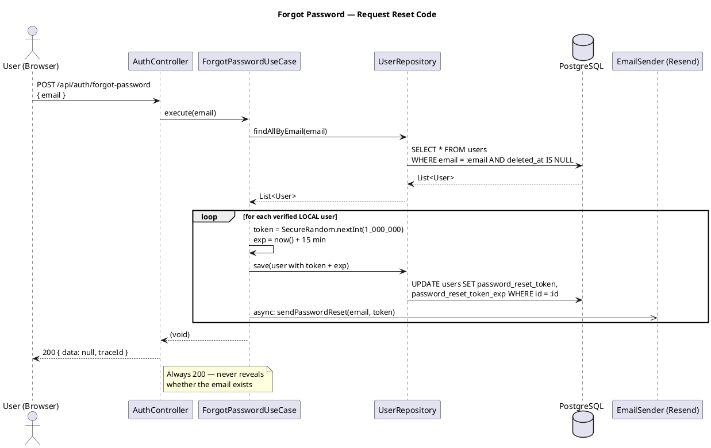
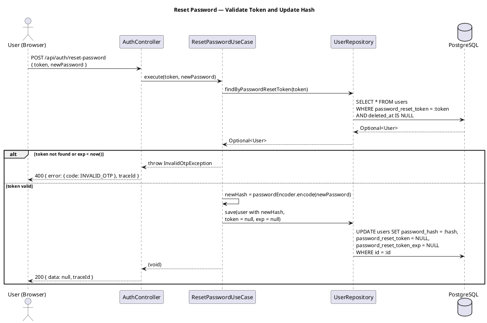

# Plan: Task 1.61 — Password Reset End-to-End

## Feature Summary

Task 1.61 completes the password reset vertical in the gateway service. The backend skeleton (use cases, controller endpoints, DB schema, frontend routes) already exists; this task delivers the remaining correctness fixes, PasswordEncoder extraction, and integration test coverage that make the feature shippable. The user-visible outcome is a working self-service password recovery flow: a verified user requests a reset code, receives it by email via Resend, and exchanges it for a new password on a dedicated UI route excluded from the auth guard.

---

## GitHub Workflow

### Issues

No existing issue covers 1.61. Create:

- **Title**: `US1.61 — Password reset end-to-end`
- **Acceptance criteria**:
  - AC-1: `POST /api/auth/forgot-password` with a verified user's email returns 200 and dispatches a reset code via Resend
  - AC-2: `POST /api/auth/forgot-password` with an unknown or unverified email still returns 200 (no account enumeration)
  - AC-3: `POST /api/auth/reset-password` with a valid token and new password returns 200; subsequent login with the new password succeeds
  - AC-4: `POST /api/auth/reset-password` with an expired token returns 400 with a non-empty `error.code`
  - AC-5: `POST /api/auth/reset-password` with an unknown token returns 400
  - AC-6: More than 10 requests to `/api/auth/forgot-password` from the same IP within burst returns 429
  - AC-7: `ForgotPasswordUseCaseImpl` generates tokens using `SecureRandom`, not `Math.random()`
  - AC-8: `PasswordEncoder` is a shared Spring bean injected via constructor into `Login`, `Register`, and `ResetPassword` use cases
- **Milestone**: `Phase 1 — Registry Core`

### Branch

```
feat/1.61-password-reset
```

### PR

- **Title**: `feat: password reset end-to-end (1.61)`
- **Body must include**:
  - `Closes #<issue>`
  - Full E2E test strategy (copy from Test Strategy section verbatim)
  - Full Acceptance Criteria list (copy from Issues section above)
- **Milestone**: Phase 1 — Registry Core
- CI must be green (build + tests) before requesting review

### Commit and push approval

Per CLAUDE.md: never commit or push without Allan's explicit approval. Show diff summary + draft message and ask "OK to commit?" before every commit.

---

## Dependencies & Sequencing

- **Requires**: gateway compiles; `AbstractGatewayIT` base class exists with real Postgres + Redis Testcontainers — both already true.
- **Order within plan**: All changes are in the gateway service. Suggested order: (1) `SecurityConfig` bean, (2) use case injection fixes, (3) `SecureRandom` fix, (4) ITs, (5) PlantUML diagrams, (6) Postman requests.
- **Unblocks**: 1.63 (user profile management) which links "Change password" to `/forgot-password` and assumes the reset flow is stable.

---

## Per-Task Implementation

### Task 1.61 — Password reset end-to-end

**What to build**: Fix three correctness issues in the existing password reset skeleton — replace `Math.random()` with `SecureRandom` in the token generator, extract a shared `@Bean PasswordEncoder` into `SecurityConfig` and constructor-inject it into the three use cases that currently instantiate `BCryptPasswordEncoder` directly, and add three integration tests covering the happy path, expired token, and rate-limit scenarios. Produce two PlantUML sequence diagrams and extend the Postman collection.

**Files to create or modify**:

| File | Action | Notes |
|------|--------|-------|
| `services/gateway/src/main/java/io/cartogra/gateway/config/SecurityConfig.java` | Modify | Add `@Bean PasswordEncoder` returning `new BCryptPasswordEncoder()` |
| `services/gateway/src/main/java/io/cartogra/gateway/application/impl/ForgotPasswordUseCaseImpl.java` | Modify | Replace `Math.random()` with `SecureRandom.nextInt(1_000_000)`; make instance `static final` |
| `services/gateway/src/main/java/io/cartogra/gateway/application/impl/ResetPasswordUseCaseImpl.java` | Modify | Remove direct construction; inject `PasswordEncoder` via constructor |
| `services/gateway/src/main/java/io/cartogra/gateway/application/impl/LoginUseCaseImpl.java` | Modify | Remove direct construction; inject `PasswordEncoder` via constructor |
| `services/gateway/src/main/java/io/cartogra/gateway/application/impl/RegisterUserUseCaseImpl.java` | Modify | Remove direct construction; inject `PasswordEncoder` via constructor |
| `services/gateway/src/test/java/io/cartogra/gateway/api/AuthControllerIT.java` | Modify | Add three IT methods; inject `NamedParameterJdbcTemplate` |
| `docs/diagrams/gateway/forgot-password-sequence.puml` | New | Sequence diagram for forgot-password use case |
| `docs/diagrams/gateway/reset-password-sequence.puml` | New | Sequence diagram for reset-password use case |
| `postman/gateway.postman_collection.json` | Modify | Add two requests to the Auth folder |

**Key signatures**:

```java
// SecurityConfig.java — new bean
@Bean
public PasswordEncoder passwordEncoder() {
    return new BCryptPasswordEncoder();
}

// ForgotPasswordUseCaseImpl.java — corrected generator
private static final SecureRandom SECURE_RANDOM = new SecureRandom();

private String generateToken() {
    return String.format("%06d", SECURE_RANDOM.nextInt(1_000_000));
}

// ResetPasswordUseCaseImpl.java — constructor after fix
public ResetPasswordUseCaseImpl(UserRepository userRepository, PasswordEncoder passwordEncoder) {
    this.userRepository = userRepository;
    this.passwordEncoder = passwordEncoder;
}
```

**Critical constraints**:

- Constructor injection only — NEVER `@Autowired` field injection or direct `new` in Spring beans
- `PasswordEncoder` field type must be the `org.springframework.security.crypto.password.PasswordEncoder` interface, not `BCryptPasswordEncoder` concretely
- `SecureRandom` instance must be `static final` — do not create a new instance per call (expensive seeding)
- IT test setup inserts rows directly via `NamedParameterJdbcTemplate`; assertions go through the HTTP layer only — never assert on DB state directly
- The `@BeforeEach` in `AbstractGatewayIT` already flushes `rate_limit:*` Redis keys; no additional cleanup needed in the rate-limit IT

---

## Schema Changes

N/A — `password_reset_token TEXT` and `password_reset_token_exp TIMESTAMPTZ` columns already exist in `services/gateway/src/test/resources/db/test-schema.sql`. The gateway has no Flyway migrations of its own; it mirrors the registry schema via that test-schema file. No migration needed.

---

## Env Vars Delta

N/A — all required configuration (`RESEND_API_KEY`, `RESEND_FROM`, rate-limit properties) is already wired.

---

## Test Strategy

**Unit tests**: N/A — use case logic is covered at the IT layer where real Postgres and Redis run.

**Integration tests** (Testcontainers — Postgres + Redis via `AbstractGatewayIT`):

Inject `NamedParameterJdbcTemplate` at the `AuthControllerIT` class level for SQL setup. Helper: a private `insertVerifiedUser(String email, UUID tenantId)` method that inserts a tenant row + a verified `LOCAL` user row with a bcrypt-hashed password.

**IT 1 — Happy path** (covers AC-1, AC-3):
1. `insertVerifiedUser(email, tenantId)` — direct SQL.
2. `POST /api/auth/forgot-password { email }` → assert 200, envelope present, `traceId` matches `/^[0-9a-f]{32}$/`.
3. Read `password_reset_token` from `users` table via `jdbc`.
4. `POST /api/auth/reset-password { token, newPassword }` → assert 200, envelope present.
5. `POST /api/auth/login { email, tenantId, password: newPassword }` → assert 200, `data.accessToken` present.

**IT 2 — Expired token** (covers AC-4):
1. `insertVerifiedUser(email, tenantId)` with `password_reset_token = '999999'` and `password_reset_token_exp = now() - interval '1 hour'` set via a follow-up SQL UPDATE.
2. `POST /api/auth/reset-password { token: "999999", newPassword }` → assert 400, `error.code` non-empty, `traceId` present.

**IT 3 — Rate limit** (covers AC-6):
1. No DB setup needed — the endpoint always returns 200 for unknown emails.
2. Fire 11 `POST /api/auth/forgot-password` requests in a loop.
3. Assert the 11th response is 429.
4. Assert the 429 response includes a `Retry-After` header.

**Prior art**: `AuthControllerIT.registerNewUserReturns201()` and `registerAndExtractTenantId` show the MockMvc + JSON path pattern.

**What NOT to test here**: Frontend form validations (password match, 8-char minimum) are exercised by the TanStack Forms wiring and not duplicated in ITs.

---

## New Error Codes

N/A — `InvalidOtpException` already maps to 400 with `error.code = "INVALID_OTP"` via the existing `@RestControllerAdvice`. No new codes required.

---

## Postman Collection

**Service**: gateway
**Collection file**: `postman/gateway.postman_collection.json`
**Action**: Extend existing — add two requests to the `Auth` folder `item` array.

> **Note**: The existing collection uses `/v1/auth/...` paths; the `AuthController` is mounted at `/api/auth/...` (confirmed correct). New requests use `/api/auth/...`. Reconciling the prefix on existing requests is out of scope for 1.61.

### New requests

**Forgot Password**:

```json
{
  "name": "AC-1 — Forgot Password (always 200)",
  "request": {
    "method": "POST",
    "header": [],
    "body": {
      "mode": "raw",
      "raw": "{\n  \"email\": \"{{testEmail}}\"\n}",
      "options": { "raw": { "language": "json" } }
    },
    "url": {
      "raw": "{{gateway-url}}/api/auth/forgot-password",
      "host": ["{{gateway-url}}"],
      "path": ["api", "auth", "forgot-password"]
    }
  },
  "event": [{
    "listen": "test",
    "script": {
      "exec": [
        "pm.test(\"status is 200\", () => pm.expect(pm.response.code).to.equal(200));",
        "pm.test(\"envelope present\", () => { pm.expect(pm.response.json()).to.have.property(\"data\"); pm.expect(pm.response.json()).to.have.property(\"traceId\"); });",
        "pm.test(\"traceId is 32 lowercase hex\", () => pm.expect(pm.response.json().traceId).to.match(/^[0-9a-f]{32}$/));",
        "pm.test(\"X-Trace-Id header matches body traceId\", () => pm.expect(pm.response.headers.get(\"X-Trace-Id\")).to.equal(pm.response.json().traceId));"
      ],
      "type": "text/javascript"
    }
  }]
}
```

**Reset Password**:

```json
{
  "name": "AC-3 — Reset Password (valid token)",
  "request": {
    "method": "POST",
    "header": [],
    "body": {
      "mode": "raw",
      "raw": "{\n  \"token\": \"{{resetToken}}\",\n  \"newPassword\": \"{{newPassword}}\"\n}",
      "options": { "raw": { "language": "json" } }
    },
    "url": {
      "raw": "{{gateway-url}}/api/auth/reset-password",
      "host": ["{{gateway-url}}"],
      "path": ["api", "auth", "reset-password"]
    }
  },
  "event": [{
    "listen": "test",
    "script": {
      "exec": [
        "pm.test(\"status is 200\", () => pm.expect(pm.response.code).to.equal(200));",
        "pm.test(\"envelope present\", () => { pm.expect(pm.response.json()).to.have.property(\"data\"); pm.expect(pm.response.json()).to.have.property(\"traceId\"); });",
        "pm.test(\"traceId is 32 lowercase hex\", () => pm.expect(pm.response.json().traceId).to.match(/^[0-9a-f]{32}$/));",
        "pm.test(\"X-Trace-Id header matches body traceId\", () => pm.expect(pm.response.headers.get(\"X-Trace-Id\")).to.equal(pm.response.json().traceId));"
      ],
      "type": "text/javascript"
    }
  }]
}
```

---

## Documentation

### PlantUML Diagrams

| File | Type | Trigger |
|------|------|---------|
| `docs/diagrams/gateway/forgot-password-sequence.puml` | Sequence | New use case flow |
| `docs/diagrams/gateway/reset-password-sequence.puml` | Sequence | New use case flow |

**`forgot-password-sequence.puml`**:



**`reset-password-sequence.puml`**:



### ADR

N/A — ADR-0010 (gateway sole token issuer) and ADR-0011 (httpOnly cookie + Bearer) cover the relevant decisions. The `SecureRandom` fix and `PasswordEncoder` extraction are implementation corrections, not new architectural decisions.

### OpenAPI

N/A — `POST /api/auth/forgot-password` and `POST /api/auth/reset-password` already exist in the gateway's OpenAPI spec. No new paths, methods, or response shapes are introduced.

---

## Rollback Plan

Revert the branch — no schema migrations are involved and no persistent state changes outside the gateway process.

---

## Verification Script

1. `./gradlew :services:gateway:test` — all tests green, including the three new ITs in `AuthControllerIT`.
2. `./gradlew :services:gateway:build` — build succeeds, no compilation errors across the five modified files.
3. `docker compose up` — gateway reports healthy at `http://localhost:8080/actuator/health/ready`.
4. Open `http://localhost:3000/forgot-password` — page loads without redirect to `/login`.
5. Submit any email on `/forgot-password` — page shows a success message.
6. Open `http://localhost:3000/reset-password` directly — page loads without redirect.
7. Verify PlantUML renders: paste each `.puml` file into the PlantUML online server and confirm no syntax errors.

---

## BIP

N/A — task 1.61 is not tagged `[BIP]`.

---

## Files Created / Modified

| File | Action | Task |
|------|--------|------|
| `services/gateway/src/main/java/io/cartogra/gateway/config/SecurityConfig.java` | Modify | 1.61 |
| `services/gateway/src/main/java/io/cartogra/gateway/application/impl/ForgotPasswordUseCaseImpl.java` | Modify | 1.61 |
| `services/gateway/src/main/java/io/cartogra/gateway/application/impl/ResetPasswordUseCaseImpl.java` | Modify | 1.61 |
| `services/gateway/src/main/java/io/cartogra/gateway/application/impl/LoginUseCaseImpl.java` | Modify | 1.61 |
| `services/gateway/src/main/java/io/cartogra/gateway/application/impl/RegisterUserUseCaseImpl.java` | Modify | 1.61 |
| `services/gateway/src/test/java/io/cartogra/gateway/api/AuthControllerIT.java` | Modify | 1.61 |
| `docs/diagrams/gateway/forgot-password-sequence.puml` | New | 1.61 |
| `docs/diagrams/gateway/reset-password-sequence.puml` | New | 1.61 |
| `postman/gateway.postman_collection.json` | Modify | 1.61 |
| `docs/execution-checklist.md` | Mark done | 1.61 |

---

## Checklist Items to Mark Done

After all work is implemented and verified:

- Change `[ ]` to `[x]` in `docs/execution-checklist.md` for task: **1.61**
