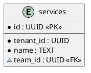
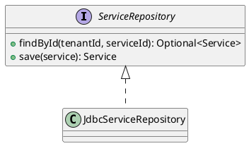
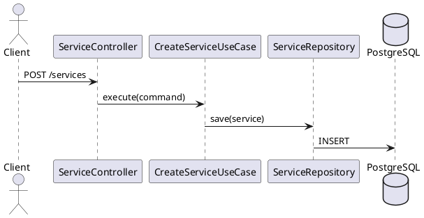

# Development Workflow Rules

## Checklist-driven branch / PR / issue flow

Every implementation task from `docs/execution-checklist.md` MUST follow this workflow — no exceptions.

### Step-by-step

1. **Create (or reuse) a GitHub issue** for the user story being addressed:
   - Title: `USx.y — <story title>` (e.g. `US0.3 — Registry applies baseline schema`)
   - Body: acceptance criteria from `docs/plan.md`
   - Assign to the correct milestone: `Phase N — <name>`
   - Add to the Cartogra Roadmap project and set the Phase field

2. **Create a feature branch** from `main`:
   - Naming: `feat/<phase>.<seq>-<short-slug>` (e.g. `feat/0.7-shared-contracts`)
   - One branch per checklist task (or tightly coupled group of tasks)

3. **Do the work** on the branch, committing with conventional-commit format.

4. **Open a PR** that:
   - References the issue: include `Closes #<issue-number>` in the PR body
   - Has a short title matching the checklist item
   - Is linked to the same milestone as the issue
   - CI must be green before requesting review

5. **Milestone completion**: A milestone is marked complete only when **all** its user-story issues are closed (either merged PRs or explicit deferral with a public note).

### CLI shortcuts

```bash
# Create issue + assign milestone in one command
gh issue create \
  --title "USx.y — <title>" \
  --body "<acceptance criteria>" \
  --milestone "<Phase N — Name>" \
  --label "user-story"

# Create branch
git checkout -b feat/<phase>.<seq>-<slug>

# Open PR referencing issue
gh pr create \
  --title "<checklist item title>" \
  --body "Closes #<issue>" \
  --milestone "<Phase N — Name>"
```

### Commit and push approval

- NEVER run `git commit` or `git push` (or any destructive git command) without **explicit user approval** first
- Before committing: show the diff summary and the draft commit message, then ask "OK to commit?"
- Before pushing: confirm the target branch and PR intent, then ask "OK to push?"
- This applies to every branch, every phase — no exceptions, even for trivial changes

### Rules summary

- NEVER push directly to `main` — all changes go through a PR
- NEVER open a PR without a linked issue
- NEVER close a milestone manually — it closes automatically when all issues are closed
- A PR that addresses multiple checklist items must still link one primary user-story issue
- NEVER commit or push without explicit user approval

## PlantUML Diagrams (Hard Requirement)

Every feature that involves new code, use cases, or database schema changes MUST include PlantUML diagrams. This is non-negotiable — diagrams are part of the definition of done, not optional documentation.

### What to produce

| Trigger | Required diagram |
|---------|-----------------|
| New database table(s) | ER/table diagram showing all tables and relationships |
| New domain entities or complex structures | Class diagram of the domain model |
| New use case, flow, or multi-step interaction | Sequence diagram per use case |

### Tool and format

- **Tool**: PlantUML (`.puml` files)
- **Location**: `docs/diagrams/{service}/{feature}-{type}.puml`
- **Types suffix**: `-sequence`, `-class`, `-er`
- Example: `docs/diagrams/registry/create-service-sequence.puml`

### Diagram conventions

**ER diagrams** — use PlantUML `entity` blocks; mark PK (`<<PK>>`), FK (`<<FK>>`), required (`*`), optional (`~`); show all relationships:



**Class diagrams** — show domain records, repository interfaces, use case interfaces, and their relationships; omit Spring/framework annotations:



**Sequence diagrams** — show the full call chain from controller (or caller) through use case to repository to DB; include the history snapshot save for mutating operations:



### Rules

- NEVER ship a new feature without its diagrams — open a PR only when diagrams exist
- Update diagrams when the implementation changes (they must reflect the actual code)
- One file per diagram — NEVER combine unrelated flows into a single file
- Include a `title` directive at the top of every `.puml` file

---

## BIP (Build in Public) output channels

Every BIP planning task MUST produce drafts for all applicable channels. The canonical format reference is [`docs/bip/README.md`](../../docs/bip/README.md).

Standard channels (all five should be considered for each BIP task):

- **Blog post** — long-form, 600–1000 words, published to personal blog or dev.to
- **Twitter/X thread** — 4–8 tweets; first tweet is the hook, thread tells the story
- **Instagram carousel** — 5–8 slides; first slide = hook visual, last slide = CTA; caption 150–200 words
- **LinkedIn article/post** — 300–500 words, professional framing, ends with engagement question
- **Video outline** — optional 5–10 min screencast or talking-head script

BIP draft files live at `docs/bip/{task-id}-{slug}.md`. When a checklist item is tagged `[BIP]`, the implementation MUST include all applicable channel drafts in that file. Never plan a BIP task that only produces a blog post.
