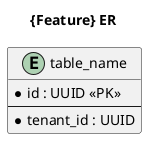

# Plan File Template

File: `.claude/plans/plan-tasks-{first-id}-{last-id}.md`

---

```markdown
# Plan: Tasks {IDs} — {short collective title}

**Branch**: `feat/{first-id}-{short-slug}`

## Feature Summary

2–3 sentences: what this delivers, which services it touches, the user/operator-visible outcome.

---

## Dependencies & Sequencing

- **Requires**: {existing code, merged PRs, env vars, tool versions}
- **Order within plan**: {e.g. 1.28 → 1.29 — interface before impl}
- **Unblocks**: {future checklist items}

---

## Per-Task Implementation

### Task {id} — {short title}

**What to build**: one paragraph describing the deliverable.

**Files to create or modify**:
| File | Action | Notes |
|------|--------|-------|
| `path/to/File.java` | New / Modify | Brief note |

**Key signatures** (only when it's an architectural contract other tasks depend on):
```java
// Omit for straightforward CRUD.
```

**Critical constraints** (rules from CLAUDE.md that apply here):
- e.g. "RestClient must propagate `traceparent` and `X-Tenant-Id`"

---

## E2E Test Strategy

Ordered steps a developer runs after implementing to confirm the feature works end-to-end.

1. `docker compose up` — confirm {service} healthy at `/actuator/health/ready`
2. Run Postman request `AC-1 — {title}` — expect {status} + envelope fields
3. ...

**Passing signal**: {what green looks like}  
**Failure triage**: {first place to look if it breaks}

---

## Unit & Integration Tests

**Unit tests** (no containers):
- What to unit-test and what to mock.

**Integration tests** (Testcontainers):
- Containers needed: Postgres · Redis · Kafka · WireMock
- Key scenarios per IT class.

**Not tested here**: {what's covered by a later checklist item or different layer}

---

## Schema Changes

_Only if tasks involve new or modified DB tables._

- **File**: `services/{service}/src/main/resources/db/migration/V{NNN}__{desc}.sql`
  - Read existing files for the next version number — do not guess.
- **Tables**: names, key columns, indexes, RLS policy, soft-delete column.
- **ER diagram**: `docs/diagrams/{service}/{feature}-er.puml`

PlantUML `entity` block stub:


---

## Env Vars Delta

_Only if tasks introduce new configuration._

| Var | Service(s) | `.env.example` default | `application-dev.yml` value | Notes |
|-----|-----------|------------------------|------------------------------|-------|

Also note any `docker-compose.yml` or `build.gradle.kts` changes.

---

## New Error Codes

_Only if tasks introduce new failure modes needing stable codes in `shared/common/.../ErrorCodes.java`._

| Constant | HTTP Status | When emitted |
|----------|-------------|--------------|

N/A — no new error codes required. _(if none)_

---

## Postman Collection

**Service**: {service}  
**Collection file**: `postman/{service}.postman_collection.json`  
**Action**: Extend existing | Create new

See [postman-rules.md](postman-rules.md) for request item rules.

### New requests

One folder per task ID. Each request item = one AC. Provide full request JSON.

---

## Documentation

### PlantUML Diagrams

| File | Type | Trigger |
|------|------|---------|
| `docs/diagrams/{service}/{feature}-er.puml` | ER | new tables |
| `docs/diagrams/{service}/{feature}-class.puml` | Class | new domain model |
| `docs/diagrams/{service}/{feature}-sequence.puml` | Sequence | new use case / multi-step flow |

Provide full syntactically valid `.puml` stubs (title, participants, happy-path minimum).

### ADR

Only if an architectural decision isn't already captured. Check `docs/adr/` for next number.

- File: `docs/adr/ADR-{NNNN}-{kebab-slug}.md`
- Sections: Context · Decision · Consequences (positive / negative / neutral)

### OpenAPI

Only if tasks add or change HTTP endpoints.

- File: `docs/api/{service}.openapi.yaml`
- List: new paths, methods, request/response schemas, security changes, new headers.

---

## Rollback Plan

Migration tasks: SQL to undo (DROP statements, how to restore the previous V-number, how to recreate DB locally).  
Code-only tasks: "Revert the branch — no persistent state change."

---

## BIP

Only for `[BIP]`-tagged tasks or features worth writing about. Otherwise: N/A.

Draft file: `docs/bip/{task-id}-{slug}.md`  
See [bip-format.md](bip-format.md) for all 5 channel formats.

---

## Files Created / Modified

| File | Action | Task |
|------|--------|------|
| `path/to/File.java` | New | 1.28 |
| `docs/execution-checklist.md` | Mark done | 1.28, 1.29 |

---

## Checklist Items to Mark Done

Change `[ ]` → `[x]` in `docs/execution-checklist.md` for tasks: {list each task ID}
```
