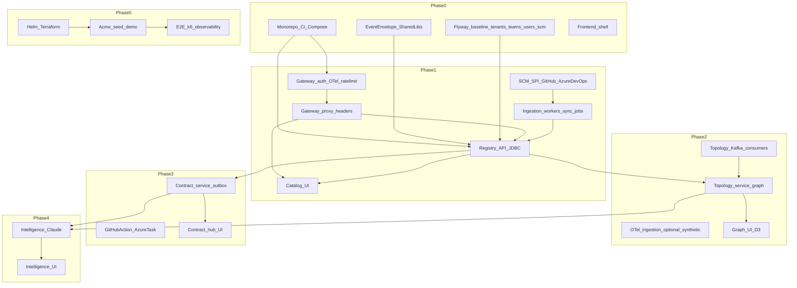

_Local copy of the Cartogra implementation plan for version control alongside [project-scope.md](project-scope.md) and [project-guide.md](project-guide.md). The Cursor IDE may also keep a plan under `.cursor/plans/`; update this file when you rebaseline the plan._

# Cartogra — Implementation Plan (Scope + Guide)

## Why this looks bigger than a “simple roadmap”

The scope describes **six backend services**, **16+ Kafka topics**, **20+ relational tables**, **dual SCM providers**, **OTel ingestion**, **contract CI for two ecosystems**, and a **multi-surface TanStack Start app** (catalog, D3 graph, contract hub, intelligence, operations). The **current** [project-scope.md](project-scope.md) / [project-guide.md](project-guide.md) further specify **Gateway MVP auth** (Resend OTP, OAuth/OIDC), **Spring Data JDBC**, a unified **HTTP response envelope** + **W3C trace propagation**, **Redis rate limits on all routes**, and **tenant API keys** for CI. This plan is **phase-gated** with **program structure**: parallel workstreams, **week-level sequencing**, **dependency maps**, **granular checklists**, and **quality/security evolution**.

## Guiding constraints

- **Source of truth:** Monorepo layout, API shapes (including **Gateway auth routes** and **envelope**), auth, seed data, and Gradle conventions from [project-guide.md](project-guide.md); pillars, Kafka topics, DB schema, and phase intent from [project-scope.md](project-scope.md).
- **Service isolation:** Services communicate only via REST and Kafka; `shared:common` stays Spring-free ([implementation guide §1](project-guide.md)).
- **Phase gates:** Each phase ships a **usable increment**, **documented decisions** (ADRs when architecture moves), **tests appropriate to the phase**, and **BIP artifacts** (not optional polish).

## Documentation-driven baselines (current scope §3 + guide)

These are **non-negotiable product/engineering constraints** from the updated docs; they supersede older plan language (e.g. “JWT stub only”, “JPA”, generic error JSON).

- **Persistence:** **Spring Data JDBC** (`spring-boot-starter-data-jdbc`) for all domain services—**not JPA**—plus `JdbcTemplate` / explicit SQL for recursive CTEs, history, and graph queries ([project-scope.md](project-scope.md) §3 *Spring Data JDBC vs JPA*; [project-guide.md](project-guide.md) §6).
- **Bootstrap policy:** New Spring modules are generated from **[Spring Initializr](https://start.spring.io/)** (Gradle, aligned Java LTS, Web, Actuator, Flyway, OpenTelemetry, etc.) and merged into `services/<name>/` so modules stay consistent ([project-guide.md](project-guide.md) §6).
- **HTTP response envelope (Spring APIs only):** Success `{ "data": <T>, "traceId": "<32-hex>" }`, error `{ "error": { code, message, details }, "traceId": "<32-hex>" }`. **`traceId`** is the OpenTelemetry trace id (lowercase hex). Responses SHOULD include **`X-Trace-Id`** with the same value. **Inbound provider webhooks** keep the provider’s JSON; no wrapping ([project-scope.md](project-scope.md) §3 *Traceability & HTTP API contract*; [project-guide.md](project-guide.md) §2 *Common Response Patterns*).
- **Tracing:** **OpenTelemetry** in **every** JVM service (gateway, domain services, workers); W3C **`traceparent`** / **`tracestate`** honored; propagate context to downstream HTTP and Kafka producers; Micrometer → **Prometheus**, dashboards/alerts in **Grafana**; logs JSON with same trace ids ([project-scope.md](project-scope.md) §3).
- **Gateway MVP:** Authentication and token/session issuance live in the **gateway** (no separate auth microservice for MVP): **local email + password** with **email OTP via Resend**; **Google** and **GitHub** OAuth; **per-tenant OAuth2/OIDC** (workforce); **httpOnly cookie** for browsers and **`Authorization: Bearer`** for non-browser clients; **Redis-backed rate limiting on all HTTP routes** ([project-scope.md](project-scope.md) §3 *Identity & session security*; [project-guide.md](project-guide.md) §2–3).
- **CI automation auth:** `POST /ci/check` and similar use a **tenant-scoped API key** only (e.g. **`X-Cartogra-Api-Key`**—exact header fixed in OpenAPI); **v1: no HMAC** ([project-scope.md](project-scope.md) §3; [project-guide.md](project-guide.md) §2–3).
- **Transactional email:** **Resend** for OTP and related mail; API key in secrets ([project-scope.md](project-scope.md) §4; [project-guide.md](project-guide.md) §3).
- **Containers:** **Docker** for every deployable (Java services, frontend, workers) ([project-scope.md](project-scope.md) §3).

## Program workstreams (run in parallel every phase)

Every phase should advance **all** of these columns; avoid “backend-only” months that leave the UI and ops story untested.

1. **Platform & build:** Gradle modules, Initializr-aligned service templates, Docker, Compose, CI/CD, image publishing, later Helm/Terraform.
2. **Data & messaging:** PostgreSQL schema (Flyway per service), **JDBC repositories**, Kafka topics/consumers, Kafka **event** envelope + idempotency, DLQ path (stub → real).
3. **Backend services:** **Gateway (auth, rate limits, trace, proxy)**, Registry, Topology, Contract, Intelligence, Ingestion—only those in scope for the phase.
4. **Integrations:** GitHub App / webhooks, Azure DevOps PAT or SP / Service Hooks, K8s client, later Slack/Teams, OTel, Claude.
5. **Frontend:** TanStack Start routes, TanStack Query, TanStack Router, TanStack Table, TanStack Forms, Zustand, shadcn, D3/Recharts as features land. **Design flow:** run `/shape <feature>` at the start of each phase's UI workstream; run `/impeccable craft <feature>` per screen; run `/impeccable audit` before the phase gate. Context files: `DESIGN.md` (visual tokens) and `PRODUCT.md` (product register) at repo root — keep both up to date. Full workflow documented in `docs/frontend-setup.md § UI Design Workflow`.
6. **Security & tenancy:** Gateway-issued session / Bearer tokens, RBAC, RLS, **Redis rate limits on all routes**, Resend OTP, OAuth app configs, **tenant API keys** for CI, secrets patterns ([implementation guide §3, §8](project-guide.md)).
7. **Observability:** **OTel + W3C trace context** on every JVM service, **`X-Trace-Id` / body `traceId`**, Micrometer → Prometheus, Grafana, correlatable JSON logs—**introduce in Phase 0–1**, deepen in Phase 5.
8. **Docs & API contract:** `docs/api/*.openapi.yaml` describing **response envelope** defaults, ADRs, runbooks, later Docusaurus.
9. **Build in public:** Posts, threads, ADRs, demos—**Definition of Done** items per phase.

## Dependency map (what must exist before what)

## Kafka topic rollout by phase (incremental, not big-bang)

Scope defines many topics ([project-scope.md](project-scope.md) §6). **Introduce topics when the first real producer/consumer exists** to avoid empty complexity.

- **Phase 0–1:** `cartogra.registry.service-events`, `cartogra.registry.sync-commands`, `cartogra.registry.sync-results`, `cartogra.ingestion.webhook-events` (if webhooks land in Phase 1).
- **Phase 2:** `cartogra.topology.dependency-events`, `cartogra.topology.analysis-results`, `cartogra.topology.otel-spans`; wire `topology-graph-builder` to registry + (stub) contract events.
- **Phase 3:** `cartogra.contract.schema-events`, `cartogra.contract.check-events`, `cartogra.ingestion.spec-discovered`, `cartogra.platform.notifications`; outbox relay publishes to contract topics; `cartogra.platform.dead-letter` + retry policy.
- **Phase 4:** `cartogra.intelligence.analysis-requests`, `cartogra.intelligence.analysis-results`.
- **Phase 5:** Harden consumer groups, retention tuning, DLQ replay API, monitoring dashboards for lag.

## Flyway / schema ownership (clarity for a multi-service DB)

- Each **service owns its migrations** under `services/<svc>/src/main/resources/db/migration/` per [implementation guide §1](project-guide.md).
- **Rule:** Migrations run in CI per module; **integration tests** use Testcontainers to apply **all** migration sets needed for that test (or use a single logical DB with ordered migration prefixes per service—document the convention in ADR or `docs/architecture/data-model.md`).
- **Phase mapping (logical):** Registry: tenants → … → services_history; Topology: dependencies → graph view → drifts; Contract: contracts → … → outbox; Intelligence: analysis_runs → findings → nl_query_log; Ingestion: sync_jobs.

## Global specifications (all phases)

- **Multi-tenancy:** `tenant_id` on all domain data; Gateway injects `X-Tenant-Id` and principal headers; queries scoped; PostgreSQL RLS as safety net ([implementation guide §3](project-guide.md)).
- **HTTP API contract:** OpenAPI-first under `docs/api/*.openapi.yaml`; **all Spring JSON responses** use `{ data, traceId }` / `{ error, traceId }` and **`X-Trace-Id`** header per [project-guide.md](project-guide.md) §2 (not the older flat error-only examples unless legacy docs remain somewhere).
- **Events (Kafka):** Separate from HTTP—versioned **Kafka** JSON envelope, deterministic `event_id`, entity-keyed partitioning, DLQ strategy ([scope §6](project-scope.md)).
- **Quality bar:** Conventional commits, PR template checklist, Testcontainers for migrations/integration, Trivy in CI ([scope §9](project-scope.md), [implementation guide §8–9](project-guide.md)).
- **Licensing:** Apache 2.0 ([implementation guide §4](project-guide.md)).

## Global testing strategy (deepen each phase)
**Spring Boot 4 test API — apply in ALL phases:**
- `@MockBean` → **`@MockitoBean`**; `@SpyBean` → **`@MockitoSpyBean`** — NEVER use removed annotations.
- `@SpringBootTest` no longer auto-provides MockMVC — add **`@AutoConfigureMockMvc`** explicitly.
- `@SpringBootTest` no longer provides `TestRestTemplate` — add **`@AutoConfigureTestRestTemplate`** explicitly.
- **Phase 0:** Gradle test task green; smoke test “DB up + Flyway + health”; assert **HTTP responses** from stubs (when present) include **`traceId`** + **`X-Trace-Id`** on a sample endpoint; frontend `vitest` for utilities if any; CI cache strategy.
- **Phase 1:** JDBC repository integration tests (Testcontainers Postgres); Kafka tests; **contract tests** for **Registry + Gateway OpenAPI** including **envelope** schemas; **auth flow** integration tests (register → Resend mock → verify → login); **Bearer** vs **cookie** session tests; frontend RTL for catalog list filters.
- **Phase 2:** Graph algorithm tests (SQL fixtures for blast radius / cycles); consumer integration tests (registry event → dependency row); D3-heavy UI: snapshot or interaction tests selectively.
- **Phase 3:** Compatibility engine unit tests (golden OpenAPI pairs); outbox integration test (DB transaction + relay sees message); CI extension smoke scripts; webhook mock tests for notifications.
- **Phase 4:** Prompt regression fixtures (recorded responses with redacted keys or mock Anthropic in CI); evaluation set of NL questions against seed DB.
- **Phase 5:** Playwright E2E for guest demo paths; k6 for `GET /graph`, `POST /ci/check`, `GET /graph/impact/{id}`; chaos-lite (stop broker, assert DLQ).

## Global security & hardening evolution

- **Phase 0–1:** Validation, CORS policy stub, body size limits; secrets in env only; **Gateway Redis rate limits on all routes** as soon as Gateway serves traffic ([project-scope.md](project-scope.md) §3); Resend API key only in server env; password storage policy (e.g. bcrypt); document threat model sketch.
- **Phase 2–3:** RBAC on mutating routes; **tenant API keys** for `/ci/check` (store hashed, rotate UX); audit log events for contract approvals.
- **Phase 4–5:** AI abuse controls (per implementation guide demo limits); sandbox tenant cleanup; credential rotation runbook; security headers middleware.

## Risk register → mitigations in-plan

Map from [project-scope.md](project-scope.md) §14:

- **Scope creep:** Strict **MVP per phase** lists below; defer “nice” graph clustering, advanced search, Avro, Neo4j.
- **K8s complexity:** Local dev uses Compose; K8s sync behind env-based feature flag; use **kind/minikube** optional profile in Phase 1–2.
- **OTel volume:** Synthetic spans for demo; sampling; worker backpressure.
- **Claude cost:** Redis cache, quotas, model tiering ([implementation guide §5](project-guide.md)).
- **Azure DevOps friction:** SPI + contract tests against HTTP mocks; document PAT/SP setup early (Phase 1 BIP).
- **Email deliverability / Resend:** Use Resend test mode in CI; monitor bounce/spam in staging; fallback messaging in UI if OTP delayed.
- **OAuth app configuration:** Google/GitHub OAuth client IDs per environment; document setup in runbook (Phase 1).
- **BIP burnout:** Batch content from real PRs/ADRs; reduce cadence before quality slips.

---

## Phase 0 — Foundation (Weeks 1–2)

**Objective:** Runnable skeleton, infra, CI, docs shell, and first public narrative—no full business features yet.

### Specs (Phase 0)

- ~~**S0.1 Repository:** Structure matches [implementation guide §1](project-guide.md) (`.github/`, `docs/`, `services/*`, `shared/*`, `frontend/`, `infra/docker-compose/`, `seed/` placeholders).~~
- ~~**S0.2 Build:** Root Gradle multi-module; **Initializr-aligned** `services/gateway` + `services/registry` + `services/ingestion` stubs ([project-guide.md](project-guide.md) §6); **`spring-boot-starter-data-jdbc`** on domain services (registry, ingestion), **not** `data-jpa`; `shared:common` with `EventEnvelope`, tenant/service IDs; all three apps start, health-check, and export **OTel** (OTLP endpoint configurable, can point to local collector or `none`).~~
- **S0.3 Local stack:** `docker-compose.yml` — PostgreSQL, Kafka (e.g. Redpanda), Redis; optional `docker-compose.dev.yml` ([implementation guide §1, §10](project-guide.md)).
- **S0.4 CI:** `ci.yml` — **Java 25** + **Spring Boot 4.0** pinned in root BOM ([project-scope.md](project-scope.md) §3); `./gradlew build`, tests, Trivy; path to frontend lint/test when scaffold exists ([scope §8](project-scope.md)).
- **S0.5 Data:** Flyway **initial** migrations: `tenants`, `teams`, `users`, `scm_connections` per scope §7 (registry service owns migrations as in guide).
- **S0.6 Docs:** `docs/adr/TEMPLATE.md`, `docs/adr/README.md`, architecture stubs, and initial runbooks; **`docs/api/gateway.openapi.yaml` + `docs/api/registry.openapi.yaml`** stubbed with **envelope** response components per [project-guide.md](project-guide.md) §2, with `docs/api/topology.openapi.yaml`, `docs/api/contract.openapi.yaml`, and `docs/api/intelligence.openapi.yaml` allowed as forward-looking stubs refined in later service phases.

### User stories (Phase 0)

| ID | Story | Acceptance criteria (summary) |
|----|--------|-------------------------------|
| US0.1 | **Contributor can clone and run infra** | `docker compose up` brings up Postgres, Kafka, Redis; README documents ports and env vars. |
| US0.2 | **CI proves the monorepo builds** | PR pipeline runs Gradle build + tests; fails on agreed severity from Trivy. |
| US0.3 | **Registry applies baseline schema** | Service starts against empty DB; Flyway applies V001–V004 (or equivalent) without error. |
| US0.4 | **Project is legible to outsiders** | README (vision, quickstart), CONTRIBUTING, LICENSE, issue/PR templates, GitHub Project milestones for phases. |

### Phase 0 MVP boundary (what is in / out)

- **In scope:** Monorepo, CI, Compose infra, `shared:common` **Kafka** event envelope + IDs, registry **stub** with Flyway V001–V004+ for core org tables, **gateway stub** route (e.g. `/actuator/health` + one ping returning **`{ data, traceId }`**), **ingestion stub** (health endpoint only — no workers yet), **OTel + traceparent** filters wired, **JDBC** on registry + ingestion, frontend shell, ADR template + index, OpenAPI stubs with **shared envelope** components, GitHub Project, first BIP wave.
- **Out of scope:** **Production-ready** auth (Resend OTP, OAuth)—that starts Phase 1; SCM/K8s sync workers (ingestion Phase 1); Topology/Contract/Intelligence business logic (README placeholders OK).

### Week-by-week sequencing (Phase 0)

- **Week 1 — Build + infra:** Repo, Gradle multi-module, **Spring Initializr merge** for `registry` + `gateway` + `ingestion` ([project-guide.md](project-guide.md) §6), `shared:common`, `test-support`, **JDBC** on registry + ingestion + Flyway, **gateway** Spring Cloud Gateway stub + **OTel** + one JSON route returning **envelope**, Compose (Postgres, Redpanda/Kafka, Redis), CI, Trivy, **Dockerfiles for gateway + registry + ingestion**, `docker compose up` documented.
- **Week 2 — Frontend + docs + public launch:** TanStack Start/shadcn shell, compose wiring for frontend, `docs/adr/*`, architecture stub pages, README/CONTRIBUTING/templates, GitHub Project, **OpenAPI envelope components** for gateway+registry, **two blogs + two social threads + optional video**.

### Granular engineering checklist (Phase 0)

**Repository & governance**

1. LICENSE (Apache-2.0), README, CONTRIBUTING, `.editorconfig`, `.gitignore`, `CODEOWNERS`, branch protection (require CI).
2. Issue templates: bug, feature, architecture discussion; PR template with checklist ([implementation guide §9](project-guide.md)).
3. GitHub Project: columns Backlog / In progress / In review / Done; milestones Phase 0…5.

**Build & modules**

4. Root `build.gradle.kts`, `settings.gradle.kts`, `gradle.properties`; **Java 25** toolchain + **Spring Boot 4.0 BOM** ([project-scope.md](project-scope.md) §3); Spring Cloud BOM for gateway module. **Spring Boot 4 / Jackson 3 dependency notes:** Jackson group ID changed from `com.fasterxml.jackson` → `tools.jackson` (except `jackson-annotations`); `@JsonComponent` → `@JacksonComponent`; `@JsonMixin` → `@JacksonMixin` — NEVER import `com.fasterxml.jackson` in new code. **Flyway note:** `spring-boot-starter-flyway` is no longer auto-included in Spring Boot 4 — add it explicitly to every domain service that owns migrations.
5. Module `shared:common`: **Kafka** `EventEnvelope`, `event_id` UUIDv5 helper, `TenantId`/`ServiceId` value types, shared **API error** DTO shape (plain Java—no Spring) matching OpenAPI `error` object ([project-guide.md](project-guide.md) §2).
6. Module `shared:test-support`: `PostgresTestSupport`, `KafkaTestSupport` (containers or embedded strategy documented).
7. Module `services:registry`: Spring Boot app, **`spring-boot-starter-data-jdbc`**, **`spring-boot-starter-flyway`** (explicit), `application.yml` with `spring.threads.virtual.enabled=true` for all I/O-bound work, actuator `/actuator/health`.
7b. Module `services:gateway`: Spring Cloud Gateway, **Micrometer tracing bridge OTel**, OTLP exporter config, global filters: **forward `traceparent`**, add **`X-Trace-Id`**, **request logging** with trace id; `spring.threads.virtual.enabled=true`; no business CRUD here ([project-guide.md](project-guide.md) §2–3).
7c. Module `services:ingestion`: Spring Boot app (port 8085), **`spring-boot-starter-data-jdbc`**, **`spring-boot-starter-flyway`** (explicit), `application.yml` with `spring.threads.virtual.enabled=true`, actuator `/actuator/health`; stub only in Phase 0 — no workers yet.

**Database**

8. Flyway `V001`–`V004` (or equivalent): `tenants`, `teams`, `users`, `scm_connections` per [scope §7](project-scope.md); enums as needed; indexes on `tenant_id`.
9. CI job runs migrations against clean Postgres (Testcontainers).

**Local runtime**

10. `infra/docker-compose/docker-compose.yml`: Postgres 16, Redis, Redpanda (or Kafka); named volumes; documented ports.
11. Optional `docker-compose.dev.yml`: expose debug ports, hot reload volumes.
12. `services/registry` connects via env vars; `SPRING_PROFILES_ACTIVE=local` documented.

**Container images**

13. Multi-stage `Dockerfile` for **registry, gateway, and ingestion**; `docker build` in CI.
14. (Optional) Frontend Dockerfile stub for Phase 0—otherwise Phase 0 exit only requires local `pnpm/npm run dev` documented.

**Frontend**

15. `frontend/`: TanStack Start + TS + ESLint + Prettier; Tailwind + shadcn init; TanStack Router file-based layout with sidebar placeholders: Catalog / Graph / Contracts / Intelligence / Operations (dead links OK).
16. Add frontend job to CI: `lint` + `test` (even if no tests yet, `vitest --passWithNoTests` or single smoke).

**Docs & API contract**

17. `docs/adr/TEMPLATE.md`, `docs/adr/README.md` (empty table).
18. `docs/architecture/system-overview.md` linking to scope diagram; `data-model.md` pointing to registry tables delivered in P0/P1; `kafka-topics.md` listing **planned** topics with “status: not yet provisioned.”
19. `docs/api/registry.openapi.yaml` + `docs/api/gateway.openapi.yaml`: default **envelope** wrappers (`data` + `traceId`), **standard error** schema, **`X-Trace-Id`** header documented; gateway auth paths marked “Phase 1” if not implemented in P0.
20. `docs/api/topology.openapi.yaml`, `docs/api/contract.openapi.yaml`, and `docs/api/intelligence.openapi.yaml`: service-level API stubs may exist ahead of implementation, but must be refined in Phases 2, 3, and 4 respectively.
21. `docs/runbooks/local-development.md`, `docs/runbooks/deployment.md`, and `docs/runbooks/incident-response.md`: create initial operational runbooks in Phase 0 and expand them as delivery moves from local-only to staged and on-call operation.

**Observability (minimal)**

22. **Structured JSON logging** in registry + gateway + ingestion with **same trace id** as OTel span; verify a single request produces matching **`traceparent` → traceId** in logs (local doc or test).

### Build-in public — Phase 0 (explicit deliverable IDs)

- **BIP0.1** Blog: “Why your service catalog is always wrong.”
- **BIP0.2** Blog: “ADRs to think in public” + land `TEMPLATE.md`.
- **BIP0.3** Thread: launch (problem, gap, what you’re building).
- **BIP0.4** Thread: data model / Kafka sketch before code.
- **BIP0.5** GitHub: README diagram + Project board screenshot in discussion or blog.
- **BIP0.6** Video (optional): 5 min problem framing.

### Definition of Done — Phase 0

- `./gradlew build` and CI green; Trivy policy documented (what severities fail).
- `docker compose up` + registry connects to Postgres; Flyway clean migrate succeeds; **gateway** starts and OTel can export (or no-op exporter in CI); **ingestion** stub starts and `/actuator/health` returns 200.
- **Envelope:** at least one gateway or registry endpoint returns `{ data, traceId }` and **`X-Trace-Id`** per [project-scope.md](project-scope.md) §3.
- Frontend installs and runs; CI runs lint.
- At least **BIP0.1–BIP0.4** published; ADR index file exists (ADRs **may** be empty until Phase 1 if blogs reference forthcoming ADR-0001/2).

**Phase 0 exit:** Matches [implementation guide §10 Day-One Checklist](project-guide.md) “Done” outcome: buildable, testable skeleton + first public artifacts.

---

## Phase 1 — Gateway MVP auth + Registry (Weeks 3–6)

**Objective:** **Gateway** implements **MVP identity** (local + **Resend OTP**, **Google** + **GitHub** OAuth, **tenant OIDC** config), **session cookie + Bearer tokens**, **Redis rate limits on all routes**, and proxies to **Registry**; **Registry** delivers the living catalog (JDBC, temporal history, dual SCM + K8s ingestion, Kafka events); **catalog UI** for authenticated users; prepare **tenant API keys** data model for Phase 3 `/ci/check` (optional: issue keys behind admin flag).

### Specs (Phase 1)

- **S1.1 Registry API:** Implement `/api/v1` services, teams, connections, health summary, orphaned list, history/at per [implementation guide §2](project-guide.md); **every JSON response** uses the **Cartogra envelope** (`data` + `traceId` / `error` + `traceId`) and **`X-Trace-Id`** ([project-scope.md](project-scope.md) §3; [project-guide.md](project-guide.md) §2).
- **S1.2 SCM SPI:** `ScmProvider` + `GitHubProvider` + `AzureDevOpsProvider` ([project-scope.md](project-scope.md) §4).
- **S1.3 Events:** `cartogra.registry.service-events`, `sync-commands`, `sync-results` ([project-scope.md](project-scope.md) §6).
- **S1.4 Migrations:** Registry — `services`, `services_history`, `scm_webhooks`; extend **`users`** / auth-related columns as needed for **email verification**, `auth_provider`, `auth_subject` ([project-scope.md](project-scope.md) §7 + [project-guide.md](project-guide.md) §3 flows). Ingestion — `sync_jobs` (owned by `services/ingestion`).
- **S1.6 Ingestion (SCM workers):** `ScmProvider` SPI + `GitHubProvider` + `AzureDevOpsProvider` in `services/ingestion`; `sync_jobs` Flyway migration; workers consume `cartogra.registry.sync-commands` and produce `cartogra.registry.sync-results`; K8s worker behind env-based flag (`ENABLE_K8S_WORKER`).
- **S1.5 Gateway (MVP product, not stub):** Implement **`/auth/*`** routes per [project-guide.md](project-guide.md) §2 (`register`, `verify-email`, `login`, `oauth/...`, `refresh`, `logout`, `userinfo`); validate **cookie** or **Bearer**; inject **`X-Tenant-Id`** + principal headers to downstream; **proxy** `/api/v1/services/**`, `/teams/**`, `/connections/**` → Registry; **Redis token-bucket limits** (per user + per tenant + stricter on `/auth/*`); forward **`traceparent`** and set **`X-Trace-Id`** ([project-scope.md](project-scope.md) §3).

### User stories (Phase 1)

| ID | Story | Acceptance criteria |
|----|--------|---------------------|
| US1.1 | **Platform admin manages teams and SCM connections** | CRUD teams; create/list/update SCM connections (GitHub + Azure DevOps JSONB configs). |
| US1.2 | **Services appear in the catalog** | List/filter by team, health, tech_stack, `scm_provider`, search; detail shows SCM badge ([project-scope.md](project-scope.md) §5). |
| US1.3 | **Ownership and orphans are visible** | Assign owner; `GET /services/orphaned`; UI highlights orphans. |
| US1.4 | **History is queryable** | `GET .../history` and `.../history/at` via `services_history` ([project-scope.md](project-scope.md) §7). |
| US1.5 | **Discovery sync runs** | `POST /connections/{id}/sync`; `sync_jobs`; GitHub + Azure DevOps workers; K8s worker (mock/kind acceptable with runbook). |
| US1.6 | **Guest-readable demo path (optional)** | If enabled: read-only browse without login—**does not** bypass Gateway rate limits; aligns with demo story in guide §3. |
| US1.7 | **User registers with email OTP** | `POST /auth/register` creates pending user; **Resend** sends OTP; `POST /auth/verify-email` activates; unverified cannot access tenant data ([project-guide.md](project-guide.md) §3). |
| US1.8 | **User signs in with Google or GitHub** | OAuth start + callback via Gateway; user row linked with `auth_provider` + `auth_subject`. |
| US1.9 | **Workforce SSO (tenant OIDC)** | Admin can configure issuer/client for a tenant; users in that tenant authenticate via IdP; maps to same session/JWT model ([project-scope.md](project-scope.md) §3). **Defer** if schedule slips—document in BIP. |
| US1.10 | **API client can use Bearer token** | Non-browser client logs in or exchanges token; `Authorization: Bearer` accepted on proxied APIs; same RBAC as cookie session. |

### Phase 1 MVP boundary

- **In scope:** Full Registry REST + **JDBC** repositories; Gateway **MVP auth** + **rate limits** + proxy; **Resend** integration (sandbox in CI); **OAuth** apps for dev/staging; dual SCM workers; K8s worker behind **env-based flag** (`ENABLE_K8S_WORKER`); Kafka registry topics; catalog UI; OpenAPI **registry + gateway** kept current.
- **Defer if schedule slips:** **US1.9 tenant OIDC** (ship Google/GitHub + local OTP first); GitHub App marketplace hardening (PAT-first); webhook signature verification polish; **tenant API key** UX (still add DB table if cheap); advanced staleness ranking.

### Week-by-week sequencing (Phase 1, Weeks 3–6)

- **Week 3 — Registry domain + JDBC:** Hexagonal `domain`/`application`/`infrastructure/persistence` with **`JdbcTemplate`/`DataJdbc` repos**; Flyway `services`, `services_history`, `scm_webhooks`; controller **envelope** wrapper; integration tests for CRUD + history.
- **Week 4 — Gateway auth + proxy:** Spring Security; **Resend** client; register/verify/login; OAuth Google/GitHub; session + Bearer issuance; **Redis** rate limit filter **on all routes**; proxy to registry with trust-boundary stripping of `X-Tenant-Id` from clients; OTel propagation verified across hop.
- **Week 5 — SCM SPI + ingestion:** GitHub + Azure DevOps adapters (WireMock); ingestion workers + `sync_jobs`; optional webhooks → `ingestion.webhook-events`.
- **Week 6 — K8s + OIDC (if scheduled) + UI + events:** Kubernetes worker; **tenant OIDC** if not deferred; `service-events` emit; catalog UI login flows; minimal seed JSON; BIP (ADRs + posts).

### Granular engineering checklist (Phase 1)

**Registry core**

1. **JDBC:** No JPA entities; use explicit SQL for list filters, history snapshots, full-text (`to_tsvector`) per [project-scope.md](project-scope.md) §7.
2. Domain validation: unique `(tenant_id, name)` for services; soft delete semantics.
3. `services_history` writer on every material change; point-in-time query.
4. Controllers return **`ApiResponse<T>`** (or equivalent) mapping to **`{ data, traceId }`**; `@RestControllerAdvice` maps exceptions to **`{ error, traceId }`** with stable `code` values ([project-guide.md](project-guide.md) §2). NEVER use `@ControllerAdvice` alone (no automatic JSON serialization).

**Kafka**

5. Producer: service lifecycle events; keys + **Kafka envelope** ([project-scope.md](project-scope.md) §6).
6. Consumer: sync command topics; idempotency strategy documented.
7. Propagate **trace context** to Kafka headers (`traceparent`) on produce/consume ([project-scope.md](project-scope.md) §3).

**SCM SPI + ingestion**

8. `ScmProvider` SPI (`services/ingestion` → `application/spi/ScmProvider.java`): interface with `discoverServices(ScmConnection)`, `fetchRepoMetadata(String repoUrl)`, `testConnection(ScmConnection)`; no Spring in the interface.
9. `GitHubProvider` (`infrastructure/scm/GitHubProvider.java`): implement `ScmProvider` via GitHub REST API; read PAT from `scm_connections` JSONB config; WireMock stub in integration tests.
10. `AzureDevOpsProvider` (`infrastructure/scm/AzureDevOpsProvider.java`): implement `ScmProvider` via Azure DevOps REST API; PAT or Service Principal from connection config; WireMock stub in integration tests; document PAT setup in a runbook.
11. Flyway `V001__create_sync_jobs.sql` in `services/ingestion`: `sync_jobs` table — `id UUID PK DEFAULT gen_random_uuid()`, `tenant_id UUID NOT NULL`, `connection_id UUID NOT NULL`, `status TEXT NOT NULL` (PENDING/RUNNING/DONE/FAILED), `started_at TIMESTAMPTZ`, `completed_at TIMESTAMPTZ`, `error_detail TEXT`, `created_at TIMESTAMPTZ NOT NULL DEFAULT now()`, `deleted_at TIMESTAMPTZ`; index on `(tenant_id, connection_id) WHERE deleted_at IS NULL`; RLS policy on `tenant_id`.
12. `GitHubSyncWorker` + `AzureDevOpsSyncWorker` (`infrastructure/workers/`): consume `cartogra.registry.sync-commands`; update `sync_jobs` status transitions; produce discovered services to `cartogra.registry.sync-results`; propagate `traceparent` on produce; K8s worker enabled only when env var `ENABLE_K8S_WORKER=true` (env-based flag — no external flag service).

**Gateway**

13. Implement **§2 auth route list** in OpenAPI; CORS for frontend origin; **Secure, httpOnly, SameSite** cookie policy documented.
14. **Rate limiting:** Redis token bucket — defaults per [project-guide.md](project-guide.md) / scope (tune); separate bucket for expensive routes.
15. **Trust boundary:** reject client-supplied `X-Tenant-Id`; derive from token/session; forward to registry.
16. **Tenant OIDC:** per-tenant `issuer`, `client_id`, `client_secret` storage (encrypted or secret ref)—**schema + admin API** even if UI comes later.

**Frontend**

17. Login / register / verify screens; OAuth redirects via Gateway; store **no tokens in localStorage** if using cookie session; support Bearer for dev API tools page (optional).
18. Catalog views wired to Gateway base URL; handle **envelope** parsing (`data` vs `error`).

**Quality**

19. Tests: OTP flow with **Resend test double**; OAuth integration tests with mock IdP or recorded stubs; Testcontainers for registry; contract tests assert **envelope** + **`X-Trace-Id`**.

### Build-in public — Phase 1

- **BIP1.1** ADR-0001: PostgreSQL vs graph DB.
- **BIP1.2** ADR-0002: SCM SPI.
- **BIP1.3** Short ADR or design note: **Spring Data JDBC** default (link [project-scope.md](project-scope.md) §3 table).
- **BIP1.4** Blog: self-healing registry narrative.
- **BIP1.5** Blog: multi-tenant + temporal versioning deep dive.
- **BIP1.6** Thread: **HTTP envelope + trace id** end-to-end (32-hex, `X-Trace-Id`).
- **BIP1.7** Thread: SPI sketch (GitHub vs Azure DevOps).
- **BIP1.8** Thread: Gateway owns MVP auth—why no auth microservice yet.
- **BIP1.9** LinkedIn: enterprise SCM angle.
- **BIP1.10** GitHub: screenshots + links to **`gateway.openapi.yaml`** and **`registry.openapi.yaml`**.

### Definition of Done — Phase 1

- **US1.1–US1.8, US1.10** satisfied locally/staging; **US1.9** either satisfied or explicitly deferred with public note.
- Sync jobs succeed for **both** SCM providers in scripted or runbooked tests; Kafka events visible.
- **Rate limits** enforced on a smoke test (429 behavior documented).
- OpenAPI + envelope conventions match [project-guide.md](project-guide.md) §2.
- BIP1.1–BIP1.8 minimum shipped.

---

## Phase 2 — Topology service (Weeks 7–10)

**Objective:** Declared + observed dependencies, graph API, blast radius / cycles / SPOF, drift, D3 UI, Kafka topics for topology + OTel path.

### Specs (Phase 2)

- **S2.1 Data:** `dependencies`, `dependency_drifts`, materialized view `dependency_graph`, indexes per scope §7; **JDBC** access and hand-authored SQL for CTEs ([project-scope.md](project-scope.md) §3).
- **S2.2 API:** `/dependencies`, `/graph`, `/graph/impact/{id}`, `/graph/spof`, `/graph/cycles`, `/drifts` ([implementation guide §2](project-guide.md)); same **HTTP envelope** + **`X-Trace-Id`** rules as Registry ([project-guide.md](project-guide.md) §2).
- **S2.3 Algorithms:** Recursive CTEs for blast radius and cycles ([scope §7 SQL](project-scope.md)); refresh strategy for materialized view on change events.
- **S2.4 Events:** `cartogra.topology.*` topics; consumer group `topology-graph-builder` subscribes to registry + contract events as designed ([scope §6](project-scope.md)).
- **S2.5 OTel:** Ingestion worker `OtelSpanWorker` → `cartogra.topology.otel-spans` (demo: synthetic spans acceptable per risk register).

### User stories (Phase 2)

| ID | Story | Acceptance criteria |
|----|--------|---------------------|
| US2.1 | **Architect sees the dependency graph** | `GET /graph` returns nodes/edges; UI force-directed D3 with zoom/pan; toggle declared vs observed ([scope §5](project-scope.md)). |
| US2.2 | **Impact analysis** | Selecting a service highlights blast radius; API returns affected services with depth. |
| US2.3 | **Risks surface automatically** | API returns SPOF findings and cycles; UI shows warnings. |
| US2.4 | **Drift is actionable** | Unresolved drifts listed; resolve endpoint updates state; optional overlay on graph. |

### Phase 2 MVP boundary

- **In scope:** Topology service + migrations (`dependencies`, `dependency_drifts`, `dependency_graph` materialized view); full read API from [implementation guide §2](project-guide.md); graph builder consumer from registry events; **declared** edges from manual API + later from contract ingestion hints if available; **observed** edges from OTel worker (synthetic acceptable); drift detection job comparing declared vs observed; D3 graph UI with declared/observed toggle and blast-radius highlight; recursive CTEs for impact + cycles; SPOF heuristic (fan-in threshold configurable).
- **Defer:** SSE stream to frontend for analysis results; advanced graph layout (cluster by team); Neo4j; Avro schemas.

### Week-by-week sequencing (Phase 2, Weeks 7–10)

- **Week 7 — Schema + persistence:** Flyway for dependencies + drifts + materialized view; repositories; uniqueness rules; soft delete behavior; refresh MV strategy (on commit vs scheduled).
- **Week 8 — Algorithms + API:** Implement blast radius, cycles, SPOF queries; REST controllers; integration tests with fixed graph fixtures.
- **Week 9 — Event-driven graph builder:** Kafka consumers; idempotent edge upsert; emit `dependency-events`; OTel worker producing `topology.otel-spans` consumer path.
- **Week 10 — Frontend + perf + BIP:** D3 visualization; what-if blast radius UX; document p95 latency on N edges; update `docs/api/topology.openapi.yaml`; publish ADR-0003/0006 + posts.

### Granular engineering checklist (Phase 2)

1. Topology module skeleton + `application.yml` + Flyway `V001`–`V003` per [implementation guide §1](project-guide.md).
2. DAO/repository: insert/update dependency rows; enforce `source != target`; store `confidence_score` / `observation_count` for observed edges.
3. Materialized view `dependency_graph` + `REFRESH` strategy; measure refresh duration; add advisory lock or debounce if needed.
4. API: `POST/DELETE` declared dependencies; `GET /graph?type=DECLARED|OBSERVED|BOTH`.
5. SQL: blast radius CTE from [scope §7](project-scope.md); cap depth; prevent path explosion; unit-test on small graphs.
6. SQL: cycle detection query; normalize cycles for deduplication in API response.
7. SPOF: compute high fan-in nodes; optional “no redundancy” heuristic documented.
8. Drift: detector job (scheduled + on-demand) writing `dependency_drifts`; `PUT /drifts/{id}/resolve`.
9. Kafka: consumer `topology-graph-builder` subscribed to `registry.service-events` and (stub) `contract.schema-events` if needed for declared edges—**document** actual triggers.
10. OTel: `OtelSpanWorker` parses span attributes → candidate edges; integration test with fixture span batch.
11. Frontend: `components/graph/*` force layout; zoom/pan; node click panel (upstream/downstream lists); mode toggle; drift overlay legend.
12. Observability: metrics for MV refresh, consumer lag, query latency histograms.
13. Docs: keep `docs/api/topology.openapi.yaml` aligned with graph, impact, cycle, SPOF, and drift endpoints.

### Build-in public — Phase 2

- **BIP2.1** ADR-0003: recursive CTEs vs graph DB.
- **BIP2.2** ADR-0006: Kafka envelope + topic taxonomy.
- **BIP2.3** Blog: declared vs observed dependencies.
- **BIP2.4** Blog: Kafka topic design (16 topics walkthrough).
- **BIP2.5** Blog: recursive CTEs in production PostgreSQL.
- **BIP2.6** Thread: blast radius SQL + explanation.
- **BIP2.7** Thread: materialized view for graph speed.
- **BIP2.8** Thread: UUIDv5 idempotency pattern.
- **BIP2.9** LinkedIn: event naming + partitioning story.
- **BIP2.10** Video (optional): live impact analysis coding.

### Definition of Done — Phase 2

- Graph renders for tenant with ≥20 services without browser freeze (target hardware documented).
- Impact/cycles/SPOF endpoints return stable results on seed dataset; drift list matches known scenario from Phase 5 seed (preview with temporary fixtures in Phase 2 OK).
- Consumer lag observable in metrics; DLQ path stubbed or implemented per Phase 3 readiness.
- BIP2.1–BIP2.7 minimum shipped.

---

## Phase 3 — Contract guardian (Weeks 11–15)

**Objective:** Schema registry, breaking-change detection, consumer matrix, notifications, outbox → Kafka, CI extensions (GitHub Action + Azure DevOps task).

### Specs (Phase 3)

- **S3.1 Data:** `api_contracts`, `contract_consumers`, `contract_versions`, `contract_checks`, `outbox_events` ([scope §7](project-scope.md)); **JDBC** + transactions that persist contract version + outbox row atomically.
- **S3.2 API:** Contract CRUD, versions, consumers, `POST .../check`, checks list/detail, approve/block, `GET .../matrix`, `POST /ci/check` ([implementation guide §2](project-guide.md)); **`/ci/check` response** wrapped in global envelope; **API key auth** only for that route ([project-scope.md](project-scope.md) §3).
- **S3.3 Outbox:** Transactional write + relay publisher ([scope §3 Pillar 3](project-scope.md)).
- **S3.4 Notifications:** Rules + delivery workers for Slack/Teams (minimum: webhook path); `cartogra.platform.notifications` ([scope §6–7](project-scope.md)).
- **S3.5 CI extensions:** `ci-extensions/github-action` and `ci-extensions/azure-pipelines-task` calling `/ci/check` ([scope §4](project-scope.md)).

### User stories (Phase 3)

| ID | Story | Acceptance criteria |
|----|--------|---------------------|
| US3.1 | **Producer publishes API specs** | Register/update OpenAPI 3 / AsyncAPI 2; version history stored; diff data structured. |
| US3.2 | **Breaking changes are detected** | Check run produces `is_breaking`, structured `changes` JSON, affected consumers. |
| US3.3 | **Teams see compatibility** | Matrix view green/yellow/red per consumer-producer pair ([scope §5](project-scope.md)). |
| US3.4 | **CI blocks bad merges** | Marketplace Action + Azure extension documented; failing check sets failed status in example workflows. |
| US3.5 | **Alerts fire** | On breaking detection, notification logged/delivered per tenant rule (test with webhook mock). |

### Phase 3 MVP boundary

- **In scope:** Contract service + full contract schema tables; OpenAPI 3 + AsyncAPI 2 parse/validate; `contract_versions` history; breaking-change engine producing structured `changes` JSON; `contract_checks` workflow (pending/approve/block); consumer-producer matrix (`contract_consumers` + `GET /contracts/matrix`); `POST /ci/check` for headless CI; **outbox + relay** to Kafka; notification rules + **Slack OR Teams** (one channel proven); spec discovery consumer `ingestion.spec-discovered`; GitHub Action + Azure DevOps task in `ci-extensions/`; Contract Hub UI (diff, matrix, timeline).
- **Defer:** Email notifications; interactive Slack approvals; full AsyncAPI runtime validation beyond parse; schema registry replication across regions.

### Week-by-week sequencing (Phase 3, Weeks 11–15)

- **Week 11 — Contract CRUD + versions:** Flyway; entities; publish version; store `spec_hash`; integration tests.
- **Week 12 — Compatibility engine:** Diff algorithm; golden tests; consumer impact analysis; `POST /contracts/{id}/check`.
- **Week 13 — Outbox + Kafka + notifications:** Transactional outbox write; relay service; publish `schema-events` / `check-events`; notification fan-out worker; webhook integration tests.
- **Week 14 — CI extensions:** GitHub Action + Azure Task wrapping `/ci/check`; example workflows in `docs/`; marketplace packaging checklist (icons, branding, versioning).
- **Week 15 — UI polish + spec discovery + BIP:** Wire ingestion → contract registration; Contract Hub UI; update `docs/api/contract.openapi.yaml`; extend `docs/runbooks/deployment.md` and `docs/runbooks/incident-response.md` for contract checks and notifications; BIP + marketplace publish.

### Granular engineering checklist (Phase 3)

1. Contract module + migrations `V001`–`V005` ([implementation guide §1](project-guide.md)).
2. Parse OpenAPI/AsyncAPI; reject invalid specs with actionable errors; store canonical JSON in `spec_content`.
3. Versioning rules: semver or opaque string—**document**; enforce uniqueness `(contract_id, version)`.
4. Breaking rules: removed fields, type changes, new required fields, enum removals—align with industry practice; table-driven tests.
5. `affected_consumers` resolution using `contract_consumers` evidence ([scope §7](project-scope.md)).
6. `POST /ci/check`: accept `spec_content` + metadata; persist check; return `blocking` semantics documented.
7. Outbox: write in **same transaction** as contract version insert; `idx_outbox_unpublished`; relay backoff; poison message handling.
8. Kafka: consumers for topology/intelligence hooks (may be no-op logging initially) — avoid silent drops.
9. `notification_rules` CRUD (admin only); `notification_log` + retry policy.
10. Ingestion: on repo scan, publish `spec.openapi.found` / `spec.asyncapi.found`; contract processor registers contracts idempotently.
11. Frontend: side-by-side diff viewer (highlight added/removed/required); matrix heatmap; timeline of versions; breaking queue UI.
12. Security: `/ci/check` accepts **tenant API key** header **`X-Cartogra-Api-Key`** only (v1—**no HMAC**); keys hashed at rest; rotation UX; document abuse case “leaked key” ([project-scope.md](project-scope.md) §3; [project-guide.md](project-guide.md) §3).
13. Docs: keep `docs/api/contract.openapi.yaml` aligned with contract CRUD, versioning, compatibility, and CI-check endpoints; extend runbooks for CI integration and notification troubleshooting.

### Build-in public — Phase 3

- **BIP3.1** ADR-0004: outbox pattern.
- **BIP3.2** Blog: consumer-driven contracts without ceremony.
- **BIP3.3** Blog: breaking change detection algorithm.
- **BIP3.4** Blog: outbox eliminating dual-write bugs.
- **BIP3.5** Blog: dual marketplace (GitHub Action + Azure Task).
- **BIP3.6** Publish: `cartogra/contract-check` to GitHub Marketplace.
- **BIP3.7** Publish: Azure DevOps extension listing.
- **BIP3.8** Thread: schema diff UI demo.
- **BIP3.9** Thread: structured JSONB diffs for automation.
- **BIP3.10** Thread: one check, two CI systems.
- **BIP3.11** LinkedIn: compatibility matrix story.

### Definition of Done — Phase 3

- End-to-end: new spec version → check → Kafka event → notification log entry (webhook mock OK) in local compose.
- Example repos demonstrate failing CI on breaking change; passing on compatible change.
- Contract OpenAPI + CI extension README complete.
- BIP3.1–BIP3.10 minimum shipped; marketplace publish **or** documented blocker + timeline (honesty is part of BIP).

---

## Phase 4 — Intelligence layer (Weeks 16–19)

**Objective:** Claude-powered NL queries, anti-pattern scans, health score, weekly digest, observability of AI usage.

### Specs (Phase 4)

- **S4.1 Data:** `analysis_runs`, `anti_pattern_findings`, `nl_query_log` ([scope §7](project-scope.md)); **JDBC** for persistence.
- **S4.2 API:** `/intelligence/query`, feedback, analyze triggers, findings list, acknowledge/resolve, health-score, digests ([implementation guide §2](project-guide.md)); **HTTP envelope** on all JSON responses.
- **S4.3 AI:** Externalized prompts under `resources/prompts/`; structured outputs; token and latency recorded ([implementation guide §1 intelligence layout](project-guide.md)).
- **S4.4 Safety:** Rate limits and caching per demo budget ([implementation guide §5–6](project-guide.md)).

### User stories (Phase 4)

| ID | Story | Acceptance criteria |
|----|--------|---------------------|
| US4.1 | **User asks questions in plain English** | NL endpoint returns answer + optional `generated_sql`; errors handled gracefully. |
| US4.2 | **Anti-patterns appear in a feed** | Scheduled or on-demand scan persists findings with severity and evidence JSON. |
| US4.3 | **Org health is summarized** | Health score endpoint + trend; weekly digest content retrievable. |
| US4.4 | **Quality improves over time** | Feedback endpoint updates `nl_query_log`; dashboards or exports for token usage. |

### Phase 4 MVP boundary

- **In scope:** Intelligence service + migrations; Claude client with **structured output** parsing; externalized prompts; `nl_query_log` + feedback endpoint; NL query path that **either** executes constrained read-only SQL or returns an explanation when unsafe; anti-pattern scan (`circular_dependency`, `god_service`, `orphaned_service`, etc.) combining **deterministic** graph metrics + LLM narrative; architecture health score; weekly digest generation stored/retrievable; Kafka `analysis-requests` / `analysis-results`; frontend Intelligence panel; rate limits + Redis cache ([implementation guide §5–6](project-guide.md)).
- **Defer:** Fine-tuned local model; automatic remediation actions; multi-turn conversational memory across sessions.

### Week-by-week sequencing (Phase 4, Weeks 16–19)

- **Week 16 — Service skeleton + safety:** Intelligence module; prompt loading; Anthropic integration behind interface; secrets; record `analysis_runs` + tokens.
- **Week 17 — NL query:** SQL generation guardrails (allowlist tables, read-only transaction, row limits); `nl_query_log`; feedback; caching.
- **Week 18 — Deterministic + LLM analysis:** Anti-pattern jobs consuming topology/registry/contract projections; persist `anti_pattern_findings` with evidence JSON; health score; digest.
- **Week 19 — Frontend + evaluation + BIP:** Chat UI; findings feed; dashboards; offline evaluation set; update `docs/api/intelligence.openapi.yaml`; ADR-0005 + posts.

### Granular engineering checklist (Phase 4)

1. Intelligence module + Flyway `V001`–`V003` ([implementation guide §1](project-guide.md)).
2. Prompt templates: `nl-query-system.txt`, `anti-pattern-analysis.txt`, `digest-generation.txt` versioned in repo.
3. **SQL safety:** whitelist views or tables; reject multi-statement; bind parameters; max rows; timeout; explain plan optional logging.
4. `POST /intelligence/query` returns `answer`, optional `data`, `generated_sql`, `query_id`.
5. `POST /intelligence/query/{id}/feedback` updates `nl_query_log.feedback`.
6. `POST /intelligence/analyze` schedules via Kafka; worker updates `analysis_runs` status + results JSON.
7. Anti-pattern: reuse SQL/graph metrics (cycles, fan-in) — **do not** let LLM invent numbers without citing deterministic evidence fields.
8. Health score: versioned formula documented in ADR-0005 appendix or `docs/architecture/`.
9. Digest: rendered markdown or JSON blocks; stored with timestamp; `GET /intelligence/digests/latest`.
10. Observability: token usage metrics; cost estimation dashboard (Grafana panel optional).
11. Frontend: chat components; streaming optional; findings list with severity chips; health score trend using Recharts.
12. Tests: mock Anthropic in CI; golden tests for prompt formatting; evaluation notebook optional.
13. Docs: keep `docs/api/intelligence.openapi.yaml` aligned with NL query, findings, health score, and digest endpoints.

### Build-in public — Phase 4

- **BIP4.1** ADR-0005: Claude integration + prompt strategy.
- **BIP4.2** Blog: LLMs for infrastructure intelligence (honest limits).
- **BIP4.3** Blog: NL over PostgreSQL + `nl_query_log` feedback loop.
- **BIP4.4** Video: NL query demo.
- **BIP4.5** Thread: anti-pattern + graph evidence.
- **BIP4.6** Thread: token + latency tracking schema.
- **BIP4.7** Thread: trust = deterministic evidence + LLM explanation.

### Definition of Done — Phase 4

- NL queries safe under threat model doc; abuse limits enforced.
- At least **three** anti-pattern types produce findings on Acme seed (once seed exists) or temporary fixture DB.
- Digest and health score available via API; UI surfaces them.
- BIP4.1–BIP4.5 minimum shipped.

---

## Phase 5 — Polish and production (Weeks 20–24)

**Objective:** Helm/Terraform, observability stack, demo at `cartogra.dev`, Docusaurus, DLQ replay, capstone content.

### Specs (Phase 5)

- **S5.1 Deploy:** Helm charts per service; Terraform modules ([scope §8](project-scope.md), [implementation guide §1 `infra/`](project-guide.md)).
- **S5.2 Observability:** OTel → Jaeger; Micrometer → Prometheus; Grafana dashboards; structured logs ([scope §8](project-scope.md)).
- **S5.3 Demo:** “Acme Fintech” seed via `seed/seed-data.json` + loader; guest read-only; scenarios from [implementation guide §7](project-guide.md).
- **S5.4 Ops:** DLQ topic + replay admin API ([scope §6](project-scope.md)); ingestion health in Operations view ([scope §5](project-scope.md)).
- **S5.5 Docs:** Docusaurus site; ADR index complete; runbooks (`docs/runbooks/local-development.md`, `docs/runbooks/deployment.md`, `docs/runbooks/incident-response.md`) kept current and cross-linked from the docs site ([scope §11](project-scope.md)).

### User stories (Phase 5)

| ID | Story | Acceptance criteria |
|----|--------|---------------------|
| US5.1 | **Ops can deploy consistently** | Staging deploy from CI; documented values for Helm; secrets via K8s secrets. |
| US5.2 | **Visitor sees realistic demo** | 20 services, dual SCM labels, orphans, cycles, god service, drift, pending breaking change ([implementation guide §7](project-guide.md)). |
| US5.3 | **On-call can trace failures** | Correlation IDs across gateway and services; basic dashboards for lag and errors. |
| US5.4 | **Failed messages are recoverable** | DLQ write path + documented replay procedure/API. |

### Phase 5 MVP boundary

- **In scope:** Production packaging — Helm umbrella + per-service charts; Terraform modules for **at least one** cloud reference (document others); GitHub Actions deploy staging; observability stack wired (OTel → Jaeger, Micrometer → Prometheus, Grafana dashboards); structured logging aggregation approach documented; **Acme Fintech** seed (`seed/seed-data.json` + loader hitting real APIs); guest read-only demo mode + sandbox tenant rules ([implementation guide §5–7](project-guide.md)); Operations UI (ingestion health, recent platform events); DLQ topic + **replay admin API**; Docusaurus docs site; Playwright E2E smoke; k6 load tests on critical paths; env-based feature flags for risky features.
- **Defer:** Multi-region active-active; enterprise SSO hardening beyond scope’s demo GitHub OAuth; paid hosting SLAs.

### Week-by-week sequencing (Phase 5, Weeks 20–24)

- **Week 20 — Seed + demo hardening:** Complete `seed-data.json` for 20 services + scenarios; loader automation; guest mode enforcement; demo abuse limits revisited.
- **Week 21 — Packaging:** Helm charts; K8s probes; config maps/secrets layout; staging deploy pipeline; smoke test job post-deploy.
- **Week 22 — Observability + ops:** Dashboards; alerts on consumer lag + error rate; DLQ replay; runbooks (`docs/runbooks/`).
- **Week 23 — Docs + E2E:** Docusaurus; tutorial “happy path”; Playwright suite in CI.
- **Week 24 — Performance + retrospective:** k6 benchmarks; tune DB indexes/MV refresh; capstone BIP content; `cartogra.dev` launch checklist.

### Granular engineering checklist (Phase 5)

1. Seed: implement all rows in [implementation guide §7](project-guide.md) tables via public APIs; idempotent loader; verify scenarios (orphans, cycles, god service, drift, pending breaking change).
2. Demo security: guest cannot mutate Acme tenant; logged-in users get sandbox; AI rate limits enforced ([implementation guide §5](project-guide.md)).
3. Helm: umbrella chart + subcharts for gateway/registry/topology/contract/intelligence/ingestion; values for staging vs prod; resource requests/limits defaults.
4. Terraform: modules for K8s, Postgres, Kafka-compatible service, Redis; example `staging` env; document cost model ([implementation guide §5](project-guide.md)).
5. CI: `deploy-staging.yml`; optional manual `deploy-production.yml`; release tagging `release.yml` ([implementation guide §1](project-guide.md)).
6. DLQ: publish on retry exhaustion; admin API with auth **admin-only**; audit log entry per replay.
7. Operations UI: ingest connector status (`last_sync_at`, error counts); Kafka lag widget; link to Grafana.
8. E2E: guest browse catalog → open graph → open contract matrix → run one NL query (mock Claude in CI if needed).
9. k6: scripts in `perf/` with thresholds; fail CI on regression beyond agreed %.
10. Docs site: ADR index pages; API reference links; onboarding tutorial.
11. Domain + TLS + `cartogra.dev` checklist (registrar, ingress, cert-manager or provider TLS).

### Build-in public — Phase 5

- **BIP5.1** Blog: observability stack for the platform.
- **BIP5.2** Blog: full data architecture retrospective (20+ tables, 16 topics, 2 SCM providers).
- **BIP5.3** Blog: Flyway in multi-service monorepo.
- **BIP5.4** Video: 15-minute architecture walkthrough.
- **BIP5.5** Thread: ship retrospective + lessons.
- **BIP5.6** Thread: DLQ saved us (real incidents only—skip if not true).
- **BIP5.7** LinkedIn: ADR index + build-in-public meta.
- **BIP5.8** Launch post: demo site + how to try it.

### Definition of Done — Phase 5

- Staging environment reproducible from docs; seed loads cleanly; guest demo matches scenario list in [implementation guide §7](project-guide.md).
- Observability answers: “What’s broken?” and “Which consumer lags?” within 5 minutes for a maintainer.
- E2E + k6 gates in CI (thresholds documented).
- BIP5.1–BIP5.5 + **BIP5.8** shipped.

---

## Cross-phase backlog (non-blocking but planned)

- **Notification service** as first-class consumer groups (`notification-router`, delivery workers) — may start minimal in Phase 3 and harden in 5.
- **Audit service** writing `cartogra.platform.audit-log` long-term — scope §6; can be Phase 5 if needed.
- **Elasticsearch upgrade** for search — scope allows Postgres FTS initially.

---

## RACI-style ownership (solo project)

- **You:** All engineering + BIP; prioritize phase gates over full feature depth when schedule slips.
- **Community:** Feedback via Issues/Discussions; incorporate in public threads per scope §10 principles.

---

## How to execute this plan (operational discipline)

- **GitHub Issues:** For each phase, create an Epic per **phase** + labels per **workstream** (`platform`, `data`, `backend`, `integrations`, `frontend`, `security`, `observability`, `docs`, `bip`). Break granular checklist items into issues ≤2 days each.
- **Traceability:** In PR descriptions, link **USx.y** (user story), **BIPx.z** (build-in-public id), and **ADR** when applicable—mirrors senior/staff review expectations.
- **Weekly rhythm:** Monday—pick items from week slice; Wednesday—demo locally; Friday—retro note (1 paragraph) usable for BIP.
- **Scope defense:** If a week slips, cut **Defer** items first (explicit per-phase lists), not tests or tenancy guards.

## Rough order-of-magnitude (why this is a multi-quarter program)

- **~25 user stories** named across phases (more when decomposed), **~100+ engineering checklist rows** when Phase 0–5 items are turned into tickets, **6 ADRs** in scope appendix, **40+ BIP deliverables** if all optional videos/threads ship—intentionally large surface for a credible staff-level portfolio piece.

## Success checks (from scope §12, made measurable)

- **Build health:** CI green on `main`; build time target **under 10 minutes** ([project-scope.md](project-scope.md) §12); Trivy policy enforced.
- **Reliability:** Critical APIs (registry list, graph read, contract check) meet agreed p95 latency on seed data after k6 tuning (Phase 5).
- **Demo UX:** Primary dashboard routes **under 2s** TTFB on staging (scope §12—adjust per hosting reality; document final target).
- **Correctness:** No open **severity-1** bugs in tenant isolation or contract false negatives (breaking change undetected) for golden tests.
- **BIP:** Depth over vanity metrics—each phase closes with **shippable software + ≥1 long-form artifact (ADR or blog) + ≥2 short-form posts**; optional 1–2 talk proposals ([project-scope.md](project-scope.md) §12).
