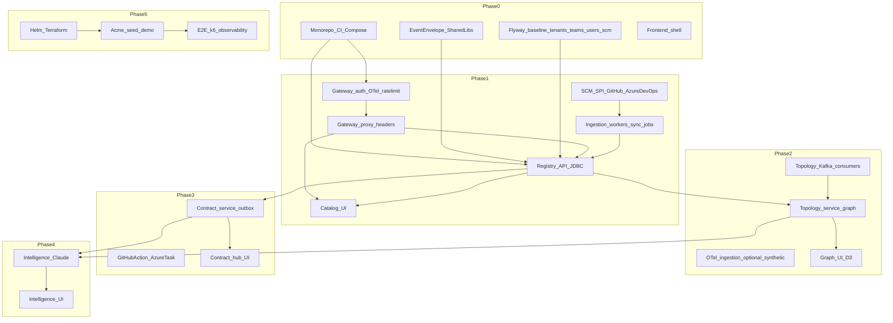

<!-- markdownlint-disable-file MD041 -->

> **Working from this plan?** Day-to-day execution tasks live in [execution-checklist.md](execution-checklist.md). Engineering rules and code patterns live in [CLAUDE.md](../CLAUDE.md) and `.claude/rules/`. This file covers rationale, constraints, scope, user stories, and phase gates only.

# Cartogra — Implementation Plan

## Why this looks bigger than a "simple roadmap"

Six backend services, 16+ Kafka topics, 20+ relational tables, dual SCM providers, OTel ingestion, contract CI for two ecosystems, and a multi-surface TanStack Start app (catalog, D3 graph, contract hub, intelligence, operations). Gateway MVP auth (Resend OTP, OAuth/OIDC), Spring Data JDBC, unified HTTP response envelope + W3C trace propagation, Redis rate limits, and tenant API keys for CI are all in scope. This plan is phase-gated with parallel workstreams and quality gates — intentionally large surface for a credible staff-level portfolio.

## Guiding constraints

- **Source of truth:** [CLAUDE.md](../CLAUDE.md) and `.claude/rules/` define tech choices, patterns, and non-negotiables (JDBC not JPA, gRPC for service-to-service, `.proto` files only in `shared:contracts`, etc.).
- **Service isolation:** Services communicate only via gRPC (synchronous) and Kafka (async); `shared:common` stays Spring-free.
- **Phase gates:** Each phase ships a usable increment, documented decisions (ADRs), appropriate tests, and BIP artifacts.

## Program workstreams (run in parallel every phase)

1. **Platform & build** — Gradle modules, Docker, Compose, CI/CD, image publishing, later Helm/Terraform
2. **Data & messaging** — PostgreSQL schema (Flyway per service), JDBC repositories, Kafka topics/consumers, event envelope + idempotency, DLQ path
3. **Backend services** — Gateway, Registry, Topology, Contract, Intelligence, Ingestion (only those in scope per phase)
4. **Integrations** — GitHub App / webhooks, Azure DevOps, K8s client, Slack/Teams, OTel, Claude API
5. **Frontend** — TanStack Start routes, TanStack Query, TanStack Router, TanStack Table, TanStack Forms, Zustand, shadcn/ui, D3/Recharts. Design workflow: run `/shape <feature>` at phase start; `/impeccable craft <feature>` per screen; `/impeccable audit` before phase gate. Context files: `DESIGN.md` (visual tokens) and `PRODUCT.md` (product register) at repo root.
6. **Security & tenancy** — Gateway sessions/Bearer/API keys, RBAC, RLS, Redis rate limits, Resend OTP, OAuth configs, tenant API keys
7. **Observability** — OTel + W3C trace context on every JVM service, `X-Trace-Id` / body `traceId`, Micrometer → Prometheus, Grafana, JSON logs
8. **Docs & API contract** — `docs/api/*.openapi.yaml`, ADRs, runbooks, later Docusaurus
9. **Build in public** — Posts, threads, ADRs, demos — Definition of Done items per phase

## Dependency map

## Kafka topic rollout (introduce when first real producer/consumer exists)

- **Phase 0–1:** `cartogra.registry.service-events`, `cartogra.registry.sync-commands`, `cartogra.registry.sync-results`, `cartogra.ingestion.webhook-events`
- **Phase 2:** `cartogra.topology.dependency-events`, `cartogra.topology.analysis-results`, `cartogra.topology.otel-spans`
- **Phase 3:** `cartogra.contract.schema-events`, `cartogra.contract.check-events`, `cartogra.ingestion.spec-discovered`, `cartogra.platform.notifications`, `cartogra.platform.dead-letter`
- **Phase 4:** `cartogra.intelligence.analysis-requests`, `cartogra.intelligence.analysis-results`
- **Phase 5:** Harden consumer groups, retention tuning, DLQ replay API, lag monitoring

---

## Phase 0 — Foundation (Weeks 1–2)

**Objective:** Runnable skeleton, infra, CI, docs shell, and first public narrative — no full business features yet.

### User stories

| ID | Story | Acceptance criteria (summary) |
| -- | ----- | ----------------------------- |
| US0.1 | **Contributor can clone and run infra** | `docker compose up` starts local platform dependencies and core stubs; healthchecks pass; README documents ports, env vars, and local startup path. |
| US0.2 | **CI proves the monorepo builds** | PR pipeline runs Gradle build, service tests, frontend checks, and Trivy; failing tests or HIGH/CRITICAL findings block merges. |
| US0.3 | **Registry applies baseline schema** | Registry service starts from empty DB, Flyway applies V001–V004 cleanly, smoke test verifies migration order and repeatability. |
| US0.4 | **Project is legible to outsiders** | Contributor docs, templates, licensing, ADR entry points, and project board exist; sufficient for a new contributor to understand the repo. |

### MVP boundary

- **In:** Monorepo CI, Compose infra, `shared:common` Kafka event envelope, `shared:contracts` Gradle module with protobuf plugin, registry stub + Flyway V001–V004 for core org tables, gateway stub returning `{ data, traceId }` on one route, ingestion stub (health only), OTel + traceparent wired, JDBC on registry + ingestion, frontend shell (TanStack Start + shadcn + routing placeholders + `apiFetch<T>` + vitest), `DESIGN.md` + `PRODUCT.md` created, ADR template + index, OpenAPI stubs with envelope components, GitHub Project, first BIP wave.
- **Out:** Production auth (Resend OTP, OAuth) — Phase 1; SCM/K8s sync workers — Phase 1; Topology/Contract/Intelligence business logic.

### Definition of Done

- `./gradlew build` and CI green; Trivy policy documented.
- `docker compose up` + registry connects to Postgres; Flyway clean migrate succeeds; gateway and ingestion stubs start and export OTel (or no-op in CI).
- At least one gateway or registry endpoint returns `{ data, traceId }` + `X-Trace-Id`.
- `shared:contracts` module compiles with protobuf plugin; no proto files yet required.
- Frontend installs, runs dev server, CI runs lint and vitest.
- `DESIGN.md` and `PRODUCT.md` exist at repo root; app shell shaped and crafted.
- BIP0.1–BIP0.4 published; ADR index file exists.

---

## Phase 1 — Gateway MVP auth + Registry (Weeks 3–6)

**Objective:** Gateway implements MVP identity (local + Resend OTP, Google + GitHub OAuth, tenant OIDC config), session cookie + Bearer tokens, Redis rate limits, and proxies to Registry via gRPC; Registry delivers the living catalog (JDBC, temporal history, dual SCM + K8s ingestion, Kafka events); catalog UI for authenticated users.

### User stories

| ID | Story | Acceptance criteria |
| -- | ----- | ------------------- |
| US1.1 | **Platform admin manages teams and SCM connections** | Team and SCM connection CRUD works through the registry API; provider-specific config persisted safely; responses follow envelope contract. |
| US1.2 | **Services appear in the catalog** | Users can list and filter services by team, health, tech stack, SCM provider, and search text; service detail includes SCM/provider context and ownership state. |
| US1.3 | **Ownership and orphans are visible** | Owner assignment works, `GET /services/orphaned` returns expected services, UI highlights orphaned services. |
| US1.4 | **History is queryable** | History and point-in-time endpoints return consistent snapshots from `services_history`; at least one automated test proves temporal correctness. |
| US1.5 | **Discovery sync runs** | Manual sync triggers create `sync_jobs`; GitHub and Azure DevOps workers complete end to end; K8s path runnable behind documented local fallback. |
| US1.6 | **Guest-readable demo path (optional)** | If guest mode enabled, guests browse read-only catalog data without bypassing rate limits or tenant boundaries. |
| US1.7 | **User registers with email OTP** | Register, verify-email, and login work through gateway; Resend invoked for OTP delivery; unverified users blocked from tenant data. |
| US1.8 | **User signs in with Google or GitHub** | Google and GitHub OAuth flows complete through gateway and link or create the correct local user record. |
| US1.9 | **Workforce SSO (tenant OIDC)** | Admin-configured tenant OIDC works end to end, or explicitly deferred with a public note. |
| US1.10 | **API client can use Bearer token** | Non-browser clients authenticate with Bearer tokens against proxied APIs; authorization matches cookie-based path. |
| US1.11 | **Authorization respects tenant and role boundaries** | Gateway-issued identity drives tenant context and role-based access; client-supplied tenant headers ignored; cross-tenant access blocked in tests. |

### MVP boundary

- **In:** Full Registry REST + JDBC repositories; Gateway MVP auth + rate limits + gRPC proxy to Registry; Resend integration (sandbox in CI); OAuth apps for dev/staging; dual SCM workers; K8s worker behind `ENABLE_K8S_WORKER` flag; Kafka registry topics; catalog UI; OpenAPI registry + gateway kept current.
- **Defer if slips:** US1.9 tenant OIDC; GitHub App marketplace hardening; webhook signature verification polish; tenant API key UX (add DB table if cheap).

### Definition of Done

- US1.1–US1.8, US1.10 satisfied locally/staging; US1.9 either satisfied or explicitly deferred with public note.
- Sync jobs succeed for both SCM providers; Kafka events visible.
- Rate limits enforced; 429 behavior documented.
- Gateway → Registry gRPC reachable and load-balanced; `RegistryGrpcService` and `RegistryGrpcClient` integration-tested.
- OpenAPI + envelope conventions match project guide §2.
- Catalog UI shaped, crafted, and `/impeccable audit` passed.
- BIP1.1–BIP1.8 minimum shipped.

---

## Phase 2 — Topology service (Weeks 7–10)

**Objective:** Declared + observed dependencies, graph API, blast radius / cycles / SPOF, drift, D3 UI, Kafka topics for topology + OTel path.

### User stories

| ID | Story | Acceptance criteria |
| -- | ----- | ------------------- |
| US2.1 | **Architect sees the dependency graph** | `GET /graph` returns expected nodes and edges; UI renders navigable D3 graph with zoom, pan, and node inspection. |
| US2.2 | **Impact analysis is usable** | Impact endpoint returns affected services and depth; UI highlights blast radius clearly. |
| US2.3 | **Risks surface automatically** | SPOF and cycle endpoints return stable findings on known fixtures; UI exposes warnings without manual graph inspection. |
| US2.4 | **Drift is actionable** | Declared-versus-observed drift listed; individual drifts resolvable; graph optionally surfaces unresolved drift. |
| US2.5 | **Observed dependencies are visible** | Real or synthetic span ingestion creates observed edges; graph toggle proves observed relationships separately from declared ones. |

### MVP boundary

- **In:** Topology service + migrations (`dependencies`, `dependency_drifts`, `dependency_graph` materialized view); full read API; graph builder consumer from registry events; declared + observed edges; drift detection job; D3 graph UI with declared/observed toggle and blast-radius highlight; recursive CTEs for impact + cycles; SPOF heuristic; gRPC service exposed to gateway.
- **Defer:** SSE stream to frontend; advanced graph layout (cluster by team); Neo4j; Avro schemas.

### Definition of Done

- Graph renders for tenant with ≥20 services without browser freeze.
- Impact/cycles/SPOF endpoints return stable results on seed dataset; drift list matches known scenario.
- Gateway → Topology gRPC reachable; `TopologyGrpcService` and `TopologyGrpcClient` integration-tested.
- Consumer lag observable in metrics; DLQ path stubbed.
- Graph UI shaped, crafted, and `/impeccable audit` passed.
- BIP2.1–BIP2.7 minimum shipped.

---

## Phase 3 — Contract guardian (Weeks 11–15)

**Objective:** Schema registry, breaking-change detection, consumer matrix, notifications, outbox → Kafka, CI extensions (GitHub Action + Azure DevOps task).

### User stories

| ID | Story | Acceptance criteria |
| -- | ----- | ------------------- |
| US3.1 | **Producer publishes API specs** | Producers register or update OpenAPI 3 and AsyncAPI 2 specs; contract versions stored; diff-ready canonical data persisted. |
| US3.2 | **Breaking changes are detected** | Compatibility check returns `is_breaking`, structured `changes`, and affected consumers with deterministic rules validated by golden tests. |
| US3.3 | **Teams see compatibility** | Compatibility matrix shows consumer-producer status clearly; backed by persisted consumer relationship data. |
| US3.4 | **CI blocks bad merges** | GitHub Action and Azure Pipelines task both call `/ci/check`; fail on blocking change; succeed on compatible inputs. |
| US3.5 | **Alerts fire** | Breaking detections create durable notification records and deliver through at least one proven outbound channel (webhook or provider mock). |
| US3.6 | **Specs are discovered automatically** | Repo scanning publishes discovered specs; contract processor registers/updates them idempotently. |

### MVP boundary

- **In:** Contract service + schema tables; OpenAPI 3 + AsyncAPI 2 parse/validate; `contract_versions` history; breaking-change engine; `contract_checks` workflow (pending/approve/block); consumer-producer matrix; `POST /ci/check` (API key auth only); outbox + relay to Kafka; notification rules + Slack OR Teams; spec discovery consumer; GitHub Action + Azure DevOps task in `ci-extensions/`; Contract Hub UI (diff, matrix, timeline); gRPC service exposed to gateway.
- **Defer:** Email notifications; interactive Slack approvals; full AsyncAPI runtime validation; schema registry replication.

### Definition of Done

- End-to-end: new spec version → check → Kafka event → notification log entry (webhook mock OK) in local compose.
- Example repos demonstrate failing CI on breaking change; passing on compatible change.
- Gateway → Contract gRPC reachable; `ContractGrpcService` and `ContractGrpcClient` integration-tested.
- Contract OpenAPI + CI extension README complete.
- Contract Hub UI shaped, crafted, and `/impeccable audit` passed.
- BIP3.1–BIP3.10 minimum shipped; marketplace publish or documented blocker + timeline.

---

## Phase 4 — Intelligence layer (Weeks 16–19)

**Objective:** Claude-powered NL queries, anti-pattern scans, health score, weekly digest, observability of AI usage.

### User stories

| ID | Story | Acceptance criteria |
| -- | ----- | ------------------- |
| US4.1 | **User asks questions in plain English** | NL query endpoint returns an answer, a durable query ID, optional safe `generated_sql`, and never executes unsafe or out-of-bounds SQL. |
| US4.2 | **Anti-patterns appear in a feed** | Scheduled or on-demand analysis persists findings with severity, deterministic evidence, and optional LLM explanation citing evidence. |
| US4.3 | **Org health is summarized** | Health score and trend endpoints work; weekly digest retrievable; both backed by persisted analysis runs. |
| US4.4 | **Feedback improves the system** | Query feedback updates `nl_query_log` and can be used to analyze helpful vs unhelpful results. |
| US4.5 | **Operators can observe AI usage** | Token counts, latency, cache behavior, and quota/rate-limit signals visible to manage demo cost and diagnose failures. |

### MVP boundary

- **In:** Intelligence service + migrations; Claude client with structured output parsing; externalized prompts under `resources/prompts/`; `nl_query_log` + feedback endpoint; NL query path (constrained read-only SQL or safe explanation); anti-pattern scan (circular_dependency, god_service, orphaned_service) combining deterministic graph metrics + LLM narrative; health score; weekly digest; Kafka analysis-requests/results; frontend Intelligence panel; rate limits + Redis cache; gRPC service exposed to gateway.
- **Defer:** Fine-tuned local model; automatic remediation; multi-turn conversational memory.

### Definition of Done

- NL queries safe under threat model doc; abuse limits enforced.
- At least three anti-pattern types produce findings on seed or fixture DB.
- Digest and health score available via API and surfaced in UI.
- Gateway → Intelligence gRPC reachable; `IntelligenceGrpcService` and `IntelligenceGrpcClient` integration-tested.
- Intelligence panel shaped, crafted, and `/impeccable audit` passed.
- BIP4.1–BIP4.5 minimum shipped.

---

## Phase 5 — Polish and production (Weeks 20–24)

**Objective:** Helm/Terraform, observability stack, demo at `cartogra.dev`, Docusaurus, DLQ replay, capstone content.

### User stories

| ID | Story | Acceptance criteria |
| -- | ----- | ------------------- |
| US5.1 | **Ops can deploy consistently** | Staging deploys from CI; Helm values documented; Terraform state managed safely; secrets handled through expected platform mechanisms. |
| US5.2 | **Visitor sees a realistic demo** | Acme Fintech seed produces documented service mix and scenarios: dual SCM providers, orphans, cycles, drift, and a pending breaking change. |
| US5.3 | **On-call can trace failures** | Operators correlate failures across gateway and services with traces, logs, dashboards, and alerts for critical paths. |
| US5.4 | **Failed messages are recoverable** | Messages that exhaust retries land in DLQ; replay protected behind admin path; recovery procedure documented and tested. |
| US5.5 | **Contributors can self-serve the docs** | Docs site surfaces ADRs, onboarding guidance, API references, and runbooks without source-code archaeology. |

### MVP boundary

- **In:** Helm umbrella + per-service charts; Terraform modules for at least one cloud reference; GitHub Actions deploy staging; observability stack (OTel → Tempo + Loki + Prometheus, Grafana for correlation); structured logging aggregation documented; Acme Fintech seed + loader; guest read-only demo mode; Operations UI (ingestion health, recent platform events); DLQ topic + replay admin API; Docusaurus docs site; Playwright E2E smoke; k6 load tests on critical paths.
- **Defer:** Multi-region active-active; enterprise SSO hardening beyond demo OAuth; paid hosting SLAs.

### Definition of Done

- Staging environment reproducible from docs; seed loads cleanly; guest demo matches scenario list in implementation guide §7.
- Observability answers "What's broken?" and "Which consumer lags?" within 5 minutes.
- E2E + k6 gates in CI; thresholds documented.
- Operations view shaped, crafted, and `/impeccable audit` passed.
- All gRPC services confirmed reachable in staging environment.
- BIP5.1–BIP5.5 + BIP5.8 shipped.

---

## Cross-phase backlog (non-blocking but planned)

- **Notification service** as first-class consumer groups — start minimal in Phase 3, harden in Phase 5.
- **Audit service** writing `cartogra.platform.audit-log` — Phase 5 if needed.
- **Elasticsearch upgrade** for search — Postgres FTS initially.

## Risk register

| Risk | Mitigation |
| ---- | ---------- |
| Scope creep | Strict MVP boundary per phase; defer lists are explicit and enforced |
| K8s complexity | Local dev uses Compose; K8s sync behind `ENABLE_K8S_WORKER` env flag; kind/minikube optional profile |
| OTel volume | Synthetic spans for demo; sampling; worker backpressure |
| Claude cost | Redis cache, quotas, model tiering (cheapest model per CLAUDE.md) |
| Azure DevOps friction | SPI + contract tests against HTTP mocks; document PAT/SP setup early |
| Email deliverability | Use Resend test mode in CI; monitor bounce/spam in staging; fallback messaging if OTP delayed |
| OAuth app configuration | Google/GitHub OAuth client IDs per environment; setup documented in runbook (Phase 1) |
| BIP burnout | Batch content from real PRs/ADRs; reduce cadence before quality slips |

## Success checks

- **Build health:** CI green on `main`; build time under 10 minutes; Trivy policy enforced.
- **Reliability:** Critical APIs (registry list, graph read, contract check) meet agreed p95 latency on seed data after k6 tuning.
- **Demo UX:** Primary dashboard routes under 2s TTFB on staging.
- **Correctness:** No open severity-1 bugs in tenant isolation or contract false negatives for golden tests.
- **BIP:** Each phase closes with shippable software + ≥1 long-form artifact (ADR or blog) + ≥2 short-form posts.

## RACI

- **You:** All engineering + BIP; prioritize phase gates over full feature depth when schedule slips.
- **Community:** Feedback via Issues/Discussions; incorporate in public threads.
