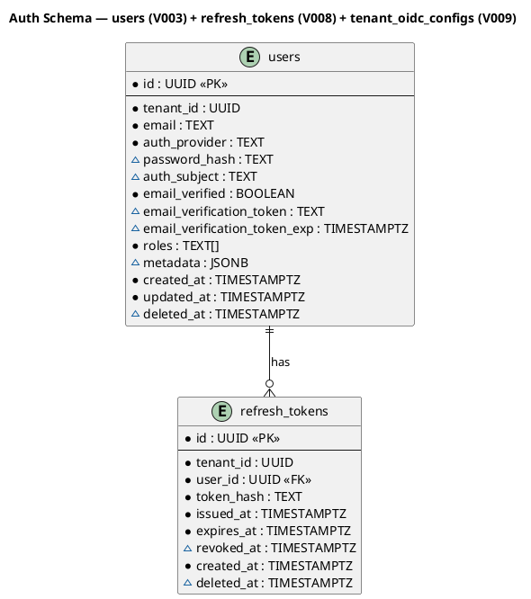
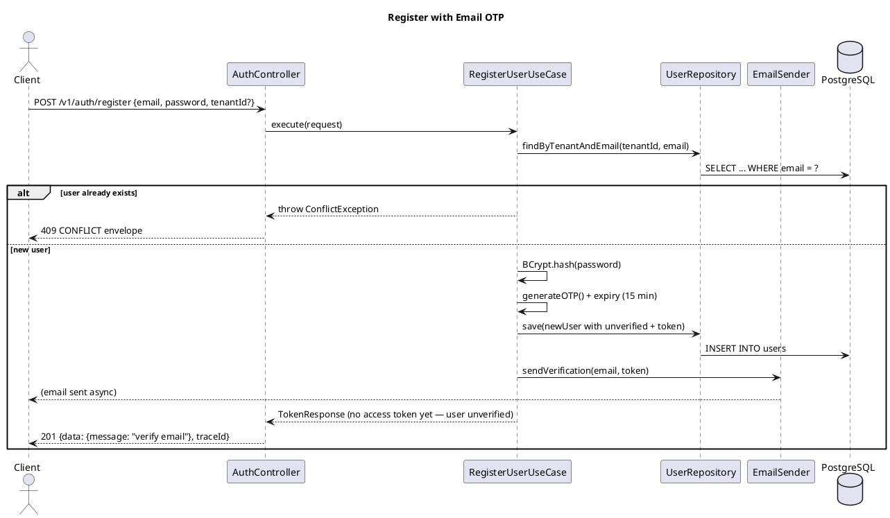
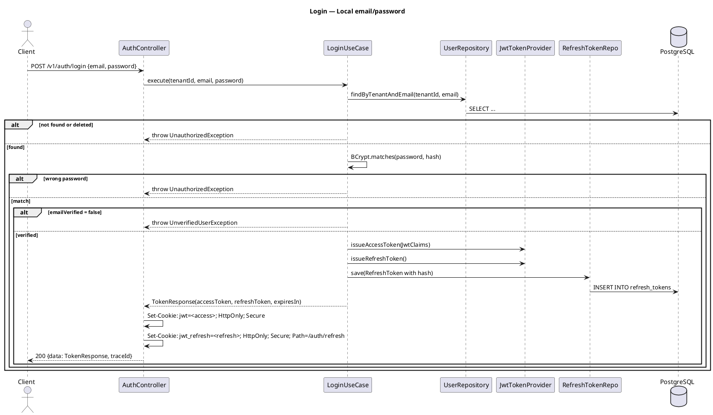
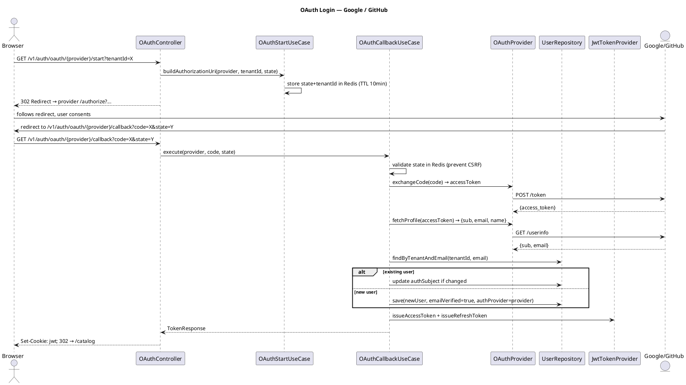
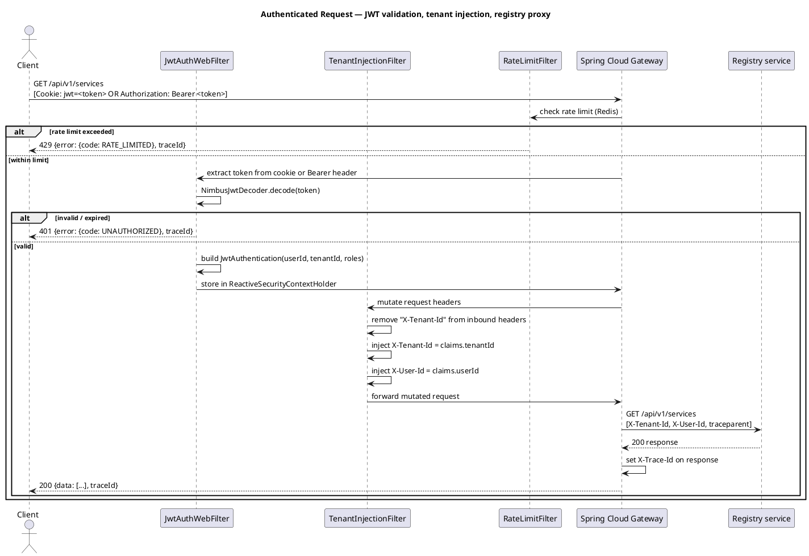

# Plan: Tasks 1.16–1.27 — Gateway Auth, Authorization, Proxying + BIP additions

## Context

Tasks 1.16–1.27 implement the full gateway auth layer on top of an otherwise complete reactive Spring Cloud Gateway WebFlux app. The gateway currently has zero Spring Security, no Flyway, and no auth code — only `PingController`, `GlobalTracingFilter`, and `GlobalWebExceptionHandler`.

Architecture constraint: **gateway is the sole token issuer** (per `CLAUDE.md`). No separate auth microservice. The gateway issues JWTs, validates them on every inbound request, derives tenant identity, injects downstream headers, and proxies to registry.

Gateway is WebFlux/reactive. Spring Data JDBC is used for auth DB queries (blocking is acceptable on virtual threads per `spring.threads.virtual.enabled=true`).

---

## Part 1 — GitHub Issues

### Existing issues and task coverage

| Issue | Title | Covers |
|-------|-------|--------|
| #11 | US1.7 — User registers with email OTP | 1.17, 1.18 |
| #12 | US1.8 — User signs in with Google or GitHub | 1.19 |
| #13 | US1.9 — Workforce SSO (tenant OIDC) | 1.20 |
| #14 | US1.10 — API client can use Bearer token | 1.21 |
| #15 | US1.11 — Authorization respects tenant and role boundaries | 1.22 |

### Actions on existing issues

- **Update #11**: add acceptance criteria for schema migration (1.16), OpenAPI update (1.27), and E2E register→OTP→verify→login tests (1.26)
- **Update #15**: add acceptance criteria for `X-Tenant-Id` derived from principal, never from inbound headers

### New issues to create

**Issue A — "US1.12 — Gateway derives tenant from JWT, strips inbound X-Tenant-Id, injects derived headers, and proxies registry with trace propagation"**
- Covers: 1.23, 1.24
- Milestone: Phase 1 — Registry Core
- Acceptance criteria:
  - `X-Tenant-Id` from inbound clients is stripped before forwarding
  - `X-Tenant-Id` and `X-User-Id` injected from validated JWT on all proxied requests
  - Registry routes (`/api/v1/**`) proxied via gateway; W3C `traceparent` forwarded
  - `X-Trace-Id` set on all proxied responses

**Issue B — "US1.13 — Gateway enforces Redis-backed rate limits with strict token buckets for auth endpoints"**
- Covers: 1.25
- Milestone: Phase 1 — Registry Core
- Acceptance criteria:
  - All routes have a baseline Redis rate limit
  - `/auth/**` routes have a stricter token bucket (lower replenish rate)
  - Rate-limited requests return HTTP 429 with the standard error envelope and `traceId`
  - 429 behavior is asserted in integration tests

---

## Part 2 — GitHub Workflow

### Branch

```
feat/1.16-gateway-auth
```

Single branch covering all tasks 1.16–1.27 — they form one cohesive auth feature that must ship together.

### Issues and PRs

Per `CLAUDE.md` workflow rules:

1. **Before coding**: update GitHub issues #11 and #15 (acceptance criteria), create Issue A (US1.12) and Issue B (US1.13) as described in Part 1
2. **Open one PR** referencing all four issues (`Closes #11`, `Closes #12`, `Closes #13`, `Closes #14`, `Closes #15`, `Closes #A`, `Closes #B`) once CI is green
3. PR title: `feat: gateway auth — register/OTP/login/OAuth/JWT/rate-limit (1.16–1.27)`
4. Assign to milestone: `Phase 1 — Registry Core`

### CI requirements before PR can merge

- `./gradlew build` green (all modules compile)
- All new integration tests pass (`AuthControllerIT`, `OAuthControllerIT`, `RateLimitIT`, `TenantIsolationIT`)
- All unit tests pass (`JwtAuthFilterTest`, `JwtTokenProviderTest`, `RegisterUserUseCaseTest`, etc.)
- Flyway migrations apply cleanly from blank DB (V003 updated in-place + V008 + V009)
- `docs/api/gateway.openapi.yaml` validates with `swagger-cli validate`
- PlantUML diagrams render without errors (6 `.puml` files)

### Commit and push approval

Per `CLAUDE.md` rules: **never commit or push without Allan's explicit approval.** Before each commit, show the diff summary and draft message, then ask "OK to commit?"

---

## Part 3 — New BIP Items (1.58, 1.59)

Add after existing item 1.57 in `docs/execution-checklist.md`:

```
- [ ] 1.58 [BIP] Publish the dual-mode auth article (httpOnly cookies + Bearer tokens
      in a Spring Security 7 reactive gateway) after JWT issuance is stable end-to-end.
- [ ] 1.59 [BIP] Publish the Redis rate-limiting article (token buckets, per-tenant key
      isolation, 429 behavior) after rate limiting is tested and observable.
```

**BIP 1.58** — `docs/bip/1.58-dual-mode-auth-gateway.md`
Topic: how the gateway issues httpOnly JWT cookies for browser clients and Bearer tokens for API clients from the same reactive security pipeline — and why tenant identity is always derived from the token, never from client-supplied headers.
All 5 channels: blog (600–1000 words with `SecurityConfig` excerpts), Twitter/X thread (hook: "your auth lives in the gateway, not the service"), Instagram carousel (visual of two auth paths), LinkedIn (professional framing on multi-tenant API security), optional video walkthrough.

**BIP 1.59** — `docs/bip/1.59-redis-rate-limiting.md`
Topic: Redis token-bucket rate limiting to protect `/auth/**` from brute-force and credential stuffing, with per-tenant key isolation and observable 429 behavior — plus how CI tests assert rate limiting without hitting a real Redis.
All 5 channels: blog (Redis key structure, algorithm, backoff), Twitter/X thread (hook: "one misconfigured rate limit let attackers enumerate usernames"), Instagram carousel (before/after request patterns), LinkedIn (abuse prevention in multi-tenant SaaS), optional video demo.

---

## Part 4 — Auth Table Ownership (decided: Option A — revised)

Registry Flyway owns **all** schema migrations. The gateway connects to the **same PostgreSQL database/schema** as registry via Spring Data JDBC. Gateway has **no Flyway** — it adds zero migration files and zero flyway dependencies. All new tables (refresh_tokens, tenant_oidc_configs) go in registry migrations. V003 (users) is updated in-place; the DB will be recreated from scratch.

---

## Part 5 — Schema (Task 1.16)

### File: `services/registry/src/main/resources/db/migration/V003__create_users.sql` — updated in-place

Add the four new auth columns directly to the CREATE TABLE statement (DB will be recreated):

```sql
CREATE TABLE users (
    id                              UUID        NOT NULL DEFAULT gen_random_uuid() PRIMARY KEY,
    tenant_id                       UUID        NOT NULL,
    email                           TEXT        NOT NULL,
    auth_provider                   TEXT        NOT NULL,     -- "local", "google", "github"
    auth_subject                    TEXT,                     -- OAuth provider's user ID (sub/id)
    password_hash                   TEXT,                     -- NULL for OAuth users
    email_verified                  BOOLEAN     NOT NULL DEFAULT false,
    email_verification_token        TEXT,
    email_verification_token_exp    TIMESTAMPTZ,
    roles                           TEXT[]      NOT NULL DEFAULT '{}',
    metadata                        JSONB,
    created_at                      TIMESTAMPTZ NOT NULL DEFAULT now(),
    updated_at                      TIMESTAMPTZ NOT NULL DEFAULT now(),
    deleted_at                      TIMESTAMPTZ,
    CONSTRAINT uq_user_tenant_email UNIQUE (tenant_id, email)
);

CREATE INDEX ON users (tenant_id) WHERE deleted_at IS NULL;
CREATE INDEX ON users USING GIN (metadata) WHERE metadata IS NOT NULL;
CREATE INDEX ON users (email_verification_token)
  WHERE email_verification_token IS NOT NULL AND deleted_at IS NULL;

ALTER TABLE users ENABLE ROW LEVEL SECURITY;
CREATE POLICY tenant_isolation ON users
    USING (tenant_id = current_setting('app.current_tenant_id', true)::UUID);
```

Notes:
- `password_hash` nullable — OAuth users have no password
- `auth_subject` stores the provider's user ID (Google `sub`, GitHub `id`)
- Token index enables fast OTP lookup without scanning all users

### File: `services/registry/src/main/resources/db/migration/V008__create_refresh_tokens.sql`

```sql
CREATE TABLE refresh_tokens (
    id          UUID        NOT NULL DEFAULT gen_random_uuid() PRIMARY KEY,
    tenant_id   UUID        NOT NULL,
    user_id     UUID        NOT NULL REFERENCES users(id),
    token_hash  TEXT        NOT NULL UNIQUE,
    issued_at   TIMESTAMPTZ NOT NULL DEFAULT now(),
    expires_at  TIMESTAMPTZ NOT NULL,
    revoked_at  TIMESTAMPTZ,
    created_at  TIMESTAMPTZ NOT NULL DEFAULT now(),
    deleted_at  TIMESTAMPTZ
);

CREATE INDEX ON refresh_tokens (user_id)     WHERE deleted_at IS NULL;
CREATE INDEX ON refresh_tokens (tenant_id)   WHERE deleted_at IS NULL;
CREATE INDEX ON refresh_tokens (token_hash)  WHERE revoked_at IS NULL AND deleted_at IS NULL;

ALTER TABLE refresh_tokens ENABLE ROW LEVEL SECURITY;
CREATE POLICY tenant_isolation ON refresh_tokens
    USING (tenant_id = current_setting('app.current_tenant_id', true)::UUID);
```

### ER Diagram

**File:** `docs/diagrams/gateway/auth-schema-er.puml`



---

## Part 6 — Dependency Changes (Task 1.16/1.17/1.25)

### `services/gateway/build.gradle.kts` — additions

Remove `flyway-core` and `flyway-database-postgresql` — gateway has no migrations. All schema managed by registry Flyway.

```kotlin
// Auth + DB (connects to same PostgreSQL as registry — no Flyway)
implementation("org.springframework.boot:spring-boot-starter-security")
implementation("org.springframework.security:spring-security-oauth2-jose")   // JWT (Nimbus)
implementation("org.springframework.boot:spring-boot-starter-data-jdbc")
runtimeOnly("org.postgresql:postgresql")

// Rate limiting (Spring Cloud Gateway Redis rate limiter)
implementation("org.springframework.boot:spring-boot-starter-data-redis-reactive")

// Email via Resend
implementation("com.squareup.okhttp3:okhttp:4.12.0")   // Resend HTTP calls

// Test
testImplementation("org.springframework.security:spring-security-test")
testImplementation("org.testcontainers:postgresql")
testImplementation("org.testcontainers:kafka")
testImplementation("com.redis:testcontainers-redis:2.2.2")
testImplementation("com.squareup.okhttp3:mockwebserver:4.12.0")   // Resend mock
```

### `services/gateway/src/main/resources/application.yml` — additions (env vars only)

No Flyway block. Gateway connects to the same DB as registry using the `registry` PostgreSQL schema.
`DB_URL` must include `?currentSchema=registry` (set at deploy time; see `application-dev.yml` for the local example).

```yaml
spring:
  datasource:
    url: ${DB_URL}           # must include ?currentSchema=registry
    username: ${DB_USERNAME}
    password: ${DB_PASSWORD}
  data:
    redis:
      host: ${REDIS_HOST}
      port: ${REDIS_PORT}

app:
  jwt:
    secret: ${JWT_SECRET}
    access-token-expiry-seconds: ${JWT_ACCESS_EXPIRY_SECONDS:900}
    refresh-token-expiry-seconds: ${JWT_REFRESH_EXPIRY_SECONDS:2592000}
  resend:
    api-key: ${RESEND_API_KEY}
    from-address: ${RESEND_FROM}
    test-mode: ${RESEND_TEST_MODE:false}
  oauth:
    google:
      client-id: ${GOOGLE_CLIENT_ID}
      client-secret: ${GOOGLE_CLIENT_SECRET}
      redirect-uri: ${APP_BASE_URL}/v1/auth/oauth/google/callback
    github:
      client-id: ${GITHUB_CLIENT_ID}
      client-secret: ${GITHUB_CLIENT_SECRET}
      redirect-uri: ${APP_BASE_URL}/v1/auth/oauth/github/callback
  rate-limit:
    default-replenish-rate: ${RATE_LIMIT_DEFAULT_REPLENISH:20}
    default-burst-capacity: ${RATE_LIMIT_DEFAULT_BURST:40}
    auth-replenish-rate: ${RATE_LIMIT_AUTH_REPLENISH:5}
    auth-burst-capacity: ${RATE_LIMIT_AUTH_BURST:10}
```

### `services/gateway/src/main/resources/application-dev.yml` — NEW (dev profile, local secrets OK)

Each service gets a `application-dev.yml` for local development. `bootRun` activates it via `--spring.profiles.active=dev` (set in `build.gradle.kts`). This file contains hardcoded dev values and is **never deployed**.

```yaml
spring:
  datasource:
    url: jdbc:postgresql://localhost:5436/cartogra?currentSchema=registry
    username: cartogra
    password: cartogra
  data:
    redis:
      host: localhost
      port: 6380   # Docker Compose maps Valkey to 6380

app:
  jwt:
    secret: dev-secret-32-bytes-minimum-padding-here
    access-token-expiry-seconds: 900
    refresh-token-expiry-seconds: 2592000
  resend:
    api-key: re_test_fake_key
    from-address: noreply@cartogra.dev
    test-mode: true          # NoOpEmailSender active — no real emails sent
  oauth:
    google:
      client-id: dev-google-client-id
      client-secret: dev-google-client-secret
      redirect-uri: http://localhost:8080/v1/auth/oauth/google/callback
    github:
      client-id: dev-github-client-id
      client-secret: dev-github-client-secret
      redirect-uri: http://localhost:8080/v1/auth/oauth/github/callback
  rate-limit:
    default-replenish-rate: 100
    default-burst-capacity: 200
    auth-replenish-rate: 50
    auth-burst-capacity: 100    # relaxed for local development
```

Add to `services/gateway/build.gradle.kts` bootRun block:

```kotlin
tasks.named<org.springframework.boot.gradle.tasks.run.BootRun>("bootRun") {
    args("--spring.profiles.active=dev")
}
```

This pattern applies to **all services** that have env-var-only `application.yml` — registry, gateway, etc. each get a matching `application-dev.yml`.

### `infra/docker-compose/docker-compose.yml` — gateway env update

The gateway entry already exists but its `SPRING_DATASOURCE_URL` is missing the schema. Update it:

```yaml
gateway:
  environment:
    SPRING_DATASOURCE_URL: jdbc:postgresql://postgres:5432/cartogra?currentSchema=registry
```

(Registry and ingestion entries are unchanged — registry already sets this via its own `application.yml` default; ingestion does not share the registry schema.)

---

## Part 7 — Package Structure

```
services/gateway/src/main/java/io/cartogra/gateway/
├── GatewayApplication.java                    (existing)
├── api/
│   ├── AuthController.java                    (register, verify, login, refresh, logout, userinfo)
│   ├── OAuthController.java                   (start, callback — Google + GitHub)
│   ├── TenantOidcAdminController.java         (admin OIDC config CRUD)
│   └── dto/
│       ├── RegisterRequest.java
│       ├── VerifyEmailRequest.java
│       ├── LoginRequest.java
│       ├── TokenResponse.java                 (access_token, refresh_token, expires_in)
│       ├── UserInfoResponse.java              (sub, email, tenantId, roles)
│       ├── RefreshRequest.java
│       └── TenantOidcConfigRequest.java
├── application/
│   ├── RegisterUserUseCase.java               (interface)
│   ├── VerifyEmailUseCase.java                (interface)
│   ├── LoginUseCase.java                      (interface)
│   ├── RefreshTokenUseCase.java               (interface)
│   ├── LogoutUseCase.java                     (interface)
│   ├── OAuthStartUseCase.java                 (interface)
│   ├── OAuthCallbackUseCase.java              (interface)
│   └── impl/
│       ├── RegisterUserUseCaseImpl.java
│       ├── VerifyEmailUseCaseImpl.java
│       ├── LoginUseCaseImpl.java
│       ├── RefreshTokenUseCaseImpl.java
│       ├── LogoutUseCaseImpl.java
│       ├── OAuthStartUseCaseImpl.java
│       └── OAuthCallbackUseCaseImpl.java
├── domain/
│   ├── User.java                              (record — id, tenantId, email, provider, roles, verified)
│   ├── RefreshToken.java                      (record — id, tenantId, userId, tokenHash, expiresAt)
│   └── TenantOidcConfig.java                  (record — tenantId, discoveryUri, clientId, clientSecret)
├── infrastructure/
│   ├── jdbc/
│   │   ├── UserRepository.java                (interface)
│   │   ├── RefreshTokenRepository.java        (interface)
│   │   ├── TenantOidcConfigRepository.java    (interface)
│   │   ├── JdbcUserRepository.java
│   │   ├── JdbcRefreshTokenRepository.java
│   │   └── JdbcTenantOidcConfigRepository.java
│   ├── email/
│   │   ├── EmailSender.java                   (interface: sendVerification, sendPasswordReset)
│   │   ├── ResendEmailSender.java             (OkHttp → Resend API)
│   │   └── NoOpEmailSender.java               (test-mode: logs only, no real send)
│   ├── oauth/
│   │   ├── OAuthProvider.java                 (interface: authorizationUri, exchangeCode, fetchProfile)
│   │   ├── GoogleOAuthProvider.java
│   │   └── GitHubOAuthProvider.java
│   ├── jwt/
│   │   ├── JwtTokenProvider.java              (issue + validate, wraps NimbusJwtEncoder/Decoder)
│   │   └── JwtClaims.java                     (record — userId, tenantId, email, roles, exp)
│   └── security/
│       ├── JwtAuthenticationWebFilter.java    (WebFilter — extracts + validates JWT from cookie or Bearer)
│       ├── TenantInjectionGlobalFilter.java   (GlobalFilter — strips X-Tenant-Id, injects from JWT)
│       └── RateLimitGlobalFilter.java         (GlobalFilter — Redis token bucket, 429 on breach)
└── config/
    ├── SecurityConfig.java                    (SecurityWebFilterChain, route rules)
    ├── JwtConfig.java                         (@ConfigurationProperties for jwt.*)
    ├── ResendConfig.java                      (@ConfigurationProperties for resend.*)
    ├── OAuthConfig.java                       (@ConfigurationProperties for oauth.*)
    ├── RateLimitConfig.java                   (RedisRateLimiter beans, route rate-limit wiring)
    └── GatewayRoutesConfig.java               (route definitions including registry proxy)
```

---

## Part 8 — Domain Model (Task 1.17)

### `domain/User.java`

```java
public record User(
    UUID id,
    UUID tenantId,
    String email,
    String authProvider,       // "local", "google", "github"
    String authSubject,        // nullable — OAuth provider's user ID
    String passwordHash,       // nullable — absent for OAuth users
    boolean emailVerified,
    List<String> roles,
    String emailVerificationToken,      // nullable
    Instant emailVerificationTokenExp,  // nullable
    Instant createdAt,
    Instant updatedAt,
    Instant deletedAt          // nullable
) {}
```

### `domain/RefreshToken.java`

```java
public record RefreshToken(
    UUID id,
    UUID tenantId,
    UUID userId,
    String tokenHash,
    Instant issuedAt,
    Instant expiresAt,
    Instant revokedAt          // nullable
) {}
```

### `domain/TenantOidcConfig.java`

```java
public record TenantOidcConfig(
    UUID id,
    UUID tenantId,
    String discoveryUri,
    String clientId,
    String clientSecret,       // stored encrypted in JSONB metadata
    Instant createdAt,
    Instant updatedAt
) {}
```

### Class Diagram

**File:** `docs/diagrams/gateway/auth-domain-class.puml`

```plantuml
@startuml
title Gateway Auth Domain

package "domain" {
  record User {
    id : UUID
    tenantId : UUID
    email : String
    authProvider : String
    authSubject : String?
    passwordHash : String?
    emailVerified : boolean
    roles : List<String>
    emailVerificationToken : String?
    emailVerificationTokenExp : Instant?
  }
  record RefreshToken {
    id : UUID
    tenantId : UUID
    userId : UUID
    tokenHash : String
    expiresAt : Instant
    revokedAt : Instant?
  }
  record TenantOidcConfig {
    id : UUID
    tenantId : UUID
    discoveryUri : String
    clientId : String
    clientSecret : String
  }
}

package "application" {
  interface RegisterUserUseCase {
    execute(tenantId, request) : TokenResponse
  }
  interface VerifyEmailUseCase {
    execute(email, token) : void
  }
  interface LoginUseCase {
    execute(tenantId, email, password) : TokenResponse
  }
  interface RefreshTokenUseCase {
    execute(refreshToken) : TokenResponse
  }
  interface OAuthStartUseCase {
    startUrl(provider, tenantId) : String
  }
  interface OAuthCallbackUseCase {
    execute(provider, code, state) : TokenResponse
  }
}

package "infrastructure.jdbc" {
  interface UserRepository {
    findByTenantAndEmail(tenantId, email) : Optional<User>
    findByVerificationToken(token) : Optional<User>
    save(user) : User
  }
  interface RefreshTokenRepository {
    findActiveByHash(tokenHash) : Optional<RefreshToken>
    save(token) : RefreshToken
    revoke(id) : void
    revokeAllForUser(userId) : void
  }
  interface TenantOidcConfigRepository {
    findByTenantId(tenantId) : Optional<TenantOidcConfig>
    save(config) : TenantOidcConfig
  }
}

package "infrastructure.jwt" {
  class JwtTokenProvider {
    issueAccessToken(claims) : String
    issueRefreshToken() : String
    decode(token) : JwtClaims
  }
  record JwtClaims {
    userId : UUID
    tenantId : UUID
    email : String
    roles : List<String>
    exp : Instant
  }
}

RegisterUserUseCase ..> UserRepository
LoginUseCase ..> UserRepository
LoginUseCase ..> JwtTokenProvider
RefreshTokenUseCase ..> RefreshTokenRepository
RefreshTokenUseCase ..> JwtTokenProvider
OAuthCallbackUseCase ..> UserRepository
@enduml
```

---

## Part 9 — Auth Controller & Use Cases (Task 1.17)

### `api/AuthController.java` skeleton

All gateway auth endpoints are versioned under `/v1/auth/**`.

```java
@RestController
@RequestMapping("/v1/auth")
public class AuthController {

    private final RegisterUserUseCase registerUser;
    private final VerifyEmailUseCase verifyEmail;
    private final LoginUseCase login;
    private final RefreshTokenUseCase refreshToken;
    private final LogoutUseCase logout;

    public AuthController(/*...*/) { /*...*/ }

    /** POST /v1/auth/register */
    @PostMapping("/register")
    public Mono<ResponseEntity<ApiResponse<TokenResponse>>> register(
            @Valid @RequestBody RegisterRequest request) {
        String traceId = Span.current().getSpanContext().getTraceId();
        TokenResponse result = registerUser.execute(request);
        return Mono.just(ResponseEntity.status(201)
            .header("X-Trace-Id", traceId)
            .body(new ApiResponse<>(result, traceId)));
    }

    /** POST /v1/auth/verify */
    @PostMapping("/verify")
    public Mono<ResponseEntity<ApiResponse<Void>>> verify(
            @Valid @RequestBody VerifyEmailRequest request) { /*...*/ }

    /** POST /v1/auth/login */
    @PostMapping("/login")
    public Mono<ResponseEntity<ApiResponse<TokenResponse>>> login(
            @Valid @RequestBody LoginRequest request,
            ServerHttpResponse response) {
        // On success: set httpOnly cookie + return token in body
        /*...*/
    }

    /** POST /v1/auth/refresh */
    @PostMapping("/refresh")
    public Mono<ResponseEntity<ApiResponse<TokenResponse>>> refresh(
            ServerHttpRequest request, ServerHttpResponse response) {
        // Read refresh token from cookie or request body
        /*...*/
    }

    /** POST /v1/auth/logout */
    @PostMapping("/logout")
    public Mono<ResponseEntity<ApiResponse<Void>>> logout(
            ServerHttpRequest request, ServerHttpResponse response) { /*...*/ }

    /** GET /v1/auth/userinfo */
    @GetMapping("/userinfo")
    public Mono<ResponseEntity<ApiResponse<UserInfoResponse>>> userinfo(
            @AuthenticationPrincipal JwtAuthentication principal) { /*...*/ }
}
```

`OAuthController` maps to `/v1/auth/oauth`:

```java
@RestController
@RequestMapping("/v1/auth/oauth")
public class OAuthController { /* ... */ }
```

Rules:
- `JwtAuthentication` is a custom `AbstractAuthenticationToken` holding `JwtClaims`
- Cookie name: `jwt`; set as `HttpOnly; Secure; SameSite=Lax; Path=/; Max-Age=900`
- Refresh cookie name: `jwt_refresh`; `HttpOnly; Secure; SameSite=Lax; Path=/v1/auth/refresh`
- `/v1/auth/**` is `permitAll()` in `SecurityWebFilterChain`; downstream calls reject unverified users (1.21 gate)
- Email sending is **async**: `RegisterUserUseCaseImpl` submits `EmailSender.sendVerification(...)` to a virtual-thread executor (`Executors.newVirtualThreadPerTaskExecutor()`) so the HTTP response is returned immediately without waiting for the Resend API call. This avoids auth endpoint latency spikes.

### Use case interfaces (`application/`)

Each interface follows the same pattern: single `execute` method, constructor-injected dependencies, returns domain type (never Spring type):

```java
public interface RegisterUserUseCase {
    TokenResponse execute(RegisterRequest request);
}

public interface VerifyEmailUseCase {
    void execute(String email, String token);
}

public interface LoginUseCase {
    TokenResponse execute(UUID tenantId, String email, String password);
}

public interface RefreshTokenUseCase {
    TokenResponse execute(String rawRefreshToken);
}

public interface OAuthStartUseCase {
    String buildAuthorizationUri(String provider, UUID tenantId, String state);
}

public interface OAuthCallbackUseCase {
    TokenResponse execute(String provider, String code, String state);
}
```

### Sequence Diagrams

**File:** `docs/diagrams/gateway/register-otp-sequence.puml`



**File:** `docs/diagrams/gateway/login-local-sequence.puml`



**File:** `docs/diagrams/gateway/login-oauth-sequence.puml`



**File:** `docs/diagrams/gateway/jwt-proxy-sequence.puml`



---

## Part 10 — Spring Security Config (Task 1.17 / 1.22)

### `config/SecurityConfig.java`

```java
@Configuration
@EnableWebFluxSecurity
@EnableReactiveMethodSecurity   // reactive variant — NOT @EnableMethodSecurity (servlet)
public class SecurityConfig {

    private final JwtAuthenticationWebFilter jwtAuthFilter;
    private final TenantInjectionGlobalFilter tenantFilter;

    public SecurityConfig(JwtAuthenticationWebFilter jwtAuthFilter,
                          TenantInjectionGlobalFilter tenantFilter) {
        this.jwtAuthFilter = jwtAuthFilter;
        this.tenantFilter = tenantFilter;
    }

    @Bean
    public SecurityWebFilterChain securityWebFilterChain(ServerHttpSecurity http) {
        return http
            .csrf(ServerHttpSecurity.CsrfSpec::disable)
            .httpBasic(ServerHttpSecurity.HttpBasicSpec::disable)
            .formLogin(ServerHttpSecurity.FormLoginSpec::disable)
            .authorizeExchange(ex -> ex
                .pathMatchers("/v1/auth/**").permitAll()          // gateway auth endpoints
                .pathMatchers("/actuator/health/**").permitAll()
                .pathMatchers("/api/v1/admin/**").hasRole("ADMIN")    // proxied registry admin
                .pathMatchers("/api/v1/**").hasAnyRole("VIEWER", "MEMBER", "ADMIN")
                .anyExchange().authenticated()
            )
            .addFilterBefore(jwtAuthFilter, SecurityWebFiltersOrder.AUTHENTICATION)
            .exceptionHandling(ex -> ex
                .authenticationEntryPoint(new JsonAuthenticationEntryPoint())
                .accessDeniedHandler(new JsonAccessDeniedHandler())
            )
            .build();
    }
}
```

Notes:
- `@EnableReactiveMethodSecurity` is used (not `@EnableMethodSecurity`) — the gateway is reactive WebFlux
- Route-level authorization in `authorizeExchange` handles the bulk of RBAC
- `@PreAuthorize("hasRole('ADMIN')")` can still be used on controller methods for fine-grained control
- `JsonAuthenticationEntryPoint` / `JsonAccessDeniedHandler`: return the standard Cartogra error envelope (not HTML default)
- `TenantInjectionGlobalFilter` is registered as a Spring bean (`@Component`) and auto-picked by SCG as a `GlobalFilter`

### `infrastructure/security/JwtAuthenticationWebFilter.java` skeleton

```java
@Component
public class JwtAuthenticationWebFilter implements WebFilter {

    private final JwtTokenProvider jwtTokenProvider;

    public JwtAuthenticationWebFilter(JwtTokenProvider jwtTokenProvider) {
        this.jwtTokenProvider = jwtTokenProvider;
    }

    @Override
    public Mono<Void> filter(ServerWebExchange exchange, WebFilterChain chain) {
        return extractRawToken(exchange)
            .flatMap(jwtTokenProvider::decode)
            .flatMap(claims -> {
                JwtAuthentication auth = new JwtAuthentication(claims);
                return chain.filter(exchange)
                    .contextWrite(ReactiveSecurityContextHolder.withAuthentication(auth));
            })
            .onErrorResume(JwtException.class, _ -> chain.filter(exchange))
            .switchIfEmpty(chain.filter(exchange));
    }

    private Mono<String> extractRawToken(ServerWebExchange exchange) {
        HttpCookie cookie = exchange.getRequest().getCookies().getFirst("jwt");
        if (cookie != null) return Mono.just(cookie.getValue());

        String bearer = exchange.getRequest().getHeaders().getFirst(HttpHeaders.AUTHORIZATION);
        if (bearer != null && bearer.startsWith("Bearer ")) {
            return Mono.just(bearer.substring(7));
        }
        return Mono.empty();
    }
}
```

---

## Part 11 — JWT Provider (Task 1.21)

### `infrastructure/jwt/JwtTokenProvider.java`

```java
@Component
public class JwtTokenProvider {

    private final JwtEncoder encoder;
    private final JwtDecoder decoder;
    private final JwtConfig config;

    public JwtTokenProvider(JwtEncoder encoder, JwtDecoder decoder, JwtConfig config) {
        this.encoder = encoder;
        this.decoder = decoder;
        this.config = config;
    }

    public String issueAccessToken(JwtClaims claims) {
        Instant now = Instant.now();
        JwtClaimsSet claimsSet = JwtClaimsSet.builder()
            .subject(claims.userId().toString())
            .claim("tid", claims.tenantId().toString())
            .claim("email", claims.email())
            .claim("roles", claims.roles())
            .issuedAt(now)
            .expiresAt(now.plusSeconds(config.accessTokenExpirySeconds()))
            .build();
        return encoder.encode(JwtEncoderParameters.from(claimsSet)).getTokenValue();
    }

    public String issueRefreshToken() {
        // raw random token — caller hashes before persisting
        return UUID.randomUUID().toString().replace("-", "") +
               UUID.randomUUID().toString().replace("-", "");
    }

    public Mono<JwtClaims> decode(String token) {
        return Mono.fromCallable(() -> {
            Jwt jwt = decoder.decode(token);
            return new JwtClaims(
                UUID.fromString(jwt.getSubject()),
                UUID.fromString(jwt.getClaimAsString("tid")),
                jwt.getClaimAsString("email"),
                jwt.getClaimAsStringList("roles"),
                jwt.getExpiresAt()
            );
        });
    }
}
```

### `config/JwtConfig.java`

```java
@ConfigurationProperties(prefix = "app.jwt")
@Validated
public record JwtConfig(
    @NotEmpty String secret,
    @Positive long accessTokenExpirySeconds,
    @Positive long refreshTokenExpirySeconds
) {}
```

JWT beans wired in `SecurityConfig` (or a dedicated `@Configuration` class):

```java
@Bean
JwtEncoder jwtEncoder(JwtConfig config) {
    byte[] keyBytes = config.secret().getBytes(StandardCharsets.UTF_8);
    SecretKeySpec key = new SecretKeySpec(keyBytes, "HmacSHA256");
    return new NimbusJwtEncoder(new ImmutableSecret<>(key));
}

@Bean
JwtDecoder jwtDecoder(JwtConfig config) {
    byte[] keyBytes = config.secret().getBytes(StandardCharsets.UTF_8);
    return NimbusJwtDecoder.withSecretKey(new SecretKeySpec(keyBytes, "HmacSHA256")).build();
}
```

---

## Part 12 — Resend Email Client (Task 1.18)

### `infrastructure/email/EmailSender.java`

```java
public interface EmailSender {
    void sendVerification(String toEmail, String otpToken);
    void sendPasswordReset(String toEmail, String resetToken);
}
```

### `infrastructure/email/ResendEmailSender.java` skeleton

- Uses OkHttp to POST to `https://api.resend.com/emails`
- Constructs HTML body from a template string (no Thymeleaf/Freemarker dependency)
- `Authorization: Bearer <RESEND_API_KEY>` header

### `infrastructure/email/NoOpEmailSender.java`

```java
@Component
@ConditionalOnProperty(name = "app.resend.test-mode", havingValue = "true")
public class NoOpEmailSender implements EmailSender {
    private static final Logger log = LoggerFactory.getLogger(NoOpEmailSender.class);

    @Override
    public void sendVerification(String toEmail, String otpToken) {
        log.info("[TEST MODE] Verification OTP for {} — token: {}", toEmail, otpToken);
    }
    // ...
}
```

### `config/ResendConfig.java`

```java
@ConfigurationProperties(prefix = "app.resend")
@Validated
public record ResendConfig(
    @NotEmpty String apiKey,
    @NotEmpty String fromAddress,
    boolean testMode
) {}
```

CI sets `RESEND_TEST_MODE=true` — no API key needed in CI environment.

---

## Part 13 — OAuth Provider SPI (Task 1.19)

### `infrastructure/oauth/OAuthProvider.java`

```java
public interface OAuthProvider {
    String providerName();     // "google" or "github"
    String buildAuthorizationUri(String state, String redirectUri);
    String exchangeCodeForAccessToken(String code, String redirectUri);
    OAuthProfile fetchProfile(String accessToken);
}

public record OAuthProfile(String subject, String email, String name) {}
```

### Provider implementations

- `GoogleOAuthProvider` — calls `https://oauth2.googleapis.com/token` and `https://openidconnect.googleapis.com/v1/userinfo` via `WebClient` (reactive)
- `GitHubOAuthProvider` — calls `https://github.com/login/oauth/access_token` and `https://api.github.com/user` via `WebClient`

Providers registered in a `Map<String, OAuthProvider>` bean keyed by `providerName()`.

State parameter: store `state → tenantId` in Redis with 10-minute TTL to prevent CSRF and carry tenant context through the OAuth round-trip.

---

## Part 14 — Tenant OIDC (Task 1.20)

Admin API: `TenantOidcAdminController` at `/v1/auth/admin/oidc-config`

```java
@RestController
@RequestMapping("/v1/auth/admin/oidc-config")
@PreAuthorize("hasRole('ADMIN')")
public class TenantOidcAdminController {
    // POST   /v1/auth/admin/oidc-config          — create
    // GET    /v1/auth/admin/oidc-config/{id}     — read
    // PUT    /v1/auth/admin/oidc-config/{id}     — update
    // DELETE /v1/auth/admin/oidc-config/{id}     — soft delete
}
```

Schema: Add `V009__create_tenant_oidc_configs.sql` to registry (new migration after V008):

```sql
CREATE TABLE tenant_oidc_configs (
    id              UUID        NOT NULL DEFAULT gen_random_uuid() PRIMARY KEY,
    tenant_id       UUID        NOT NULL UNIQUE,
    discovery_uri   TEXT        NOT NULL,
    client_id       TEXT        NOT NULL,
    client_secret   TEXT        NOT NULL,   -- encrypted at app layer
    enabled         BOOLEAN     NOT NULL DEFAULT true,
    created_at      TIMESTAMPTZ NOT NULL DEFAULT now(),
    updated_at      TIMESTAMPTZ NOT NULL DEFAULT now(),
    deleted_at      TIMESTAMPTZ
);
CREATE INDEX ON tenant_oidc_configs (tenant_id) WHERE deleted_at IS NULL;
```

UI for tenant OIDC is deferred to Phase 1 follow-up per checklist note.

---

## Part 15 — Header Stripping + Tenant Injection (Task 1.23)

### `infrastructure/security/TenantInjectionGlobalFilter.java`

```java
@Component
public class TenantInjectionGlobalFilter implements GlobalFilter, Ordered {

    @Override
    public int getOrder() { return -100; } // run before routing filters

    @Override
    public Mono<Void> filter(ServerWebExchange exchange, GatewayFilterChain chain) {
        // Always strip — whether authenticated or not
        ServerHttpRequest stripped = exchange.getRequest().mutate()
            .headers(h -> {
                h.remove("X-Tenant-Id");
                h.remove("X-User-Id");
            })
            .build();

        return ReactiveSecurityContextHolder.getContext()
            .map(SecurityContext::getAuthentication)
            .cast(JwtAuthentication.class)
            .map(auth -> stripped.mutate()
                .header("X-Tenant-Id", auth.getTenantId().toString())
                .header("X-User-Id", auth.getUserId().toString())
                .build())
            .defaultIfEmpty(stripped)
            .flatMap(req -> chain.filter(exchange.mutate().request(req).build()));
    }
}
```

---

## Part 16 — Registry Proxying (Task 1.24)

### `application.yml` route configuration

```yaml
spring:
  cloud:
    gateway:
      routes:
        - id: registry
          uri: ${REGISTRY_URI:http://localhost:8081}
          predicates:
            - Path=/api/v1/**
          filters:
            - name: RequestSize
              args:
                maxSize: 5MB
```

Trace propagation is handled automatically by `spring-boot-starter-opentelemetry` (OTel auto-instruments Spring Cloud Gateway WebClient). The `GlobalTracingFilter` (already implemented) adds `X-Trace-Id` to all responses.

If manual `traceparent` injection is needed (e.g. for non-instrumented routes), add a `TracePropagationGlobalFilter` that reads `Span.current()` and writes the `traceparent` header into the forwarded request.

---

## Part 17 — Redis Rate Limiting (Task 1.25)

Spring Cloud Gateway ships with a built-in `RedisRateLimiter` that implements the token bucket algorithm. Wire it in `GatewayRoutesConfig` or `RateLimitConfig`.

### `config/RateLimitConfig.java`

```java
@Configuration
public class RateLimitConfig {

    private final RateLimitProperties props;

    public RateLimitConfig(RateLimitProperties props) { this.props = props; }

    @Bean
    public RedisRateLimiter defaultRateLimiter() {
        return new RedisRateLimiter(
            props.defaultReplenishRate(),
            props.defaultBurstCapacity(),
            1
        );
    }

    @Bean
    public RedisRateLimiter authRateLimiter() {
        return new RedisRateLimiter(
            props.authReplenishRate(),    // e.g. 5/s
            props.authBurstCapacity(),    // e.g. 10
            1
        );
    }

    @Bean
    public KeyResolver ipKeyResolver() {
        return exchange -> Mono.justOrEmpty(
            exchange.getRequest().getRemoteAddress()
        ).map(addr -> addr.getAddress().getHostAddress())
         .switchIfEmpty(Mono.just("unknown"));
    }
}
```

### `application.yml` route filters (rate limit applied per route)

```yaml
spring:
  cloud:
    gateway:
      default-filters:
        - name: RequestRateLimiter
          args:
            redis-rate-limiter.replenish-rate: 20
            redis-rate-limiter.burst-capacity: 40
            key-resolver: "#{@ipKeyResolver}"
      routes:
        - id: auth
          uri: forward://auth-internal        # in-process gateway controllers
          predicates:
            - Path=/v1/auth/**
          filters:
            - name: RequestRateLimiter
              args:
                redis-rate-limiter.replenish-rate: 5
                redis-rate-limiter.burst-capacity: 10
                key-resolver: "#{@ipKeyResolver}"
        - id: registry
          uri: ${REGISTRY_URI:http://localhost:8081}
          predicates:
            - Path=/api/v1/**
```

429 responses from Spring Cloud Gateway's built-in rate limiter return an empty body. Override with a custom `ErrorWebExceptionHandler` that wraps `ResponseStatusException(TOO_MANY_REQUESTS)` in the Cartogra error envelope.

---

## Part 18 — Tests (Task 1.26)

### Test file locations

```
services/gateway/src/test/java/io/cartogra/gateway/
├── api/
│   ├── AuthControllerIT.java      (register→OTP→verify→login full flow)
│   ├── OAuthControllerIT.java     (OAuth start + callback with MockWebServer)
│   └── RateLimitIT.java           (assert 429 after threshold)
└── security/
    ├── JwtAuthFilterTest.java     (unit — cookie, Bearer, missing token)
    └── TenantInjectionFilterTest.java (unit — header stripping/injection)
```

### Test file locations (expanded)

```
services/gateway/src/test/java/io/cartogra/gateway/
├── api/
│   ├── AuthControllerIT.java           (full register→OTP→verify→login flow + edge cases)
│   ├── OAuthControllerIT.java          (OAuth start + callback with MockWebServer)
│   ├── RateLimitIT.java                (429 threshold + burst + reset behavior)
│   └── TenantIsolationIT.java          (header stripping, cross-tenant access rejection)
├── security/
│   ├── JwtAuthFilterTest.java          (unit — all token extraction paths)
│   ├── TenantInjectionFilterTest.java  (unit — strip/inject behavior)
│   └── JwtTokenProviderTest.java       (unit — issue, decode, expired, tampered)
└── application/
    ├── RegisterUserUseCaseTest.java     (unit — happy path, duplicates, async email)
    ├── LoginUseCaseTest.java            (unit — wrong password, unverified, deleted user)
    └── RefreshTokenUseCaseTest.java     (unit — expired token, revoked token, replay)
```

### Key test scenarios (Testcontainers — PostgreSQL + Redis)

**Registration & Verification:**
- Happy path: `POST /v1/auth/register` → 201, email sent (NoOp log) → `POST /v1/auth/verify` with correct OTP → 200 → login succeeds
- Duplicate email: `POST /v1/auth/register` with existing email → 409 `DUPLICATE_EMAIL`
- OTP expired: verify with valid-format token after 15-min TTL → 400 `OTP_EXPIRED`
- OTP wrong: verify with incorrect token → 400 `INVALID_OTP`
- Email validation: missing `@` / blank email → 400 validation error envelope
- Password too short: `< 8 chars` → 400 `WEAK_PASSWORD`

**Login — local email/password:**
- Happy path: verified user → 200 with `Set-Cookie: jwt`, `Set-Cookie: jwt_refresh`, body contains `access_token`
- Unverified user: login → 401 `UNVERIFIED_EMAIL`
- Wrong password: login → 401 `INVALID_CREDENTIALS` (same message as not-found — no enumeration)
- Non-existent user: login → 401 `INVALID_CREDENTIALS` (must be indistinguishable from wrong-password)
- Soft-deleted user: `deleted_at IS NOT NULL` → 401 `INVALID_CREDENTIALS`

**JWT validation:**
- Cookie auth: valid `jwt` cookie → request authenticated, `X-Tenant-Id` injected from token
- Bearer auth: valid `Authorization: Bearer <token>` → same behavior as cookie
- Both cookie and Bearer present: cookie takes precedence
- Missing token on protected route → 401 `UNAUTHORIZED` with envelope
- Malformed JWT (not 3 parts) → 401, no stack trace in response
- JWT with wrong HMAC signature → 401
- Expired JWT → 401 `TOKEN_EXPIRED`
- JWT missing `tid` claim → 401

**Refresh & Logout:**
- Valid refresh token: `POST /v1/auth/refresh` with `jwt_refresh` cookie → new `access_token` + rotated `jwt_refresh`
- Expired refresh token → 401 `REFRESH_TOKEN_EXPIRED`
- Revoked refresh token (replay attack): use same refresh token twice → second use returns 401 `REFRESH_TOKEN_REVOKED`
- Logout: `POST /v1/auth/logout` → refresh token revoked; subsequent refresh attempt → 401

**Authorization (RBAC):**
- VIEWER role: `GET /api/v1/services` → 200
- VIEWER role: `DELETE /api/v1/admin/something` → 403 `ACCESS_DENIED` envelope
- ADMIN role: admin routes → 200
- No role at all: authenticated but empty roles → 403

**Tenant isolation (header stripping):**
- Request with `X-Tenant-Id: <attacker-uuid>` header + valid JWT for tenant A → downstream receives tenant A from JWT, not the forged header
- Request with `X-User-Id: <attacker-uuid>` header + valid JWT → downstream receives real user ID

**Rate limiting:**
- Auth burst: 5 requests within 1 second to `POST /v1/auth/login` → 6th returns 429 with error envelope containing `traceId`
- Rate limit response body: `{"error":{"code":"RATE_LIMITED","message":"..."},"traceId":"<32hex>"}` — NOT empty
- Default rate: 20+ requests to `/api/v1/**` route do not hit rate limit; 41st does
- Rate limit headers: `X-RateLimit-Remaining` present on allowed responses

**OAuth:**
- OAuth start: `GET /v1/auth/oauth/google/start?tenantId=X` → 302 to Google with `state` param stored in Redis
- OAuth callback CSRF: callback with unknown/expired state → 400 `INVALID_OAUTH_STATE`
- OAuth new user: valid callback → user created, email verified, JWT issued
- OAuth existing user: same email re-authenticates → existing user returned, `auth_subject` updated if changed
- OAuth provider error: callback with `error=access_denied` → 400 `OAUTH_DENIED`

**Trace propagation:**
- All responses include `X-Trace-Id` header (32 lowercase hex)
- Proxied request to registry includes `traceparent` W3C header
- Error responses (4xx/5xx) also include `traceId` in body

**Performance (async email):**
- Register response time: `POST /v1/auth/register` completes in `< 200ms` even when email sender is stubbed with 500ms delay — confirms async email dispatch

---

## Part 19 — ADRs

### ADR-001x — Gateway as sole token issuer

**File:** `docs/adr/ADR-001x-gateway-sole-token-issuer.md` (use next available ADR number)

**Status:** Accepted

**Decision:** The gateway service is the only component that issues JWTs. No separate auth microservice.

**Rationale:** An MVP auth microservice adds one extra hop, one extra service to operate, and one more gRPC contract to maintain without adding capability. The gateway already sits at the perimeter — it is the natural place to validate credentials and issue tokens. Tenant context injection (1.23) and rate limiting (1.25) are cleanest when auth and routing share the same process. Separation into a dedicated auth service is a Phase 5+ concern when the auth surface grows beyond a single gateway.

**Consequences:** Gateway must own a DB connection to the shared PostgreSQL for user/token lookups. The gateway is no longer purely stateless.

---

### ADR-001y — httpOnly cookie + Bearer dual-mode auth

**File:** `docs/adr/ADR-001y-httponlycookie-bearer-dual-auth.md`

**Status:** Accepted

**Decision:** Browser clients receive JWTs via `HttpOnly; Secure; SameSite=Lax` cookies. Non-browser clients use `Authorization: Bearer`. Neither path ever uses `localStorage` or exposes tokens to JavaScript.

**Rationale:** `localStorage` tokens are readable by any JavaScript on the page — XSS becomes instant account takeover. `HttpOnly` cookies are inaccessible to scripts. `SameSite=Lax` provides CSRF protection without requiring custom CSRF tokens. The `Bearer` path serves CLI tools, CI automation, and API clients that cannot handle cookies.

**Consequences:** The `JwtAuthenticationWebFilter` must try both extraction paths. The `/auth/login` response must set the cookie AND return the token in the body so non-browser callers can grab it directly.

---

## Part 20 — OpenAPI Update (Task 1.27)

**File:** `docs/api/gateway.openapi.yaml`

New paths to document (all gateway-owned endpoints are prefixed `/v1`; proxied registry routes remain `/api/v1/**`):

| Path | Method | Auth | Description |
|------|--------|------|-------------|
| `/v1/auth/register` | POST | none | Register + send OTP |
| `/v1/auth/verify` | POST | none | Verify OTP |
| `/v1/auth/login` | POST | none | Login → cookie + Bearer |
| `/v1/auth/refresh` | POST | cookie or body | Refresh access token |
| `/v1/auth/logout` | POST | JWT | Revoke refresh token |
| `/v1/auth/userinfo` | GET | JWT | Return principal info |
| `/v1/auth/oauth/{provider}/start` | GET | none | Begin OAuth flow |
| `/v1/auth/oauth/{provider}/callback` | GET | none | OAuth callback |
| `/v1/auth/admin/oidc-config` | POST/GET/PUT/DELETE | JWT+ADMIN | Tenant OIDC config |

Document:
- `Set-Cookie` response headers for login and refresh
- `Authorization: Bearer` option for all secured routes
- `X-Trace-Id` on all responses (shared component already in spec)
- `X-Cartogra-Api-Key` as alternative auth for CI routes (Phase 3, deferred — mark as `x-planned`)
- 429 response schema using the standard error envelope

---

## Part 21 — Files Created / Modified Summary

| File | Action |
|------|--------|
| `services/registry/src/main/resources/db/migration/V003__create_users.sql` | Modified in-place — add auth columns (DB recreated) |
| `services/registry/src/main/resources/db/migration/V008__create_refresh_tokens.sql` | New |
| `services/registry/src/main/resources/db/migration/V009__create_tenant_oidc_configs.sql` | New |
| `services/gateway/build.gradle.kts` | Modified — add security, JDBC, Redis deps (NO Flyway) |
| `services/gateway/src/main/resources/application.yml` | Modified — env vars only; no Flyway block |
| `services/gateway/src/main/resources/application-dev.yml` | New — hardcoded dev values, test-mode email |
| `services/registry/src/main/resources/application-dev.yml` | New — hardcoded dev values for registry |
| `services/gateway/src/main/java/io/cartogra/gateway/api/AuthController.java` | New — `/v1/auth/**` |
| `services/gateway/src/main/java/io/cartogra/gateway/api/OAuthController.java` | New — `/v1/auth/oauth/**` |
| `services/gateway/src/main/java/io/cartogra/gateway/api/TenantOidcAdminController.java` | New — `/v1/auth/admin/oidc-config` |
| `services/gateway/src/main/java/io/cartogra/gateway/api/dto/*.java` (7 records) | New |
| `services/gateway/src/main/java/io/cartogra/gateway/domain/*.java` (3 records) | New |
| `services/gateway/src/main/java/io/cartogra/gateway/application/*.java` (6 interfaces) | New |
| `services/gateway/src/main/java/io/cartogra/gateway/application/impl/*.java` (6 impls) | New |
| `services/gateway/src/main/java/io/cartogra/gateway/infrastructure/jdbc/*.java` (6 files) | New |
| `services/gateway/src/main/java/io/cartogra/gateway/infrastructure/email/*.java` (3 files) | New |
| `services/gateway/src/main/java/io/cartogra/gateway/infrastructure/oauth/*.java` (3 files) | New |
| `services/gateway/src/main/java/io/cartogra/gateway/infrastructure/jwt/*.java` (2 files) | New |
| `services/gateway/src/main/java/io/cartogra/gateway/infrastructure/security/*.java` (3 files) | New |
| `services/gateway/src/main/java/io/cartogra/gateway/config/*.java` (6 files) | New |
| `services/gateway/src/test/java/io/cartogra/gateway/**/*.java` (10 test files) | New |
| `docs/diagrams/gateway/auth-schema-er.puml` | New |
| `docs/diagrams/gateway/auth-domain-class.puml` | New |
| `docs/diagrams/gateway/register-otp-sequence.puml` | New |
| `docs/diagrams/gateway/login-local-sequence.puml` | New |
| `docs/diagrams/gateway/login-oauth-sequence.puml` | New |
| `docs/diagrams/gateway/jwt-proxy-sequence.puml` | New |
| `docs/adr/ADR-001x-gateway-sole-token-issuer.md` | New |
| `docs/adr/ADR-001y-httponlycookie-bearer-dual-auth.md` | New |
| `docs/api/gateway.openapi.yaml` | Modified — all `/v1/auth/**` routes with cookies, 429, traceId |
| `infra/docker-compose/docker-compose.yml` | Modified — add `?currentSchema=registry` to gateway `SPRING_DATASOURCE_URL` |
| `docs/execution-checklist.md` | Modified — add 1.58, 1.59 BIP items; add Phase 5 service-token items |

---

## Verification

Before marking any task done:

1. `./gradlew build` — all modules compile, no deprecated API usage
2. `docker compose up` — gateway, registry, Redis, Postgres all healthy
3. Flyway migrations apply cleanly from blank DB (`./gradlew flywayClean flywayMigrate` equivalent)
4. Register→OTP→verify→login full flow succeeds end-to-end (integration test or manual curl)
5. 429 returned after exceeding auth rate limit (assert in `RateLimitIT`)
6. Registry route reachable via `GET http://localhost:8080/api/v1/...` with JWT cookie
7. `X-Trace-Id` present on proxied response; same value in response body `traceId`
8. Request with forged `X-Tenant-Id` header: downstream receives tenant from JWT, not from header
9. `docs/api/gateway.openapi.yaml` validates with `openapi-generator` or `swagger-cli`
10. PlantUML diagrams render without errors

---

## Part 22 — Phase 5 Checklist Additions (service-to-service trust)

Add after the production packaging items in Phase 5 of `docs/execution-checklist.md` (after item 5.10):

```
- [ ] 5.X [INFRA] Add K8s NetworkPolicy rules so registry, topology, contract, and intelligence
      accept inbound traffic only from the gateway namespace — no direct external access to
      backend service ports.

- [ ] 5.Y [CODE] Implement gateway service-token validation in all proxied services (registry,
      topology, contract, intelligence): gateway signs a short-lived X-Gateway-Token (HS256,
      30 s TTL, separate secret from user JWTs); each downstream service rejects requests
      missing or invalid tokens. This enforces the gateway-as-perimeter contract independently
      of network policy. Write a shared filter in `shared:common` to avoid repeating the
      validation logic in every service.
```

**Why**: Defense in depth. NetworkPolicy prevents direct access in production, but a misconfiguration (port-forward in staging, wrong ingress rule) would expose raw backend services. A service token means backends reject requests even if network isolation fails. The short TTL (30 s) limits the blast radius of a leaked token. These are Phase 5 concerns — Phase 1 MVP relies on Docker network isolation, which is sufficient for local dev and CI.
