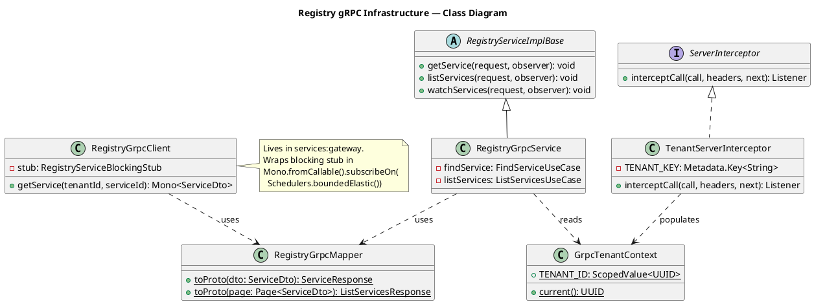
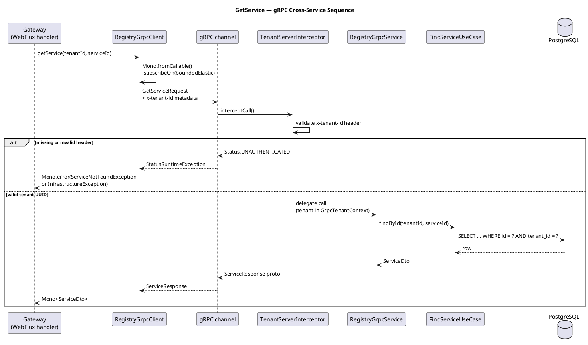

# Plan: Tasks 1.28–1.32 — Registry gRPC Channel

## Feature Summary

Tasks 1.28–1.32 wire the internal gRPC channel between the gateway and the registry service. The proto contract (`shared:contracts`) already exists with `GetService`, `ListServices`, and `WatchServices` RPCs; this group adds the server implementation (with a tenant-aware interceptor) in the registry, the blocking-stub client wrapped for WebFlux in the gateway, and the port/compose wiring. The operator-visible outcome is that the gateway can look up service records from the registry synchronously over gRPC without any REST calls between services.

---

## GitHub Workflow

### Issues

| Task(s) | Title | Acceptance criteria |
|---------|-------|---------------------|
| 1.28–1.30 | `US1.28 — Registry exposes gRPC server with tenant interceptor` | - Proto stubs compile from `shared:contracts` in registry<br>- `TenantServerInterceptor` rejects calls missing `x-tenant-id` with `UNAUTHENTICATED`<br>- `RegistryGrpcService` responds to `GetService` and `ListServices` with tenant-scoped data<br>- `WatchServices` completes immediately (Phase 1 stub) |
| 1.31 | `US1.31 — Gateway calls registry via gRPC client` | - `RegistryGrpcClient` attaches `x-tenant-id` on every call<br>- `NOT_FOUND` maps to `ServiceNotFoundException`<br>- `UNAVAILABLE` maps to `InfrastructureException`<br>- WebFlux pipeline never blocks a reactor thread |
| 1.32 | `US1.32 — gRPC port 9091 configured for registry` | - Registry listens on port 9091 (distinct from REST 8081)<br>- `docker-compose.yml` exposes `9091:9091` for registry<br>- Gateway container has `REGISTRY_GRPC_HOST`/`PORT` env vars |

Milestone: **Phase 1 — Registry & Gateway**

### Branch

```
feat/1.28-registry-grpc
```

One branch covers all five tasks — they share a single code path (proto → interceptor → service → client → infra).

### PR

- Title: `feat: add registry gRPC channel with tenant interceptor (1.28–1.32)`
- Body must include `Closes #<issue-1.28-1.30>`, `Closes #<issue-1.31>`, `Closes #<issue-1.32>`
- Milestone: Phase 1 — Registry & Gateway
- CI must be green before requesting review

### Commit and push approval

Per CLAUDE.md and memory: **never commit or push without Allan's explicit approval.** Show diff summary + draft message and ask "OK to commit?" before every commit.

---

## Dependencies & Sequencing

**Requires:**
- `shared:contracts` module compiles and generated stubs exist (confirmed — `registry.proto` is already present and `./gradlew :shared:contracts:generateProto` produces stubs in `build/generated/`)
- `services:registry` REST layer implemented (done — tasks 1.3–1.15 merged)
- `services:gateway` auth layer implemented (done — tasks 1.16–1.27 merged)

**Execution order within this plan:**

```
1.28 (add deps to both build.gradle.kts files)
  → 1.32 (application.yml gRPC port + docker-compose wiring)
    → 1.30 (TenantServerInterceptor + GrpcTenantContext)
      → 1.29 (RegistryGrpcService using interceptor context)
        → 1.31 (RegistryGrpcClient in gateway)
```

**Unblocks:**
- 2.x topology service: can call registry via gRPC to resolve service IDs
- Any future service needing synchronous registry lookups

---

## Per-Task Implementation

### Task 1.28 — Add gRPC dependencies to registry and gateway

**What to build:** The proto file already exists at `shared/contracts/src/main/proto/io/cartogra/registry/v1/registry.proto` with all three RPCs defined. Task 1.28 is satisfied by ensuring both consuming modules declare the correct Gradle dependencies so the generated stubs are available at compile time.

**Files to modify:**

| File | Action | Notes |
|------|--------|-------|
| `services/registry/build.gradle.kts` | Modify | Add `project(":shared:contracts")` + `spring-grpc-spring-boot-starter` |
| `services/gateway/build.gradle.kts` | Modify | Same two deps — gateway is the gRPC client |

**Dependencies to add (both services):**

```kotlin
implementation(project(":shared:contracts"))
implementation("org.springframework.grpc:spring-grpc-spring-boot-starter:$springGrpcVersion")
```

`springGrpcVersion=1.0.1` is already declared in `gradle.properties`.

**Critical constraints:**
- `java_multiple_files = true` and `java_package = "io.cartogra.grpc.registry.v1"` are already set in the proto — no change needed
- NEVER define proto files inside a service module; they live exclusively in `shared:contracts`

---

### Tasks 1.30 + 1.29 — Tenant interceptor and gRPC service (registry)

These two tasks are tightly coupled: the service impl depends on the interceptor's `ScopedValue`.

**What to build:**
- `GrpcTenantContext`: holds the `ScopedValue<UUID>` for tenant ID, available to any code running within the interceptor's scope
- `TenantServerInterceptor`: reads `x-tenant-id` from incoming gRPC metadata; rejects the call with `UNAUTHENTICATED` if absent/invalid; runs the handler inside `ScopedValue.where(...).call(...)`
- `RegistryGrpcMapper`: converts domain records to proto messages
- `RegistryGrpcService`: `@GrpcService` implementation of all three RPCs; `WatchServices` is a stub that immediately calls `observer.onCompleted()` in Phase 1

**Files to create:**

| File | Action | Notes |
|------|--------|-------|
| `services/registry/src/main/java/io/cartogra/registry/infrastructure/grpc/GrpcTenantContext.java` | New | `ScopedValue<UUID>` holder |
| `services/registry/src/main/java/io/cartogra/registry/infrastructure/grpc/TenantServerInterceptor.java` | New | `@Component`, `ServerInterceptor` |
| `services/registry/src/main/java/io/cartogra/registry/infrastructure/grpc/RegistryGrpcMapper.java` | New | Domain → proto conversion |
| `services/registry/src/main/java/io/cartogra/registry/infrastructure/grpc/RegistryGrpcService.java` | New | `@GrpcService` implementation |

**Key signatures:**

```java
// GrpcTenantContext.java
public final class GrpcTenantContext {
    private GrpcTenantContext() {}

    public static final ScopedValue<UUID> TENANT_ID = ScopedValue.newInstance();

    public static UUID current() {
        return TENANT_ID.orElseThrow(() ->
            new IllegalStateException("No tenant in gRPC scope — TenantServerInterceptor not wired"));
    }
}
```

```java
// TenantServerInterceptor.java
@Component
public class TenantServerInterceptor implements ServerInterceptor {

    private static final Metadata.Key<String> TENANT_KEY =
        Metadata.Key.of("x-tenant-id", Metadata.ASCII_STRING_MARSHALLER);

    @Override
    public <Req, Resp> ServerCall.Listener<Req> interceptCall(
            ServerCall<Req, Resp> call,
            Metadata headers,
            ServerCallHandler<Req, Resp> next) {

        String raw = headers.get(TENANT_KEY);
        if (raw == null || raw.isBlank()) {
            call.close(Status.UNAUTHENTICATED.withDescription("x-tenant-id metadata required"), new Metadata());
            return new ServerCall.Listener<>() {};
        }

        UUID tenantId;
        try {
            tenantId = UUID.fromString(raw);
        } catch (IllegalArgumentException _) {
            call.close(Status.UNAUTHENTICATED.withDescription("x-tenant-id must be a valid UUID"), new Metadata());
            return new ServerCall.Listener<>() {};
        }

        // ScopedValue is set for the duration of this call via the Contexts mechanism
        Context ctx = Context.current().withValue(
            Context.key("tenant-id"), tenantId);
        // Note: spring-grpc wires interceptors automatically when @Component is present
        // The ScopedValue binding is done inside RegistryGrpcService via a helper
        return Contexts.interceptCall(ctx, call, headers, next);
    }
}
```

> **Note on ScopedValue + gRPC:** gRPC's `Context` and Java's `ScopedValue` have different scoping mechanisms. The cleanest pattern with `spring-grpc` 1.x is to store the tenant UUID in the gRPC `Context` key inside the interceptor, then retrieve it at the top of each service method via `GrpcTenantContext.current()`. Alternatively, use `ScopedValue.where(...).call(...)` wrapping the listener. Use whichever compiles cleanly with `spring-grpc` 1.0.1 — verify during implementation.

```java
// RegistryGrpcService.java
@GrpcService
public class RegistryGrpcService extends RegistryServiceGrpc.RegistryServiceImplBase {

    private final FindServiceUseCase findService;
    private final ListServicesUseCase listServices;

    public RegistryGrpcService(FindServiceUseCase findService, ListServicesUseCase listServices) {
        this.findService = findService;
        this.listServices = listServices;
    }

    @Override
    public void getService(GetServiceRequest request, StreamObserver<ServiceResponse> observer) {
        UUID tenantId = GrpcTenantContext.current();
        try {
            ServiceDto dto = findService.findById(tenantId, UUID.fromString(request.getServiceId()));
            observer.onNext(RegistryGrpcMapper.toProto(dto));
            observer.onCompleted();
        } catch (ServiceNotFoundException ex) {
            observer.onError(Status.NOT_FOUND
                .withDescription(ex.getMessage())
                .asRuntimeException());
        }
    }

    @Override
    public void listServices(ListServicesRequest request, StreamObserver<ListServicesResponse> observer) {
        UUID tenantId = GrpcTenantContext.current();
        Page<ServiceDto> page = listServices.execute(tenantId, PageRequest.of(
            request.getPage(), Math.max(1, Math.min(request.getPageSize(), 100))));
        observer.onNext(RegistryGrpcMapper.toProto(page));
        observer.onCompleted();
    }

    @Override
    public void watchServices(WatchServicesRequest request, StreamObserver<ServiceEvent> observer) {
        // Phase 1 stub — streaming implementation deferred
        observer.onCompleted();
    }
}
```

**Critical constraints:**
- Tenant ID comes ONLY from the interceptor context — NEVER from a proto request field
- `watchServices` MUST call `observer.onCompleted()` in all code paths (per CLAUDE.md streaming rule)
- Use `@GrpcService` from `org.springframework.grpc.server.service` package
- Extend the generated `RegistryServiceGrpc.RegistryServiceImplBase`

---

### Task 1.31 — RegistryGrpcClient in gateway

**What to build:** A `@Component` that wraps the blocking gRPC stub in `Mono.fromCallable(...).subscribeOn(Schedulers.boundedElastic())` because the gateway is fully reactive (Spring Cloud Gateway WebFlux). Attaches `x-tenant-id` metadata. Maps `StatusRuntimeException` to domain exceptions.

**Files to create:**

| File | Action | Notes |
|------|--------|-------|
| `services/gateway/src/main/java/io/cartogra/gateway/infrastructure/grpc/RegistryGrpcClient.java` | New | Reactive wrapper around blocking stub |

**Key signature:**

```java
// RegistryGrpcClient.java
@Component
public class RegistryGrpcClient {

    private static final Metadata.Key<String> TENANT_KEY =
        Metadata.Key.of("x-tenant-id", Metadata.ASCII_STRING_MARSHALLER);

    private final RegistryServiceGrpc.RegistryServiceBlockingStub stub;

    public RegistryGrpcClient(@GrpcClient("registry") Channel channel) {
        this.stub = RegistryServiceGrpc.newBlockingStub(channel);
    }

    public Mono<ServiceDto> getService(UUID tenantId, UUID serviceId) {
        return Mono.fromCallable(() -> {
            Metadata metadata = new Metadata();
            metadata.put(TENANT_KEY, tenantId.toString());
            try {
                ServiceResponse response = MetadataUtils.attachHeaders(stub, metadata)
                    .getService(GetServiceRequest.newBuilder()
                        .setServiceId(serviceId.toString())
                        .build());
                return RegistryGrpcMapper.fromProto(response);
            } catch (StatusRuntimeException ex) {
                throw mapException(ex, serviceId);
            }
        }).subscribeOn(Schedulers.boundedElastic());
    }

    private RuntimeException mapException(StatusRuntimeException ex, UUID serviceId) {
        return switch (ex.getStatus().getCode()) {
            case NOT_FOUND -> new ServiceNotFoundException(serviceId);
            default -> new InfrastructureException("registry gRPC call failed: " + ex.getStatus(), ex);
        };
    }
}
```

**Critical constraints:**
- Gateway is WebFlux — NEVER block a reactor thread; always `subscribeOn(Schedulers.boundedElastic())`
- Map `StatusRuntimeException` at this boundary — NEVER let gRPC status codes reach the REST/WebFlux layer
- `@GrpcClient("registry")` injects the channel configured in `application.yml`
- OTel tracing is auto-instrumented via `spring-boot-starter-opentelemetry` — no manual interceptor needed

---

### Task 1.32 — gRPC port 9091 configuration and docker-compose wiring

**What to build:** Application config for the gRPC server port in registry, gRPC client channel address in gateway, and docker-compose port + env var updates.

**Files to modify:**

| File | Action | Notes |
|------|--------|-------|
| `services/registry/src/main/resources/application.yml` | Modify | Add `spring.grpc.server.port` |
| `services/gateway/src/main/resources/application.yml` | Modify | Add `spring.grpc.client.channels.registry` |
| `infra/docker-compose/docker-compose.yml` | Modify | Expose 9091 for registry; add GRPC env vars to both services |

**Registry application.yml addition:**

```yaml
spring:
  grpc:
    server:
      port: ${GRPC_PORT:9091}
```

**Gateway application.yml addition:**

```yaml
spring:
  grpc:
    client:
      channels:
        registry:
          address: ${REGISTRY_GRPC_HOST:localhost}:${REGISTRY_GRPC_PORT:9091}
```

**docker-compose.yml changes:**

Registry service:
```yaml
ports:
  - "8081:8081"
  - "9091:9091"          # gRPC
environment:
  GRPC_PORT: 9091
```

Gateway service environment additions:
```yaml
REGISTRY_GRPC_HOST: registry
REGISTRY_GRPC_PORT: 9091
```

**Note:** `.env.example` already contains `REGISTRY_GRPC_HOST=localhost` and `REGISTRY_GRPC_PORT=9091` — no change needed there.

---

## Schema Changes

N/A — no new database tables. Existing `services` table queried via existing repository methods.

---

## Env Vars Delta

| Var | Service(s) | `.env.example` default | `docker-compose` value | Notes |
|-----|-----------|------------------------|------------------------|-------|
| `GRPC_PORT` | registry | N/A (not a gateway concern) | `9091` | gRPC server listen port |
| `REGISTRY_GRPC_HOST` | gateway | `localhost` (already present) | `registry` | gRPC target host |
| `REGISTRY_GRPC_PORT` | gateway | `9091` (already present) | `9091` | gRPC target port |

`.env.example` requires no changes.

---

## Acceptance Criteria

**Task 1.28:**
- AC-1: `./gradlew :services:registry:compileJava` succeeds with `RegistryServiceGrpc` on the classpath
- AC-2: `./gradlew :services:gateway:compileJava` succeeds with `RegistryServiceGrpc` on the classpath

**Task 1.29:**
- AC-3: `GetService` RPC returns the correct service record for a valid tenant + service ID
- AC-4: `ListServices` RPC returns a paginated list of services for the tenant
- AC-5: `WatchServices` RPC completes immediately without error (Phase 1 stub)

**Task 1.30:**
- AC-6: A gRPC call without `x-tenant-id` metadata is rejected with status `UNAUTHENTICATED`
- AC-7: A gRPC call with an invalid (non-UUID) `x-tenant-id` is rejected with status `UNAUTHENTICATED`
- AC-8: A valid call makes `GrpcTenantContext.current()` return the correct UUID inside the service method

**Task 1.31:**
- AC-9: `RegistryGrpcClient.getService(tenantId, id)` returns a `Mono<ServiceDto>` that completes on `boundedElastic`
- AC-10: A `NOT_FOUND` gRPC status is mapped to `ServiceNotFoundException`
- AC-11: Any other gRPC error is mapped to `InfrastructureException`

**Task 1.32:**
- AC-12: Registry actuator health responds on port 8081; gRPC server responds on port 9091
- AC-13: `docker compose up` starts registry listening on both ports

---

## Test Strategy

**Unit tests (no containers):**

| Class | What to test | Mocks |
|-------|-------------|-------|
| `TenantServerInterceptorTest` | Missing header → UNAUTHENTICATED; invalid UUID → UNAUTHENTICATED; valid header → context populated | Mock `ServerCall`, `ServerCallHandler` |
| `RegistryGrpcServiceTest` | `getService` happy path; `getService` NOT_FOUND maps to gRPC NOT_FOUND; `listServices` pagination; `watchServices` completes | Mock `FindServiceUseCase`, `ListServicesUseCase` |
| `RegistryGrpcClientTest` | Happy path returns `ServiceDto`; NOT_FOUND → `ServiceNotFoundException`; other error → `InfrastructureException` | Mock gRPC channel / in-process server |

**Integration tests (Testcontainers):**

Containers needed: PostgreSQL (existing `TestcontainersPostgres` helper), Redis not needed for gRPC tests.

| IT Class | Scenario | AC |
|----------|---------|-----|
| `RegistryGrpcServiceIT` | Full round-trip: insert service via REST → call gRPC `GetService` → assert proto fields match | AC-3, AC-8 |
| `RegistryGrpcServiceIT` | Missing `x-tenant-id` → UNAUTHENTICATED | AC-6 |
| `RegistryGrpcServiceIT` | `WatchServices` → onCompleted called | AC-5 |
| `RegistryGrpcClientIT` (gateway) | In-process gRPC server stubs registry → `getService` returns `Mono` with correct value | AC-9 |

Use `io.grpc.testing.GrpcCleanupRule` or the Spring gRPC test support for in-process server setup.

**What NOT to test here:**
- Gateway routing of REST requests — covered by 1.16–1.27 tests
- `WatchServices` real streaming — deferred to a later phase

---

## New Error Codes

N/A — `ServiceNotFoundException` and `InfrastructureException` already exist in `shared:common`. No new `ErrorCodes` constants required.

---

## Postman Collection

No Postman requests — gRPC internal only; verified by integration tests.

---

## Documentation

### PlantUML Diagrams

| File | Type | Trigger |
|------|------|---------|
| `docs/diagrams/registry/grpc-class.puml` | Class | New infrastructure classes |
| `docs/diagrams/registry/grpc-get-service-sequence.puml` | Sequence | GetService use case cross-service flow |

**`docs/diagrams/registry/grpc-class.puml`:**



**`docs/diagrams/registry/grpc-get-service-sequence.puml`:**



### ADR

N/A — ADR-0003 already covers gRPC for internal service communication.

### OpenAPI

N/A — no HTTP endpoints added or changed.

---

## Rollback Plan

Code-only tasks (1.28–1.31): revert the branch — no persistent state change.

Task 1.32 (docker-compose port): remove the added `9091:9091` port mapping and env vars from `docker-compose.yml`. No schema migration involved.

---

## Verification Script

After implementation, run these steps in order before asking for commit approval:

1. **Build:** `./gradlew :services:registry:build :services:gateway:build` — must be green
2. **Unit tests:** `./gradlew :services:registry:test :services:gateway:test` — must be green
3. **Start infra:** `docker compose -f infra/docker-compose/docker-compose.yml up postgres valkey -d`
4. **Integration tests:** `./gradlew :services:registry:integrationTest` (if separate task) or include in `:test`
5. **Run registry locally:** confirm `curl http://localhost:8081/actuator/health/ready` → `{"status":"UP"}`
6. **Confirm gRPC port:** `curl -v telnet://localhost:9091` or use `grpcurl -plaintext localhost:9091 list` → shows `io.cartogra.registry.v1.RegistryService`
7. **Docker compose full stack:** `docker compose up --build` → all services healthy
8. **Verify gateway env:** `docker exec cartogra-gateway env | grep REGISTRY_GRPC` → shows host + port

---

## BIP

N/A — tasks 1.28–1.32 are not tagged `[BIP]`.

---

## Files Created / Modified

| File | Action | Task |
|------|--------|------|
| `services/registry/build.gradle.kts` | Modify — add deps | 1.28 |
| `services/gateway/build.gradle.kts` | Modify — add deps | 1.28 |
| `services/registry/src/main/java/io/cartogra/registry/infrastructure/grpc/GrpcTenantContext.java` | New | 1.30 |
| `services/registry/src/main/java/io/cartogra/registry/infrastructure/grpc/TenantServerInterceptor.java` | New | 1.30 |
| `services/registry/src/main/java/io/cartogra/registry/infrastructure/grpc/RegistryGrpcMapper.java` | New | 1.29 |
| `services/registry/src/main/java/io/cartogra/registry/infrastructure/grpc/RegistryGrpcService.java` | New | 1.29 |
| `services/registry/src/main/resources/application.yml` | Modify — add gRPC server port | 1.29/1.32 |
| `services/gateway/src/main/java/io/cartogra/gateway/infrastructure/grpc/RegistryGrpcClient.java` | New | 1.31 |
| `services/gateway/src/main/java/io/cartogra/gateway/infrastructure/grpc/RegistryGrpcMapper.java` | New | 1.31 |
| `services/gateway/src/main/resources/application.yml` | Modify — add gRPC client channel | 1.31 |
| `infra/docker-compose/docker-compose.yml` | Modify — port + env vars | 1.32 |
| `docs/diagrams/registry/grpc-class.puml` | New | 1.29 |
| `docs/diagrams/registry/grpc-get-service-sequence.puml` | New | 1.29 |
| `docs/execution-checklist.md` | Mark done | 1.28, 1.29, 1.30, 1.31, 1.32 |

---

## Checklist Items to Mark Done

After all work is implemented and verified, change `[ ]` to `[x]` in `docs/execution-checklist.md` for:

- 1.28 — Define registry/v1/registry.proto in shared:contracts
- 1.29 — Implement RegistryGrpcService in services:registry
- 1.30 — Add the gRPC server interceptor in services:registry
- 1.31 — Implement RegistryGrpcClient in services:gateway
- 1.32 — Configure gRPC server port 9091 for registry
