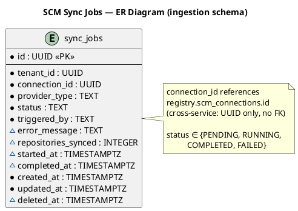
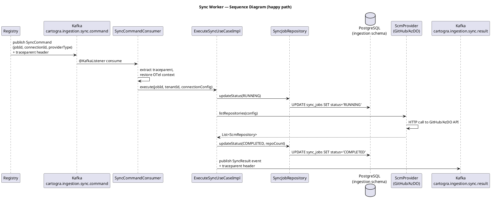

# Plan: Tasks 1.28–1.37 — SCM SPI and Ingestion Workers

## Feature Summary

This group of tasks delivers the full SCM ingestion pipeline for Cartogra's `ingestion` service: a Spring-free `ScmProvider` SPI that decouples the sync pipeline from any specific SCM vendor, concrete GitHub and Azure DevOps implementations backed by WireMock tests, a `sync_jobs` table for status tracking and audit, Kafka-driven sync workers that consume sync commands and publish results, and a feature-flagged Kubernetes discovery worker. Operators immediately gain observable, tenant-isolated sync jobs and a clear path to adding future SCM providers with no pipeline changes.

---

## GitHub Workflow

### Issues

Create one GitHub issue covering all tasks in this plan:

**Issue 1 — Tasks 1.28–1.37**
- Title: `US1.28-1.37 — SCM SPI, ingestion workers, and sync job tracking`
- Milestone: `Phase 1 — Gateway MVP auth + Registry`
- Label: `user-story`
- Acceptance criteria:
  - A `ScmProvider` interface with zero Spring imports exists under `ingestion` application code
  - `GitHubProvider` calls GitHub REST API via `RestClient`, reading connection config from the JSONB blob passed in; WireMock tests pass
  - `AzureDevOpsProvider` calls AzDO REST API via PAT or service-principal; WireMock tests pass
  - `sync_jobs` table (V002) migrates cleanly from a blank ingestion schema with tenant isolation, status tracking, soft delete, and RLS
  - A Kafka consumer for `cartogra.ingestion.sync.command` updates sync job status through PENDING → RUNNING → COMPLETED / FAILED
  - A Kafka producer publishes `cartogra.ingestion.sync.result` after each sync run with the shared event envelope and `traceparent` header
  - The Kubernetes worker boots when `ENABLE_K8S_WORKER=true` and is skipped (no-op Spring `@ConditionalOnProperty`) otherwise; local fallback is documented
  - Integration tests cover both SCM providers (WireMock-backed) and all sync job state transitions (Testcontainers Postgres)
  - ADR-0002 is updated to reflect the SPI location in `ingestion` (not `registry` as originally written) and deployment docs are extended with PAT/service-principal setup
  - BIP drafts for 1.36 and 1.37 exist in `docs/bip/`

### Branch

```
feat/1.28-scm-spi-ingestion-workers
```

One branch covers all tasks; they share the SPI interface and `sync_jobs` table and have no cross-service dependencies.

### PR

- Title: `feat: SCM provider SPI, GitHub/AzDO adapters, sync workers (1.28–1.37)`
- Body must include `Closes #<issue>` for the issue above.
- Milestone: `Phase 1 — Gateway MVP auth + Registry`
- CI must be green (build + tests + Trivy) before requesting review.

### Commit and push approval

Per CLAUDE.md and project memory: never run `git commit` or `git push` without Allan's explicit approval. Show the diff summary and draft commit message first, then ask "OK to commit?"

---

## Dependencies & Sequencing

**Requires:**
- `shared:common` with `EventEnvelope`, `ApiResponse`, `ErrorCodes` — already merged (Phase 0)
- `shared:test-support` with Postgres and Kafka Testcontainers helpers — already merged (Phase 0)
- `services:ingestion` bootstrapped with Spring Data JDBC, Flyway, OTel, virtual threads — already merged (0.12)
- Registry `V004__create_scm_connections.sql` applied — already merged (Phase 0); ingestion reads connection config IDs passed in sync commands, does not query registry DB directly
- Kafka broker available in docker-compose — already wired (Phase 0)

**Order within plan:**
1. **1.28** — SPI interface (everything else depends on it)
2. **1.29 + 1.30** — Provider implementations (parallel; both depend on 1.28)
3. **1.31** — Migration V002 (parallel with 1.29/1.30; workers depend on it)
4. **1.32** — Sync workers (depends on 1.28, 1.29, 1.30, 1.31)
5. **1.33** — K8s worker (depends on 1.32 pattern; can be a follow-on commit)
6. **1.34** — Integration tests (depends on 1.28–1.33)
7. **1.35** — ADR update + deployment docs (depends on 1.28–1.34 being stable)
8. **1.36 + 1.37** — BIP drafts (depends on 1.35)

**Unblocks:**
- `1.38` — Registry lifecycle events (now has a sync pipeline to receive them)
- `1.39` — Sync command consumption with idempotency strategy (1.32 is the baseline)
- Phase 1 Gate: "Both SCM sync workers succeed in scripted or runbooked tests"

---

## Per-Task Implementation

### Task 1.28 — Spring-free ScmProvider SPI

**What to build:** A pure-Java interface and its supporting value-object records that form the output port (driven port) of the ingestion hexagonal architecture. No Spring annotations anywhere in the interface or its records. The interface lives in the `application/port/out/` package so that use cases depend only on the abstraction, and implementations in `infrastructure/scm/` inject through constructors.

> **ADR-0002 discrepancy:** ADR-0002 placed the SPI in `services/registry/…/infrastructure/scm/`. Task 1.28 correctly puts it under `ingestion` application code. The plan tracks the ADR correction in task 1.35.

**Files to create or modify:**

| File | Action | Notes |
|------|--------|-------|
| `services/ingestion/src/main/java/io/cartogra/ingestion/application/port/out/ScmProvider.java` | New | Spring-free interface |
| `services/ingestion/src/main/java/io/cartogra/ingestion/application/port/out/ScmConnectionConfig.java` | New | Record; JSONB config as `Map<String,Object>` |
| `services/ingestion/src/main/java/io/cartogra/ingestion/application/port/out/ScmRepository.java` | New | Value object record |
| `services/ingestion/src/main/java/io/cartogra/ingestion/application/port/out/OwnershipMap.java` | New | Value object record |
| `services/ingestion/src/main/java/io/cartogra/ingestion/application/port/out/ScmProviderException.java` | New | Unchecked; wraps vendor errors |

**Key signatures:**

```java
// application/port/out/ScmProvider.java
public interface ScmProvider {
    String providerType();                         // "github" | "azure-devops"
    List<ScmRepository> listRepositories(ScmConnectionConfig config);
    Optional<String> getFileContents(ScmConnectionConfig config, String repoPath, String filePath);
    OwnershipMap resolveOwnership(ScmConnectionConfig config, ScmRepository repository);
}

// application/port/out/ScmConnectionConfig.java
public record ScmConnectionConfig(
    UUID connectionId,
    UUID tenantId,
    String providerType,
    Map<String, Object> config    // raw JSONB from registry.scm_connections.config
) {}

// application/port/out/ScmRepository.java
public record ScmRepository(
    String id,
    String name,
    String fullPath,
    String defaultBranch,
    boolean archived
) {}

// application/port/out/OwnershipMap.java
public record OwnershipMap(
    List<String> ownerTeams,
    Map<String, List<String>> pathOwners    // path prefix → teams/users
) {}

// application/port/out/ScmProviderException.java
public final class ScmProviderException extends RuntimeException {
    private final String providerType;
    public ScmProviderException(String providerType, String message, Throwable cause) { ... }
    public String providerType() { return providerType; }
}
```

**Critical constraints:**
- ZERO Spring imports (`org.springframework.*`, `jakarta.*`) anywhere in `application/port/out/`
- NEVER return `null` — `Optional<String>` for absent file contents; throw `ScmProviderException` for vendor errors
- Records only — no mutable POJOs

---

### Task 1.29 — GitHubProvider

**What to build:** Spring `@Component` in `infrastructure/scm/` that implements `ScmProvider` using a `RestClient` to call the GitHub REST API. Connection config arrives via `ScmConnectionConfig.config` JSONB map; the provider reads `token` (PAT or GitHub App installation token) and optional `apiBaseUrl` from that map. WireMock stubs its HTTP surface.

**Files to create or modify:**

| File | Action | Notes |
|------|--------|-------|
| `services/ingestion/src/main/java/io/cartogra/ingestion/infrastructure/scm/GitHubProvider.java` | New | `@Component`, implements `ScmProvider` |
| `services/ingestion/src/main/java/io/cartogra/ingestion/infrastructure/scm/GitHubRestClient.java` | New | Private helper; `RestClient` wrapper |
| `services/ingestion/src/main/java/io/cartogra/ingestion/config/ScmProviderConfig.java` | New | Registers all `ScmProvider` beans in a `Map<String, ScmProvider>` by `providerType()` |
| `services/ingestion/src/test/java/io/cartogra/ingestion/infrastructure/scm/GitHubProviderTest.java` | New | WireMock JUnit 5 extension |
| `services/ingestion/build.gradle.kts` | Modify | Add `testImplementation("org.wiremock:wiremock-standalone:3.x")` |

**Key signatures:**

```java
@Component
public class GitHubProvider implements ScmProvider {

    private static final String PROVIDER_TYPE = "github";
    private static final String DEFAULT_BASE_URL = "https://api.github.com";

    @Override
    public String providerType() { return PROVIDER_TYPE; }

    @Override
    public List<ScmRepository> listRepositories(ScmConnectionConfig config) {
        String token = extractToken(config);
        String baseUrl = (String) config.config().getOrDefault("apiBaseUrl", DEFAULT_BASE_URL);
        RestClient client = RestClient.builder().baseUrl(baseUrl).build();
        // GET /user/repos or /orgs/{org}/repos — paginated
        // Map GitHub JSON to List<ScmRepository>
        // Throw ScmProviderException on non-2xx
    }

    private String extractToken(ScmConnectionConfig config) {
        Object token = config.config().get("token");
        if (!(token instanceof String t) || t.isBlank()) {
            throw new ScmProviderException(PROVIDER_TYPE, "missing token in connection config", null);
        }
        return t;
    }
}
```

**Critical constraints:**
- `apiBaseUrl` must be overridable via the JSONB config map — WireMock uses this to redirect HTTP traffic without needing env vars at test time
- Propagate `traceparent` on every `RestClient` call (OTel auto-instrumentation covers `RestClient` via the Spring Boot starter — no manual interceptor needed)
- Map `4xx` GitHub responses to `ScmProviderException`; log the status and body at `WARN` level; never bubble `RestClientException` to callers
- NEVER log the token value

---

### Task 1.30 — AzureDevOpsProvider

**What to build:** Spring `@Component` that implements `ScmProvider` for Azure DevOps REST API. Supports two auth modes controlled by the JSONB config: `pat` (Personal Access Token — Base64-encode `:{pat}` as Basic auth) and `servicePrincipal` (OAuth2 client credentials flow to `https://login.microsoftonline.com/{tenantId}/oauth2/v2.0/token`, then Bearer). Both modes are read from `config.config()` fields; no Spring env var binding into `ScmConnectionConfig`.

**Files to create or modify:**

| File | Action | Notes |
|------|--------|-------|
| `services/ingestion/src/main/java/io/cartogra/ingestion/infrastructure/scm/AzureDevOpsProvider.java` | New | `@Component`, implements `ScmProvider` |
| `services/ingestion/src/main/java/io/cartogra/ingestion/infrastructure/scm/AzureDevOpsAuthHelper.java` | New | PAT encoder + SP token exchange; package-private |
| `services/ingestion/src/test/java/io/cartogra/ingestion/infrastructure/scm/AzureDevOpsProviderTest.java` | New | WireMock stubs for both auth modes |

**Key config map fields (from JSONB):**

| Field | Auth mode | Description |
|-------|-----------|-------------|
| `authMode` | both | `"pat"` or `"servicePrincipal"` |
| `organization` | both | AzDO organization name |
| `pat` | `pat` | Personal Access Token (never logged) |
| `tenantId` | `servicePrincipal` | Azure AD tenant ID |
| `clientId` | `servicePrincipal` | App registration client ID |
| `clientSecret` | `servicePrincipal` | App registration secret (never logged) |
| `apiBaseUrl` | both | Override for WireMock in tests |

**Critical constraints:**
- `pat` and `clientSecret` MUST NEVER be logged at any level
- Service-principal token exchange must be retried once on `401` before throwing `ScmProviderException`
- `apiBaseUrl` override enables WireMock in tests without env var injection

---

### Task 1.31 — Flyway V002__create_sync_jobs.sql

> **Checklist note:** The checklist references `V001__create_sync_jobs.sql` but `V001__baseline.sql` already exists in the ingestion schema (a Phase 0 placeholder with a no-op `DO` block). The correct next version is **V002**.

**What to build:** A single migration file that creates the `sync_jobs` table with the full tenant isolation, status lifecycle, soft delete, and RLS pattern required by project rules.

**Files to create:**

| File | Action | Notes |
|------|--------|-------|
| `services/ingestion/src/main/resources/db/migration/V002__create_sync_jobs.sql` | New | Ingestion schema; next after V001 placeholder |

**Migration content:**

```sql
CREATE TABLE sync_jobs (
    id                  UUID        NOT NULL DEFAULT gen_random_uuid() PRIMARY KEY,
    tenant_id           UUID        NOT NULL,
    connection_id       UUID        NOT NULL,
    provider_type       TEXT        NOT NULL,
    status              TEXT        NOT NULL DEFAULT 'PENDING',
    triggered_by        TEXT        NOT NULL,
    error_message       TEXT,
    repositories_synced INTEGER,
    started_at          TIMESTAMPTZ,
    completed_at        TIMESTAMPTZ,
    created_at          TIMESTAMPTZ NOT NULL DEFAULT now(),
    updated_at          TIMESTAMPTZ NOT NULL DEFAULT now(),
    deleted_at          TIMESTAMPTZ,

    CONSTRAINT sync_jobs_status_check
        CHECK (status IN ('PENDING','RUNNING','COMPLETED','FAILED'))
);

CREATE INDEX ON sync_jobs (tenant_id) WHERE deleted_at IS NULL;
CREATE INDEX ON sync_jobs (connection_id) WHERE deleted_at IS NULL;
CREATE INDEX ON sync_jobs (status) WHERE deleted_at IS NULL;

ALTER TABLE sync_jobs ENABLE ROW LEVEL SECURITY;
CREATE POLICY tenant_isolation ON sync_jobs
    USING (tenant_id = current_setting('app.current_tenant_id', true)::UUID);
```

**Critical constraints:**
- `connection_id` is a raw UUID — no FK constraint to `registry.scm_connections` (cross-service boundary; store IDs only per AGENTS.md)
- `status` CHECK constraint enforces the lifecycle enum at the DB layer
- Soft delete: `deleted_at TIMESTAMPTZ` — NEVER hard-delete rows

---

### Task 1.32 — GitHub and Azure DevOps Sync Workers

**What to build:** A Kafka consumer (`SyncCommandConsumer`) that listens on `cartogra.ingestion.sync.command`, routes to the correct `ScmProvider` by `providerType`, drives the sync job lifecycle, and a producer (`SyncResultProducer`) that publishes `cartogra.ingestion.sync.result` on completion. Sync job status transitions: PENDING → RUNNING → COMPLETED / FAILED, persisted via `SyncJobRepository`.

**Files to create or modify:**

| File | Action | Notes |
|------|--------|-------|
| `services/ingestion/src/main/java/io/cartogra/ingestion/domain/SyncJob.java` | New | Aggregate root record |
| `services/ingestion/src/main/java/io/cartogra/ingestion/infrastructure/jdbc/SyncJobRepository.java` | New | Spring Data JDBC repo |
| `services/ingestion/src/main/java/io/cartogra/ingestion/infrastructure/kafka/SyncCommandConsumer.java` | New | `@KafkaListener` |
| `services/ingestion/src/main/java/io/cartogra/ingestion/infrastructure/kafka/SyncResultProducer.java` | New | `KafkaTemplate` |
| `services/ingestion/src/main/java/io/cartogra/ingestion/application/usecase/ExecuteSyncUseCase.java` | New | Interface |
| `services/ingestion/src/main/java/io/cartogra/ingestion/application/usecase/ExecuteSyncUseCaseImpl.java` | New | Impl; orchestrates provider + repo |
| `services/ingestion/build.gradle.kts` | Modify | Add `spring-kafka`; add WireMock test dep |
| `services/ingestion/src/main/resources/application.yml` | Modify | Add Kafka consumer/producer config |

**Key signatures:**

```java
// domain/SyncJob.java
public record SyncJob(
    UUID id,
    UUID tenantId,
    UUID connectionId,
    String providerType,
    String status,
    String triggeredBy,
    @Nullable String errorMessage,
    @Nullable Integer repositoriesSynced,
    @Nullable Instant startedAt,
    @Nullable Instant completedAt,
    Instant createdAt,
    Instant updatedAt,
    @Nullable Instant deletedAt
) {}

// infrastructure/kafka/SyncCommandConsumer.java
@Component
public class SyncCommandConsumer {
    @KafkaListener(topics = "cartogra.ingestion.sync.command",
                   groupId = "${spring.kafka.consumer.group-id}")
    public void consume(ConsumerRecord<String, EventEnvelope<SyncCommandPayload>> record) {
        // Extract traceparent from headers, restore OTel context
        // Delegate to ExecuteSyncUseCase
    }
}
```

**Kafka topic names:**

| Topic | Direction | Notes |
|-------|-----------|-------|
| `cartogra.ingestion.sync.command` | Consumed | Published by registry when sync is triggered |
| `cartogra.ingestion.sync.result` | Produced | Published after each sync run completes |

**`application.yml` Kafka additions:**

```yaml
spring:
  kafka:
    bootstrap-servers: ${KAFKA_BOOTSTRAP_SERVERS:localhost:9092}
    consumer:
      group-id: ingestion-sync-worker
      auto-offset-reset: earliest
      key-deserializer: org.apache.kafka.common.serialization.StringDeserializer
      value-deserializer: org.springframework.kafka.support.serializer.JsonDeserializer
      properties:
        spring.json.trusted.packages: "io.cartogra.*"
    producer:
      key-serializer: org.apache.kafka.common.serialization.StringSerializer
      value-serializer: org.springframework.kafka.support.serializer.JsonSerializer
```

**Critical constraints:**
- Extract W3C `traceparent` from Kafka message headers and restore OTel context before processing — pattern from `patterns.md` Kafka consumer
- Message key = `sync_job.id.toString()` (ensures ordering per job)
- Use `try-with-resources`-style scope: restore context → process → close scope
- `SyncJobRepository` must filter all queries by `tenant_id`
- `ExecuteSyncUseCaseImpl` saves RUNNING before calling provider, saves COMPLETED/FAILED after — never leave a job in RUNNING permanently on crash (see rollback note below)

---

### Task 1.33 — Kubernetes Worker (Feature-Flagged)

**What to build:** A Spring `@Component` guarded by `@ConditionalOnProperty(name = "ingestion.workers.k8s.enabled", havingValue = "true")`. When enabled, uses `io.fabric8:kubernetes-client` to discover `Service` and `Deployment` resources across configured namespaces and publish them as sync results. When disabled (the default), no Fabric8 client is instantiated — document the kind/mock fallback for local development in a comment and in the runbook.

**Files to create or modify:**

| File | Action | Notes |
|------|--------|-------|
| `services/ingestion/src/main/java/io/cartogra/ingestion/infrastructure/k8s/KubernetesWorker.java` | New | `@ConditionalOnProperty` |
| `services/ingestion/src/main/java/io/cartogra/ingestion/config/KubernetesWorkerConfig.java` | New | Conditional Fabric8 `KubernetesClient` bean |
| `services/ingestion/src/main/resources/application.yml` | Modify | Add `ingestion.workers.k8s.enabled: false` |
| `docs/runbooks/local-development.md` | Modify | Add K8s worker kind/mock fallback section |
| `services/ingestion/build.gradle.kts` | Modify | Add `compileOnly("io.fabric8:kubernetes-client:7.x")` (runtime only when enabled) |

**Local development fallback (documented in runbook):**

```
# To run the K8s worker locally:
# 1. Install kind: https://kind.sigs.k8s.io/
# 2. kind create cluster --name cartogra-dev
# 3. kubectl apply -f infra/k8s/dev/seed-deployments.yaml
# 4. Set ENABLE_K8S_WORKER=true in .env.local (or application-dev.yml)
# 5. Kubeconfig auto-detected from ~/.kube/config
#
# Without kind, leave ENABLE_K8S_WORKER unset (default false) — no K8s client is created.
```

**application.yml env var binding:**

```yaml
ingestion:
  workers:
    k8s:
      enabled: ${ENABLE_K8S_WORKER:false}
      namespaces: ${K8S_WATCH_NAMESPACES:default}
```

**Critical constraints:**
- `@ConditionalOnProperty` must reference the `ingestion.workers.k8s.enabled` key exactly — not a boolean env var directly
- The `KubernetesClient` bean must NOT be created when the property is false (conditional on the config class, not just the worker)
- NEVER hardcode namespace names — read from `ingestion.workers.k8s.namespaces`

---

### Task 1.34 — Integration Tests

**What to build:** Two WireMock-backed provider tests and one Testcontainers-backed state-machine test.

**Files to create or modify:**

| File | Action | Notes |
|------|--------|-------|
| `services/ingestion/src/test/java/io/cartogra/ingestion/infrastructure/scm/GitHubProviderTest.java` | New | WireMock JUnit 5 |
| `services/ingestion/src/test/java/io/cartogra/ingestion/infrastructure/scm/AzureDevOpsProviderTest.java` | New | WireMock — both PAT + SP auth modes |
| `services/ingestion/src/test/java/io/cartogra/ingestion/infrastructure/jdbc/SyncJobRepositoryIT.java` | New | Testcontainers Postgres; state transitions |
| `services/ingestion/src/test/java/io/cartogra/ingestion/infrastructure/kafka/SyncWorkerIT.java` | New | Testcontainers Kafka + Postgres; end-to-end |

**Key test scenarios per class:**

`GitHubProviderTest`:
- `listRepositories_returnsRepos_whenTokenValid` (stub `GET /user/repos` → 200 with JSON fixture)
- `listRepositories_throwsScmProviderException_onUnauthorized` (stub → 401)
- `getFileContents_returnsContent_whenFileExists` (stub `GET /repos/{owner}/{repo}/contents/{path}`)
- `getFileContents_returnsEmpty_whenFileNotFound` (stub → 404)

`AzureDevOpsProviderTest`:
- `listRepositories_patMode_returnsRepos` (stub AzDO list endpoint with Basic auth)
- `listRepositories_servicePrincipalMode_returnsRepos` (stub token exchange + API call)
- `listRepositories_throwsScmProviderException_onBadPat` (stub → 401)

`SyncJobRepositoryIT`:
- `savesAndFindsById_withTenantIsolation`
- `statusTransition_pendingToRunning_toCompleted`
- `statusTransition_pendingToRunning_toFailed_withErrorMessage`
- `softDelete_doesNotReturnDeletedRows`
- `findByTenantId_doesNotReturnOtherTenantRows`

`SyncWorkerIT`:
- `consumeSyncCommand_githubProvider_completesJob` (embedded Kafka + WireMock)
- `consumeSyncCommand_unknownProvider_failsJob`
- `syncResultPublished_afterSuccessfulSync`

---

### Task 1.35 — ADR Update + Deployment Docs

**What to build:**
1. **Update ADR-0002** to correct the SPI location from `registry/infrastructure/scm/` to `ingestion/application/port/out/` and add a note that implementations live in `ingestion/infrastructure/scm/`.
2. **Update `docs/runbooks/local-development.md`** with PAT/service-principal connection config JSON shapes for GitHub and Azure DevOps.
3. **Update `docs/runbooks/deployment.md`** with env var checklist for Kafka bootstrap and the K8s worker flag.

No new ADR is needed — ADR-0002 covers the core decision; the implementation location correction is a clarification, not a new architectural decision.

**Files to modify:**

| File | Action | Notes |
|------|--------|-------|
| `docs/adr/ADR-0002-scm-provider-abstraction.md` | Modify | Correct SPI package; add implementation notes |
| `docs/runbooks/local-development.md` | Modify | Add SCM config JSONB shapes + K8s fallback |
| `docs/runbooks/deployment.md` | Modify | Add Kafka + K8s env var checklist |

**PAT config shape (for runbook):**

```json
// GitHub PAT
{
  "token": "<github-pat-or-app-installation-token>",
  "apiBaseUrl": "https://api.github.com",
  "org": "your-org-name"
}

// Azure DevOps — PAT mode
{
  "authMode": "pat",
  "organization": "your-ado-org",
  "pat": "<azure-devops-pat>",
  "apiBaseUrl": "https://dev.azure.com"
}

// Azure DevOps — Service Principal mode
{
  "authMode": "servicePrincipal",
  "organization": "your-ado-org",
  "tenantId": "<azure-ad-tenant-id>",
  "clientId": "<app-registration-client-id>",
  "clientSecret": "<app-registration-secret>",
  "apiBaseUrl": "https://dev.azure.com"
}
```

---

## Schema Changes

### Migration: V002__create_sync_jobs.sql

- **File**: `services/ingestion/src/main/resources/db/migration/V002__create_sync_jobs.sql`
  - V001 is already occupied by the Phase 0 placeholder (`V001__baseline.sql` — a no-op `DO` block); V002 is confirmed as next.
- **Schema**: `ingestion` (Flyway schema setting in `application.yml`)
- **Tables**: `sync_jobs`
- **Key columns**: UUID PK, `tenant_id` (not null), `connection_id` (UUID, cross-service reference — no FK), `provider_type` TEXT, `status` TEXT with CHECK constraint, `triggered_by` TEXT, `error_message` TEXT nullable, `repositories_synced` INT nullable, `started_at` / `completed_at` TIMESTAMPTZ nullable, `created_at` / `updated_at` TIMESTAMPTZ not null, `deleted_at` TIMESTAMPTZ soft delete
- **Indexes**: on `(tenant_id)`, `(connection_id)`, `(status)` — all `WHERE deleted_at IS NULL`
- **RLS**: `tenant_isolation` policy using `current_setting('app.current_tenant_id', true)::UUID`

### ER diagram stub: `docs/diagrams/ingestion/sync-jobs-er.puml`



---

## Env Vars Delta

| Var | Service | `.env.example` default | `application-dev.yml` value | Notes |
|-----|---------|------------------------|------------------------------|-------|
| `KAFKA_BOOTSTRAP_SERVERS` | ingestion | `localhost:9092` | `localhost:9092` | Kafka broker; already in docker-compose |
| `ENABLE_K8S_WORKER` | ingestion | `false` | `false` | Maps to `ingestion.workers.k8s.enabled` |
| `K8S_WATCH_NAMESPACES` | ingestion | `default` | `default` | Comma-separated; used only when K8s worker is enabled |

No new top-level secrets: SCM credentials (PAT, client secret) are stored in `registry.scm_connections.config` JSONB and passed in sync command payloads — never in env vars on the ingestion side.

**`build.gradle.kts` additions for ingestion:**

```kotlin
implementation("org.springframework.kafka:spring-kafka")
compileOnly("io.fabric8:kubernetes-client:7.x")          // runtime only when K8s worker enabled
testImplementation("org.wiremock:wiremock-standalone:3.x")
testImplementation("org.springframework.kafka:spring-kafka-test")
testImplementation("org.testcontainers:kafka")
```

---

## Acceptance Criteria

**1.28 — ScmProvider SPI:**
- AC-1: `ScmProvider.java` compiles with `javac` without any `spring-*` or `jakarta-*` on the classpath
- AC-2: `ScmConnectionConfig`, `ScmRepository`, `OwnershipMap` are Java records with no mutable state

**1.29 — GitHubProvider:**
- AC-3: `GitHubProvider.listRepositories()` returns mapped repositories when WireMock stubs `GET /user/repos` → 200
- AC-4: `GitHubProvider.listRepositories()` throws `ScmProviderException` when WireMock returns 401
- AC-5: `GitHubProvider.getFileContents()` returns `Optional.empty()` when WireMock returns 404
- AC-6: The PAT value never appears in log output (verified by log capture in test)

**1.30 — AzureDevOpsProvider:**
- AC-7: `AzureDevOpsProvider` in PAT mode sets `Authorization: Basic` header with encoded PAT
- AC-8: `AzureDevOpsProvider` in service-principal mode exchanges credentials before calling the AzDO API
- AC-9: `AzureDevOpsProvider` throws `ScmProviderException` on 401 from AzDO API

**1.31 — V002 migration:**
- AC-10: Flyway migration runs cleanly against a blank ingestion schema (Testcontainers)
- AC-11: `status` column rejects values outside the CHECK constraint
- AC-12: RLS policy prevents cross-tenant row access when `app.current_tenant_id` is set

**1.32 — Sync workers:**
- AC-13: Publishing a `cartogra.ingestion.sync.command` message causes `sync_jobs.status` to transition PENDING → RUNNING → COMPLETED
- AC-14: When `ScmProvider` throws `ScmProviderException`, job transitions to FAILED with `error_message` populated
- AC-15: A `cartogra.ingestion.sync.result` event is published after every successful sync run
- AC-16: `traceparent` propagated from sync command header appears in OTel spans of the processing thread

**1.33 — K8s worker:**
- AC-17: With `ENABLE_K8S_WORKER=false` (default), no `KubernetesClient` bean is created (verified by `ApplicationContext` assertion)
- AC-18: With `ENABLE_K8S_WORKER=true`, `KubernetesWorker` bean is present in context

**1.34 — Integration tests:**
- AC-19: All WireMock-backed provider tests pass without network egress
- AC-20: `SyncJobRepositoryIT` verifies tenant isolation (no cross-tenant row leakage)
- AC-21: `SyncWorkerIT` proves end-to-end PENDING → COMPLETED transition with embedded Kafka

---

## Test Strategy

**Unit tests (no containers):**
- `GitHubProviderTest` and `AzureDevOpsProviderTest` use WireMock JUnit 5 extension (`@WireMockTest`) — no Testcontainers, fast
- Mock `SyncJobRepository` in `ExecuteSyncUseCaseImplTest` to verify orchestration logic independently of DB

**Integration tests (Testcontainers):**
- **Containers needed**: Postgres (ingestion schema), Kafka (embedded via `spring-kafka-test` or Testcontainers)
- `SyncJobRepositoryIT`: Postgres only; verifies state transitions, tenant isolation, soft-delete behavior
- `SyncWorkerIT`: Postgres + embedded Kafka; produces a sync command, asserts job status, asserts result event published

**What NOT to test here:**
- Gateway authentication or JWT validation — covered by 1.26
- Registry CRUD or scm_connections content — covered by 1.11
- UI sync trigger flows — covered by future UI tasks

---

## New Error Codes

Add to `shared/common/src/main/java/io/cartogra/common/api/ErrorCodes.java`:

| Constant | HTTP Status | When emitted |
|----------|-------------|--------------|
| `SCM_PROVIDER_ERROR` | 502 | `ScmProviderException` caught at API boundary; vendor call failed |
| `SCM_PROVIDER_NOT_SUPPORTED` | 400 | Sync command references an unknown `providerType` |
| `SYNC_JOB_NOT_FOUND` | 404 | Future query endpoint cannot find a sync job by ID |

---

## Postman Collection

**Service**: ingestion
**Action**: No external HTTP surface in tasks 1.28–1.34. The sync pipeline is Kafka-driven; ingestion has no REST endpoints added in these tasks. All acceptance criteria are verified by integration tests.

Internal-only tasks — no Postman requests required.

---

## Documentation

### PlantUML Diagrams

| File | Type | Trigger |
|------|------|---------|
| `docs/diagrams/ingestion/sync-jobs-er.puml` | ER | New `sync_jobs` table (1.31) |
| `docs/diagrams/ingestion/scm-provider-class.puml` | Class | New domain model — SPI + implementations (1.28–1.30) |
| `docs/diagrams/ingestion/sync-worker-sequence.puml` | Sequence | New multi-step sync worker flow (1.32) |

**`docs/diagrams/ingestion/scm-provider-class.puml`:**

```plantuml
@startuml
title SCM Provider SPI — Class Diagram (ingestion service)

interface ScmProvider {
  + providerType() : String
  + listRepositories(config) : List<ScmRepository>
  + getFileContents(config, repoPath, filePath) : Optional<String>
  + resolveOwnership(config, repo) : OwnershipMap
}

class GitHubProvider implements ScmProvider {
  - restClient : RestClient
  + providerType() : String
}

class AzureDevOpsProvider implements ScmProvider {
  - restClient : RestClient
  - authHelper : AzureDevOpsAuthHelper
  + providerType() : String
}

class AzureDevOpsAuthHelper {
  + buildAuthHeader(config) : String
  + exchangeServicePrincipal(config) : String
}

record ScmConnectionConfig {
  connectionId : UUID
  tenantId : UUID
  providerType : String
  config : Map<String,Object>
}

record ScmRepository {
  id : String
  name : String
  fullPath : String
  defaultBranch : String
  archived : boolean
}

record OwnershipMap {
  ownerTeams : List<String>
  pathOwners : Map<String,List<String>>
}

interface ExecuteSyncUseCase {
  + execute(jobId, config, connectionConfig) : void
}

class ExecuteSyncUseCaseImpl implements ExecuteSyncUseCase {
  - providers : Map<String,ScmProvider>
  - syncJobRepository : SyncJobRepository
  - syncResultProducer : SyncResultProducer
}

ExecuteSyncUseCaseImpl --> ScmProvider
ExecuteSyncUseCaseImpl --> ScmConnectionConfig
ScmProvider ..> ScmRepository
ScmProvider ..> OwnershipMap
@enduml
```

**`docs/diagrams/ingestion/sync-worker-sequence.puml`:**



### ADR

**Update ADR-0002** (`docs/adr/ADR-0002-scm-provider-abstraction.md`):
- Correct the Decision section: SPI interface lives in `services/ingestion/src/main/java/io/cartogra/ingestion/application/port/out/` (output port), not in `registry/infrastructure/scm/` as originally written
- Implementations (`GitHubProvider`, `AzureDevOpsProvider`) live in `services/ingestion/src/main/java/io/cartogra/ingestion/infrastructure/scm/`
- Add a note: "SPI corrected to ingestion application layer during Phase 1 implementation (2026-05-18)"

No new ADR needed — the architectural decision (SPI pattern, two providers, no third-party VCS lib) is unchanged.

### OpenAPI

No new HTTP endpoints are added in tasks 1.28–1.33; the sync pipeline is Kafka-driven. The ingestion service has no public REST surface in this batch. No OpenAPI changes required.

---

## Rollback Plan

**For V002 migration (task 1.31):**

If the migration must be reverted mid-branch:

```sql
-- Run against ingestion schema to undo V002
DROP TABLE IF EXISTS ingestion.sync_jobs;
DELETE FROM ingestion.flyway_schema_history WHERE version = '2';
```

To restore locally: `docker compose down -v && docker compose up -d` — wipes volumes and re-migrates from V001.

The V001 placeholder must remain; do not renumber it.

**For code-only tasks (1.28–1.30, 1.32–1.37):** Revert the branch — no persistent state change beyond the migration above.

---

## Verification Script

Ordered steps a developer runs after implementing all tasks, before asking for commit approval:

```bash
# 1. Build the full monorepo
./gradlew build --parallel

# 2. Run ingestion tests specifically
./gradlew :services:ingestion:test

# 3. Confirm migration applies cleanly from blank DB
docker compose down -v
docker compose up -d postgres
./gradlew :services:ingestion:flywayMigrate

# 4. Confirm sync_jobs table exists with correct columns
docker exec cartogra-postgres-1 psql -U cartogra -d cartogra \
  -c "SELECT column_name, data_type, is_nullable FROM information_schema.columns WHERE table_name='sync_jobs' AND table_schema='ingestion' ORDER BY ordinal_position;"

# 5. Confirm status constraint blocks invalid values
docker exec cartogra-postgres-1 psql -U cartogra -d cartogra \
  -c "SET search_path=ingestion; INSERT INTO sync_jobs(tenant_id,connection_id,provider_type,status,triggered_by) VALUES(gen_random_uuid(),gen_random_uuid(),'github','INVALID','test');"
# Expect: ERROR: new row for relation "sync_jobs" violates check constraint

# 6. Boot the full stack and verify ingestion health
docker compose up -d
curl -s http://localhost:8085/actuator/health/ready | jq .
# Expect: {"status":"UP"}

# 7. Verify K8s worker is NOT created by default
grep -r "KubernetesWorker" services/ingestion/src/main/
# Should exist; then verify context assertion in KubernetesWorkerConfigTest

# 8. Render PlantUML diagrams (requires plantuml CLI or plugin)
plantuml docs/diagrams/ingestion/*.puml
# Expect: three PNG/SVG files generated with no syntax errors

# 9. Verify WireMock provider tests pass without network
./gradlew :services:ingestion:test --tests "*.GitHubProviderTest"
./gradlew :services:ingestion:test --tests "*.AzureDevOpsProviderTest"

# 10. Verify Trivy passes (no HIGH/CRITICAL CVEs in new deps)
trivy fs --severity HIGH,CRITICAL services/ingestion/

# 11. Manual end-to-end smoke test against the live stack
#     (use this before registry-side publisher lands in 1.38)
#
#     Prerequisites:
#       - docker compose up -d (full stack including Kafka and ingestion)
#       - A real scm_connection row in registry.scm_connections with a valid
#         GitHub PAT config; note its id as CONNECTION_ID
#       - kcat installed (brew install kcat  /  apt install kafkacat)
#
#     Substitute the UUIDs below before running:
TENANT_ID="00000000-0000-0000-0000-000000000001"     # seed tenant UUID
CONNECTION_ID="<uuid-from-registry-scm_connections>"  # real connection row
JOB_ID=$(uuidgen)                                     # new job to track

# Insert a PENDING sync_job row directly so ingestion has something to update
docker exec cartogra-postgres-1 psql -U cartogra -d cartogra -c "
  SET search_path=ingestion;
  INSERT INTO sync_jobs(id, tenant_id, connection_id, provider_type, status, triggered_by)
  VALUES('$JOB_ID'::uuid, '$TENANT_ID'::uuid, '$CONNECTION_ID'::uuid, 'github', 'PENDING', 'manual-smoke-test');
"

# Publish a sync command on the topic that SyncCommandConsumer listens to.
# The payload must match EventEnvelope<SyncCommandPayload> — adjust providerType/org as needed.
echo '{
  "event_id": "'$(uuidgen)'",
  "event_type": "sync.command",
  "entity_id": "'$JOB_ID'",
  "tenant_id": "'$TENANT_ID'",
  "timestamp": "'$(date -u +%Y-%m-%dT%H:%M:%SZ)'",
  "version": 1,
  "correlation_id": "'$(uuidgen)'",
  "payload": {
    "jobId": "'$JOB_ID'",
    "connectionId": "'$CONNECTION_ID'",
    "providerType": "github"
  }
}' | kcat -P -b localhost:9092 -t cartogra.ingestion.sync.command -k "$JOB_ID"

# Poll for status — expect RUNNING then COMPLETED within ~30s
sleep 5
docker exec cartogra-postgres-1 psql -U cartogra -d cartogra \
  -c "SET search_path=ingestion; SELECT id, status, repositories_synced, error_message FROM sync_jobs WHERE id='$JOB_ID'::uuid;"
# Expect: status=COMPLETED, repositories_synced=<count>, error_message=null

# Verify the result event was published
kcat -C -b localhost:9092 -t cartogra.ingestion.sync.result -o beginning -e \
  | jq 'select(.payload.jobId == "'$JOB_ID'")'
# Expect: one JSON object with event_type "sync.result" and jobId matching above
```

---

## BIP

### 1.36 — SCM SPI ADR: Why we designed a provider interface before writing a single line of GitHub code

**Draft file:** `docs/bip/1.36-scm-spi-adr.md`

---

#### Blog post (600–1000 words)

**Title:** The SCM Provider SPI: designing for the second provider before shipping the first

When we started building Cartogra's ingestion pipeline, we knew we needed to sync service metadata from two SCM systems: GitHub and Azure DevOps. The temptation was obvious — just ship GitHub first, worry about Azure DevOps later. But I've seen "worry about it later" turn into a full rewrite when provider two arrives. So we designed a Service Provider Interface upfront.

Here's what we built and why it was worth the extra hour.

**The problem with if-else**

If you hard-code provider-specific logic into your ingestion pipeline — `if (providerType.equals("github")) { ... } else if (providerType.equals("azure-devops")) { ... }` — you're not just adding code, you're coupling your business logic to vendor APIs forever. The moment Cartogra needs to support GitLab or Bitbucket, you're touching the same class that drives the critical sync path.

We've seen this pattern fail in production. A bug fix for GitHub auth accidentally breaks the Azure DevOps branch. Tests for one provider obscure regressions in the other.

**The SPI pattern**

The solution is a Service Provider Interface — a plain Java contract that the application layer depends on, with implementations hidden behind it in the infrastructure layer. The key rule: zero Spring imports in the interface.

```java
public interface ScmProvider {
    String providerType();
    List<ScmRepository> listRepositories(ScmConnectionConfig config);
    Optional<String> getFileContents(ScmConnectionConfig config, String repoPath, String filePath);
    OwnershipMap resolveOwnership(ScmConnectionConfig config, ScmRepository repository);
}
```

That's it. No `@Component`, no `@ConditionalOnProperty`, no Spring `RestClient` in the method signatures. The interface is pure Java — it could compile on any JVM without a Spring dependency on the classpath.

The sync pipeline is written against `ScmProvider` only. It doesn't know if it's talking to GitHub or Azure DevOps. It receives a `ScmConnectionConfig` (which carries the provider type and JSONB credentials blob from the database), calls `listRepositories`, and moves on.

**Where connection config lives**

This is the other design decision worth capturing: credentials never live in env vars on the ingestion side. They're stored in the `registry.scm_connections` table as JSONB — a record per tenant per SCM connection. When a sync command arrives on Kafka, it carries the connection ID and a serialized config blob. Ingestion reads it, passes it to the provider, and never touches a credentials file.

This means rotating a PAT for one tenant doesn't require a service restart. It means multi-tenancy is natural — each sync job works with that tenant's credentials, isolated.

**Adding a third provider**

When GitLab support lands, the diff is one new class (`GitLabProvider implements ScmProvider`) and one `@Configuration` entry. The sync worker, the `sync_jobs` table, the Kafka topics, the monitoring dashboards — nothing changes. That's the payoff.

**WireMock-backed tests**

Each provider ships its own WireMock-backed test. No shared test harness, no mocking the interface at the wrong level. The GitHub test stubs `https://api.github.com`; the Azure DevOps test stubs `https://dev.azure.com` and the OAuth token endpoint. The providers accept a configurable `apiBaseUrl` in the JSONB config so tests redirect HTTP calls without needing env var injection.

**Takeaway**

Designing the SPI before writing the first provider took about an hour. It prevented a class of cross-provider coupling bugs that are hard to catch and harder to fix. If you're building a system that will eventually support multiple data sources, design the interface first. You don't need a third provider to exist — you just need to write the second one cleanly.

ADR-0002 in the Cartogra repo captures the full decision with alternatives considered. The implementation landed in `services/ingestion/src/main/java/io/cartogra/ingestion/application/port/out/`.

---

#### Twitter/X thread (6 tweets)

**Tweet 1 (hook):**
We needed to sync data from GitHub AND Azure DevOps in @cartogra_dev.

The obvious move: ship GitHub first, add Azure DevOps "later."

Here's why we designed the interface before writing a single line of API code 🧵

**Tweet 2:**
The problem with if-else providers:

```
if (type.equals("github")) { ... }
else if (type.equals("azure-devops")) { ... }
```

Now your sync pipeline is coupled to vendor APIs forever.
Bug fix for GitHub? You're touching Azure DevOps code too.

**Tweet 3:**
We designed a `ScmProvider` SPI first.

Zero Spring imports in the interface.
Just plain Java records and one contract:

```java
interface ScmProvider {
    List<ScmRepository> listRepositories(ScmConnectionConfig config);
    Optional<String> getFileContents(...);
    OwnershipMap resolveOwnership(...);
}
```

**Tweet 4:**
Credentials never live in env vars on the ingestion side.

They're stored per-tenant per-connection in the DB as JSONB.

When a sync command arrives on Kafka → config blob comes with it → passed to the provider → done.

Rotate a PAT without restarting the service.

**Tweet 5:**
Each provider ships its own WireMock-backed test.

No shared test harness. GitHub test stubs api.github.com. AzDO test stubs dev.azure.com + the OAuth token endpoint.

Providers accept `apiBaseUrl` from the config blob — so tests redirect without env var injection.

**Tweet 6:**
Adding GitLab later? One new class. One config entry. The sync worker, Kafka topics, and monitoring dashboards change nothing.

That's the payoff of designing the interface first.

ADR in the @cartogra_dev repo: docs/adr/ADR-0002-scm-provider-abstraction.md

---

#### Instagram carousel (6 slides)

**Slide 1 — Hook:**
Visual: Split screen — GitHub logo on left, Azure DevOps logo on right, a clean Java interface in the middle
Text: "We designed the interface before writing a single provider. Here's why. →"

**Slide 2 — The problem:**
Visual: if-else code block, highlighted in red
Text: "Hard-coding providers in your pipeline couples your business logic to vendor APIs forever. One bug fix breaks both providers."

**Slide 3 — The SPI:**
Visual: Interface code snippet, clean white background, monospace font
Text: "A Service Provider Interface — pure Java, zero Spring imports. Your pipeline depends on the contract, not the vendor."

**Slide 4 — Credentials as JSONB:**
Visual: Database row with JSONB config, arrow pointing to sync command on Kafka
Text: "Credentials live in the DB as JSONB, not env vars. Pass them with the sync command. Rotate a PAT without restarting the service."

**Slide 5 — WireMock tests:**
Visual: Test code with WireMock stub, green checkmark
Text: "Each provider ships its own WireMock test. No shared harness. GitHub test stubs the GitHub API. AzDO test stubs AzDO + the OAuth endpoint."

**Slide 6 — CTA:**
Visual: Cartogra logo, clean background
Text: "Adding a third provider = one class + one config entry. Design interfaces first. Follow the build: @cartogra_dev"

**Caption (175 words):** When we built the SCM ingestion pipeline for Cartogra, we needed to support GitHub and Azure DevOps from day one. The temptation was to ship GitHub first and add AzDO later with an if-else branch. We've seen that pattern turn into a coupling nightmare. Instead, we designed a `ScmProvider` SPI in pure Java — zero Spring annotations in the interface — before writing a single HTTP call. The pipeline is written against the contract only. Credentials flow in as a JSONB config blob per sync command, so they're tenant-scoped and rotatable without service restarts. Each provider ships its own WireMock test with no shared harness. When GitLab support arrives, the diff is one new class and one config entry. That's the payoff of designing the interface first. Full ADR in the repo. #softwaredevelopment #java #springboot #cleanarchitecture #microservices #buildinpublic #cartogra

---

#### LinkedIn post (380 words)

**Title:** Why we designed the SCM provider interface before writing a single line of GitHub code

At Cartogra, we're building a living service registry that ingests metadata from multiple SCM systems — starting with GitHub and Azure DevOps. When scoping the ingestion pipeline, we faced a familiar engineering question: ship the first provider quickly, or invest a bit of time designing the abstraction properly?

We chose the abstraction. Here's the thinking.

**The risk of the first provider**

The first provider you build tends to define your pipeline's shape. If you write `GitHubSyncService` that directly calls the GitHub REST API, your next provider arrives as a copy-paste with if-else branching. That coupling is subtle and expensive: a bug fix for one provider's auth touches code that affects the other, tests become tangled, and adding a third provider (GitLab, Bitbucket) means touching the critical sync path.

**The Service Provider Interface pattern**

We defined a `ScmProvider` interface in pure Java — no Spring imports, no framework coupling. The method signatures use plain Java records: `listRepositories(ScmConnectionConfig config)`, `getFileContents(config, repoPath, filePath)`, `resolveOwnership(config, repository)`.

The sync pipeline is written exclusively against this interface. It receives a connection config blob (from Kafka, originally stored as JSONB in PostgreSQL), calls the provider, and processes the result. It doesn't care whether it's talking to GitHub or Azure DevOps.

**Credentials as tenant-scoped JSONB**

SCM credentials (PATs, service-principal secrets) live per-tenant in the `scm_connections` table as JSONB, not in env vars on the ingestion service. When a sync command arrives, the config blob travels with it. Rotating a token for one tenant requires a DB update — not a service restart, not a config change.

**The payoff**

Adding a new SCM provider will require one new class and one config entry. The sync worker, the `sync_jobs` table, the Kafka topics, the monitoring — all unchanged.

We documented this in ADR-0002. The implementation is in the Cartogra open build.

**Question for you:** How do you approach the "design for the second use case" vs "ship the first case quickly" trade-off on infrastructure abstractions? Do you find SPIs worth the initial scaffolding cost? Curious to hear how other teams handle this.

---

#### Video outline (optional — 7 min)

**Title:** "Designing a Java SPI for multi-provider SCM ingestion — live walkthrough"

| Timestamp | Section |
|-----------|---------|
| 0:00–0:45 | Problem framing: why if-else coupling is dangerous |
| 0:45–2:00 | Show the `ScmProvider` interface; explain zero-Spring rule |
| 2:00–3:30 | Walk through `GitHubProvider` — `RestClient`, WireMock test |
| 3:30–5:00 | Walk through `AzureDevOpsProvider` — PAT + SP auth modes |
| 5:00–6:00 | Show `SyncCommandConsumer` dispatching by `providerType` |
| 6:00–7:00 | Run the WireMock tests live; show green |

**Verdict:** Record if available — concretely shows the WireMock pattern which is not common in Spring Boot tutorials.

---

### 1.37 — Provider comparison thread: GitHub vs Azure DevOps in a Java sync pipeline

**Draft file:** `docs/bip/1.37-provider-comparison.md`

---

#### Blog post (650 words)

**Title:** GitHub vs Azure DevOps: what's actually different when you build a sync adapter for each

Building a provider-agnostic SCM ingestion pipeline sounds clean in theory. In practice, GitHub and Azure DevOps have enough differences in auth models, API shapes, and pagination behavior to make you glad you designed the SPI upfront. Here's what we ran into.

**Auth models**

GitHub supports Personal Access Tokens (Bearer header) and GitHub App installation tokens. For Cartogra, we support PATs for simplicity — a `token` field in the JSONB config blob. The token goes in the `Authorization: Bearer {token}` header.

Azure DevOps supports two modes. PAT mode encodes `:{pat}` as Base64 and sends it as `Authorization: Basic {encoded}`. Service-principal mode exchanges a client ID and secret for an OAuth2 access token from `https://login.microsoftonline.com/{tenantId}/oauth2/v2.0/token`, then uses `Authorization: Bearer {access_token}`.

The consequence: Azure DevOps has a token exchange step that needs a WireMock stub for the login endpoint, not just the AzDO API itself. Our test stubs two endpoints: the token exchange and the API endpoint.

**Pagination**

GitHub's repository list uses `Link` header pagination — you follow the `rel="next"` URL until it's absent. Azure DevOps uses a `continuationToken` in the response JSON — you pass it as a query param on the next request.

Both are straightforward once you know the pattern, but they're different enough that you can't share pagination logic between providers without abstracting it further. We chose to keep each provider's pagination internal rather than extracting a shared paginator — the SPI contract returns a `List<ScmRepository>`, and pagination is an implementation detail.

**Repository identity**

GitHub repositories have a stable numeric ID, a full name (e.g. `org/repo`), a default branch, and an `archived` flag. Azure DevOps repositories have a GUID ID, a project name, a repository name, and a `isDisabled` flag (rather than `archived`).

The `ScmRepository` record normalizes these: `id` (string form of the provider ID), `name`, `fullPath` (`org/repo` for GitHub; `project/repo` for AzDO), `defaultBranch`, `archived`.

This normalization is the value of the SPI — callers don't need to know these differences.

**Ownership resolution**

GitHub uses `CODEOWNERS` files in the repository root. Azure DevOps has "Required Reviewers" policies and team membership APIs — no CODEOWNERS equivalent by default. Both are exposed through `resolveOwnership()` but the implementation paths are completely different: GitHub reads a file, AzDO calls a policy API.

This is exactly the kind of provider-specific logic that would pollute a shared ingestion class if we hadn't encapsulated it behind the SPI.

**Testing: two WireMock setups**

The GitHub test has one WireMock stub setup: the GitHub API base URL (`https://api.github.com`). Redirect it with `apiBaseUrl` in the config and all HTTP traffic hits WireMock.

The Azure DevOps test needs two stubs: the AzDO API and the Microsoft login endpoint (for service-principal mode). Both are configurable via the JSONB config, so no env var injection is needed in tests.

If we had built this without the SPI, these two test setups would have been tangled in the same class. With the SPI, each provider's test is a self-contained file.

**What this tells us about the SPI design**

The interface operations (`listRepositories`, `getFileContents`, `resolveOwnership`) map well to the differences between providers: each operation encapsulates a provider-specific approach. The tricky part was the JSONB config shape — each provider reads different keys from the same map. We documented the shapes in the runbook rather than trying to type-safe them at compile time (a future refactor could introduce sealed config records per provider).

**Takeaway:** The actual differences between GitHub and Azure DevOps are significant enough to justify the SPI design. If anything, seeing both implementations side by side confirms that the alternative (if-else in a shared class) would have been hard to maintain.

---

#### Twitter/X thread (5 tweets)

**Tweet 1 (hook):**
We built GitHub AND Azure DevOps adapters for @cartogra_dev's sync pipeline.

The differences are bigger than you'd expect.

Here's what's actually different between them (and why it matters for your SPI design) 🧵

**Tweet 2:**
Auth:
- GitHub: Bearer PAT
- Azure DevOps PAT: Basic base64(:{pat})
- Azure DevOps SP: OAuth2 token exchange → then Bearer

AzDO service-principal mode requires a WireMock stub for login.microsoftonline.com IN ADDITION to the AzDO API.

**Tweet 3:**
Pagination:
- GitHub: `Link: <url>; rel="next"` header
- Azure DevOps: `continuationToken` in response JSON → query param

Both are fine. Neither is compatible with a shared paginator.
We kept it internal per provider.

**Tweet 4:**
Ownership:
- GitHub: `CODEOWNERS` file in repo root
- Azure DevOps: Required Reviewers policy API + team membership API

Same interface method (`resolveOwnership`), completely different implementation paths.

That's the SPI paying off.

**Tweet 5:**
Side-by-side in the repo: `GitHubProvider.java` + `AzureDevOpsProvider.java`
Each with its own WireMock test, no shared harness.

The differences justify the interface. Hard to argue for if-else after seeing this.

Follow the build: @cartogra_dev

---

#### Instagram carousel (5 slides)

**Slide 1 — Hook:**
Visual: GitHub octocat vs Azure DevOps logo, side-by-side
Text: "We built both adapters. Here's what's actually different. →"

**Slide 2 — Auth:**
Visual: Two code snippets — GitHub Bearer, AzDO Base64 + OAuth2 flow
Text: "GitHub: Bearer PAT. Azure DevOps: Base64 Basic (PAT) OR OAuth2 token exchange (SP). Two auth flows = two WireMock setups."

**Slide 3 — Pagination:**
Visual: HTTP response snippets — Link header vs continuationToken JSON
Text: "GitHub uses Link header pagination. Azure DevOps uses a continuationToken in the response body. Neither can share a paginator."

**Slide 4 — Ownership:**
Visual: CODEOWNERS file vs Azure DevOps policy API response
Text: "GitHub: parse a CODEOWNERS file. AzDO: call a policy API + team membership API. Same interface method. Completely different code."

**Slide 5 — CTA:**
Visual: Two Java files open side by side in VS Code
Text: "The differences justify the SPI. See both adapters in the Cartogra repo. Follow @cartogra_dev"

**Caption (160 words):** We built GitHub and Azure DevOps adapters for the Cartogra ingestion pipeline — and the differences are more interesting than the similarity. Auth: GitHub uses Bearer PATs, Azure DevOps supports both Base64-encoded PATs and full OAuth2 service-principal flows (which need a separate WireMock stub for the Microsoft login endpoint). Pagination: completely different — GitHub uses Link headers, AzDO uses a continuationToken in the response body. Ownership resolution: GitHub reads CODEOWNERS files, AzDO calls a policy API plus a team membership API. Same interface method, different implementation path per provider. These differences are exactly why we designed the `ScmProvider` SPI before writing any adapter code. Each provider has its own WireMock-backed test with no shared harness. The SPI keeps the sync pipeline blissfully unaware of any of this. Two adapters, one contract. Follow the build at @cartogra_dev #java #springboot #github #azuredevops #buildinpublic #microservices

---

#### LinkedIn post (360 words)

**Title:** Building two SCM adapters taught us why the SPI was the right call

When we designed the `ScmProvider` interface for Cartogra before writing a single provider, it felt like defensive architecture — good hygiene but maybe over-engineered for two adapters.

After implementing both GitHub and Azure DevOps side-by-side, I'm convinced it was necessary. Here's what's actually different between them.

**Authentication**

GitHub is straightforward: Bearer token in the `Authorization` header. Azure DevOps is more nuanced: PAT mode encodes `:{pat}` as Base64 Basic auth, service-principal mode requires a full OAuth2 token exchange against Microsoft's login endpoint before you can call the AzDO API.

The consequence: our Azure DevOps WireMock test stubs two endpoints — the Microsoft login endpoint and the AzDO API itself — while the GitHub test stubs one. If these lived in the same class, managing two different WireMock setups in one test would be messy.

**Pagination**

GitHub uses `Link` header pagination with a `rel="next"` URL. Azure DevOps uses a `continuationToken` field in the response JSON, passed as a query param on the next request. Both are functional, neither is compatible with a shared paginator. We kept pagination internal per provider.

**Ownership resolution**

GitHub reads `CODEOWNERS` files from repository roots. Azure DevOps queries a Required Reviewers policy API plus a team membership API. Same interface method (`resolveOwnership`), completely different implementation.

This is the SPI paying off: the sync pipeline calls `resolveOwnership()` and gets back an `OwnershipMap`. It has no idea it's parsing a file in one case and calling two APIs in the other.

**What it confirmed**

The provider differences are significant enough that a single shared class with if-else branching would have been a maintenance problem from day one. Not just messy — genuinely hard to test and reason about.

The two adapters are now self-contained files with self-contained WireMock tests. The sync pipeline hasn't changed since the SPI was defined.

If you're adding a second data source to any pipeline, designing the interface before the second implementation arrives is worth the hour of scaffolding.

---

#### Video outline (optional — 6 min)

| Timestamp | Section |
|-----------|---------|
| 0:00–0:30 | Set up: two providers, one interface |
| 0:30–2:00 | Side-by-side auth comparison: GitHub Bearer vs AzDO PAT vs AzDO SP |
| 2:00–3:00 | Pagination differences — walk through code |
| 3:00–4:00 | Ownership resolution — CODEOWNERS vs policy API |
| 4:00–5:30 | WireMock test comparison — one stub vs two stubs |
| 5:30–6:00 | Takeaway: the SPI was the right call |

**Verdict:** Publish this after both adapters have passing WireMock tests. Concrete, shows real code comparison.

---

## Files Created / Modified

| File | Action | Task |
|------|--------|------|
| `services/ingestion/src/main/java/io/cartogra/ingestion/application/port/out/ScmProvider.java` | New | 1.28 |
| `services/ingestion/src/main/java/io/cartogra/ingestion/application/port/out/ScmConnectionConfig.java` | New | 1.28 |
| `services/ingestion/src/main/java/io/cartogra/ingestion/application/port/out/ScmRepository.java` | New | 1.28 |
| `services/ingestion/src/main/java/io/cartogra/ingestion/application/port/out/OwnershipMap.java` | New | 1.28 |
| `services/ingestion/src/main/java/io/cartogra/ingestion/application/port/out/ScmProviderException.java` | New | 1.28 |
| `services/ingestion/src/main/java/io/cartogra/ingestion/infrastructure/scm/GitHubProvider.java` | New | 1.29 |
| `services/ingestion/src/main/java/io/cartogra/ingestion/infrastructure/scm/GitHubRestClient.java` | New | 1.29 |
| `services/ingestion/src/main/java/io/cartogra/ingestion/infrastructure/scm/AzureDevOpsProvider.java` | New | 1.30 |
| `services/ingestion/src/main/java/io/cartogra/ingestion/infrastructure/scm/AzureDevOpsAuthHelper.java` | New | 1.30 |
| `services/ingestion/src/main/java/io/cartogra/ingestion/config/ScmProviderConfig.java` | New | 1.29/1.30 |
| `services/ingestion/src/main/java/io/cartogra/ingestion/config/KubernetesWorkerConfig.java` | New | 1.33 |
| `services/ingestion/src/main/java/io/cartogra/ingestion/domain/SyncJob.java` | New | 1.32 |
| `services/ingestion/src/main/java/io/cartogra/ingestion/infrastructure/jdbc/SyncJobRepository.java` | New | 1.32 |
| `services/ingestion/src/main/java/io/cartogra/ingestion/infrastructure/kafka/SyncCommandConsumer.java` | New | 1.32 |
| `services/ingestion/src/main/java/io/cartogra/ingestion/infrastructure/kafka/SyncResultProducer.java` | New | 1.32 |
| `services/ingestion/src/main/java/io/cartogra/ingestion/application/usecase/ExecuteSyncUseCase.java` | New | 1.32 |
| `services/ingestion/src/main/java/io/cartogra/ingestion/application/usecase/ExecuteSyncUseCaseImpl.java` | New | 1.32 |
| `services/ingestion/src/main/java/io/cartogra/ingestion/infrastructure/k8s/KubernetesWorker.java` | New | 1.33 |
| `services/ingestion/src/main/resources/db/migration/V002__create_sync_jobs.sql` | New | 1.31 |
| `services/ingestion/src/main/resources/application.yml` | Modify | 1.32/1.33 |
| `services/ingestion/build.gradle.kts` | Modify | 1.29/1.30/1.32/1.33 |
| `shared/common/src/main/java/io/cartogra/common/api/ErrorCodes.java` | Modify | 1.32 |
| `services/ingestion/src/test/java/io/cartogra/ingestion/infrastructure/scm/GitHubProviderTest.java` | New | 1.29/1.34 |
| `services/ingestion/src/test/java/io/cartogra/ingestion/infrastructure/scm/AzureDevOpsProviderTest.java` | New | 1.30/1.34 |
| `services/ingestion/src/test/java/io/cartogra/ingestion/infrastructure/jdbc/SyncJobRepositoryIT.java` | New | 1.34 |
| `services/ingestion/src/test/java/io/cartogra/ingestion/infrastructure/kafka/SyncWorkerIT.java` | New | 1.34 |
| `docs/diagrams/ingestion/sync-jobs-er.puml` | New | 1.31 |
| `docs/diagrams/ingestion/scm-provider-class.puml` | New | 1.28 |
| `docs/diagrams/ingestion/sync-worker-sequence.puml` | New | 1.32 |
| `docs/adr/ADR-0002-scm-provider-abstraction.md` | Modify | 1.35 |
| `docs/runbooks/local-development.md` | Modify | 1.33/1.35 |
| `docs/runbooks/deployment.md` | Modify | 1.35 |
| `docs/bip/1.36-scm-spi-adr.md` | New | 1.36 |
| `docs/bip/1.37-provider-comparison.md` | New | 1.37 |
| `docs/execution-checklist.md` | Mark done | 1.28–1.37 |

---

## Checklist Items to Mark Done

After all work is implemented and verified:

- Change `[ ]` to `[x]` in `docs/execution-checklist.md` for tasks: **1.28, 1.29, 1.30, 1.31, 1.32, 1.33, 1.34, 1.35, 1.36, 1.37**
