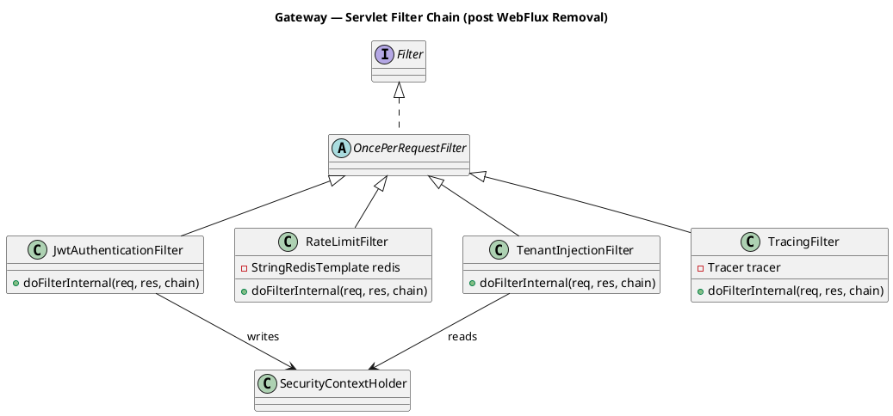
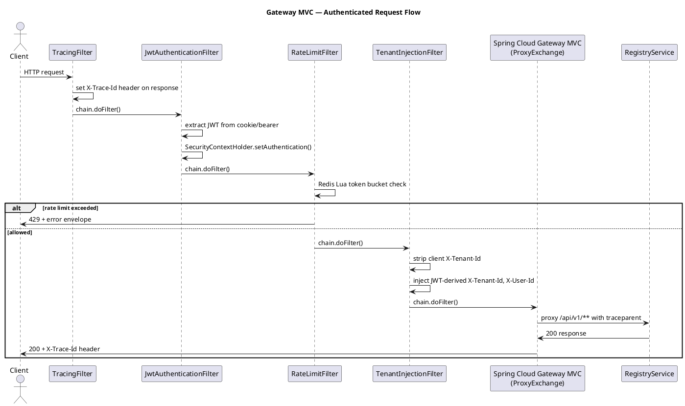

# Plan: Gateway MVC Migration and GraalVM Native Images

## Context

The gateway service was built on WebFlux because Spring Cloud Gateway historically required it. Virtual threads (`spring.threads.virtual.enabled=true`) are now enabled globally, making reactive I/O unnecessary for throughput. WebFlux is also the primary blocker preventing GraalVM native image compilation.

This plan is **outside the execution checklist** — it is a focused infrastructure improvement tracked as a standalone GitHub issue.

## Feature Summary

Three sequenced work items delivering two tightly coupled infrastructure improvements:
**WebFlux Removal** replaces the gateway's reactive stack with `spring-cloud-gateway-server-mvc` (servlet + virtual threads), eliminating accidental reactive complexity and unblocking native compilation.
**Native Image Plugin** adds the GraalVM native-image Gradle plugin, AOT reflection hints, and resource registrations across all three JVM services (gateway, registry, ingestion).
**Native Dockerfiles** delivers native Dockerfiles for all three services and a `docker-compose.native.yml` override so developers and CI can produce native binaries without touching the existing JVM build.

Operators gain ~50–70 % lower RSS memory, millisecond startup, and smaller container images. Developers keep the existing JVM Dockerfile path for fast iteration.

---

## GitHub Workflow

### Issues

**Single issue covers all three work items**
- Title: `Gateway WebFlux removal and GraalVM native images`
- Milestone: `Phase 1 — Gateway MVP auth + Registry`
- Label: `infrastructure`
- Acceptance criteria:
  - Gateway service has no WebFlux or Reactor dependencies; `./gradlew :services:gateway:build` is green
  - All existing gateway tests (auth, OAuth, rate-limit, tenant isolation) pass with MockMvc
  - `./gradlew :services:registry:nativeCompile` produces a runnable binary
  - `./gradlew :services:ingestion:nativeCompile` produces a runnable binary
  - `./gradlew :services:gateway:nativeCompile` produces a runnable binary (after WebFlux removal merges first)
  - `docker compose -f docker-compose.yml -f docker-compose.native.yml build` completes without error
  - Native gateway starts up and returns 200 from `/actuator/health/ready` in under 500 ms
  - Native registry starts up and completes Flyway migration on a clean schema
  - ADR-0012 and ADR-0013 exist in `docs/adr/`

### Branch

```
feat/gateway-mvc-native-images
```

All three work items share gateway code and build configuration — one branch is correct. Within the branch, commit order follows the sequencing below.

### PR

- Title: `feat: gateway servlet-stack migration and GraalVM native images`
- Body: `Closes #<issue>`
- Milestone: `Phase 1 — Gateway MVP auth + Registry`
- CI must be green (build + tests + Trivy) before review. Native CI job is optional (main-only).

### Commit and push approval

Per CLAUDE.md: never run `git commit` or `git push` without Allan's explicit approval. Show diff summary + draft message first, then ask "OK to commit?"

---

## Dependencies & Sequencing

**Requires:**
- Gateway auth (feat/1.17–1.27) merged — provides the WebFlux codebase being migrated
- `shared:common` and `shared:test-support` stable (Phase 0) — unchanged

**Order within plan:**
1. **WebFlux Removal** — gateway must be servlet-based before its native Dockerfile can work
2. **Native Plugin + Hints** — can start for registry/ingestion in parallel with WebFlux Removal; wait for it to complete before adding gateway native hints
3. **Native Dockerfiles + CI** — depends on both prior items being green

**Unblocks (checklist items):**
- 1.69 (per-tenant rate limiting): easier filter refactor now that the filter is a plain `OncePerRequestFilter`
- 1.71 (Resilience4j circuit breakers): `RestClient` interceptors are simpler than reactive operators
- Phase 5 production hardening: native image is the target runtime for staging/prod

---

## Per-Task Implementation

---

### Task: Gateway WebFlux → Spring MVC Migration

**What to build:** Replace every reactive type in the gateway with its servlet equivalent. The HTTP surface (all routes, cookies, headers, response envelope) is unchanged — this is a pure stack swap. Also replace OkHttp with `RestClient` in OAuth providers and `ResendEmailSender`, eliminating that dependency entirely.

#### build.gradle.kts

**File:** `services/gateway/build.gradle.kts`

| Change | Detail |
|--------|--------|
| Remove | `spring-cloud-gateway-server-webflux` |
| Remove | `spring-cloud-starter-loadbalancer` |
| Remove | `spring-boot-starter-webflux` |
| Remove | `spring-boot-starter-data-redis-reactive` |
| Remove | `opentelemetry-reactor-3.1:2.20.0-alpha` |
| Remove (test) | `io.projectreactor:reactor-test` |
| Remove | `com.squareup.okhttp3:okhttp:4.12.0` |
| Remove (test) | `com.squareup.okhttp3:mockwebserver:4.12.0` |
| Add | `spring-cloud-gateway-server-mvc` |
| Add | `spring-boot-starter-web` |
| Add | `spring-boot-starter-data-redis` |

#### application.yml

**File:** `services/gateway/src/main/resources/application.yml`

Change gateway route key from `webflux` to `mvc`:
```yaml
spring:
  cloud:
    gateway:
      server:
        mvc:           # was: webflux
          routes:
            - id: registry
              uri: ${REGISTRY_URI:http://localhost:8081}
              predicates:
                - Path=/api/v1/**
```

Remove any `spring.cloud.loadbalancer` config if present.

#### Config layer

**Files to create or modify:**

| File | Action | Notes |
|------|--------|-------|
| `config/SecurityConfig.java` | Modify (full rewrite) | `@EnableWebFluxSecurity` → `@EnableWebSecurity`; `ServerHttpSecurity` → `HttpSecurity`; `ReactiveAuthenticationManager` removed; filter chain order explicit |
| `config/AppConfig.java` | Modify | Remove `WebClient.Builder` bean; `ReactiveStringRedisTemplate` → `StringRedisTemplate`; add `RestClient.Builder` bean for OAuth/Resend |
| `config/RateLimitConfig.java` | Modify | `ReactiveStringRedisTemplate` → `StringRedisTemplate`; Lua script execution via `redisTemplate.execute(script, keys, args)` (blocking, sync) |
| `config/GlobalTracingFilter.java` | Modify | `WebFilter` → `OncePerRequestFilter`; remove `Mono.deferContextual()`; inject `X-Trace-Id` via `response.setHeader(...)` |
| `config/ProxyRequestLoggingFilter.java` | Delete | Spring Cloud Gateway MVC provides its own access logging via `server.tomcat.accesslog.*` |
| `config/GlobalWebExceptionHandler.java` | Delete | Replace with `@RestControllerAdvice` |

New files:

| File | Action | Notes |
|------|--------|-------|
| `config/GlobalExceptionHandler.java` | New | `@RestControllerAdvice`; `@ExceptionHandler` per exception type; same error codes and envelope as current |
| `config/JwtAuthenticationFilter.java` | New | Replaces `JwtAuthenticationWebFilter`; `OncePerRequestFilter`; cookie-then-bearer extraction; writes to `SecurityContextHolder` |
| `config/RateLimitFilter.java` | New | Replaces `RateLimitWebFilter`; `OncePerRequestFilter`; same Redis Lua script logic; returns 429 with error envelope |
| `config/TenantInjectionFilter.java` | New | Replaces `TenantInjectionGlobalFilter`; `OncePerRequestFilter`; strips/injects `X-Tenant-Id` and `X-User-Id` from `SecurityContextHolder` |

Key signature for the new security config:
```java
@Configuration
@EnableWebSecurity
@EnableMethodSecurity
public class SecurityConfig {
    @Bean
    public SecurityFilterChain filterChain(HttpSecurity http,
            JwtAuthenticationFilter jwtFilter,
            RateLimitFilter rateLimitFilter,
            TenantInjectionFilter tenantFilter) throws Exception {
        return http
            .csrf(AbstractHttpConfigurer::disable)
            .sessionManagement(s -> s.sessionCreationPolicy(SessionCreationPolicy.STATELESS))
            .addFilterBefore(jwtFilter, UsernamePasswordAuthenticationFilter.class)
            .addFilterAfter(rateLimitFilter, JwtAuthenticationFilter.class)
            .addFilterAfter(tenantFilter, RateLimitFilter.class)
            .authorizeHttpRequests(auth -> auth
                .requestMatchers("/v1/auth/register", "/v1/auth/verify",
                                 "/v1/auth/login", "/v1/auth/refresh",
                                 "/v1/auth/oauth/**").permitAll()
                .requestMatchers("/v1/auth/userinfo").authenticated()
                .requestMatchers("/v1/auth/admin/**").hasRole("ADMIN")
                .requestMatchers("/api/v1/**").hasAnyRole("VIEWER","MEMBER","ADMIN")
                .anyRequest().authenticated())
            .exceptionHandling(e -> e
                .authenticationEntryPoint(customEntryPoint())
                .accessDeniedHandler(customAccessDeniedHandler()))
            .build();
    }
}
```

#### TraceContext

**File:** `infrastructure/tracing/TraceContext.java` — Modify

Remove `Mono.deferContextual()` and `ObservationThreadLocalAccessor`. Replace with direct OTel span access:
```java
public String currentTraceId() {
    String id = Span.current().getSpanContext().getTraceId();
    return id.equals("00000000000000000000000000000000") ? id : id;
}
```
OTel's servlet auto-instrumentation (included in `spring-boot-starter-opentelemetry`) makes `Span.current()` valid for the entire request thread.

#### Controllers

**Files:** `api/controller/AuthController.java`, `OAuthController.java`, `TenantOidcAdminController.java`

Strip all `Mono<>` wrapping:
```java
// Before
public Mono<ResponseEntity<ApiResponse<TokenResponse>>> login(...) {
    return Mono.deferContextual(ctx -> {
        String traceId = traceContext.currentTraceId(ctx);
        ...
    }).subscribeOn(Schedulers.boundedElastic());
}

// After
public ResponseEntity<ApiResponse<TokenResponse>> login(...) {
    String traceId = traceContext.currentTraceId();
    TokenResponse result = loginUseCase.execute(tenantId, request);
    return ResponseEntity.ok()
        .header("X-Trace-Id", traceId)
        .body(new ApiResponse<>(result, traceId));
}
```

`ResponseCookie` (reactive API) → `jakarta.servlet.http.Cookie` or `HttpServletResponse.addCookie()`. Alternatively, use Spring's `ResponseCookie` which works in both stacks when added via `HttpServletResponse.setHeader("Set-Cookie", cookie.toString())`.

Async email sending (currently `Mono.fromRunnable(...).subscribeOn(boundedElastic()).subscribe()`):
```java
// After — virtual threads are enabled globally, so default executor uses VTs
CompletableFuture.runAsync(() -> emailSender.sendVerification(email, token));
```

#### Use cases

All 7 use case interfaces and impls: strip `Mono<T>` → `T`. All use cases are already calling blocking JDBC repos — the Mono wrapper was only there to keep the reactive chain alive. After removal, the code becomes simpler direct calls.

| File | Action |
|------|--------|
| `application/usecase/*.java` (7 interfaces) | Modify — `Mono<T>` → `T` |
| `application/usecase/impl/*.java` (7 impls) | Modify — remove Mono/flatMap chains, direct calls |

#### Infrastructure — OAuth providers and email

Replace OkHttp HTTP calls with `RestClient`:

**`infrastructure/oauth/GoogleOAuthProvider.java`** and **`GitHubOAuthProvider.java`**:
```java
// Before (OkHttp + .block())
private final OkHttpClient httpClient;
// ...
Request req = new Request.Builder().url(tokenUri).post(body).build();
try (Response res = httpClient.newCall(req).execute()) { ... }

// After (RestClient — injected from AppConfig)
private final RestClient restClient;
// ...
Map<?, ?> response = restClient.post().uri(tokenUri)
    .body(params)
    .retrieve()
    .body(Map.class);
```

**`infrastructure/email/ResendEmailSender.java`**:
```java
// Replace OkHttp POST to https://api.resend.com/emails with RestClient
```

Remove `AppConfig.java` `OkHttpClient` bean — it's no longer needed.

#### JwtTokenProvider

**`infrastructure/security/JwtTokenProvider.java`** — Modify `decode()`:
```java
// Before: Mono<JwtClaims> decode(String token)
// After: JwtClaims decode(String token) throws UnauthorizedException
```

`NimbusJwtDecoder.decode()` already throws synchronously; just propagate.

#### Tests

| File | Action | Notes |
|------|--------|-------|
| `AbstractGatewayIT.java` | Modify | Remove `WebTestClient`; add `@AutoConfigureMockMvc`; inject `MockMvc` |
| `AuthControllerIT.java` | Modify | `webTestClient.post().uri(...)` → `mockMvc.perform(post(...))` |
| `OAuthControllerIT.java` | Modify | Same; replace `MockWebServer` with `MockRestServiceServer` |
| `RateLimitIT.java` | Modify | Same pattern |
| `TenantIsolationIT.java` | Modify | Same pattern |
| `JwtAuthFilterTest.java` | Modify | `WebFilter` mock → `OncePerRequestFilter` with `MockHttpServletRequest/Response` |
| `TenantInjectionFilterTest.java` | Modify | Same |
| `LoginUseCaseTest.java` | No change | Pure domain, unaffected |
| `RefreshTokenUseCaseTest.java` | No change | Same |
| `RegisterUserUseCaseTest.java` | No change | Same |
| `JwtTokenProviderTest.java` | Modify | `decode()` now throws instead of returning Mono.error |

**Critical constraints for WebFlux Removal:**
- NEVER re-introduce `WebClient`, `Mono`, `Flux`, or any `io.projectreactor` import after this task
- `SecurityContextHolder` replaces `ReactiveSecurityContextHolder` throughout
- `HttpServletRequest`/`HttpServletResponse` replace `ServerWebExchange` throughout
- `OncePerRequestFilter` replaces all `WebFilter` and `GlobalFilter`
- `StringRedisTemplate` replaces `ReactiveStringRedisTemplate` in all 3 use sites (OAuth state, rate limiting)
- traceparent propagation: OTel servlet auto-instrumentation in `spring-boot-starter-opentelemetry` handles W3C propagation automatically — no manual filter needed for outbound `RestClient` calls (Spring Boot 4 wires OTel `RestClient` interceptor automatically)

---

### Task: GraalVM Native Image Plugin and AOT Hints

**What to build:** Wire the `org.graalvm.buildtools.native` plugin across all three services; add AOT reflection hints for every type that GraalVM's static analysis cannot reach; verify `nativeCompile` passes for all three services.

#### Root build.gradle.kts

**File:** `build.gradle.kts` — Modify, add to `plugins {}`:
```kotlin
id("org.graalvm.buildtools.native") version "0.10.6" apply false
```

#### Per-service build.gradle.kts (all three)

Add to `plugins {}`:
```kotlin
id("org.graalvm.buildtools.native")
```

Add GraalVM configuration block:
```kotlin
graalvmNative {
    binaries {
        named("main") {
            imageName.set(project.name)
            buildArgs.addAll(
                "--no-fallback",
                "-H:+ReportExceptionStackTraces",
                "-H:+AddAllCharsets"
            )
        }
    }
    metadataRepository {
        enabled.set(true)   // pulls hints for Flyway, PostgreSQL driver, etc.
    }
}
```

#### Native hints config — registry

**File:** `services/registry/src/main/java/io/cartogra/registry/config/NativeHintsConfig.java` — New

```java
@Configuration
@ImportRuntimeHints(NativeHintsConfig.RegistryRuntimeHints.class)
public class NativeHintsConfig {

    @RegisterReflectionForBinding({
        ApiResponse.class,
        // all domain records, request/response DTOs
    })
    static class RegistryRuntimeHints implements RuntimeHintsRegistrar {
        @Override
        public void registerHints(RuntimeHints hints, ClassLoader cl) {
            hints.resources().registerPattern("db/migration/*.sql");
        }
    }
}
```

#### Native hints config — ingestion

**File:** `services/ingestion/src/main/java/io/cartogra/ingestion/config/NativeHintsConfig.java` — New

Additional hints beyond the registry pattern:

```java
static class IngestionRuntimeHints implements RuntimeHintsRegistrar {
    @Override
    public void registerHints(RuntimeHints hints, ClassLoader cl) {
        hints.resources().registerPattern("db/migration/*.sql");
        // Kafka JSON serializer type mapping
        hints.reflection().registerType(EventEnvelope.class,
            MemberCategory.INVOKE_DECLARED_CONSTRUCTORS,
            MemberCategory.DECLARED_FIELDS);
        // Fabric8 K8s client — register watched resource types
        hints.reflection().registerType(io.fabric8.kubernetes.api.model.Service.class,
            MemberCategory.INVOKE_DECLARED_CONSTRUCTORS,
            MemberCategory.DECLARED_FIELDS);
        hints.reflection().registerType(io.fabric8.kubernetes.api.model.ServiceList.class,
            MemberCategory.INVOKE_DECLARED_CONSTRUCTORS,
            MemberCategory.DECLARED_FIELDS);
    }
}
```

**Note on Fabric8:** Fabric8 7.x ships with partial native support. The `kubernetes-client` artifact includes a `META-INF/native-image/` contribution for core API types. Run `nativeCompile` and examine the reachability report — additional `ServiceAccount`, `Namespace`, and event types may need registration. Document any additions in comments.

**Note on Kafka:** `spring-boot-starter-kafka`'s managed metadata is included in the GraalVM reachability metadata repository (enabled by `metadataRepository.enabled = true`). The `StringSerializer`/`StringDeserializer` pair needs no manual hints. `JsonSerializer` with type headers may need the concrete payload class registered — verify at compile time.

#### Native hints config — gateway

**File:** `services/gateway/src/main/java/io/cartogra/gateway/config/NativeHintsConfig.java` — New (after WebFlux Removal merges)

```java
@RegisterReflectionForBinding({
    ApiResponse.class,
    ApiErrorResponse.class,
    TokenResponse.class,
    LoginRequest.class,
    RegisterRequest.class,
    // all DTO records
})
@Configuration
@ImportRuntimeHints(NativeHintsConfig.GatewayRuntimeHints.class)
public class NativeHintsConfig {

    static class GatewayRuntimeHints implements RuntimeHintsRegistrar {
        @Override
        public void registerHints(RuntimeHints hints, ClassLoader cl) {
            // Nimbus JOSE JWT processing
            hints.reflection().registerType(
                com.nimbusds.jose.crypto.MACSigner.class,
                MemberCategory.INVOKE_DECLARED_CONSTRUCTORS);
            hints.reflection().registerType(
                com.nimbusds.jose.crypto.MACVerifier.class,
                MemberCategory.INVOKE_DECLARED_CONSTRUCTORS);
        }
    }
}
```

**Note on Spring Security + OAuth2 JOSE:** `spring-security-oauth2-jose` has first-class native support since Spring Security 6. `NimbusJwtDecoder` and `NimbusJwtEncoder` are covered. Verify at compile time if any custom `JWSSigner` subclass needs registration.

#### application.yml additions (all services)

No explicit `spring.aot.enabled` needed — it's automatic in `nativeCompile`. However, add to each `application.yml` to make AOT testing easier during development:

No changes required.

#### Critical constraints for Native Plugin:
- The GraalVM reachability metadata repository (`metadataRepository.enabled = true`) must be the first resort — do NOT add manual hints for libraries already covered there (Flyway, PostgreSQL driver, Logback, Jackson 3)
- NEVER use `--allow-incomplete-classpath` — use `--no-fallback` and fix missing hints properly
- Virtual threads (`spring.threads.virtual.enabled=true`) work natively in GraalVM 21+ — no change needed
- `@Scheduled` (used in `RefreshTokenPurgeScheduler`) is processed at build time by Spring AOT — no manual hints needed
- After adding hints, verify compilation with: `./gradlew :services:registry:nativeCompile --no-daemon 2>&1 | grep -i "missing\|error"`

---

### Task: Native Dockerfiles and docker-compose Override

**What to build:** Three `Dockerfile.native` files alongside the existing JVM Dockerfiles; a `docker-compose.native.yml` override that swaps build targets; an optional CI job for main-branch native verification.

#### Native Dockerfiles

**Files to create:**
- `infra/docker/gateway/Dockerfile.native`
- `infra/docker/registry/Dockerfile.native`
- `infra/docker/ingestion/Dockerfile.native`

**Template (registry shown — adapt name/port per service):**
```dockerfile
# syntax=docker/dockerfile:1.7
FROM ghcr.io/graalvm/native-image-community:25 AS builder
WORKDIR /build

RUN apt-get update \
    && apt-get install -y --no-install-recommends curl \
    && rm -rf /var/lib/apt/lists/*

COPY gradle/ gradle/
COPY gradlew settings.gradle.kts build.gradle.kts gradle.properties ./
COPY infra/docker/settings.docker.gradle.kts ./settings.gradle.kts
COPY shared/ shared/
COPY services/registry/ services/registry/

RUN --mount=type=cache,target=/root/.gradle \
    chmod +x ./gradlew && \
    ./gradlew -Ddocker.service=registry :services:registry:nativeCompile -x test --no-daemon

FROM debian:12-slim AS runtime

RUN apt-get update \
    && apt-get install -y --no-install-recommends curl \
    && rm -rf /var/lib/apt/lists/* \
    && useradd -m -u 1000 appuser

WORKDIR /app
COPY --from=builder \
    --chown=appuser:appuser \
    /build/services/registry/build/native/nativeCompile/registry app

USER appuser
EXPOSE 8081
HEALTHCHECK --interval=30s --timeout=3s --start-period=10s --retries=3 \
    CMD curl -f http://localhost:8081/actuator/health/liveness || exit 1
ENTRYPOINT ["./app"]
```

**Key differences from JVM Dockerfile:**
- Builder image: `ghcr.io/graalvm/native-image-community:25` (has `native-image` tool pre-installed)
- Gradle task: `nativeCompile` instead of `bootJar`
- Output path: `build/native/nativeCompile/{service-name}`
- Runtime image: `debian:12-slim` (no JRE needed — the binary is self-contained)
- No `JAVA_OPTS` in ENTRYPOINT — JVM flags do not apply to native binaries
- Start period: 10s (vs 20s JVM) — native starts in < 1s

**Port mapping by service:**
- gateway: 8080
- registry: 8081
- ingestion: 8085

#### docker-compose.native.yml

**File:** `infra/docker-compose/docker-compose.native.yml` — New

```yaml
# Override to build and run native images instead of JVM images.
# Usage: docker compose -f docker-compose.yml -f docker-compose.native.yml up --build
services:
  gateway:
    build:
      context: ../..
      dockerfile: infra/docker/gateway/Dockerfile.native
    image: cartogra/gateway:native-local
    healthcheck:
      start_period: 15s   # native starts faster

  registry:
    build:
      context: ../..
      dockerfile: infra/docker/registry/Dockerfile.native
    image: cartogra/registry:native-local
    healthcheck:
      start_period: 15s

  ingestion:
    build:
      context: ../..
      dockerfile: infra/docker/ingestion/Dockerfile.native
    image: cartogra/ingestion:native-local
    healthcheck:
      start_period: 15s
```

#### CI changes

**File:** `.github/workflows/ci.yml` — Modify

Add a new optional job that runs on `main` branch pushes only (not every PR — native compile takes 5–10 min per service):

```yaml
native-smoke:
  name: Native image smoke test (registry)
  runs-on: ubuntu-latest
  if: github.ref == 'refs/heads/main'
  steps:
    - uses: actions/checkout@v4
    - uses: graalvm/setup-graalvm@v1
      with:
        java-version: '25'
        distribution: 'community'
        cache: 'gradle'
    - name: Compile registry native image
      run: ./gradlew :services:registry:nativeCompile -x test --no-daemon
    - name: Smoke test native binary
      run: |
        # Start with test DB via Testcontainers (or a local Postgres stub)
        ./services/registry/build/native/nativeCompile/registry &
        sleep 2
        curl -f http://localhost:8081/actuator/health/liveness
```

Start with registry only — it's the simplest service and validates the build pipeline. Add ingestion and gateway native jobs in follow-on work once the pattern is proven.

#### Critical constraints for Native Dockerfiles:
- NEVER use `latest` tag — use `ghcr.io/graalvm/native-image-community:25` with explicit version
- Non-root user REQUIRED in runtime stage — same `appuser` pattern as JVM Dockerfiles
- `readOnlyRootFilesystem` K8s constraint is easier to satisfy with native (no JVM temp files) — document in Dockerfile comment
- The existing `infra/docker/settings.docker.gradle.kts` is reused unchanged — the native task is just a different Gradle task on the same project
- NEVER modify the existing JVM `Dockerfile` files — native is additive only

---

## Schema Changes

N/A — no new database tables in this migration.

---

## Env Vars Delta

N/A — no new environment variables. All existing env vars are unchanged; the native binary reads them the same way as the JVM binary.

One operational note: the `JAVA_OPTS` env var referenced in the JVM Dockerfile ENTRYPOINT has no effect on native binaries. Document this in the native Dockerfile comment.

---

## Acceptance Criteria

### Gateway WebFlux Removal

- AC-1: `./gradlew :services:gateway:build` passes with zero Reactor/WebFlux imports in main source
- AC-2: `POST /v1/auth/login` with valid credentials returns 200 with `Set-Cookie: jwt=...` (httpOnly)
- AC-3: Request to `/api/v1/services` without JWT returns 401 with envelope `{"error":{"code":"..."}, "traceId":"..."}`
- AC-4: Request to `/api/v1/services` with forged `X-Tenant-Id` header → gateway strips it and injects from JWT
- AC-5: After exhausting rate limit, endpoint returns 429 with envelope and `X-Trace-Id` header
- AC-6: OAuth `/v1/auth/oauth/google/start` redirects to Google auth URL
- AC-7: `X-Trace-Id` response header is a valid 32-char hex string on every response

### Native Plugin and Hints

- AC-8: `./gradlew :services:registry:nativeCompile` completes without `--allow-incomplete-classpath`
- AC-9: `./gradlew :services:ingestion:nativeCompile` completes without error
- AC-10: `./gradlew :services:gateway:nativeCompile` completes without error
- AC-11: Flyway migrations execute successfully when the registry native binary runs against a blank schema

### Native Dockerfiles

- AC-12: `docker build -f infra/docker/registry/Dockerfile.native .` produces an image under 120 MB
- AC-13: Native registry container reaches `/actuator/health/ready` within 5 s of startup
- AC-14: Native gateway container authenticates a login request end-to-end
- AC-15: `docker compose -f docker-compose.yml -f docker-compose.native.yml up` starts all three native services healthy

---

## Test Strategy

### Unit tests (no containers)

**WebFlux Removal:**
- All existing domain unit tests (`LoginUseCaseTest`, `RefreshTokenUseCaseTest`, `RegisterUserUseCaseTest`, `JwtTokenProviderTest`) — rerun with no changes; they test pure domain logic
- `JwtAuthFilterTest` — rewrite to test `OncePerRequestFilter`: use `MockHttpServletRequest`, `MockHttpServletResponse`, `MockFilterChain` from `spring-test`
- `TenantInjectionFilterTest` — same pattern
- `RateLimitFilterTest` (new) — mock `StringRedisTemplate.execute(script,...)`, assert 429 when script returns "0", assert passthrough when "1"

**Native Plugin:** No new unit tests; native compilation itself is the test.

### Integration tests (Testcontainers)

**WebFlux Removal:**
- All existing IT classes rewritten to use `MockMvc` via `@AutoConfigureMockMvc`
- Containers: PostgreSQL + Redis (same as current `AbstractGatewayIT`)
- Replace `MockWebServer` with `MockRestServiceServer` for OAuth provider tests; or keep WireMock (already a dependency in ingestion, consistent across services)
- Key scenarios per existing test class are unchanged — only the HTTP assertion syntax changes

**Native Plugin:**
- Add a lightweight `@SpringBootTest` AOT-mode test per service to catch reflection errors before native compile:
  ```java
  @SpringBootTest
  @Import(NativeHintsConfig.class)
  class NativeHintsValidationTest { @Test void contextLoads() {} }
  ```

**Native Dockerfiles:** Verified by the CI smoke test job (AC-13, AC-14) and the docker-compose native verification (AC-15).

**What NOT to test here:**
- Rate-limit Redis Lua correctness — covered by existing `RateLimitIT`
- OAuth full token exchange — covered by `OAuthControllerIT`
- K8s worker native behavior — deferred; Fabric8 native support should be validated separately if issues arise

---

## New Error Codes

N/A — no new error codes. All existing codes are preserved.

---

## Postman Collection

No new HTTP surface — the gateway API is unchanged. The existing `postman/gateway.postman_collection.json` covers all endpoints and should continue to work after the servlet migration.

Run the existing collection against the running gateway after the WebFlux Removal to verify no regressions.

---

## Documentation

### PlantUML Diagrams

| File | Type | Trigger |
|------|------|---------|
| `docs/diagrams/gateway/mvc-migration-class.puml` | Class | New domain model for filter chain |
| `docs/diagrams/gateway/mvc-migration-sequence.puml` | Sequence | Auth request flow through new servlet filters |

**Class diagram stub:**


**Sequence diagram stub:**


### ADRs

**ADR-0012 — Gateway stack migration from WebFlux to Spring MVC**
- File: `docs/adr/ADR-0012-gateway-servlet-stack.md`
- Context: Gateway was built on WebFlux because Spring Cloud Gateway required it. Virtual threads (`spring.threads.virtual.enabled=true`) are enabled, making reactive I/O no longer necessary for throughput. WebFlux adds cognitive overhead and is the primary blocker for GraalVM native compilation.
- Decision: Migrate to `spring-cloud-gateway-server-mvc` + `spring-boot-starter-web`. All reactive types replaced with servlet equivalents.
- Consequences:
  - Positive: Simpler code; alignment with registry and ingestion; `spring-cloud-gateway-server-mvc` has better native image support; `MockMvc` tests are easier to read than `WebTestClient`; OkHttp dependency eliminated
  - Negative: Full filter/security config rewrite required (~15 files)
  - Neutral: OTel instrumentation switches from `opentelemetry-reactor-3.1` to standard servlet instrumentation (already included in `spring-boot-starter-opentelemetry`); no observable behavior change

**ADR-0013 — GraalVM native image as production runtime**
- File: `docs/adr/ADR-0013-graalvm-native-images.md`
- Context: All three JVM services use Spring Boot 4 with AOT support. Eliminating WebFlux (done in the WebFlux Removal work item) removes the last major native-unfriendly dependency. Native binaries offer ~50–70 % lower RSS, sub-second startup, and smaller container images.
- Decision: Compile all three JVM services to native images. Keep JVM Dockerfiles for local development; `Dockerfile.native` for staging/production. Native CI job runs on main pushes only.
- Consequences:
  - Positive: Significant memory savings in Kubernetes; faster pod startup and scale-out; smaller attack surface (no JVM, no runtime classloading)
  - Negative: 5–10 min build time per service; no Java agent for profiling/debugging; Fabric8 K8s client native support is partial — monitor for missing hints
  - Neutral: Virtual threads, `ScopedValue`, and `@Scheduled` all work in GraalVM native on Java 25

### OpenAPI

N/A — no HTTP surface changes. `docs/api/gateway.openapi.yaml` is unchanged.

---

## Rollback Plan

No schema migrations in these tasks. Rollback is: revert the branch. No persistent state changed.

If a native binary fails in staging after rollback is desired: revert docker-compose to use the JVM `Dockerfile` by removing the `docker-compose.native.yml` override.

---

## Verification Script

Ordered steps after implementing all three tasks, before asking for commit approval.

**After WebFlux Removal:**
1. `./gradlew :services:gateway:build` — must be green; grep source for `import reactor` — must return zero results
2. `docker compose up gateway valkey postgres` — gateway healthy at `/actuator/health/ready`
3. Run `postman/gateway.postman_collection.json` against `http://localhost:8080` — all existing requests pass
4. Manually: register → verify email (check logs for OTP) → login → call `/api/v1/services` with cookie → expect proxied response

**After Native Plugin:**
5. `./gradlew :services:registry:nativeCompile --no-daemon` — must complete without `--allow-incomplete-classpath` warnings
6. `./gradlew :services:ingestion:nativeCompile --no-daemon` — same
7. `./gradlew :services:gateway:nativeCompile --no-daemon` — same
8. `./services/registry/build/native/nativeCompile/registry &` → `curl http://localhost:8081/actuator/health/liveness` → 200

**After Native Dockerfiles:**
9. `docker build -f infra/docker/registry/Dockerfile.native -t registry:native-test .` — image builds, size < 120 MB
10. `docker compose -f infra/docker-compose/docker-compose.yml -f infra/docker-compose/docker-compose.native.yml up --build` — all three native services reach healthy state
11. Re-run `postman/gateway.postman_collection.json` against native gateway — all requests pass

---

## BIP

N/A for WebFlux Removal and Native Plugin. The Native Dockerfiles work item is infrastructure-only with no user-facing change.

**Optional:** The WebFlux Removal has strong BIP potential (reactive → virtual threads is a popular topic). If Allan wants to publish, the existing checklist item `1.53` ("Publish the dual-mode auth article — httpOnly cookies + Bearer tokens in a Spring Security 7 **reactive** gateway") should be updated to reference the servlet-stack version, or a new checklist BIP item added. Raise this when the branch is ready to review.

---

## Files Created / Modified

| File | Action | Task |
|------|--------|------|
| `services/gateway/build.gradle.kts` | Modify — swap WebFlux for MVC deps, drop OkHttp | WebFlux Removal |
| `services/gateway/src/main/resources/application.yml` | Modify — `webflux` → `mvc` route key | WebFlux Removal |
| `services/gateway/.../config/SecurityConfig.java` | Modify (full rewrite) | WebFlux Removal |
| `services/gateway/.../config/AppConfig.java` | Modify | WebFlux Removal |
| `services/gateway/.../config/RateLimitConfig.java` | Modify | WebFlux Removal |
| `services/gateway/.../config/GlobalTracingFilter.java` | Modify | WebFlux Removal |
| `services/gateway/.../config/ProxyRequestLoggingFilter.java` | Delete | WebFlux Removal |
| `services/gateway/.../config/GlobalWebExceptionHandler.java` | Delete | WebFlux Removal |
| `services/gateway/.../config/GlobalExceptionHandler.java` | New | WebFlux Removal |
| `services/gateway/.../config/JwtAuthenticationFilter.java` | New | WebFlux Removal |
| `services/gateway/.../config/RateLimitFilter.java` | New | WebFlux Removal |
| `services/gateway/.../config/TenantInjectionFilter.java` | New | WebFlux Removal |
| `services/gateway/.../infrastructure/tracing/TraceContext.java` | Modify | WebFlux Removal |
| `services/gateway/.../infrastructure/security/JwtTokenProvider.java` | Modify | WebFlux Removal |
| `services/gateway/.../infrastructure/oauth/GoogleOAuthProvider.java` | Modify — OkHttp → RestClient | WebFlux Removal |
| `services/gateway/.../infrastructure/oauth/GitHubOAuthProvider.java` | Modify — OkHttp → RestClient | WebFlux Removal |
| `services/gateway/.../infrastructure/email/ResendEmailSender.java` | Modify — OkHttp → RestClient | WebFlux Removal |
| `services/gateway/.../api/controller/AuthController.java` | Modify — strip Mono | WebFlux Removal |
| `services/gateway/.../api/controller/OAuthController.java` | Modify — strip Mono | WebFlux Removal |
| `services/gateway/.../api/controller/TenantOidcAdminController.java` | Modify — strip Mono | WebFlux Removal |
| `services/gateway/.../application/usecase/*.java` (7 interfaces) | Modify — strip Mono | WebFlux Removal |
| `services/gateway/.../application/usecase/impl/*.java` (7 impls) | Modify — strip Mono | WebFlux Removal |
| `services/gateway/.../test/AbstractGatewayIT.java` | Modify — WebTestClient → MockMvc | WebFlux Removal |
| `services/gateway/.../test/*IT.java` (5 files) | Modify — assertion syntax update | WebFlux Removal |
| `services/gateway/.../test/*Test.java` (5 files) | Modify — filter test mechanics | WebFlux Removal |
| `docs/adr/ADR-0012-gateway-servlet-stack.md` | New | WebFlux Removal |
| `docs/diagrams/gateway/mvc-migration-class.puml` | New | WebFlux Removal |
| `docs/diagrams/gateway/mvc-migration-sequence.puml` | New | WebFlux Removal |
| `build.gradle.kts` (root) | Modify — add native plugin `apply false` | Native Plugin |
| `services/registry/build.gradle.kts` | Modify — add native plugin + config | Native Plugin |
| `services/ingestion/build.gradle.kts` | Modify — add native plugin + config | Native Plugin |
| `services/gateway/build.gradle.kts` | Modify — add native plugin + config | Native Plugin |
| `services/registry/.../config/NativeHintsConfig.java` | New | Native Plugin |
| `services/ingestion/.../config/NativeHintsConfig.java` | New | Native Plugin |
| `services/gateway/.../config/NativeHintsConfig.java` | New | Native Plugin |
| `docs/adr/ADR-0013-graalvm-native-images.md` | New | Native Plugin |
| `infra/docker/gateway/Dockerfile.native` | New | Native Dockerfiles |
| `infra/docker/registry/Dockerfile.native` | New | Native Dockerfiles |
| `infra/docker/ingestion/Dockerfile.native` | New | Native Dockerfiles |
| `infra/docker-compose/docker-compose.native.yml` | New | Native Dockerfiles |
| `.github/workflows/ci.yml` | Modify — add native-smoke job | Native Dockerfiles |
| `docs/plans/20260519 - Gateway MVC Migration and GraalVM Native Images.md` | New (copy of this plan) | all |
