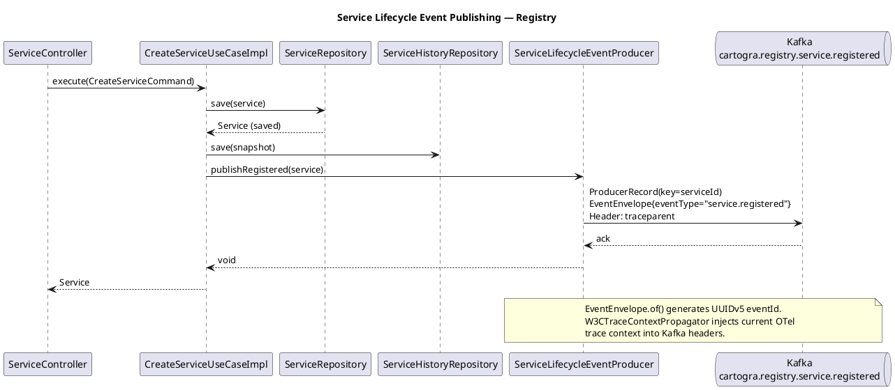
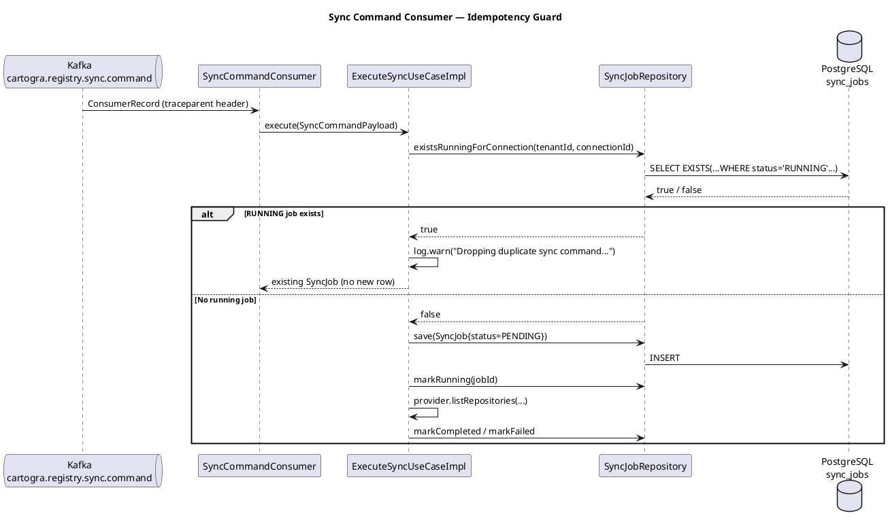

# Plan: Tasks 1.38–1.40 — Registry lifecycle events, sync idempotency, and guest access decision

## Feature Summary

This group of tasks wires up the event backbone between the registry and ingestion services, adds production-grade idempotency to the sync command consumer, and makes a formal scope decision about guest demo access in Phase 1. Task 1.38 adds a Kafka producer to the registry that publishes `service.registered`, `service.updated`, and `service.deleted` events with the shared `EventEnvelope` and W3C `traceparent` propagation. Task 1.39 hardens the existing `SyncCommandConsumer` in ingestion with a concurrent-execution guard so duplicate or overlapping sync commands for the same connection never spin up parallel sync jobs. Task 1.40 captures in ADR-0013 the Phase 1 decision to defer guest demo access to Phase 5, keeping scope tight.

---

## GitHub Workflow

### Issues

**Issue 1 (Tasks 1.38 + 1.39) — create new:**
- Title: `US1.38-1.39 — Registry lifecycle events and sync command idempotency`
- Acceptance criteria:
  - Creating, updating, or deleting a service in registry publishes an `EventEnvelope` to the correct Kafka topic with `traceparent` header
  - Each published envelope has a UUIDv5 `eventId`, correct `eventType`, `entityId`, `tenantId`, and a non-null `payload`
  - A second `sync.command` for the same `connectionId` while a sync job is `RUNNING` is silently dropped (no new `SyncJob` row created)
  - Integration tests prove both the producer path and the deduplication guard
- Milestone: `Phase 1 — Gateway MVP auth + Registry`

**Issue 2 (Task 1.40) — create new:**
- Title: `US1.40 — Guest demo access decision: defer to Phase 5`
- Acceptance criteria:
  - ADR-0013 exists and is referenced from `docs/adr/README.md`
  - ADR states that guest/anonymous access is NOT enabled in Phase 1
  - No GUEST role or anonymous auth path is introduced in code
- Milestone: `Phase 1 — Gateway MVP auth + Registry`

### Branch

`feat/1.38-registry-lifecycle-events`

All three tasks are grouped on one branch: 1.38 and 1.39 share the Kafka/event domain and deliver the event backbone together; 1.40 is a documentation-only decision that closes a Phase 1 gate item. No shared code path spans more than two services, which is acceptable for one branch.

### PR

- Title: `feat: registry lifecycle events, sync idempotency, and guest access ADR (1.38–1.40)`
- Body must include `Closes #<issue-1>` and `Closes #<issue-2>`.
- Milestone: `Phase 1 — Gateway MVP auth + Registry`
- CI must be green (build + tests + PlantUML diagram render) before requesting review.

### Commit and push approval

Per CLAUDE.md: never commit or push without Allan's explicit approval. Show diff summary + draft commit message and ask "OK to commit?" before every commit.

---

## Dependencies & Sequencing

- **Requires**: Tasks 1.28–1.37 merged (SCM SPI and ingestion workers, including `SyncCommandConsumer`, `SyncResultProducer`, `ExecuteSyncUseCaseImpl`, and `SyncJobRepository`). These are already merged on `main`.
- **Requires**: `shared:common` `EventEnvelope` and `UuidV5` already exist and compile — confirmed.
- **Requires**: Kafka broker in the local Docker Compose stack — confirmed (already in `infra/docker-compose/docker-compose.yml`).
- **Order within plan**: 1.38 first (producer + topics), then 1.39 (consumer hardening); 1.40 can be done in parallel with either.
- **Unblocks**:
  - 1.57 — `scm_connection_cache` migration and 1.58 — connection cache consumer (both depend on registry publishing `scm_connection.*` lifecycle events; note: those specific events are scoped to task 1.66, not 1.38, but the Kafka infrastructure added here enables 1.66 without further build changes)
  - 1.67 — ingestion→registry feedback loop (depends on `cartogra.ingestion.sync.completed` being consumed in registry)
  - 2.18 — topology graph builder (depends on `service.registered` and `service.updated` events from registry)

---

## Per-Task Implementation

### Task 1.38 — Registry publishes service lifecycle events

**What to build**: Add a `ServiceLifecycleEventProducer` bean to the registry's infrastructure layer that wraps a `KafkaTemplate` and publishes `EventEnvelope`-wrapped payloads with W3C `traceparent` propagation. Define three payload records (`ServiceRegisteredPayload`, `ServiceUpdatedPayload`, `ServiceDeletedPayload`) in a new `domain/event` package. Inject the producer into `CreateServiceUseCaseImpl`, `UpdateServiceUseCaseImpl`, `DeleteServiceUseCaseImpl`, and `AssignOwnerUseCaseImpl` (assign-owner is logically a service update). Add `spring-boot-starter-kafka` to `services/registry/build.gradle.kts` and wire Kafka bootstrap config in `application.yml`.

**Files to create or modify**:

| File | Action | Notes |
|------|--------|-------|
| `services/registry/build.gradle.kts` | Modify | Add `spring-boot-starter-kafka` and `spring-kafka-test` |
| `services/registry/src/main/resources/application.yml` | Modify | Add `spring.kafka` producer config block |
| `services/registry/src/main/java/io/cartogra/registry/domain/event/ServiceRegisteredPayload.java` | New | Record with service fields needed by consumers |
| `services/registry/src/main/java/io/cartogra/registry/domain/event/ServiceUpdatedPayload.java` | New | Record with updated service fields |
| `services/registry/src/main/java/io/cartogra/registry/domain/event/ServiceDeletedPayload.java` | New | Record with id, tenantId, name, deletedAt |
| `services/registry/src/main/java/io/cartogra/registry/infrastructure/kafka/ServiceLifecycleEventProducer.java` | New | KafkaTemplate wrapper with traceparent injection |
| `services/registry/src/main/java/io/cartogra/registry/application/usecase/impl/CreateServiceUseCaseImpl.java` | Modify | Inject producer; publish `service.registered` after save |
| `services/registry/src/main/java/io/cartogra/registry/application/usecase/impl/UpdateServiceUseCaseImpl.java` | Modify | Inject producer; publish `service.updated` after save |
| `services/registry/src/main/java/io/cartogra/registry/application/usecase/impl/DeleteServiceUseCaseImpl.java` | Modify | Inject producer; publish `service.deleted` after soft-delete |
| `services/registry/src/main/java/io/cartogra/registry/application/usecase/impl/AssignOwnerUseCaseImpl.java` | Modify | Inject producer; publish `service.updated` after owner assignment |
| `docs/diagrams/registry/service-lifecycle-events-sequence.puml` | New | Sequence diagram for event publishing flow |

**Key signatures**:

```java
// domain/event/ServiceRegisteredPayload.java
public record ServiceRegisteredPayload(
        UUID serviceId,
        UUID tenantId,
        String name,
        String description,
        UUID teamId,
        String repositoryUrl,
        String techStack,
        String healthStatus
) {}

// domain/event/ServiceUpdatedPayload.java  — same fields as Registered
// domain/event/ServiceDeletedPayload.java
public record ServiceDeletedPayload(
        UUID serviceId,
        UUID tenantId,
        String name,
        Instant deletedAt
) {}

// infrastructure/kafka/ServiceLifecycleEventProducer.java
@Component
public class ServiceLifecycleEventProducer {
    static final String TOPIC_REGISTERED = "cartogra.registry.service.registered";
    static final String TOPIC_UPDATED    = "cartogra.registry.service.updated";
    static final String TOPIC_DELETED    = "cartogra.registry.service.deleted";

    private final KafkaTemplate<Object, Object> kafkaTemplate;

    public void publishRegistered(Service service) { /* ... */ }
    public void publishUpdated(Service service)    { /* ... */ }
    public void publishDeleted(Service service)    { /* ... */ }

    private void publish(String topic, String eventType, Service service, Object payload) {
        var envelope = EventEnvelope.of(eventType, service.id(), service.tenantId(), 1, payload);
        var record   = new ProducerRecord<Object, Object>(topic, service.id().toString(), envelope);
        W3CTraceContextPropagator.getInstance().inject(Context.current(), record.headers(),
                (h, key, value) -> h.add(key, value.getBytes(StandardCharsets.UTF_8)));
        kafkaTemplate.send(record);
    }
}
```

**Critical constraints**:
- `spring-boot-starter-kafka` must be added to registry's `build.gradle.kts` — it is currently absent.
- Kafka message key must be the service UUID (partition ordering per entity).
- `traceparent` header must be injected on every `ProducerRecord` using `W3CTraceContextPropagator`.
- `EventEnvelope.of()` generates a UUIDv5 `eventId` deterministically — do not substitute `UUID.randomUUID()`.
- Topic names follow the `cartogra.{domain}.{entity}.{event}` convention.
- Introduce topics only when the first real producer/consumer exists — these are the first registry service lifecycle topics.
- The producer call must be outside the `@Transactional` boundary (or at the very end of it) so the DB commit precedes the Kafka publish.

**`application.yml` addition for registry**:
```yaml
spring:
  kafka:
    bootstrap-servers: ${KAFKA_BOOTSTRAP_SERVERS:localhost:9092}
    producer:
      key-serializer: org.apache.kafka.common.serialization.StringSerializer
      value-serializer: org.springframework.kafka.support.serializer.JsonSerializer
```

---

### Task 1.39 — Sync command consumer idempotency

**What to build**: Add a `boolean existsRunningForConnection(UUID tenantId, UUID connectionId)` method to `SyncJobRepository` (port) and `JdbcSyncJobRepository` (adapter). Modify `ExecuteSyncUseCaseImpl.execute()` to call this guard before creating a new `SyncJob`: if a job with `status = 'RUNNING'` already exists for the same `(tenantId, connectionId)`, log a structured warning at `WARN` level and return the existing job without creating a new one. Document the idempotency contract in a code comment on the guard and in `docs/adr/ADR-0014-sync-command-idempotency.md`.

**The idempotency strategy** (document this verbatim as a code comment):
> Concurrent-execution guard: prevents two sync workers from running in parallel for the same SCM connection. If a RUNNING job already exists for `(tenantId, connectionId)`, the new command is silently dropped. This does not deduplicate across time — sequential re-runs are always allowed. Rationale: SCM provider APIs are rate-limited; parallel syncs for the same connection would double API calls while producing identical results.

**Files to create or modify**:

| File | Action | Notes |
|------|--------|-------|
| `services/ingestion/src/main/java/io/cartogra/ingestion/application/port/out/SyncJobRepository.java` | Modify | Add `existsRunningForConnection(UUID tenantId, UUID connectionId)` |
| `services/ingestion/src/main/java/io/cartogra/ingestion/infrastructure/persistence/JdbcSyncJobRepository.java` | Modify | Implement with named-param SQL: `SELECT EXISTS(SELECT 1 FROM sync_jobs WHERE tenant_id = :tenantId AND connection_id = :connectionId AND status = 'RUNNING' AND deleted_at IS NULL)` |
| `services/ingestion/src/main/java/io/cartogra/ingestion/application/usecase/ExecuteSyncUseCaseImpl.java` | Modify | Add guard at top of `execute()` before `syncJobRepository.save()` |
| `docs/adr/ADR-0014-sync-command-idempotency.md` | New | Documents the concurrent-execution guard strategy |
| `docs/diagrams/ingestion/sync-command-idempotency-sequence.puml` | New | Sequence diagram showing the happy path and the dedup guard path |

**Key signatures**:

```java
// application/port/out/SyncJobRepository.java — add method:
boolean existsRunningForConnection(UUID tenantId, UUID connectionId);

// ExecuteSyncUseCaseImpl.execute() — guard added at top:
@Override
public SyncJob execute(SyncCommandPayload command) {
    // Concurrent-execution guard: prevents parallel syncs for the same connection.
    // Sequential re-runs after completion are always allowed.
    if (syncJobRepository.existsRunningForConnection(command.tenantId(), command.connectionId())) {
        log.warn("Dropping duplicate sync command: a RUNNING job already exists for connection={}",
                command.connectionId());
        return syncJobRepository.findRunningForConnection(command.tenantId(), command.connectionId())
                .orElseThrow(); // existsRunning guarantees presence
    }
    // ... existing create-and-run logic ...
}
```

> Note: to avoid a race between `existsRunning` and `save`, also add `findRunningForConnection(UUID tenantId, UUID connectionId): Optional<SyncJob>` to the repository so the guard and retrieval are consistent.

**Critical constraints**:
- Use named parameters in all SQL — never concatenate strings.
- The guard must filter `deleted_at IS NULL` to exclude soft-deleted jobs.
- Never return `null` — return `Optional<SyncJob>` or the existing job record.

---

### Task 1.40 — Guest demo access decision

**What to build**: This task produces an ADR, not code. The decision: **guest demo access is NOT enabled in Phase 1**. Rationale: Phase 5 tasks 5.2 (seed data), 5.3 (seed loader), and 5.4 (guest read-only + sandbox isolation) form the complete guest demo story. Enabling guest access in Phase 1 without the seed data and sandbox infrastructure would require adding an unauthenticated auth path, a `GUEST` role, and read-only enforcement across all proxied routes — scope that properly belongs in Phase 5. The existing `SecurityConfig` already enforces `hasAnyRole("VIEWER", "MEMBER", "ADMIN")` on all `/api/v1/**` routes; no GUEST path exists and none will be added until Phase 5.

**Files to create or modify**:

| File | Action | Notes |
|------|--------|-------|
| `docs/adr/ADR-0013-guest-demo-access-deferred.md` | New | Decision record |
| `docs/adr/README.md` | Modify | Add entry for ADR-0013 |

---

## Schema Changes

N/A — no new database tables. Task 1.38 introduces Kafka topics but no DB schema. Task 1.39 adds an SQL query to the existing `sync_jobs` table (no new columns). Task 1.40 is documentation only.

---

## Env Vars Delta

| Var | Service(s) | `.env.example` default | `application.yml` fallback | Notes |
|-----|-----------|------------------------|------------------------------|-------|
| `KAFKA_BOOTSTRAP_SERVERS` | registry | `localhost:9092` | `localhost:9092` | Registry needs Kafka bootstrap added; ingestion already has it |

`KAFKA_BOOTSTRAP_SERVERS` already exists in the ingestion service config and in Docker Compose. The only change is wiring it into registry's `application.yml` and `build.gradle.kts`.

No `docker-compose.yml` changes are needed — the Kafka broker is already running and the topic will be auto-created on first publish (or can be pre-created via the Kafka UI at `localhost:9090`).

---

## Acceptance Criteria

### Task 1.38

- AC-1: Calling `POST /api/v1/services` on the registry results in exactly one message published to `cartogra.registry.service.registered` with `eventType = "service.registered"`, `entityId` matching the created service's UUID, and a `traceparent` header present.
- AC-2: Calling `PUT /api/v1/services/{id}` on the registry results in a message published to `cartogra.registry.service.updated` with `eventType = "service.updated"`.
- AC-3: Calling `DELETE /api/v1/services/{id}` on the registry results in a message published to `cartogra.registry.service.deleted` with `eventType = "service.deleted"`.
- AC-4: The published `EventEnvelope` has a non-null UUIDv5 `eventId`, correct `tenantId`, non-null `payload`, and `version = 1`.
- AC-5: The `traceparent` Kafka header value is a valid W3C trace context string.

### Task 1.39

- AC-6: When a `sync.command` event is consumed for a `connectionId` that already has a `RUNNING` sync job in the database, no new `SyncJob` row is inserted.
- AC-7: When no `RUNNING` job exists for a `connectionId`, the consumer creates a new `SyncJob` and proceeds normally.
- AC-8: Duplicate command processing emits a WARN-level log message that includes the `connectionId`.

### Task 1.40

- AC-9: `docs/adr/ADR-0013-guest-demo-access-deferred.md` exists with Context, Decision, and Consequences sections.
- AC-10: `docs/adr/README.md` includes an entry for ADR-0013.
- AC-11: No GUEST role or anonymous auth path appears in gateway `SecurityConfig`.

---

## Test Strategy

**Unit tests** (no containers):

- `ServiceLifecycleEventProducerTest`: mock `KafkaTemplate`; verify `send()` is called with correct topic, message key, and event type for each of the three publish methods.
- `ExecuteSyncUseCaseImplTest` (extend existing):
  - Scenario: `existsRunningForConnection()` returns `true` → assert `save()` never called, WARN log emitted.
  - Scenario: `existsRunningForConnection()` returns `false` → assert normal path proceeds (existing test coverage).

**Integration tests** (Testcontainers):

Required containers: `PostgreSQL` (already in `test-support`), `@EmbeddedKafka` (Spring Kafka test starter).

`ServiceLifecycleEventIT` (registry):
- Boot with `@SpringBootTest + @EmbeddedKafka`
- Add `spring-kafka-test` dependency to `services/registry/build.gradle.kts` (test scope)
- AC-1: Create service via use case → consume `cartogra.registry.service.registered` → assert envelope fields and `traceparent` header (AC-1, AC-4, AC-5).
- AC-2: Update service via use case → consume `cartogra.registry.service.updated` (AC-2).
- AC-3: Delete service via use case → consume `cartogra.registry.service.deleted` (AC-3).

`SyncCommandIdempotencyIT` (ingestion):
- Extend existing test setup with a running sync job seeded in the DB.
- AC-6: Call `executeSyncUseCase.execute()` with the same `connectionId` twice; second call skipped (AC-6, AC-8).
- AC-7: Call with a new `connectionId` → new SyncJob created (AC-7).

**What NOT to test here**:
- Gateway proxy trace propagation — covered by 1.26.
- SCM provider behavior — covered by 1.34.
- Registry → topology event consumption — covered by 2.18.

**E2E manual test** (developer-executed, full local stack):

**Prerequisites**: run `docker compose up kafka kafka-ui postgres registry ingestion gateway` from `infra/docker-compose/` and confirm:

- Registry healthy: `curl -s http://localhost:8081/actuator/health/ready | jq .status` → `"UP"`
- Gateway healthy: `curl -s http://localhost:8080/actuator/health/ready | jq .status` → `"UP"`
- Kafka UI accessible: `http://localhost:8086`

**Task 1.38 — Registry lifecycle events:**

1. Authenticate: `POST http://localhost:8080/v1/auth/login` with valid credentials → capture `data.accessToken`.
2. Create a service: `POST http://localhost:8080/api/v1/services` with `Authorization: Bearer <token>` and body `{"name":"e2e-test","description":"e2e verification"}` → expect `201` with `data.id` and `traceId`.
3. Open Kafka UI → Topics → `cartogra.registry.service.registered` → Messages → confirm 1 new message whose body contains `"eventType":"service.registered"` and `"entityId"` matching the created service UUID.
4. Inspect the message's headers in Kafka UI → confirm `traceparent` header is present and matches pattern `00-[0-9a-f]{32}-[0-9a-f]{16}-[0-9a-f]{2}`.
5. Update the service: `PUT http://localhost:8080/api/v1/services/{id}` → expect `200`. Open Kafka UI → `cartogra.registry.service.updated` → confirm 1 message with `"eventType":"service.updated"` and the correct `entityId`.
6. Delete the service: `DELETE http://localhost:8080/api/v1/services/{id}` → expect `204`. Open Kafka UI → `cartogra.registry.service.deleted` → confirm 1 message with `"eventType":"service.deleted"`.

**Passing signal**: Topics `cartogra.registry.service.registered`, `.updated`, `.deleted` each contain exactly 1 message; each carries the service UUID as both the Kafka message key and `entityId`; each has a valid `traceparent` header.

**Failure triage**:

- No message in Kafka UI → check registry logs (`docker compose logs registry | grep -i kafka`) for producer errors; confirm `KAFKA_BOOTSTRAP_SERVERS` is set; verify Kafka broker is reachable from within the registry container.
- `traceparent` header absent → confirm `W3CTraceContextPropagator` injection is in `ServiceLifecycleEventProducer.publish()`; check OTel is active (`management.tracing.sampling.probability=1.0`).
- `eventId` looks like a random UUID (not deterministic across runs) → `EventEnvelope.of()` was replaced with `UUID.randomUUID()` somewhere; the `of()` factory must be used.

**Task 1.39 — Idempotency guard:**

1. Via Kafka UI → Produce Message → topic `cartogra.registry.sync.command` → set the message key to a fresh connection UUID and body to a minimal `EventEnvelope<SyncCommandPayload>` JSON (see ADR-0014 for the schema). Confirm a new row in the DB: `SELECT id, status FROM sync_jobs WHERE connection_id = '<uuid>' ORDER BY created_at;` → 1 row with `status = PENDING` or `RUNNING`.
2. Manually force the job to RUNNING (if not already): `UPDATE sync_jobs SET status = 'RUNNING', started_at = now() WHERE connection_id = '<uuid>';`
3. Publish the same sync command again (same connection UUID key) via Kafka UI.
4. Check ingestion logs: `docker compose logs ingestion | grep "Dropping duplicate"` → must show `WARN … Dropping duplicate sync command: a RUNNING job already exists for connection=<uuid>`.
5. Confirm no second row was created: `SELECT count(*) FROM sync_jobs WHERE connection_id = '<uuid>' AND deleted_at IS NULL;` → `1`.

**Passing signal**: The second command produces a WARN log line with the connection UUID, and the DB still has exactly 1 sync_jobs row for that connection.

**Failure triage**:

- Two rows in DB → the guard was not reached; check `ExecuteSyncUseCaseImpl.execute()` has `existsRunningForConnection()` as its first operation before any `save()`.
- No WARN log → the guard returned `false` despite the row existing; run `SELECT status, deleted_at FROM sync_jobs WHERE connection_id = '<uuid>';` to confirm `status = 'RUNNING'` and `deleted_at IS NULL`; the SQL in `JdbcSyncJobRepository` may be missing the `deleted_at IS NULL` filter.

**Task 1.40 — Guest access ADR:**

1. Confirm ADR file exists: `ls docs/adr/ADR-0013-guest-demo-access-deferred.md` → file present with Context, Decision, Consequences sections.
2. Send an unauthenticated request: `curl -s -o /dev/null -w "%{http_code}" http://localhost:8080/api/v1/services` → `401`.
3. Confirm no GUEST role in code: `grep -r "GUEST" services/gateway/src/` → zero matches.

**Passing signal**: ADR file present, unauthenticated request returns 401, no GUEST role in gateway.

---

## New Error Codes

N/A — no new error codes required. The idempotency guard is a silent drop, not an error path.

---

## Postman Collection

Internal Kafka event publishing (1.38) and the idempotency guard (1.39) have no external HTTP surface. Task 1.40 is documentation only.

No Postman requests — all acceptance criteria are verified by integration tests.

---

## Documentation

### PlantUML Diagrams

| File | Type | Trigger |
|------|------|---------|
| `docs/diagrams/registry/service-lifecycle-events-sequence.puml` | Sequence | New Kafka producer flow in registry (1.38) |
| `docs/diagrams/ingestion/sync-command-idempotency-sequence.puml` | Sequence | Idempotency guard in sync consumer (1.39) |

---

#### `docs/diagrams/registry/service-lifecycle-events-sequence.puml`



---

#### `docs/diagrams/ingestion/sync-command-idempotency-sequence.puml`



---

### ADR

**ADR-0013** — Guest demo access deferred to Phase 5.
- File: `docs/adr/ADR-0013-guest-demo-access-deferred.md`

```markdown
# ADR-0013 — Guest Demo Access Deferred to Phase 5

**Status**: Accepted  
**Date**: 2026-05-20  
**Deciders**: Allan Weber

## Context

Task 1.40 requires a formal decision on whether guest/anonymous demo access is enabled in Phase 1. Guest access would allow unauthenticated users (or demo visitors) to browse the Acme Fintech service catalog without creating an account. Enabling it fully requires:
- A GUEST role or anonymous auth path in the gateway's `SecurityConfig`
- Read-only enforcement on all proxied `/api/v1/**` routes for that role
- Sandbox isolation so guest sessions cannot mutate shared tenant data
- The Acme Fintech seed dataset (task 5.2) and idempotent seed loader (task 5.3) to populate meaningful demo content

None of these exist in Phase 1. The current `SecurityConfig` enforces `hasAnyRole("VIEWER", "MEMBER", "ADMIN")` on all API routes; there is no unauthenticated path through the gateway.

## Decision

**Guest demo access is NOT enabled in Phase 1.** The decision is to defer it entirely to Phase 5, where tasks 5.2–5.4 address it properly:
- 5.2: `seed/seed-data.json` with the Acme Fintech scenario
- 5.3: Idempotent seed loader via real public APIs
- 5.4: Guest read-only enforcement and sandbox isolation for demo users

In Phase 1, all users must authenticate (register → verify email → login) to access the catalog.

## Consequences

**Positive**:
- Phase 1 scope stays tight; no GUEST role, no anonymous auth path, no read-only filter.
- `SecurityConfig` remains simple and consistent.
- No risk of guest sessions mutating real tenant data before sandbox isolation is built.

**Negative**:
- A live demo in Phase 1 requires the viewer to have an account — less friction-free than a public guest path.

**Neutral**:
- No code changes are required to close this decision in Phase 1.
- Phase 5 tasks already plan the full guest/demo story; this ADR marks the explicit deferral point.
```

**ADR-0014** — Sync command consumer idempotency strategy.
- File: `docs/adr/ADR-0014-sync-command-idempotency.md`

```markdown
# ADR-0014 — Sync Command Consumer: Concurrent-Execution Guard

**Status**: Accepted  
**Date**: 2026-05-20  
**Deciders**: Allan Weber

## Context

The `SyncCommandConsumer` in the ingestion service listens on `cartogra.registry.sync.command`. Multiple producers can publish to this topic concurrently (Phase 1: Kubernetes worker + Phase 1.59 scheduler; Phase 1.61: webhook events). Without a guard, duplicate or overlapping commands for the same SCM connection would create parallel `SyncJob` rows, both entering `RUNNING` state and both making redundant API calls to the same SCM provider.

SCM provider APIs (GitHub, Azure DevOps) enforce rate limits per token. Running two parallel syncs for the same connection doubles the call volume while producing identical results.

## Decision

**Concurrent-execution guard (not full at-least-once deduplication):** Before creating a new `SyncJob`, the consumer checks whether a job with `status = 'RUNNING'` already exists for `(tenantId, connectionId)`. If one exists, the new command is silently dropped with a WARN log. Sequential re-runs are always allowed once the running job reaches a terminal state (`COMPLETED` or `FAILED`).

This is intentionally narrower than full event-ID deduplication:
- Full deduplication would require storing all seen `eventId` values — expensive and unnecessary given Kafka's at-least-once delivery guarantees in practice.
- The real risk is concurrent execution (two threads running the same sync at the same time), not replayed events from a crash (which are actually desirable: retry after failure).

## Consequences

**Positive**:
- Prevents duplicate SCM API calls under horizontal scaling or overlapping triggers.
- Simple implementation: one SQL `EXISTS` query per consumed message.
- No external deduplication store required.

**Negative**:
- A crashed sync job that stays stuck in `RUNNING` (e.g., JVM crash after `markRunning` but before `markCompleted`) will block all subsequent syncs for that connection. Mitigation: a future "stale-job reaper" task (e.g., mark jobs stuck in RUNNING for >30 min as FAILED) addresses this — out of scope for Phase 1.

**Neutral**:
- Kafka consumer offset is committed normally even when a message is dropped. The dropped command is not retried.
```

### OpenAPI

N/A — no new HTTP endpoints are introduced in tasks 1.38–1.40.

---

## Rollback Plan

Revert the branch — no persistent state change. Tasks 1.38–1.40 introduce no new Flyway migrations. The Kafka topics will be auto-created on the broker; dropping them in local dev requires either a `docker compose down -v` (destroys broker volume) or a manual deletion via the Kafka UI at `http://localhost:9090`. No rollback procedure for ADRs — they remain as-is recording the decision.

---

## Verification Script

Ordered steps to run after implementing, before requesting commit approval:

1. `docker compose up` from `infra/docker-compose/` — confirm registry healthy at `http://localhost:8081/actuator/health/ready`.
2. `./gradlew :services:registry:test` — all tests green, including new `ServiceLifecycleEventIT`.
3. `./gradlew :services:ingestion:test` — all tests green, including new `SyncCommandIdempotencyIT`.
4. `./gradlew build` from repo root — full multi-module build green.
5. Open Kafka UI at `http://localhost:9090` → Topics → confirm `cartogra.registry.service.registered`, `cartogra.registry.service.updated`, `cartogra.registry.service.deleted` exist.
6. `curl -s -X POST http://localhost:8081/api/v1/services -H "X-Tenant-Id: <uuid>" -H "Content-Type: application/json" -d '{"name":"verify-test","description":"test"}' | jq .` — response has `data` and `traceId`.
7. In Kafka UI → Messages on `cartogra.registry.service.registered` — confirm one message with correct `eventType` and `traceparent` header.
8. Confirm `docs/adr/ADR-0013-guest-demo-access-deferred.md` and `ADR-0014-sync-command-idempotency.md` exist and are linked from `docs/adr/README.md`.

---

## BIP

N/A — tasks 1.38–1.40 are internal plumbing and a scoping decision. No public artifact is produced. BIP tasks 1.47–1.54 will cover the broader event-driven and auth story once the Phase 1 UI is in place.

---

## Files Created / Modified

| File | Action | Task |
|------|--------|------|
| `services/registry/build.gradle.kts` | Modify | 1.38 |
| `services/registry/src/main/resources/application.yml` | Modify | 1.38 |
| `services/registry/src/main/java/io/cartogra/registry/domain/event/ServiceRegisteredPayload.java` | New | 1.38 |
| `services/registry/src/main/java/io/cartogra/registry/domain/event/ServiceUpdatedPayload.java` | New | 1.38 |
| `services/registry/src/main/java/io/cartogra/registry/domain/event/ServiceDeletedPayload.java` | New | 1.38 |
| `services/registry/src/main/java/io/cartogra/registry/infrastructure/kafka/ServiceLifecycleEventProducer.java` | New | 1.38 |
| `services/registry/src/main/java/io/cartogra/registry/application/usecase/impl/CreateServiceUseCaseImpl.java` | Modify | 1.38 |
| `services/registry/src/main/java/io/cartogra/registry/application/usecase/impl/UpdateServiceUseCaseImpl.java` | Modify | 1.38 |
| `services/registry/src/main/java/io/cartogra/registry/application/usecase/impl/DeleteServiceUseCaseImpl.java` | Modify | 1.38 |
| `services/registry/src/main/java/io/cartogra/registry/application/usecase/impl/AssignOwnerUseCaseImpl.java` | Modify | 1.38 |
| `services/registry/src/test/java/io/cartogra/registry/infrastructure/kafka/ServiceLifecycleEventIT.java` | New | 1.38 |
| `docs/diagrams/registry/service-lifecycle-events-sequence.puml` | New | 1.38 |
| `services/ingestion/src/main/java/io/cartogra/ingestion/application/port/out/SyncJobRepository.java` | Modify | 1.39 |
| `services/ingestion/src/main/java/io/cartogra/ingestion/infrastructure/persistence/JdbcSyncJobRepository.java` | Modify | 1.39 |
| `services/ingestion/src/main/java/io/cartogra/ingestion/application/usecase/ExecuteSyncUseCaseImpl.java` | Modify | 1.39 |
| `services/ingestion/src/test/java/io/cartogra/ingestion/application/usecase/ExecuteSyncUseCaseImplTest.java` | Modify | 1.39 |
| `services/ingestion/src/test/java/io/cartogra/ingestion/infrastructure/kafka/SyncCommandIdempotencyIT.java` | New | 1.39 |
| `docs/adr/ADR-0014-sync-command-idempotency.md` | New | 1.39 |
| `docs/diagrams/ingestion/sync-command-idempotency-sequence.puml` | New | 1.39 |
| `docs/adr/ADR-0013-guest-demo-access-deferred.md` | New | 1.40 |
| `docs/adr/README.md` | Modify | 1.40 |
| `docs/execution-checklist.md` | Mark done | 1.38, 1.39, 1.40 |

---

## Checklist Items to Mark Done

After all work is implemented and verified:

- Change `[ ]` to `[x]` in `docs/execution-checklist.md` for tasks: **1.38, 1.39, 1.40**
