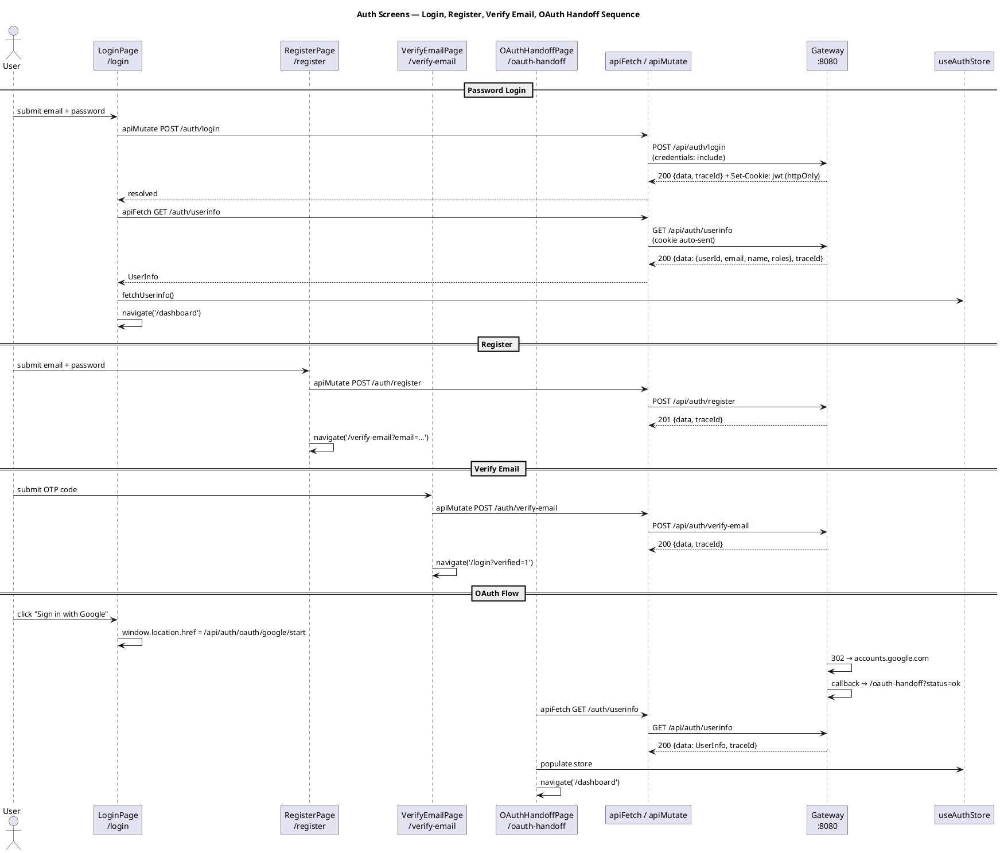
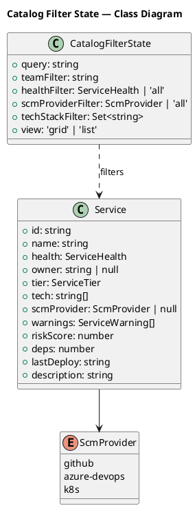

# Plan: Tasks 1.41–1.44 — Auth screens, Catalog flows, API client hardening, and Phase 1 UI audit

## Feature Summary

Tasks 1.41–1.44 deliver the complete frontend auth flow (Login, Register, Verify email, OAuth handoff) wired to the gateway `/auth/*` API via httpOnly cookies, a hardened Catalog list with the missing SCM provider and tech stack filters plus orphan visual treatment, a corrected and fully centralized API client that surfaces `traceId` in all error states, and a final `/impeccable audit` pass across all Phase 1 screens before the phase gate. All work is in `frontend/`; no backend migrations, Kafka topics, or new env vars are introduced. The user-visible outcome is a Phase 1 frontend that is deployable, accessible, and correctly wired to the gateway auth surface.

---

## GitHub Workflow

### Issues

**Issue 1 — Tasks 1.41 + 1.43 (tightly coupled)**
- Title: `US1.41/1.43 — Auth screens wired to gateway + API client hardening`
- Acceptance criteria:
  - Login screen calls `POST /api/auth/login`; successful response redirects to `/dashboard`; httpOnly cookie is set by the gateway — no token in localStorage
  - Login shows inline error with `traceId` on 4xx
  - Register screen calls `POST /api/auth/register`; redirects user to verify-email
  - Verify email screen accepts OTP and calls `POST /api/auth/verify-email`; on success redirects to `/login?verified=1`
  - OAuth handoff screen covers `/oauth-handoff` (post-gateway callback landing page): shows spinner then redirects to `/dashboard` or `/login?error=…`
  - Google OAuth button and GitHub OAuth button navigate to gateway start URLs
  - `apiFetch` bug fixed: `useTenantStore.getState().tenantId` → `currentTenantId`
  - All route error states render `<Alert>` with `traceId` from `ApiError`
  - `useAuthStore` holds user identity (id, email, name, roles) fetched from `GET /api/auth/userinfo` on app mount; no token fields stored
- Milestone: `Phase 1 — Gateway MVP auth + Registry`

**Issue 2 — Task 1.42**
- Title: `US1.42 — Catalog list and detail flows with full filter set and orphan highlighting`
- Acceptance criteria:
  - Catalog list filters: team (existing), health (existing), search (existing), **SCM provider** (new), **tech stack** (new multi-select)
  - Services with `warnings.includes('orphan')` or `owner === null` receive a distinct amber left-border ring and an "Orphan" chip in the card/row
  - `Service` type and `MOCK_SERVICES` extended with `scmProvider` field
  - Detail page shows SCM provider badge in the header meta row
- Milestone: `Phase 1 — Gateway MVP auth + Registry`

**Issue 3 — Task 1.44**
- Title: `US1.44 — /impeccable audit pass on all Phase 1 screens`
- Acceptance criteria:
  - `/impeccable audit` run against: login, register, verify-email, oauth-handoff, catalog, catalog/$serviceId, dashboard, settings
  - All blocking findings (WCAG 2.1 AA contrast, missing ARIA labels, keyboard traps, viewport overflow) resolved in the same PR
  - Non-blocking findings documented in a follow-up issue or inline TODO comment
- Milestone: `Phase 1 — Gateway MVP auth + Registry`

### Branch

```
feat/1.41-auth-screens-catalog-api-audit
```

All four tasks share no backend path and have overlapping frontend file scope — grouping into one branch and one PR is the right call.

### PR

- Title: `feat: auth screens, catalog filters, API client hardening, and Phase 1 audit (1.41–1.44)`
- Body must include:
  - `Closes #<issue-1>`
  - `Closes #<issue-2>`
  - `Closes #<issue-3>`

  **Acceptance Criteria**

  *Task 1.43 (API client)*
  - AC-1: `apiFetch` sends `X-Tenant-Id: <currentTenantId>` from the Zustand store (not a stale undefined).
  - AC-2: `apiMutate('POST', ...)` sets `Content-Type: application/json` and serializes the body with `JSON.stringify`.
  - AC-3: All route error states render `<Alert variant="destructive">` containing the `traceId` string when the error is an `ApiError`.
  - AC-4: No JWT or session token appears in `localStorage` or `sessionStorage` at any point.

  *Task 1.41 (Auth screens)*
  - AC-5: Submitting valid credentials on `/login` redirects to `/dashboard`; the gateway sets an httpOnly cookie.
  - AC-6: Submitting invalid credentials on `/login` shows an inline error with `traceId`.
  - AC-7: Submitting the register form calls `POST /api/auth/register` and redirects to `/verify-email`.
  - AC-8: Submitting the OTP on `/verify-email` calls `POST /api/auth/verify-email` and redirects to `/login?verified=1`.
  - AC-9: Clicking "Sign in with Google" navigates to the gateway OAuth start URL (hard redirect, not SPA navigation).
  - AC-10: Arriving at `/oauth-handoff?status=ok` fetches `/api/auth/userinfo` and redirects to `/dashboard`.
  - AC-11: Arriving at `/oauth-handoff?status=error&code=OAUTH_STATE_MISMATCH` redirects to `/login?error=OAUTH_STATE_MISMATCH`.

  *Task 1.42 (Catalog)*
  - AC-12: Catalog list shows an SCM provider filter dropdown; selecting "GitHub" hides non-GitHub services.
  - AC-13: Tech stack multi-select filter shows a popover; selecting "Java" shows only Java services.
  - AC-14: Services with `owner === null` or `warnings.includes('orphan')` render with amber ring and "Orphan" chip in both grid and list views.
  - AC-15: Service detail page shows the SCM provider badge in the header meta row.

  *Task 1.44 (Audit)*
  - AC-16: All Phase 1 screens pass WCAG 2.1 AA color contrast (ratio ≥ 4.5:1 for normal text).
  - AC-17: All form inputs have associated `<label>` elements.
  - AC-18: Error messages use `role="alert"`.
  - AC-19: No keyboard trap exists on any screen.

  **E2E Manual Test**

  *Prerequisites*: All of the following Docker Compose services must be running and healthy:
  - `docker compose up gateway registry postgres redis kafka` (from `infra/docker-compose/`)
  - Verify gateway: `curl -s http://localhost:8080/actuator/health/ready | jq .status` → `"UP"`
  - Frontend dev server: `cd frontend && pnpm dev` → running at `http://localhost:3000`

  *Steps*:
  1. **Register a new account** — navigate to `http://localhost:3000/register`; fill in email `test@example.com` and a password; submit. Expected: redirect to `/verify-email?email=test%40example.com`; gateway logs show `POST /auth/register → 201`.
  2. **Verify email** — check the Resend test-mode log or gateway stdout for the OTP code; enter it in the verify-email form; submit. Expected: redirect to `/login?verified=1`; banner "Email verified" appears.
  3. **Login** — at `/login` enter the same email + password; submit. Expected: redirect to `/dashboard`; browser DevTools → Application → Cookies shows an httpOnly cookie (no JWT in localStorage).
  4. **Login with bad credentials** — at `/login` enter wrong password; submit. Expected: `<Alert>` with error message and a 32-char hex `traceId` visible.
  5. **OAuth start** — click "Sign in with Google"; Expected: browser navigates to `accounts.google.com/...` (not an SPA route change); gateway logs show the OAuth redirect.
  6. **Catalog filters** — navigate to `/catalog`; use the SCM provider dropdown to select "GitHub"; verify only GitHub-sourced services are shown. Select a tech stack chip ("Java") in the multi-select popover; verify filtering narrows results correctly.
  7. **Orphan highlighting** — ensure at least one MOCK_SERVICES entry has `owner: null`; confirm it renders with amber ring and "Orphan" chip.
  8. **Catalog detail** — click a service card; Expected: detail page shows SCM provider badge in the meta row.
  9. **Inspect localStorage** — open DevTools Console; run `Object.keys(localStorage)`; Expected: no key contains "token", "jwt", "auth", or "bearer".

  *Passing signal*: User can register, verify, and log in via password; httpOnly cookie is set; catalog filters (all five) work; orphan services are visually distinct; no auth token appears in browser storage.

  *Failure triage*:
  | Symptom | What to check |
  |---------|---------------|
  | `POST /auth/login` returns 503 | Check gateway container: `docker compose logs gateway \| tail -40` |
  | OTP never arrives | Check `RESEND_TEST_MODE=true` in gateway env; look for OTP in `docker compose logs gateway \| grep OTP` |
  | Cookie not set after login | Ensure `credentials: 'include'` in `apiFetch`; check gateway CORS `allow-credentials: true` config |
  | `X-Tenant-Id` header missing | Verify `useTenantStore.getState().currentTenantId` returns a non-null value before the request |
  | Catalog SCM filter has no options | Confirm `scmProvider` field was added to `MOCK_SERVICES` in `mock-data.ts` |
  | TypeScript errors on `useAuthStore` | Run `pnpm typecheck` from `frontend/`; check store field types match `useAuthStore` interface |

- Milestone: `Phase 1 — Gateway MVP auth + Registry`
- CI must be green (pnpm install, ESLint, TypeScript typecheck, vitest) before requesting review.

### Commit and push approval

Per CLAUDE.md: never commit or push without Allan's explicit approval. Show diff summary + draft message and ask "OK to commit?" before every commit.

---

## Dependencies & Sequencing

- **Requires**: Gateway `POST /auth/login`, `POST /auth/register`, `POST /auth/verify-email`, `GET /auth/userinfo`, OAuth start URLs, and the httpOnly cookie flow from tasks 1.17–1.21 are implemented and reachable at `http://localhost:8080`.
- **Requires**: `shared:common` `ApiError` envelope model is final (done in 0.8).
- **Order within plan**: 1.43 first (fix the API client bug before wiring auth calls), then 1.41 (new auth routes use the fixed client), then 1.42 (catalog enhancements can proceed in parallel with 1.41 but must use the corrected `apiFetch`), then 1.44 last (audit runs on everything once it is built).
- **Unblocks**: Phase 1 Gate item "Phase 1 screens have passed `/impeccable audit`"; BIP tasks 1.47, 1.48, 1.52, 1.53.

---

## Per-Task Implementation

### Task 1.43 — Centralize and harden the API client

**What to build**: Fix the `tenantId` field-name bug in `apiFetch`, add a `Content-Type: application/json` header for mutation methods, and document the `ApiError` surface so all call-sites know the contract. Also add a thin `apiMutate` helper (wraps `apiFetch` with method + JSON body) to standardize mutation ergonomics before writing the auth forms. Ensure every route that renders an error uses `instanceof ApiError` to extract `traceId`.

**Files to create or modify**:
| File | Action | Notes |
|------|--------|-------|
| `frontend/src/lib/api.ts` | Modify | Fix `tenantId` → `currentTenantId`; add `Content-Type` for POST/PUT/PATCH; export `apiMutate` helper |
| `frontend/src/routes/catalog.tsx` | Modify | Replace any raw error string with `<Alert>` + `traceId` |
| `frontend/src/routes/catalog.$serviceId.tsx` | Modify | Same error state treatment |

**Key signatures**:
```ts
// frontend/src/lib/api.ts

export class ApiError extends Error {
  constructor(
    public code: string,
    message: string,
    public traceId: string,
  ) { super(message); this.name = 'ApiError' }
}

export async function apiFetch<T>(path: string, init?: RequestInit): Promise<T>

export async function apiMutate<T>(
  path: string,
  method: 'POST' | 'PUT' | 'PATCH' | 'DELETE',
  body?: unknown,
): Promise<T>
```

**Critical constraints**:
- `credentials: 'include'` MUST remain on every `fetch` call — this is how the httpOnly cookie is sent.
- `useTenantStore.getState().currentTenantId` — the Zustand field is `currentTenantId`, not `tenantId`.
- NEVER put a JWT or session token in the `Authorization` header from the frontend — the gateway reads the httpOnly cookie automatically.

---

### Task 1.41 — Auth screens

**What to build**: Four new/updated route files covering the full auth journey:

1. **Login** (`/login`) — email + password form, Google OAuth button, GitHub OAuth button, "Forgot password?" link. On submit calls `apiMutate<void>('POST', '/auth/login', { email, password })`. On success, fetches userinfo and redirects to `/dashboard`. On error, renders `<Alert variant="destructive">` with `error.message` and `(trace: {error.traceId})`.

2. **Register** (`/register`) — email + password + confirm-password form. On submit calls `POST /auth/register`. On success redirects to `/verify-email?email=<encoded>` with a toast. On error, renders `<Alert>` with `traceId`.

3. **Verify email** (`/verify-email`) — 6-digit OTP input. Reads `?email` from search params. On submit calls `POST /auth/verify-email`. On success redirects to `/login?verified=1`. On error, renders `<Alert>` with `traceId`.

4. **OAuth handoff** (`/oauth-handoff`) — landing page for the post-gateway OAuth redirect. Gateway redirects here with `?status=ok` or `?status=error&code=<code>`. On `ok` immediately calls `GET /auth/userinfo`, populates `useAuthStore`, then navigates to `/dashboard`. On `error` navigates to `/login?error=<code>`.

5. **Auth store** (`useAuthStore`) — Zustand store for user identity state. Holds `{ userId, email, name, roles, isAuthenticated }` — no tokens. Populated by a `fetchUserinfo()` action that calls `GET /api/auth/userinfo`. Stored in memory only (no `persist` middleware — auth state must come from the server, not localStorage).

**Files to create or modify**:
| File | Action | Notes |
|------|--------|-------|
| `frontend/src/routes/login.tsx` | Modify | Wire to `apiMutate`; add OAuth buttons; add traceId in error |
| `frontend/src/routes/register.tsx` | New | Registration form |
| `frontend/src/routes/verify-email.tsx` | New | OTP input, reads `?email` search param |
| `frontend/src/routes/oauth-handoff.tsx` | New | Post-OAuth landing, navigates on `?status` |
| `frontend/src/stores/useAuthStore.ts` | New | User identity store, no persist |
| `frontend/src/routes/__root.tsx` | Modify | Call `useAuthStore.fetchUserinfo()` on mount (once, on hydration) |
| `frontend/src/routeTree.gen.ts` | Modify | Regenerated by TanStack Router codegen after adding new routes |

**Key signatures**:
```ts
// frontend/src/stores/useAuthStore.ts
interface AuthState {
  userId: string | null
  email: string | null
  name: string | null
  roles: string[]
  isAuthenticated: boolean
  fetchUserinfo: () => Promise<void>
  clearAuth: () => void
}
// No persist — auth state is server-authoritative (httpOnly cookie)
export const useAuthStore = create<AuthState>()(...)
```

**Critical constraints**:
- OAuth start URLs are gateway-issued absolute redirects: `GET /api/auth/oauth/google/start` and `GET /api/auth/oauth/github/start`. Use `window.location.href = ...` — not `navigate()` — because the gateway returns a `302` to the OAuth provider.
- `httpOnly` cookies cannot be read from JavaScript. `isAuthenticated` is derived from whether `fetchUserinfo()` succeeds, not from inspecting a cookie.
- Register and login forms must use `autocomplete="email"` and `autocomplete="current-password"` / `autocomplete="new-password"`.
- NEVER store `access_token`, `refresh_token`, or any JWT in `localStorage`, `sessionStorage`, or non-httpOnly cookies.

---

### Task 1.42 — Catalog list and detail enhancements

**What to build**: Add the two missing filter dimensions (SCM provider, tech stack) and implement orphan highlighting on the Catalog list. Extend the `Service` type and `MOCK_SERVICES` with a `scmProvider` field. Update the detail view to show the SCM provider in the header meta row. Tech stack filter is a multi-select popover using shadcn `Popover` + `Command` (cmdk). SCM provider filter is a simple `<select>`. Orphan treatment: amber dashed border + "Orphan" warning chip at the top of the card and a left-border accent on list rows.

**Files to create or modify**:
| File | Action | Notes |
|------|--------|-------|
| `frontend/src/lib/mock-data.ts` | Modify | Add `scmProvider: 'github' \| 'azure-devops' \| 'k8s' \| null` to `Service` type + all MOCK_SERVICES entries |
| `frontend/src/routes/catalog.tsx` | Modify | Add SCM provider filter, tech stack multi-select, orphan highlighting |
| `frontend/src/routes/catalog.$serviceId.tsx` | Modify | Add `scmProvider` to header meta row |
| `frontend/src/components/ui/popover.tsx` | New | shadcn popover component (run `npx shadcn@latest add popover command`) |
| `frontend/src/components/ui/command.tsx` | New | shadcn command component (same) |

**Critical constraints**:
- Tech stack filter uses `Set<string>` — clearing it (empty set) means "all stacks".
- Orphan is defined as `service.owner === null` OR `service.warnings.includes('orphan')`.
- Orphan visual: amber `ring-1 ring-amber-400/60` on card, amber left-border accent on list row. Do not hide orphaned services by default — they must be visible so engineers notice them.
- Use shadcn/ui `Popover` + `Command` for tech stack multi-select — NEVER a raw `<select multiple>`.

---

### Task 1.44 — /impeccable audit on Phase 1 screens

**What to build**: Run `/impeccable audit` against every Phase 1 screen after 1.41–1.43 are implemented. Screens in scope: `/login`, `/register`, `/verify-email`, `/oauth-handoff`, `/catalog`, `/catalog/$serviceId`, `/dashboard`, `/settings`. Address all blocking findings (WCAG 2.1 AA color contrast, missing ARIA labels, missing `<label>` associations, keyboard traps, viewport overflow on mobile) in this same PR. Document non-blocking findings as inline `// TODO: audit-1.44` comments or a follow-up issue.

**Files to create or modify**: varies — depends on audit output. Likely touch all auth route files and catalog files for contrast and ARIA additions.

**Critical constraints**:
- Every `<Input>` must have an associated `<label>` (htmlFor / id pair) — not just placeholder text.
- Error messages must have `role="alert"` so screen readers announce them.
- OAuth buttons must have `aria-label` describing the provider.
- Focus order must be logical on all forms.

---

## Schema Changes

N/A — no new database tables. All changes are frontend only.

---

## Env Vars Delta

No new env vars. The existing `VITE_API_BASE_URL` (set in `frontend/.env.local`) covers all gateway calls.

The OAuth start URL paths (`/api/auth/oauth/google/start`, `/api/auth/oauth/github/start`) are relative to `VITE_API_BASE_URL` — no separate `VITE_GOOGLE_CLIENT_ID` or similar is needed because the gateway owns the OAuth flow entirely.

---

## Test Strategy

**Unit tests** (no containers):
- `frontend/src/lib/api.test.ts` — mock `fetch`, assert: (a) `currentTenantId` is sent in `X-Tenant-Id`; (b) `ApiError` is thrown with correct `code`, `message`, `traceId` on non-2xx; (c) `body.data` is returned on 2xx; (d) `apiMutate` sets `Content-Type: application/json`.
- `frontend/src/stores/useAuthStore.test.ts` — assert `fetchUserinfo` populates state; `clearAuth` resets to unauthenticated.
- `frontend/src/routes/login.test.tsx` — RTL: submit with empty fields shows validation error; submit with mocked `apiMutate` success calls `navigate({ to: '/dashboard' })`; submit with mocked `apiMutate` rejection renders `traceId` in alert.
- `frontend/src/routes/verify-email.test.tsx` — RTL: OTP submit calls correct endpoint; error state renders `traceId`.

**Integration tests** (Testcontainers): N/A — frontend-only tasks.

**What NOT to test here**:
- Full auth flows with a real gateway — covered by task 1.26 backend integration tests.
- E2E Playwright flows — deferred to task 5.20.

---

## New Error Codes

N/A — no new error codes required. The gateway auth errors (`INVALID_CREDENTIALS`, `EMAIL_NOT_VERIFIED`, `OAUTH_STATE_MISMATCH`, etc.) are already defined or will be surfaced by the gateway's `@RestControllerAdvice`. The frontend reads `body.error.code` generically via `ApiError`.

---

## Postman Collection

**Service**: gateway
**Collection file**: `postman/gateway.postman_collection.json`
**Action**: Extend existing — these tasks are frontend-only but the auth endpoints being tested are gateway REST endpoints already partially covered. Add a new folder for Phase 1 UI verification ACs.

### New folder: `task-1.41-auth-screens`

```json
{
  "name": "task-1.41-auth-screens",
  "item": [
    {
      "name": "AC-5 — POST /auth/login valid credentials",
      "request": {
        "method": "POST",
        "url": "{{gateway-url}}/api/auth/login",
        "header": [{ "key": "Content-Type", "value": "application/json" }],
        "body": {
          "mode": "raw",
          "raw": "{\"email\":\"{{testEmail}}\",\"password\":\"{{testPassword}}\"}"
        }
      },
      "event": [{
        "listen": "test",
        "script": {
          "exec": [
            "pm.test('Status 200', () => pm.response.to.have.status(200));",
            "const b = pm.response.json();",
            "pm.test('envelope present', () => { pm.expect(b).to.have.property('data'); pm.expect(b).to.have.property('traceId'); });",
            "pm.test('traceId is 32 hex chars', () => pm.expect(b.traceId).to.match(/^[0-9a-f]{32}$/));",
            "pm.test('X-Trace-Id header matches', () => pm.expect(pm.response.headers.get('x-trace-id')).to.eql(b.traceId));"
          ]
        }
      }]
    },
    {
      "name": "AC-6 — POST /auth/login invalid credentials → traceId in error",
      "request": {
        "method": "POST",
        "url": "{{gateway-url}}/api/auth/login",
        "header": [{ "key": "Content-Type", "value": "application/json" }],
        "body": { "mode": "raw", "raw": "{\"email\":\"{{testEmail}}\",\"password\":\"wrong-password\"}" }
      },
      "event": [{
        "listen": "test",
        "script": {
          "exec": [
            "pm.test('Status 401', () => pm.response.to.have.status(401));",
            "const b = pm.response.json();",
            "pm.test('error envelope', () => { pm.expect(b).to.have.property('error'); pm.expect(b).to.have.property('traceId'); });",
            "pm.test('traceId is 32 hex chars', () => pm.expect(b.traceId).to.match(/^[0-9a-f]{32}$/));"
          ]
        }
      }]
    },
    {
      "name": "AC-7 — POST /auth/register new user",
      "request": {
        "method": "POST",
        "url": "{{gateway-url}}/api/auth/register",
        "header": [{ "key": "Content-Type", "value": "application/json" }],
        "body": { "mode": "raw", "raw": "{\"email\":\"newuser-{{$randomInt}}@example.com\",\"password\":\"TestPass123!\"}" }
      },
      "event": [{
        "listen": "test",
        "script": {
          "exec": [
            "pm.test('Status 201', () => pm.response.to.have.status(201));",
            "const b = pm.response.json();",
            "pm.test('data + traceId present', () => { pm.expect(b.data).to.exist; pm.expect(b.traceId).to.match(/^[0-9a-f]{32}$/); });",
            "pm.test('X-Trace-Id header matches', () => pm.expect(pm.response.headers.get('x-trace-id')).to.eql(b.traceId));"
          ]
        }
      }]
    }
  ]
}
```

---

## Documentation

### PlantUML Diagrams

| File | Type | Trigger |
|------|------|---------|
| `docs/diagrams/frontend/auth-screens-sequence.puml` | Sequence | New multi-step auth flow (login, register, verify, OAuth) |
| `docs/diagrams/frontend/catalog-filter-class.puml` | Class | New filter state model |

#### `docs/diagrams/frontend/auth-screens-sequence.puml`



#### `docs/diagrams/frontend/catalog-filter-class.puml`



### ADR

N/A — the decision to use httpOnly cookies over localStorage for auth tokens is already captured in ADR-0010 (Gateway auth + JWT issuance). The `useAuthStore` non-persistence decision follows directly from that ADR.

### OpenAPI

N/A — no new backend endpoints. The gateway OpenAPI (`docs/api/gateway.openapi.yaml`) was updated in task 1.27.

---

## Rollback Plan

Revert the branch — no persistent state change. All changes are frontend source files. No Flyway migrations, no schema changes, no Kafka topics.

---

## Verification Script

After implementing all four tasks, before asking for commit approval:

1. `cd frontend && pnpm typecheck` — must exit 0, no type errors.
2. `cd frontend && pnpm lint` — must exit 0.
3. `cd frontend && pnpm test` — all unit tests pass.
4. `cd frontend && pnpm dev` — start dev server at `http://localhost:3000`.
5. Navigate to `/login` — confirm OAuth buttons and form are present, `aria-label` on password-toggle button is visible in DevTools.
6. Open browser DevTools → Application → Local Storage → `http://localhost:3000` — confirm no "token", "jwt", "auth" keys are present after navigating.
7. Navigate to `/catalog` — confirm five filter controls are present (search, team, health, SCM provider, tech stack).
8. Select "All Teams" and inspect a service with `owner === null` — confirm amber ring and "Orphan" chip are visible.
9. Navigate to `/catalog/svc-7` (Search Service, `owner: null`) — confirm SCM provider badge appears in the header meta row.
10. Run `/impeccable audit` — confirm no blocking findings remain.

---

## BIP

N/A — tasks 1.41–1.44 are frontend wiring and quality tasks. The relevant BIP items (1.47 envelope/trace thread, 1.48 auth rationale, 1.52 catalog screenshots) are separate tasks triggered after this PR merges.

---

## Files Created / Modified

| File | Action | Task |
|------|--------|------|
| `frontend/src/lib/api.ts` | Modify | 1.43 |
| `frontend/src/stores/useAuthStore.ts` | New | 1.41 |
| `frontend/src/routes/login.tsx` | Modify | 1.41, 1.44 |
| `frontend/src/routes/register.tsx` | New | 1.41 |
| `frontend/src/routes/verify-email.tsx` | New | 1.41 |
| `frontend/src/routes/oauth-handoff.tsx` | New | 1.41 |
| `frontend/src/routes/__root.tsx` | Modify | 1.41 (mount-time userinfo fetch) |
| `frontend/src/routeTree.gen.ts` | Modify | 1.41 (regenerated by router codegen) |
| `frontend/src/lib/mock-data.ts` | Modify | 1.42 |
| `frontend/src/routes/catalog.tsx` | Modify | 1.42, 1.43, 1.44 |
| `frontend/src/routes/catalog.$serviceId.tsx` | Modify | 1.42, 1.44 |
| `frontend/src/components/ui/popover.tsx` | New | 1.42 (shadcn add) |
| `frontend/src/components/ui/command.tsx` | New | 1.42 (shadcn add) |
| `docs/diagrams/frontend/auth-screens-sequence.puml` | New | 1.41 |
| `docs/diagrams/frontend/catalog-filter-class.puml` | New | 1.42 |
| `docs/execution-checklist.md` | Mark done | 1.41, 1.42, 1.43, 1.44 |

---

## Checklist Items to Mark Done

After all work is implemented and verified:

- Change `[ ]` to `[x]` in `docs/execution-checklist.md` for tasks: **1.41, 1.42, 1.43, 1.44**
