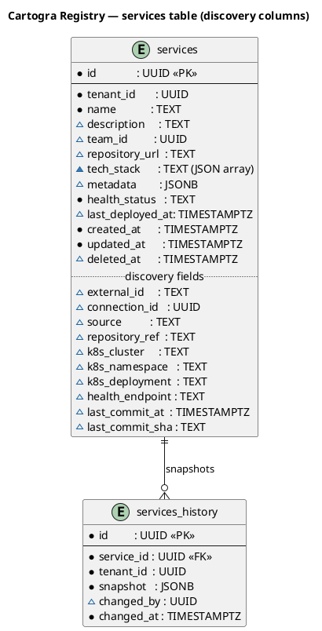
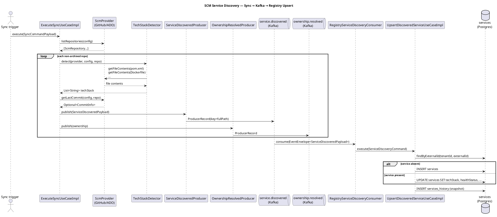
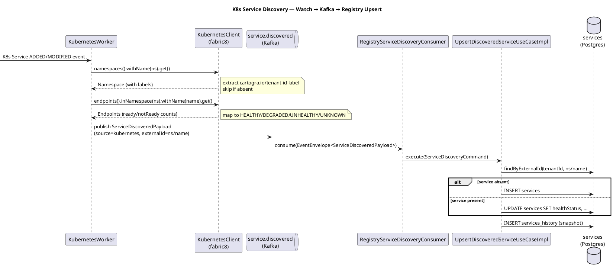

# Plan: Task 1.55 — Service Auto-Discovery from SCM and Kubernetes

## Feature Summary

Task 1.55 adds automatic service registration from two discovery sources: SCM sync workers (GitHub,
Azure DevOps) and the Kubernetes watcher. The ingestion service publishes a new
`cartogra.ingestion.service.discovered` Kafka event for every non-archived SCM repository and every
K8s Service in a tenant-labeled namespace. The registry service introduces a new consumer that upserts
service rows keyed on `(tenantId, externalId)`, writes a history snapshot, and then defers team
assignment to the existing `OwnershipResolvedConsumer`. Together these changes remove the requirement
for operators to manually register services — Cartogra discovers them automatically on every sync cycle
and every K8s watch event.

---

## GitHub Workflow

### Issues

Create one new GitHub issue:

**Title**: `US1.55 — Service auto-discovery from SCM + Kubernetes`

**Acceptance criteria**:
- AC-1: `cartogra.ingestion.service.discovered` Kafka topic carries the full discovery envelope for every non-archived SCM repository during sync.
- AC-2: Tech-stack detection (`pom.xml`→java, `build.gradle*`→java, `package.json`→javascript, `go.mod`→go, `Cargo.toml`→rust, `requirements.txt`→python, Dockerfile FROM→language/framework) runs for each non-archived repo via `provider.getFileContents`.
- AC-3: `lastCommitAt` and `lastCommitSha` are populated from the SCM API per-repo.
- AC-4: `KubernetesWorker` publishes `service.discovered` for Service ADDED/MODIFIED events in namespaces carrying the `cartogra.io/tenant-id` label; `healthStatus` is computed from Endpoints ready/not-ready counts.
- AC-5: `RegistryServiceDiscoveryConsumer` upserts services keyed on `(tenantId, externalId)`: creates new rows when absent, updates `techStack`, `healthStatus`, commit metadata when present.
- AC-6: A history snapshot is written to `services_history` on every upsert.
- AC-7: The existing `OwnershipResolvedConsumer` continues to assign team ownership after the service row exists.
- AC-8: `ServiceDiscoveryFlowIT` green (WireMock GitHub → Kafka → registry upsert → `techStack=['java','spring-boot']`).
- AC-9: `KubernetesWorkerIT` green (kubernetes-server-mock → Kafka → registry upsert → `healthStatus=HEALTHY`).

**Milestone**: `Phase 1 — Registry, Ingestion & Auth`

### Branch

```
feat/1.55-service-autodiscovery
```

Single branch — both services share the discovery contract (Kafka envelope record) which must land together.

### PR

**Title**: `feat: service auto-discovery from SCM + Kubernetes (1.55)`

**PR body**:

```
## Summary

- New Kafka topic `cartogra.ingestion.service.discovered` carrying full discovery metadata.
- `ExecuteSyncUseCaseImpl` extended: tech-stack detection, last-commit fetch, discovery event publish.
- `KubernetesWorker` extended: namespace label-based tenant resolution, Endpoints health mapping, discovery event publish.
- Registry `RegistryServiceDiscoveryConsumer` upserts services by `(tenantId, externalId)`.
- Registry V011 migration adds 10 discovery columns to `services` table.

Closes #<issue>

## Acceptance Criteria

- AC-1: `service.discovered` published for every non-archived SCM repo during sync.
- AC-2: Tech-stack detection from file presence + Dockerfile FROM line.
- AC-3: `lastCommitAt` and `lastCommitSha` populated from SCM API.
- AC-4: K8s watch publishes `service.discovered` for ADDED/MODIFIED in labeled namespaces; `healthStatus` from Endpoints.
- AC-5: Registry consumer upserts service rows on `(tenantId, externalId)`.
- AC-6: `services_history` snapshot written on every upsert.
- AC-7: `OwnershipResolvedConsumer` still assigns team after service row exists.
- AC-8: `ServiceDiscoveryFlowIT` green.
- AC-9: `KubernetesWorkerIT` green.

## E2E Test Strategy

### Prerequisites
- `docker compose up` with Postgres, Kafka, Zookeeper running.
- Ingestion service started, registry service started.
- A GitHub SCM connection registered for a test tenant.
- A K8s cluster kubeconfig accessible from the ingestion pod/process (or `ingestion.workers.k8s.enabled=false` for SCM-only test).

### Steps — SCM discovery path
1. Trigger a sync via `POST /ingestion/sync/connections/{connectionId}/trigger`.
2. In WireMock (or real GitHub): ensure the org has at least one non-archived repo containing `pom.xml` with a `spring-boot-starter` reference.
3. Wait for `cartogra.ingestion.service.discovered` Kafka topic to receive a message.
4. Verify: Kafka message `payload.techStack` contains `java` and `spring-boot`.
5. Wait for `RegistryServiceDiscoveryConsumer` to process (within 5 s).
6. Call `GET /registry/services` with the tenant header; verify the discovered service appears with `techStack` and `lastCommitSha` set.
7. Call `GET /registry/services/{id}/history`; verify at least one history snapshot exists.
8. Wait for `OwnershipResolvedConsumer` to process (if CODEOWNERS file present); verify `teamId` is set.

### Steps — K8s discovery path
1. Ensure `ingestion.workers.k8s.enabled=true` and `ingestion.workers.k8s.connection-id` is configured.
2. Create a K8s Service in a namespace labeled `cartogra.io/tenant-id={tenantId}`.
3. Create matching Endpoints resource with all addresses in the `addresses` list (ready).
4. Wait for `cartogra.ingestion.service.discovered` Kafka message with `source=kubernetes`.
5. Verify: `payload.healthStatus = HEALTHY`.
6. Call `GET /registry/services`; verify the K8s service row appears.

### Passing signal
- HTTP 200 from `GET /registry/services` returns the discovered service.
- `techStack` matches expected detection.
- `services_history` has a snapshot row.

### Failure triage
- No Kafka message: check ingestion logs for `ScmProviderException`; verify WireMock stubs are up.
- Service not in registry: check registry logs for `RegistryServiceDiscoveryConsumer`; verify `external_id` unique constraint.
- Wrong techStack: check `TechStackDetector` logs; verify WireMock file-content stubs are returning correct bodies.
- K8s events not firing: check `KubernetesWorker` startup logs; verify namespace label is set.
```

**Milestone**: `Phase 1 — Registry, Ingestion & Auth`
**CI gate**: build green + all ITs pass + diagrams render + OpenAPI validates.

### Commit and push approval

Per CLAUDE.md: never commit or push without Allan's explicit approval. Show diff summary + draft message and ask "OK to commit?" before every commit.

---

## Dependencies & Sequencing

- **Requires**: Tasks 1.28–1.37 merged (`ScmProvider` SPI, `KubernetesWorker` baseline, `ExecuteSyncUseCaseImpl` with ownership flow). Confirmed merged.
- **Requires**: Registry V010 migration merged (password reset for users). Confirmed; next registry migration is V011.
- **Order within plan**:
  1. Extend `ScmRepository` record + both provider implementations (breaking change; must land before step 2).
  2. Add `CommitInfo` record + `getLastCommit()` to `ScmProvider` interface + both implementations.
  3. Add `ServiceDiscoveredPayload` + `TechStackDetector` + `ServiceDiscoveredProducer` in ingestion.
  4. Update `ExecuteSyncUseCaseImpl` to use steps 1–3.
  5. Update `KubernetesWorker` + `KubernetesWorkerConfig`.
  6. Registry V011 migration.
  7. Extend `Service` domain record + `JdbcServiceRepository` + `ServiceRepository` interface.
  8. Add `RegistryServiceDiscoveryConsumer` + `UpsertDiscoveredServiceUseCase` + impl.
  9. ITs.
  10. Docs.
- **Unblocks**: 1.56 (topology blast-radius uses discovered services); 1.58 (K8s health dashboard).

---

## Per-Task Implementation

### Task 1.55 — Service auto-discovery from SCM + Kubernetes

**What to build**: A full discovery pipeline: ingestion detects tech stack and health per-service and publishes `cartogra.ingestion.service.discovered`; the registry consumes it and upserts service rows with all discovery metadata, then hands off to the existing ownership flow.

---

#### 1.55-A — Extend `ScmRepository` and `ScmProvider` SPI

**Files to create or modify**:

| File | Action | Notes |
|------|--------|-------|
| `services/ingestion/src/main/java/io/cartogra/ingestion/application/port/out/ScmRepository.java` | Modify | Add `description`, `repositoryUrl` nullable fields |
| `services/ingestion/src/main/java/io/cartogra/ingestion/application/port/out/CommitInfo.java` | New | Simple record: `Instant committedAt, String sha` |
| `services/ingestion/src/main/java/io/cartogra/ingestion/application/port/out/ScmProvider.java` | Modify | Add `getLastCommit(config, repo)` default method |
| `services/ingestion/src/main/java/io/cartogra/ingestion/infrastructure/scm/github/GitHubProvider.java` | Modify | Map `html_url`+`description` from listing; implement `getLastCommit` |
| `services/ingestion/src/main/java/io/cartogra/ingestion/infrastructure/scm/azuredevops/AzureDevOpsProvider.java` | Modify | Map `remoteUrl`+`description`; implement `getLastCommit` |

**Key signatures**:

```java
// application/port/out/CommitInfo.java
public record CommitInfo(Instant committedAt, String sha) {}

// application/port/out/ScmRepository.java
public record ScmRepository(
    String id,
    String name,
    String fullPath,
    String defaultBranch,
    boolean archived,
    @Nullable String description,
    @Nullable String repositoryUrl
) {}

// application/port/out/ScmProvider.java  (add method)
Optional<CommitInfo> getLastCommit(ScmConnectionConfig config, ScmRepository repository);
```

**Critical constraints**:
- `ScmRepository` fields `description` and `repositoryUrl` are nullable (`@org.jspecify.annotations.Nullable`); never return `null` from `getLastCommit` — use `Optional.empty()` when the SCM call fails or the repo has no commits.
- GitHub `listRepositories` response already contains `html_url` (use as `repositoryUrl`), `description`, and `pushed_at` (available for reference but SHA requires separate call).
- GitHub `getLastCommit`: call `GET /repos/{owner}/{repo}/commits?per_page=1`, take `sha` and `commit.committer.date`.

---

#### 1.55-B — `TechStackDetector` and `ServiceDiscoveredPayload`

**Files to create**:

| File | Action | Notes |
|------|--------|-------|
| `services/ingestion/src/main/java/io/cartogra/ingestion/application/port/out/ServiceDiscoveredPayload.java` | New | Full envelope payload record |
| `services/ingestion/src/main/java/io/cartogra/ingestion/application/usecase/TechStackDetector.java` | New | Pure application-layer component; depends on `ScmProvider` |
| `services/ingestion/src/main/java/io/cartogra/ingestion/infrastructure/kafka/ServiceDiscoveredProducer.java` | New | Publishes to `cartogra.ingestion.service.discovered` |

**Key signatures**:

```java
// application/port/out/ServiceDiscoveredPayload.java
public record ServiceDiscoveredPayload(
    UUID tenantId,
    UUID connectionId,
    String source,              // "github" | "azure_devops" | "kubernetes"
    String externalId,          // SCM: fullPath; K8s: "{namespace}/{name}"
    String name,
    @Nullable String description,
    @Nullable String repositoryUrl,
    @Nullable String repositoryRef,   // default branch
    @Nullable String k8sCluster,
    @Nullable String k8sNamespace,
    @Nullable String k8sDeployment,
    List<String> techStack,
    String healthStatus,        // "HEALTHY" | "DEGRADED" | "UNHEALTHY" | "UNKNOWN"
    @Nullable String healthEndpoint,
    @Nullable Instant lastCommitAt,
    @Nullable String lastCommitSha
) {}

// application/usecase/TechStackDetector.java
@Component
public class TechStackDetector {
    // Detects tech stack from file presence + content signals.
    // Returns an ordered, deduplicated list of technology identifiers.
    public List<String> detect(ScmProvider provider, ScmConnectionConfig config, ScmRepository repo);
}
```

**Tech-stack detection rules** (encode in `TechStackDetector`):

| File / Signal | Adds to techStack |
|---------------|-------------------|
| `pom.xml` present | `java` |
| `pom.xml` content contains `spring-boot` | `spring-boot` |
| `build.gradle` or `build.gradle.kts` present | `java` |
| `build.gradle*` content contains `spring-boot` | `spring-boot` |
| `package.json` present | `javascript` |
| `go.mod` present | `go` |
| `Cargo.toml` present | `rust` |
| `requirements.txt` present | `python` |
| Dockerfile FROM `eclipse-temurin:*` | `java` (if not already present) |
| Dockerfile FROM `node:*` | `javascript` (if not already present) |
| Dockerfile FROM `python:*` | `python` (if not already present) |
| Dockerfile FROM `golang:*` | `go` (if not already present) |
| Dockerfile FROM `rust:*` | `rust` (if not already present) |

Call `provider.getFileContents(config, repo.fullPath(), fileName)` for each candidate file in sequence. Short-circuit: if `pom.xml` or `build.gradle*` already detected java, skip the Dockerfile java check. Total provider calls: at most 8 per repo.

**`ServiceDiscoveredProducer`** — topic: `cartogra.ingestion.service.discovered`. Use repo `fullPath` as Kafka message key (partition ordering per repo). Inject W3C `traceparent` header on every send (same pattern as `OwnershipResolvedProducer`).

**Critical constraints**:
- `healthStatus` for SCM-discovered services is always `"UNKNOWN"` (SCM does not expose health); K8s sets the real value.
- `techStack` stored in the payload as `List<String>` — the registry consumer serializes it to the DB column.
- `ServiceDiscoveredProducer` must inject W3C `traceparent` on every `ProducerRecord`.

---

#### 1.55-C — Update `ExecuteSyncUseCaseImpl`

**Files to modify**:

| File | Action | Notes |
|------|--------|-------|
| `services/ingestion/src/main/java/io/cartogra/ingestion/application/usecase/ExecuteSyncUseCaseImpl.java` | Modify | Inject `TechStackDetector`, `ServiceDiscoveredProducer`; extend repo loop |

The loop over non-archived repos becomes:

```java
for (ScmRepository repo : repositories) {
    if (!repo.archived()) {
        List<String> techStack = techStackDetector.detect(provider, connectionConfig, repo);
        Optional<CommitInfo> commit = provider.getLastCommit(connectionConfig, repo);

        var payload = new ServiceDiscoveredPayload(
            command.tenantId(),
            command.connectionId(),
            command.providerType(),     // "github" | "azure_devops"
            repo.fullPath(),            // externalId
            repo.name(),
            repo.description(),
            repo.repositoryUrl(),
            repo.defaultBranch(),
            null, null, null,           // k8s fields
            techStack,
            "UNKNOWN",
            null,
            commit.map(CommitInfo::committedAt).orElse(null),
            commit.map(CommitInfo::sha).orElse(null)
        );
        serviceDiscoveredProducer.publish(payload);

        OwnershipMap ownership = provider.resolveOwnership(connectionConfig, repo);
        ownershipProducer.publish(command.tenantId(), command.connectionId(), repo, ownership);
    }
}
```

Publish `service.discovered` **before** `ownership.resolved` so the registry consumer can create the service row before ownership arrives.

**Critical constraints**:
- `TechStackDetector` and `ServiceDiscoveredProducer` injected via constructor — never `@Autowired`.
- Kafka publish failures must NOT abort the sync loop — catch and log per-repo, continue to next repo.

---

#### 1.55-D — Extend `KubernetesWorker` + `KubernetesWorkerConfig`

**Files to modify**:

| File | Action | Notes |
|------|--------|-------|
| `services/ingestion/src/main/java/io/cartogra/ingestion/infrastructure/k8s/KubernetesWorker.java` | Modify | Namespace label resolution, Endpoints health, publish event |
| `services/ingestion/src/main/java/io/cartogra/ingestion/infrastructure/k8s/KubernetesWorkerConfig.java` | Modify | Pass `connectionId` UUID + `ServiceDiscoveredProducer` |
| `services/ingestion/src/main/resources/application.yml` | Modify | Add `ingestion.workers.k8s.connection-id` |

**`KubernetesWorker` changes**:

- Switch from static namespace list to watching ALL namespaces (`kubernetesClient.services().inAnyNamespace().watch(...)`).
- In `eventReceived` for `ADDED` or `MODIFIED` actions:
  1. Get namespace labels: `kubernetesClient.namespaces().withName(namespace).get().getMetadata().getLabels()`.
  2. Look for label key `cartogra.io/tenant-id`; skip if absent.
  3. Parse `tenantId = UUID.fromString(labels.get("cartogra.io/tenant-id"))`.
  4. Compute health via Endpoints: `kubernetesClient.endpoints().inNamespace(namespace).withName(name).get()`.
     - `null` or empty subsets → `UNKNOWN`.
     - Any subset has `addresses` (ready) AND `notReadyAddresses` → `DEGRADED`.
     - All subsets have `addresses` only (none `notReadyAddresses`) → `HEALTHY`.
     - All subsets have `notReadyAddresses` only → `UNHEALTHY`.
  5. Build `externalId = namespace + "/" + name`.
  6. Publish `ServiceDiscoveredPayload` with `source = "kubernetes"`, k8s fields set, `techStack = []`, `healthStatus` from step 4.

**`KubernetesWorkerConfig` changes**:

```java
@Bean
public KubernetesWorker kubernetesWorker(
        KubernetesClient kubernetesClient,
        ServiceDiscoveredProducer serviceDiscoveredProducer,
        @Value("${ingestion.workers.k8s.connection-id}") UUID connectionId) {
    return new KubernetesWorker(kubernetesClient, serviceDiscoveredProducer, connectionId);
}
```

Remove the `namespaces` parameter — dynamic resolution from label replaces static list.

**`application.yml` additions**:

```yaml
ingestion:
  workers:
    k8s:
      enabled: false
      connection-id: ${K8S_CONNECTION_ID:00000000-0000-0000-0000-000000000001}
```

**Critical constraints**:
- `ingestion.workers.k8s.connection-id` is a synthetic UUID representing the K8s cluster as a "connection" in Cartogra; configured per cluster.
- The K8s Endpoints lookup must not throw if the Endpoints resource doesn't exist — return `UNKNOWN` in that case.
- `k8sDeployment` is derived by: fetch `ReplicaSet` owning the pods behind the Endpoints → fetch the `Deployment` owning that `ReplicaSet`; use `Deployment` name. If not resolvable, leave null.

---

#### 1.55-E — Registry V011 migration + domain model

**Files to create or modify**:

| File | Action | Notes |
|------|--------|-------|
| `services/registry/src/main/resources/db/migration/V011__add_discovery_fields_to_services.sql` | New | 10 new columns + unique index |
| `services/registry/src/main/java/io/cartogra/registry/domain/Service.java` | Modify | Add 10 new fields |
| `services/registry/src/main/java/io/cartogra/registry/domain/event/ServiceDiscoveredPayload.java` | New | Mirror of ingestion payload; used by consumer |
| `services/registry/src/main/java/io/cartogra/registry/application/repository/ServiceRepository.java` | Modify | Add `findByExternalId`, `upsertDiscovered` |
| `services/registry/src/main/java/io/cartogra/registry/infrastructure/jdbc/JdbcServiceRepository.java` | Modify | Implement new methods; extend SQL + row mapper |
| `services/registry/src/main/java/io/cartogra/registry/api/mapper/ServiceMapper.java` | Modify | Map new fields to `ServiceResponse` |
| `services/registry/src/main/java/io/cartogra/registry/api/dto/ServiceResponse.java` | Modify | Add new fields |
| `services/registry/src/main/java/io/cartogra/registry/application/usecase/impl/CreateServiceUseCaseImpl.java` | Modify | Pass `null` for new fields when building `Service` record |
| `services/registry/src/main/java/io/cartogra/registry/application/usecase/impl/UpdateServiceUseCaseImpl.java` | Modify | Preserve new fields through updates |
| `services/registry/src/main/java/io/cartogra/registry/infrastructure/jdbc/JdbcServiceHistoryRepository.java` | Review | Confirm snapshot JSONB stores full Service; update if needed |

**Extended `Service` record**:

```java
public record Service(
    UUID id,
    UUID tenantId,
    String name,
    @Nullable String description,
    @Nullable UUID teamId,
    @Nullable String repositoryUrl,
    @Nullable String techStack,          // JSON array string: '["java","spring-boot"]'
    @Nullable String metadata,
    ServiceHealthStatus healthStatus,
    @Nullable Instant lastDeployedAt,
    Instant createdAt,
    Instant updatedAt,
    @Nullable Instant deletedAt,
    // --- discovery fields (all nullable; null for manually-created services) ---
    @Nullable String externalId,         // source-system stable key
    @Nullable UUID connectionId,
    @Nullable String source,             // "github" | "azure_devops" | "kubernetes"
    @Nullable String repositoryRef,      // default branch
    @Nullable String k8sCluster,
    @Nullable String k8sNamespace,
    @Nullable String k8sDeployment,
    @Nullable String healthEndpoint,
    @Nullable Instant lastCommitAt,
    @Nullable String lastCommitSha
) {
    public boolean isOrphaned() { return teamId == null; }
    public boolean isDeleted()  { return deletedAt != null; }
}
```

**New `ServiceRepository` methods**:

```java
Optional<Service> findByExternalId(UUID tenantId, String externalId);

Service upsertDiscovered(UUID tenantId, String externalId, Consumer<Service.Builder> mutator);
```

Because `Service` is a record, introduce a minimal `Service.Builder` or use a plain upsert method that accepts all discovery fields as parameters:

```java
Service upsertDiscovered(ServiceDiscoveryCommand command);
```

Where `ServiceDiscoveryCommand` is a new application-layer record carrying all the discovery payload fields.

**Critical constraints**:
- The upsert logic in `JdbcServiceRepository.upsertDiscovered` must NOT overwrite `team_id` — discovery never changes team assignment.
- `techStack` stored as JSON array: `objectMapper.writeValueAsString(payload.techStack())`.
- All new `service` columns added with no `NOT NULL` constraint — backward compatible; existing manually-created rows keep `NULL` in discovery columns.
- The UNIQUE partial index `(tenant_id, external_id) WHERE external_id IS NOT NULL AND deleted_at IS NULL` enables idempotent upsert via find-then-update-or-insert (do NOT use `ON CONFLICT` on this partial index — it has PostgreSQL restrictions with `ON CONFLICT` clauses).

---

#### 1.55-F — `RegistryServiceDiscoveryConsumer` + `UpsertDiscoveredServiceUseCase`

**Files to create**:

| File | Action | Notes |
|------|--------|-------|
| `services/registry/src/main/java/io/cartogra/registry/application/usecase/UpsertDiscoveredServiceUseCase.java` | New | Interface |
| `services/registry/src/main/java/io/cartogra/registry/application/usecase/impl/UpsertDiscoveredServiceUseCaseImpl.java` | New | Find-then-upsert + history snapshot |
| `services/registry/src/main/java/io/cartogra/registry/application/dto/ServiceDiscoveryCommand.java` | New | Command record carrying all discovery payload fields |
| `services/registry/src/main/java/io/cartogra/registry/infrastructure/kafka/RegistryServiceDiscoveryConsumer.java` | New | Listens on `cartogra.ingestion.service.discovered` |
| `services/registry/src/main/java/io/cartogra/registry/config/KafkaConfig.java` | Modify | Register new consumer group ID if using explicit factory |

**`UpsertDiscoveredServiceUseCaseImpl` logic**:

```
1. serviceRepository.findByExternalId(tenantId, externalId)
2a. If absent → create new Service row via upsertDiscovered (no teamId, healthStatus from payload)
2b. If present and not deleted → update: techStack, healthStatus, healthEndpoint,
                                          lastCommitAt, lastCommitSha, repositoryUrl,
                                          repositoryRef, k8sCluster, k8sNamespace, k8sDeployment,
                                          updated_at = now()
    preserve: team_id, name (do not overwrite with SCM name if already set)
3. Write services_history snapshot (SYSTEM_ACTOR)
```

**`RegistryServiceDiscoveryConsumer`**:

```java
@KafkaListener(
    topics = "cartogra.ingestion.service.discovered",
    groupId = "${spring.kafka.consumer.group-id:registry-discovery-consumer}"
)
public void consume(ConsumerRecord<String, String> record) { ... }
```

- Extract W3C `traceparent` from headers (same pattern as `OwnershipResolvedConsumer`).
- Deserialize `EventEnvelope<ServiceDiscoveredPayload>` via `ObjectMapper`.
- Call `upsertDiscoveredServiceUseCase.execute(command)`.
- Log warn + swallow on error (never throw from a `@KafkaListener` to avoid retry storms).

**Critical constraints**:
- Consumer group ID must differ from `registry-ownership-consumer` to avoid competing consumption of unrelated topics.
- `RegistryServiceDiscoveryConsumer` must extract traceparent before any business logic (restore OTel trace context).
- Never overwrite `team_id` in the upsert — ownership is managed exclusively by `OwnershipResolvedConsumer`.

---

#### 1.55-G — `build.gradle.kts` and ITs

**Files to modify**:

| File | Action | Notes |
|------|--------|-------|
| `services/ingestion/build.gradle.kts` | Modify | Add `testImplementation("io.fabric8:kubernetes-server-mock:7.0.0")` |

**`ServiceDiscoveryFlowIT`** (lives in `services/ingestion/src/test/`):

- Testcontainers Postgres + `@EmbeddedKafka`.
- WireMock stubs:
  - `GET /orgs/test-org/repos?page=1&...` → one non-archived repo JSON with `full_name=test-org/payments-service`, `html_url=https://github.com/test-org/payments-service`, `description=Payment processing`.
  - `GET /repos/test-org/payments-service/contents/pom.xml` → base64-encoded pom.xml containing `spring-boot-starter-web`.
  - `GET /repos/test-org/payments-service/contents/Dockerfile` → base64-encoded `FROM eclipse-temurin:25-jre-jammy`.
  - `GET /repos/test-org/payments-service/contents/build.gradle` → 404 (not present).
  - `GET /repos/test-org/payments-service/commits?per_page=1` → JSON with `sha=abc123`, `commit.committer.date=2026-05-01T00:00:00Z`.
  - `GET /repos/test-org/payments-service/contents/.github/CODEOWNERS` → 404.
- Trigger sync via `ExecuteSyncUseCase.execute(...)`.
- Assert Kafka topic `cartogra.ingestion.service.discovered` receives a message within 10 s.
- Assert `payload.techStack` contains `java` and `spring-boot`.
- Assert `payload.lastCommitSha = abc123`.

**`RegistryServiceDiscoveryConsumerIT`** (lives in `services/registry/src/test/`):

- Testcontainers Postgres + `@EmbeddedKafka`.
- Publish a hand-crafted `EventEnvelope<ServiceDiscoveredPayload>` to `cartogra.ingestion.service.discovered`.
- Assert: within 10 s, `serviceRepository.findByExternalId(tenantId, "test-org/payments-service")` returns a non-empty result.
- Assert: returned service has `techStack` containing `java`.
- Assert: `serviceHistoryRepository.findByServiceId(tenantId, service.id())` has at least one entry.

**`KubernetesWorkerIT`** (lives in `services/ingestion/src/test/`):

- `KubernetesServer` from `io.fabric8:kubernetes-server-mock:7.0.0` + `@EmbeddedKafka`.
- Setup: create a Namespace with label `cartogra.io/tenant-id={test-uuid}` in the mock server.
- Send a Service ADDED watch event for that namespace.
- Create Endpoints with one ready address (all in `addresses`).
- Assert Kafka topic `cartogra.ingestion.service.discovered` receives message within 10 s.
- Assert `payload.healthStatus = HEALTHY` and `payload.source = kubernetes`.

---

#### 1.55-H — `docs/runbooks/local-development.md`

Add a new section (create the file if it does not exist; append section if it exists):

```markdown
## Service Auto-Discovery

### Namespace label contract (Kubernetes)

Cartogra discovers K8s Services in namespaces bearing the label:

    cartogra.io/tenant-id: <UUID>

Set this label on any namespace you want Cartogra to monitor:

    kubectl label namespace my-app cartogra.io/tenant-id=<your-tenant-uuid>

The KubernetesWorker must be enabled (`ingestion.workers.k8s.enabled=true`) and a synthetic
connection UUID must be configured (`ingestion.workers.k8s.connection-id=<UUID>`).

### Health status mapping

| Endpoints state | Cartogra healthStatus |
|-----------------|-----------------------|
| Resource absent or no subsets | UNKNOWN |
| All subsets have ready addresses only | HEALTHY |
| Some subsets have both ready and not-ready addresses | DEGRADED |
| All subsets have only not-ready addresses | UNHEALTHY |

### Tech-stack detection rules (SCM)

Cartogra probes each non-archived repository via the SCM API for these files:

| File | Technology detected |
|------|-------------------|
| `pom.xml` | java |
| `pom.xml` containing `spring-boot` | spring-boot |
| `build.gradle` or `build.gradle.kts` | java |
| `build.gradle*` containing `spring-boot` | spring-boot |
| `package.json` | javascript |
| `go.mod` | go |
| `Cargo.toml` | rust |
| `requirements.txt` | python |
| `Dockerfile` FROM `eclipse-temurin:*` | java |
| `Dockerfile` FROM `node:*` | javascript |
| `Dockerfile` FROM `python:*` | python |
| `Dockerfile` FROM `golang:*` | go |
| `Dockerfile` FROM `rust:*` | rust |

Detection is additive: multiple signals result in a list (e.g., `["java","spring-boot"]`).
```

---

## Schema Changes

### Registry — `V011__add_discovery_fields_to_services.sql`

**File**: `services/registry/src/main/resources/db/migration/V011__add_discovery_fields_to_services.sql`

Next version confirmed by reading existing files (V001–V010 present; V011 is next).

```sql
ALTER TABLE services
    ADD COLUMN external_id      TEXT,
    ADD COLUMN connection_id    UUID,
    ADD COLUMN source           TEXT,
    ADD COLUMN repository_ref   TEXT,
    ADD COLUMN k8s_cluster      TEXT,
    ADD COLUMN k8s_namespace    TEXT,
    ADD COLUMN k8s_deployment   TEXT,
    ADD COLUMN health_endpoint  TEXT,
    ADD COLUMN last_commit_at   TIMESTAMPTZ,
    ADD COLUMN last_commit_sha  TEXT;

CREATE UNIQUE INDEX ON services (tenant_id, external_id)
    WHERE external_id IS NOT NULL AND deleted_at IS NULL;
```

All columns are nullable — no DEFAULT required, no existing rows break.

### ER Diagram stub

`docs/diagrams/registry/service-discovery-er.puml` — see Documentation section.

---

## Env Vars Delta

| Var | Service | `.env.example` default | `application-dev.yml` value | Notes |
|-----|---------|------------------------|------------------------------|-------|
| `K8S_CONNECTION_ID` | ingestion | `00000000-0000-0000-0000-000000000001` | `00000000-0000-0000-0000-000000000001` | Synthetic UUID for the K8s cluster connection; one UUID per cluster |

No new env vars for the registry service. No changes to `docker-compose.yml` (K8s is out-of-cluster; the mock is for ITs only).

---

## Test Strategy

**Unit tests** (no containers):

- `TechStackDetectorTest`: mock `ScmProvider.getFileContents()` returning various combinations; assert the `techStack` list for each scenario. Scenarios: java+maven only, java+spring-boot, javascript only, rust+go (should not happen but proves no cross-contamination), empty repo (no files found → empty list).
- `KubernetesWorkerHealthMappingTest`: pure unit test of the health-status computation logic; mock `Endpoints` objects with ready/not-ready address combinations; assert HEALTHY, DEGRADED, UNHEALTHY, UNKNOWN.

**Integration tests** (Testcontainers):

- **`ServiceDiscoveryFlowIT`** (ingestion): Testcontainers Postgres + `@EmbeddedKafka` + WireMock. Covers AC-1, AC-2, AC-3.
- **`RegistryServiceDiscoveryConsumerIT`** (registry): Testcontainers Postgres + `@EmbeddedKafka`. Covers AC-5, AC-6.
- **`KubernetesWorkerIT`** (ingestion): `KubernetesServer` mock + `@EmbeddedKafka`. Covers AC-4, AC-9.

**What NOT to test here**:

- Team assignment flow — covered by existing `OwnershipResolvedConsumer` tests (task 1.37).
- UI display of discovered services — covered by 1.41.
- Full E2E multi-service container test — deferred; integration tests per service are sufficient for Phase 1.

---

## New Error Codes

N/A — no new error codes required. Discovery failures are logged and swallowed in the consumer; they do not surface as REST errors.

---

## Postman Collection

No new REST endpoints are introduced by this task. All logic is internal (Kafka producers/consumers). Verified exclusively by integration tests (AC-8, AC-9).

Extend the existing `GET /registry/services` folder in `postman/registry.postman_collection.json` with a filter request using `techStack` query param to demonstrate that discovered services can be queried:

```json
{
  "name": "AC-5 — Query discovered services by tech stack",
  "request": {
    "method": "GET",
    "url": "{{registry-url}}/services?techStack=java",
    "header": [
      { "key": "Authorization", "value": "Bearer {{authToken}}" },
      { "key": "X-Tenant-Id", "value": "{{tenantId}}" }
    ]
  },
  "event": [{
    "listen": "test",
    "script": {
      "exec": [
        "pm.test('status 200', () => pm.response.to.have.status(200));",
        "const body = pm.response.json();",
        "pm.test('envelope present', () => { pm.expect(body.data).to.exist; pm.expect(body.traceId).to.match(/^[0-9a-f]{32}$/); });",
        "pm.test('x-trace-id header matches', () => pm.expect(pm.response.headers.get('X-Trace-Id')).to.equal(body.traceId));",
        "pm.test('at least one java service', () => pm.expect(body.data.content.some(s => s.techStack && s.techStack.includes('java'))).to.be.true);"
      ]
    }
  }]
}
```

---

## Documentation

### PlantUML Diagrams

| File | Type | Trigger |
|------|------|---------|
| `docs/diagrams/registry/service-discovery-er.puml` | ER | New columns on services table |
| `docs/diagrams/ingestion/service-discovery-scm-sequence.puml` | Sequence | SCM sync → discovery event → registry upsert |
| `docs/diagrams/ingestion/service-discovery-k8s-sequence.puml` | Sequence | K8s watch → discovery event → registry upsert |
| `docs/diagrams/ingestion/tech-stack-detector-class.puml` | Class | `TechStackDetector` + `ScmProvider` relationship |

---

**`docs/diagrams/registry/service-discovery-er.puml`**



---

**`docs/diagrams/ingestion/service-discovery-scm-sequence.puml`**



---

**`docs/diagrams/ingestion/service-discovery-k8s-sequence.puml`**



---

**`docs/diagrams/ingestion/tech-stack-detector-class.puml`**

```plantuml
@startuml
title Tech-Stack Detector — Class Diagram

interface ScmProvider {
  + providerType() : String
  + listRepositories(config) : List<ScmRepository>
  + getFileContents(config, repoPath, filePath) : Optional<String>
  + getLastCommit(config, repo) : Optional<CommitInfo>
  + resolveOwnership(config, repo) : OwnershipMap
}

class GitHubProvider implements ScmProvider
class AzureDevOpsProvider implements ScmProvider

class TechStackDetector {
  + detect(provider, config, repo) : List<String>
  - detectFromFilePresence(provider, config, repo) : Set<String>
  - detectFromDockerfile(content) : Set<String>
}

record ScmRepository {
  id : String
  name : String
  fullPath : String
  defaultBranch : String
  archived : boolean
  description : String?
  repositoryUrl : String?
}

record CommitInfo {
  committedAt : Instant
  sha : String
}

TechStackDetector ..> ScmProvider : calls getFileContents
ScmProvider ..> ScmRepository : returns
ScmProvider ..> CommitInfo : returns

@enduml
```

---

### ADR

**ADR-0021** — Service Discovery Upsert Keying Strategy

File: `docs/adr/ADR-0021-service-discovery-upsert-keying.md`

```markdown
# ADR-0021 — Service Discovery Upsert Keying Strategy

## Context

Services can be discovered from multiple sources (GitHub, Azure DevOps, Kubernetes). The ingestion
service publishes a `service.discovered` event for every non-archived repo and every K8s Service.
The registry must upsert service rows idempotently: re-syncing the same repo must not create duplicate
rows.

The `services` table already has a unique index on `(tenant_id, lower(name)) WHERE deleted_at IS NULL`,
but service names in SCM do not always match the human-assigned registry name, and K8s service names
are not guaranteed to match either.

## Decision

Key discovery upserts on `(tenantId, externalId)` where `externalId` is the source system's stable
opaque identifier:

- SCM sources: `externalId = repo.fullPath` (e.g., `acme-corp/payments-service`)
- Kubernetes: `externalId = "{namespace}/{k8s-service-name}"`

A partial unique index `(tenant_id, external_id) WHERE external_id IS NOT NULL AND deleted_at IS NULL`
enforces uniqueness. The upsert implementation uses find-then-update-or-insert rather than
`ON CONFLICT` to avoid PostgreSQL restrictions with partial unique indexes in upsert clauses.

## Consequences

**Positive**
- Idempotent: replaying the same event is safe — second call updates the row rather than creating a duplicate.
- Source-system renames (GitHub repo transfer) produce a new row rather than silently overwriting.
- Manually-created services (no `externalId`) are unaffected.

**Negative**
- Repository renames in SCM break the key: the old `externalId` becomes orphaned; the new name creates a new row.
- A service discovered from both SCM and K8s gets two separate rows (different `source` values).
- find-then-update-or-insert introduces a short race window under concurrent consumers; acceptable for a single consumer group.

**Neutral**
- `externalId` is opaque to users and not exposed in the public API response.
```

### OpenAPI

No new REST endpoints are introduced. The existing `GET /registry/services` response schema should be updated in `docs/api/registry.openapi.yaml` to add the 10 new discovery fields to the `ServiceResponse` object schema (all optional, nullable). Update the `ServiceResponse` schema section only — no path or method changes.

---

## Rollback Plan

**Registry V011 migration** — if V011 must be reverted:

1. Connect to the registry Postgres instance.
2. Drop the partial unique index: `DROP INDEX IF EXISTS services_tenant_id_external_id_idx;`
3. Drop each added column: `ALTER TABLE services DROP COLUMN IF EXISTS external_id, DROP COLUMN IF EXISTS connection_id, DROP COLUMN IF EXISTS source, DROP COLUMN IF EXISTS repository_ref, DROP COLUMN IF EXISTS k8s_cluster, DROP COLUMN IF EXISTS k8s_namespace, DROP COLUMN IF EXISTS k8s_deployment, DROP COLUMN IF EXISTS health_endpoint, DROP COLUMN IF EXISTS last_commit_at, DROP COLUMN IF EXISTS last_commit_sha;`
4. Remove the V011 row from `flyway_schema_history` in the `registry` schema.
5. Re-deploy the previous image.

**Ingestion code changes** — no persistent state change; revert the branch and re-deploy.

---

## Verification Script

Run after implementation, before requesting commit approval.

```
1. docker compose up --wait   # confirm ingestion at /actuator/health/ready, registry at /actuator/health/ready

2. ./gradlew :services:ingestion:test --tests "*.ServiceDiscoveryFlowIT"
   # Expected: GREEN

3. ./gradlew :services:ingestion:test --tests "*.KubernetesWorkerIT"
   # Expected: GREEN

4. ./gradlew :services:registry:test --tests "*.RegistryServiceDiscoveryConsumerIT"
   # Expected: GREEN

5. ./gradlew build
   # Expected: BUILD SUCCESSFUL (all services compile, all tests green)

6. Trigger a real sync via Postman:
   POST {{gateway-url}}/ingestion/sync/connections/{{connectionId}}/trigger
   # Expected: 202 Accepted

7. Wait 15 s, then:
   GET {{gateway-url}}/registry/services?techStack=java
   # Expected: at least one service with techStack containing "java"

8. GET {{gateway-url}}/registry/services/{{discoveredServiceId}}/history
   # Expected: at least one history snapshot

9. Check docs/diagrams render (open each .puml in PlantUML preview)
   # Expected: no syntax errors
```

---

## BIP

N/A — task 1.55 is a `[CODE]` task with no `[BIP]` tag. Service discovery is a foundational infrastructure feature. Public content about it is planned for a later BIP cycle.

---

## Files Created / Modified

| File | Action | Task |
|------|--------|------|
| `services/ingestion/src/main/java/io/cartogra/ingestion/application/port/out/ScmRepository.java` | Modify | 1.55-A |
| `services/ingestion/src/main/java/io/cartogra/ingestion/application/port/out/CommitInfo.java` | New | 1.55-A |
| `services/ingestion/src/main/java/io/cartogra/ingestion/application/port/out/ScmProvider.java` | Modify | 1.55-A |
| `services/ingestion/src/main/java/io/cartogra/ingestion/infrastructure/scm/github/GitHubProvider.java` | Modify | 1.55-A |
| `services/ingestion/src/main/java/io/cartogra/ingestion/infrastructure/scm/azuredevops/AzureDevOpsProvider.java` | Modify | 1.55-A |
| `services/ingestion/src/main/java/io/cartogra/ingestion/application/port/out/ServiceDiscoveredPayload.java` | New | 1.55-B |
| `services/ingestion/src/main/java/io/cartogra/ingestion/application/usecase/TechStackDetector.java` | New | 1.55-B |
| `services/ingestion/src/main/java/io/cartogra/ingestion/infrastructure/kafka/ServiceDiscoveredProducer.java` | New | 1.55-B |
| `services/ingestion/src/main/java/io/cartogra/ingestion/application/usecase/ExecuteSyncUseCaseImpl.java` | Modify | 1.55-C |
| `services/ingestion/src/main/java/io/cartogra/ingestion/infrastructure/k8s/KubernetesWorker.java` | Modify | 1.55-D |
| `services/ingestion/src/main/java/io/cartogra/ingestion/infrastructure/k8s/KubernetesWorkerConfig.java` | Modify | 1.55-D |
| `services/ingestion/src/main/resources/application.yml` | Modify | 1.55-D |
| `services/registry/src/main/resources/db/migration/V011__add_discovery_fields_to_services.sql` | New | 1.55-E |
| `services/registry/src/main/java/io/cartogra/registry/domain/Service.java` | Modify | 1.55-E |
| `services/registry/src/main/java/io/cartogra/registry/domain/event/ServiceDiscoveredPayload.java` | New | 1.55-E |
| `services/registry/src/main/java/io/cartogra/registry/application/repository/ServiceRepository.java` | Modify | 1.55-E |
| `services/registry/src/main/java/io/cartogra/registry/infrastructure/jdbc/JdbcServiceRepository.java` | Modify | 1.55-E |
| `services/registry/src/main/java/io/cartogra/registry/api/dto/ServiceResponse.java` | Modify | 1.55-E |
| `services/registry/src/main/java/io/cartogra/registry/api/mapper/ServiceMapper.java` | Modify | 1.55-E |
| `services/registry/src/main/java/io/cartogra/registry/application/usecase/impl/CreateServiceUseCaseImpl.java` | Modify | 1.55-E |
| `services/registry/src/main/java/io/cartogra/registry/application/usecase/impl/UpdateServiceUseCaseImpl.java` | Modify | 1.55-E |
| `services/registry/src/main/java/io/cartogra/registry/application/dto/ServiceDiscoveryCommand.java` | New | 1.55-F |
| `services/registry/src/main/java/io/cartogra/registry/application/usecase/UpsertDiscoveredServiceUseCase.java` | New | 1.55-F |
| `services/registry/src/main/java/io/cartogra/registry/application/usecase/impl/UpsertDiscoveredServiceUseCaseImpl.java` | New | 1.55-F |
| `services/registry/src/main/java/io/cartogra/registry/infrastructure/kafka/RegistryServiceDiscoveryConsumer.java` | New | 1.55-F |
| `services/ingestion/build.gradle.kts` | Modify | 1.55-G |
| `services/ingestion/src/test/java/io/cartogra/ingestion/ServiceDiscoveryFlowIT.java` | New | 1.55-G |
| `services/ingestion/src/test/java/io/cartogra/ingestion/KubernetesWorkerIT.java` | New | 1.55-G |
| `services/registry/src/test/java/io/cartogra/registry/RegistryServiceDiscoveryConsumerIT.java` | New | 1.55-G |
| `services/ingestion/src/test/java/io/cartogra/ingestion/TechStackDetectorTest.java` | New | 1.55-G |
| `services/ingestion/src/test/java/io/cartogra/ingestion/KubernetesWorkerHealthMappingTest.java` | New | 1.55-G |
| `docs/runbooks/local-development.md` | New/Modify | 1.55-H |
| `docs/adr/ADR-0021-service-discovery-upsert-keying.md` | New | 1.55 |
| `docs/api/registry.openapi.yaml` | Modify | 1.55-E |
| `docs/diagrams/registry/service-discovery-er.puml` | New | 1.55 |
| `docs/diagrams/ingestion/service-discovery-scm-sequence.puml` | New | 1.55 |
| `docs/diagrams/ingestion/service-discovery-k8s-sequence.puml` | New | 1.55 |
| `docs/diagrams/ingestion/tech-stack-detector-class.puml` | New | 1.55 |
| `postman/registry.postman_collection.json` | Modify | AC-5 |
| `docs/execution-checklist.md` | Mark done | 1.55 |

---

## Checklist Items to Mark Done

After all work is implemented and verified:

- Change `[ ]` to `[x]` in `docs/execution-checklist.md` for task: **1.55**
