# Cartogra

**A living service catalog and dependency-intelligence platform for teams running multi-service estates.**

Cartogra answers the questions that stall engineering teams during delivery, incidents, and architecture reviews: *who owns this service, what breaks if it goes down, is this API change safe to ship, and where is architectural risk concentrated?* It discovers services automatically from GitHub, Azure DevOps, and Kubernetes rather than asking humans to maintain a wiki page that goes stale in a week.

| | |
|---|---|
| **Type** | Multi-tenant B2B SaaS platform, event-driven microservices |
| **Backend** | Java 25 · Spring Boot 4 · Spring Data JDBC · PostgreSQL · Apache Kafka · Valkey |
| **Frontend** | TanStack Start · TanStack Router/Query · shadcn/ui · Tailwind CSS · Zustand |
| **Scale of build** | 4 Spring Boot services · 261 production Java classes · 84 test classes · 21 Flyway migrations · 78 frontend modules · 240 frontend tests |
| **Status** | Auth, catalog, discovery and ownership shipped; dependency graph in progress |

---

## The problem

Every organisation past a handful of services ends up with the same three artefacts: a spreadsheet nobody trusts, a wiki page six months out of date, and one senior engineer who actually knows how things connect. When that engineer is on holiday during an incident, the answer to "what does payments-api depend on?" costs an hour instead of a second.

Existing developer portals solve part of this by asking teams to *hand-write* catalog metadata. Cartogra's bet is different: **the estate should describe itself.** Repositories, CODEOWNERS files, Kubernetes workloads, health endpoints, and OpenTelemetry traces already contain the truth — the platform's job is to continuously harvest it, reconcile it, and surface the risk it implies.

---

## What it does today

### Authentication built for real tenants

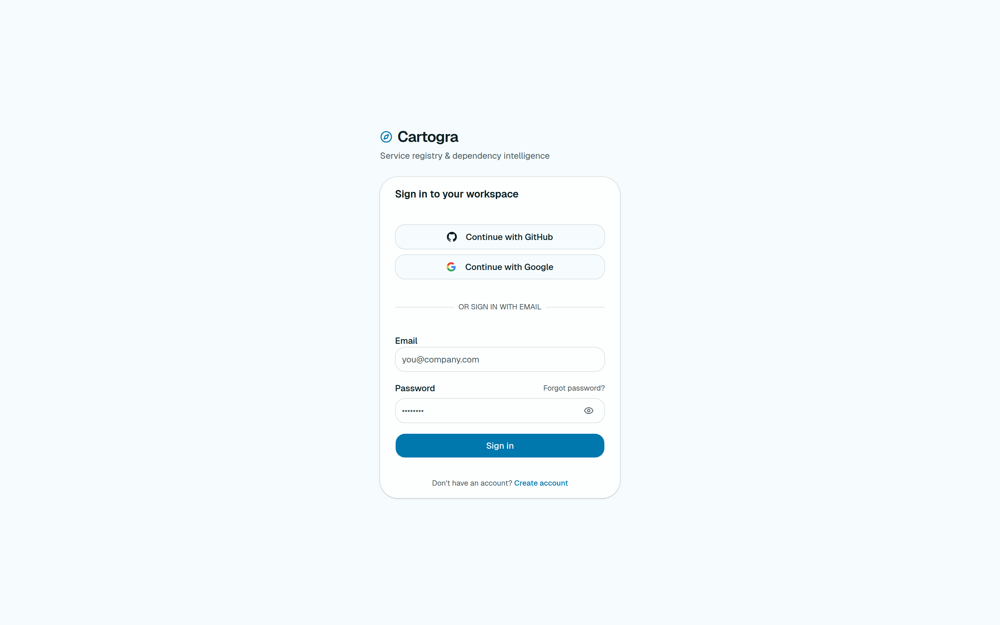

Local email + password with OTP verification, Google and GitHub OAuth, and per-tenant OIDC federation for enterprise customers — all issued by the gateway, which is the *only* token authority in the system. Sessions use httpOnly JWT cookies with silent refresh; API clients use bearer tokens.

### Architecture health at a glance

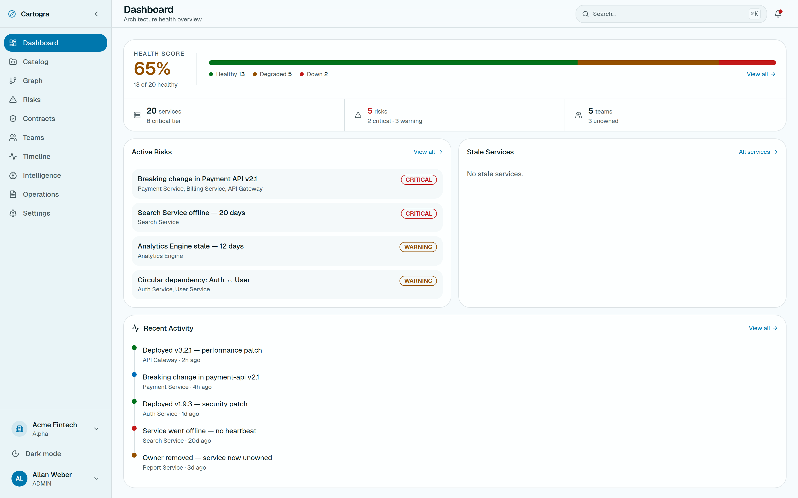

A single health score derived from live probe results, plus service counts by tier, unowned-service counts, and the active risk feed. Every number is a link into the screen that explains it.

The whole product ships light and dark themes from one token set:

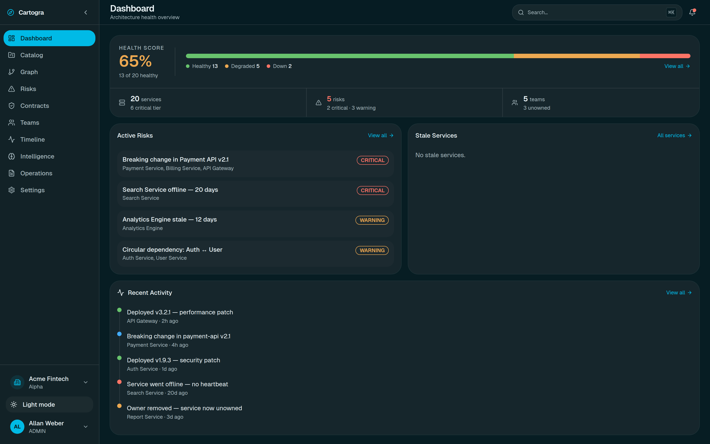

### A catalog that fills itself

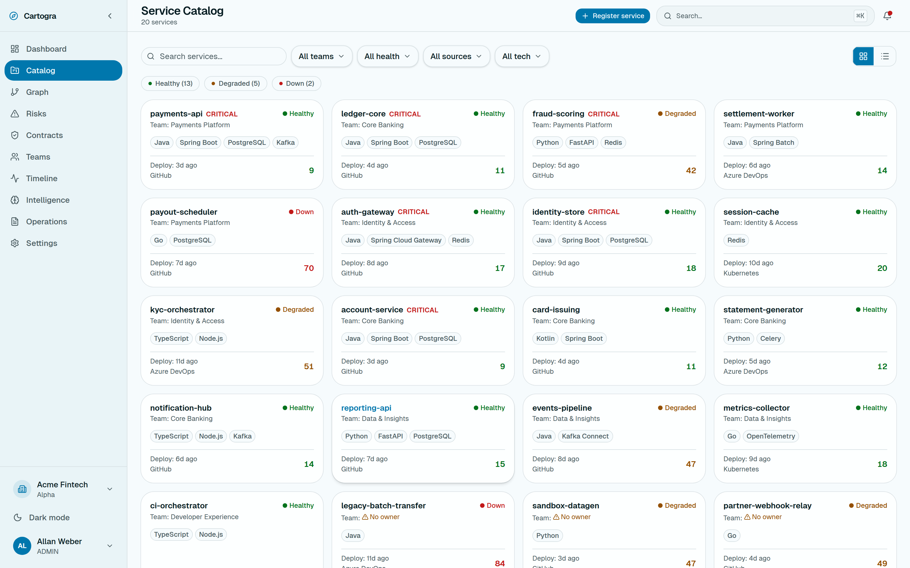

Twenty services here were discovered from two SCM connections and one Kubernetes cluster — not typed in by hand. Each card carries health, criticality tier, detected tech stack, deploy recency, a risk score, and an explicit **No owner** warning where CODEOWNERS resolution failed.

Filtering is server-side: PostgreSQL full-text search (`to_tsvector`/`plainto_tsquery` behind a GIN index) combined with team, health, source, and tech-stack facets, all paginated at the API.

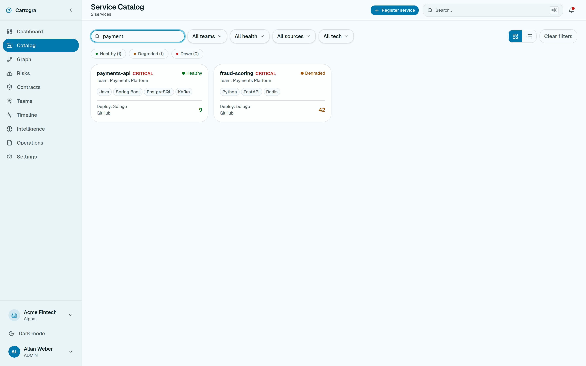

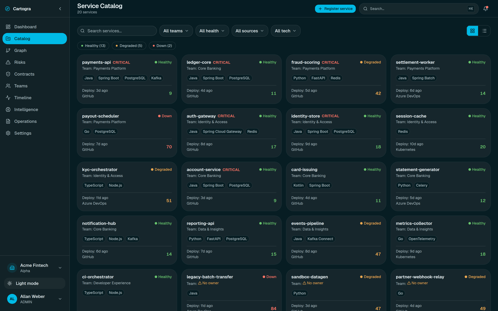

### Deep service profiles

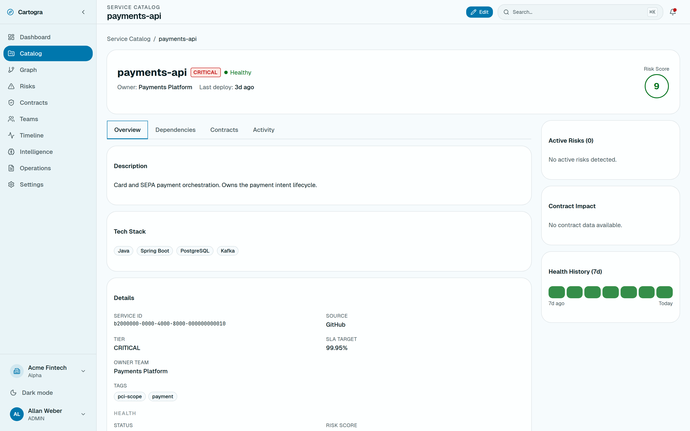

Description, owner, tier, SLA target, tags, repository provenance, last commit and deploy, plus a rolling health history built from scheduled probes. Tabs for dependencies, contracts, and activity give each service a single page an on-call engineer can act from.

### Ownership as a first-class feature

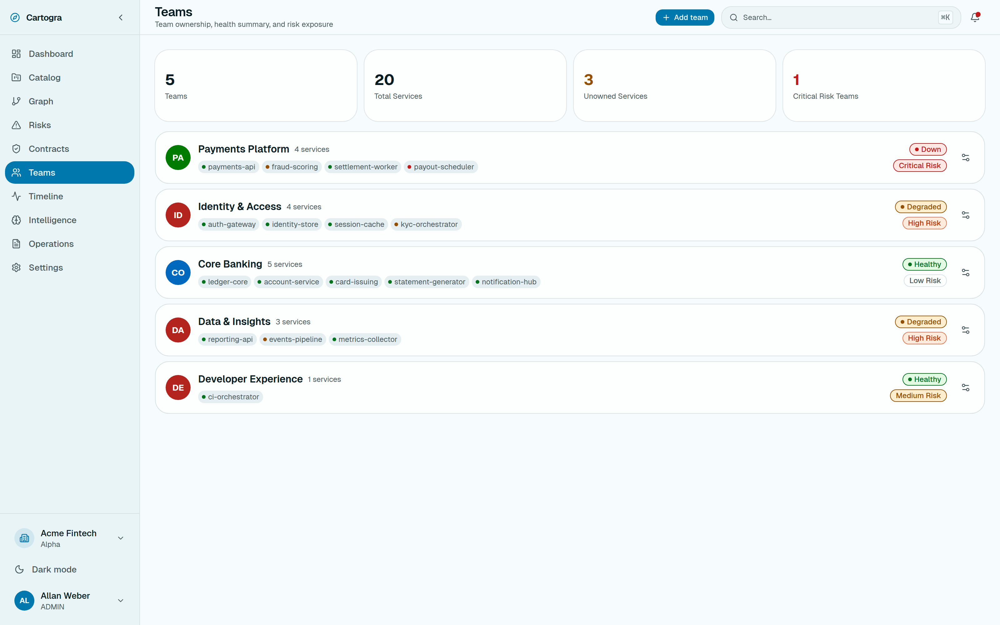

Teams own services; membership is checked live on every mutating request rather than baked into a token, so revoking access takes effect immediately. Ownership can be resolved automatically from CODEOWNERS, and a manual override always wins.

### Risk, change, and history surfaces

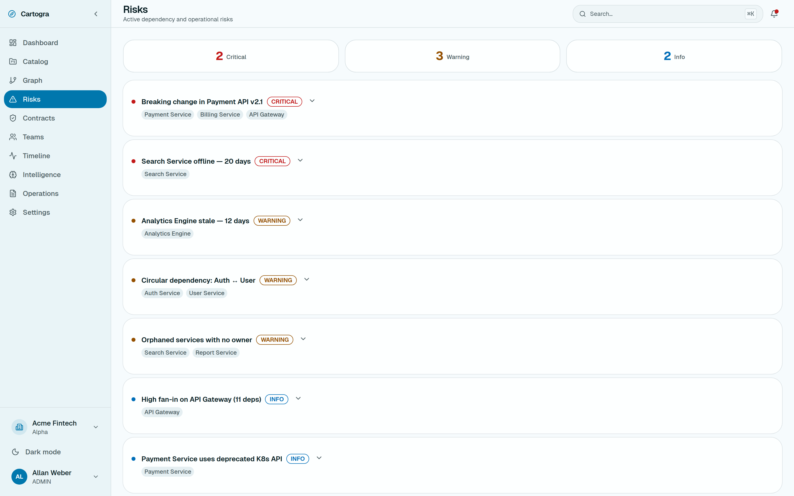

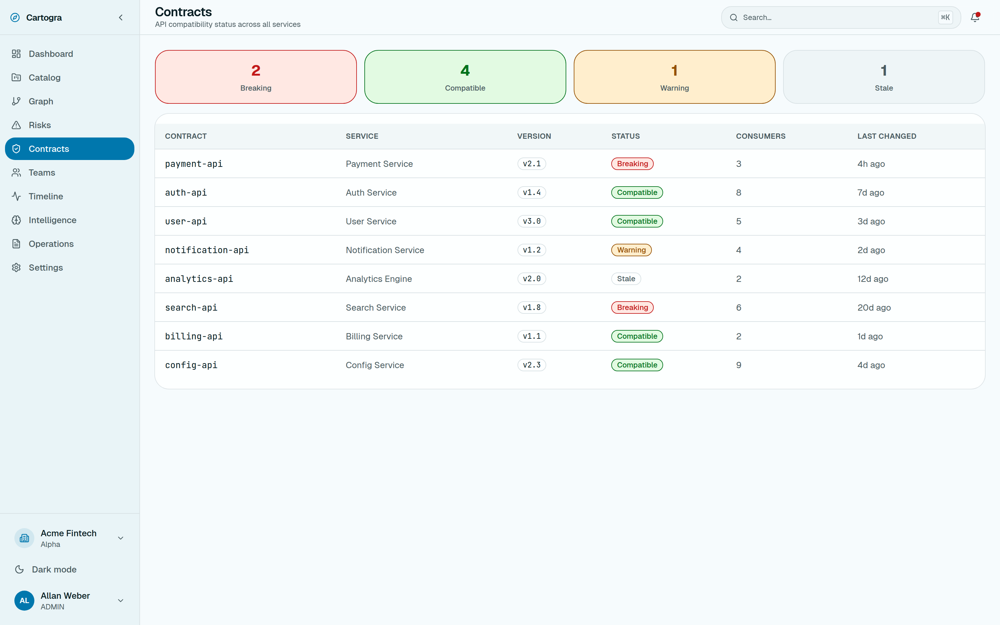

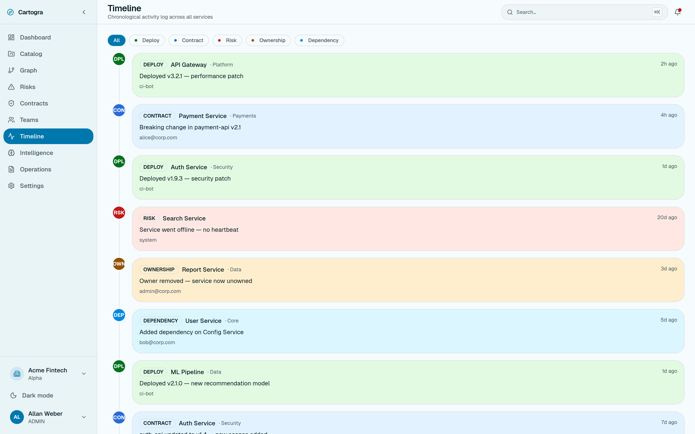

Risk triage, API contract compatibility, and the audit timeline are designed and built in the UI; their backing services are the next phases on the roadmap. The screens above render the shipped interaction model against placeholder data.

### Integrations that do the harvesting

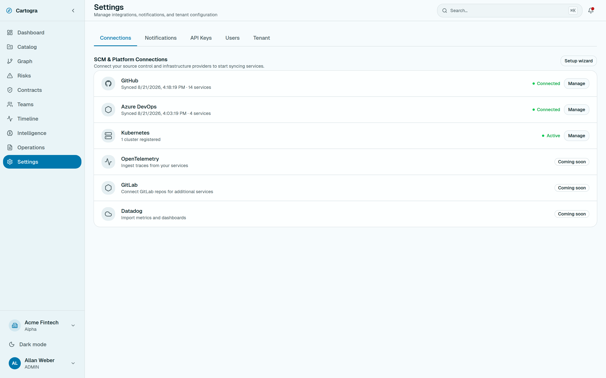

GitHub and Azure DevOps connections sync on a schedule *and* on webhook push (with provider signature verification), detect each repository's tech stack, resolve ownership from CODEOWNERS, and emit discovery events. A Kubernetes watcher tracks namespaces labelled for the tenant and derives health from endpoint readiness.

### Administration and plan governance

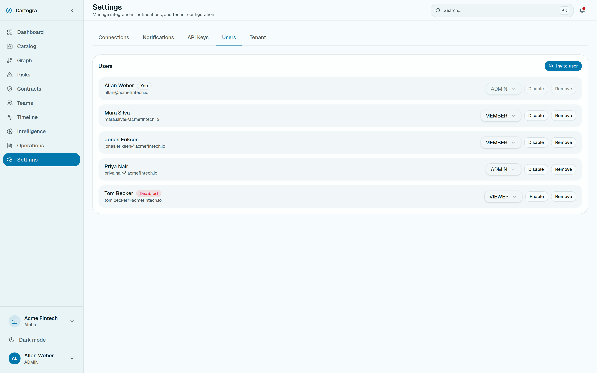

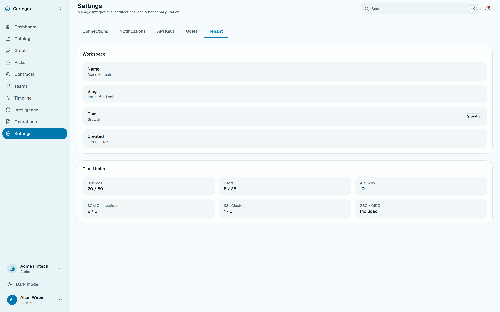

Invitations, role changes, user disable/enable, and per-plan quota enforcement (services, users, API keys, connections, clusters) with usage shown against the tenant's limits.

### Keyboard-first navigation

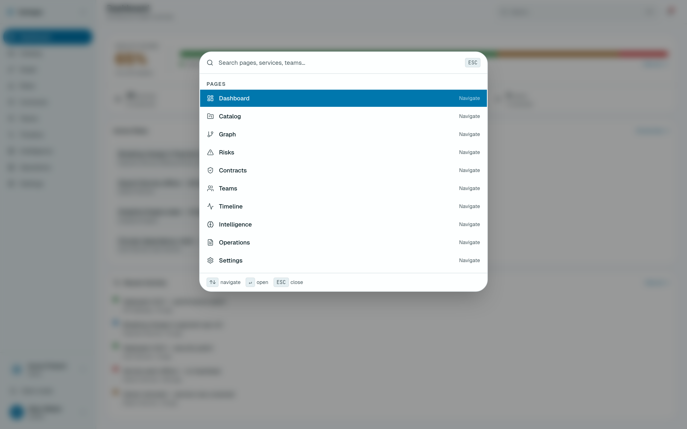

⌘K opens a command palette that spans pages, services, and teams.

---

## Architecture

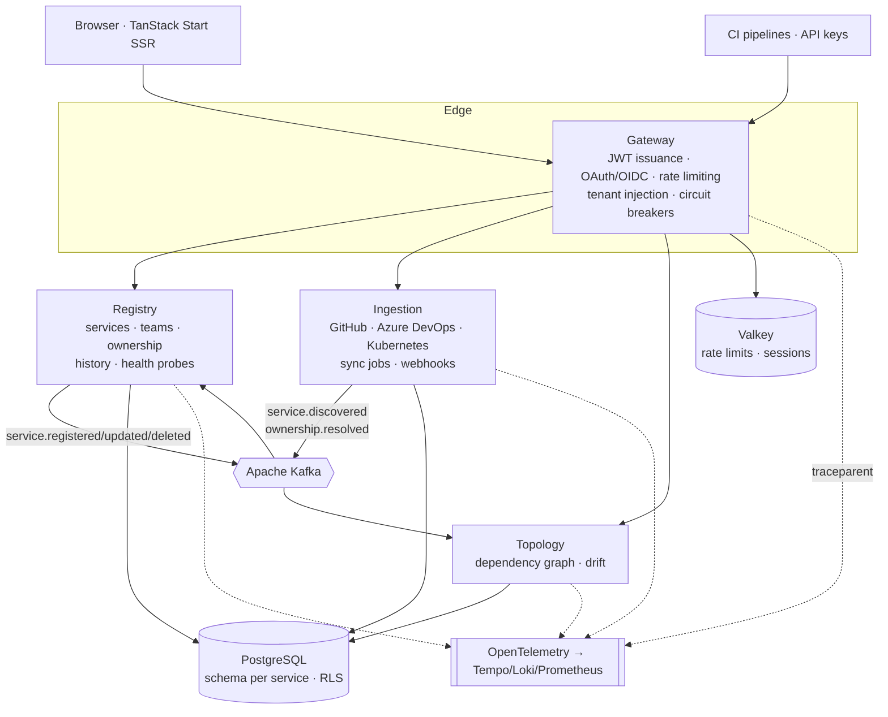
```mermaid
flowchart TB
    Browser[Browser · TanStack Start SSR]
    CI[CI pipelines · API keys]

    Browser --> GW
    CI --> GW

    subgraph Edge
        GW[Gateway<br/>JWT issuance · OAuth/OIDC · rate limiting<br/>tenant injection · circuit breakers]
    end

    GW --> REG[Registry<br/>services · teams · ownership<br/>history · health probes]
    GW --> ING[Ingestion<br/>GitHub · Azure DevOps · Kubernetes<br/>sync jobs · webhooks]
    GW --> TOP[Topology<br/>dependency graph · drift]

    ING -- service.discovered<br/>ownership.resolved --> KAFKA{{Apache Kafka}}
    KAFKA --> REG
    REG -- service.registered/updated/deleted --> KAFKA
    KAFKA --> TOP

    REG --> PG[(PostgreSQL<br/>schema per service · RLS)]
    ING --> PG
    TOP --> PG
    GW --> CACHE[(Valkey<br/>rate limits · sessions)]

    GW -.traceparent.-> OTEL[[OpenTelemetry → Tempo/Loki/Prometheus]]
    REG -.-> OTEL
    ING -.-> OTEL
    TOP -.-> OTEL
```

**Flow that makes the catalog self-maintaining:** a push webhook or scheduled sync starts an Ingestion job → repositories are scanned, tech stacks detected, CODEOWNERS parsed → `service.discovered` and `ownership.resolved` events are published → Registry upserts idempotently on `(tenant_id, external_id)` and assigns the owning team → lifecycle events flow onward to Topology for graph construction. No human edits a catalog entry.

---

## Engineering highlights

**Multi-tenancy enforced in depth.** `tenant_id` on every domain table, every repository query filtered by it, PostgreSQL row-level security policies as a database-level safety net, and a gateway filter that strips any client-supplied `X-Tenant-Id` and re-injects it from the validated token. Three independent layers, because one is a single point of failure.

**One response contract, everywhere.** Every endpoint returns `{data, traceId}` or `{error: {code, message, details}, traceId}`, where `traceId` is the 32-hex OpenTelemetry trace ID, mirrored in the `X-Trace-Id` header and in every structured log line. A user reporting a failure can quote the ID from the error toast, and the exact request is retrievable in Tempo.

**Idempotent event choreography over orchestration.** Consumers dedupe on UUIDv5 event IDs, discovery upserts key on `(tenant_id, external_id)`, and failures route to per-topic dead-letter topics with manual acknowledgement preserving failure semantics. No distributed transactions, no saga coordinator.

**Failure isolation at the edge.** Each gateway route carries a Resilience4j circuit breaker; an open breaker returns an envelope-shaped `SERVICE_UNAVAILABLE` rather than a raw proxy error, and breaker state is exposed as a health *detail* that deliberately never flips the aggregate status — a gateway that fails readiness during a downstream incident makes the incident worse.

**Concurrency handled honestly.** Virtual threads for I/O-bound work throughout, PostgreSQL advisory locks to close a plan-limit TOCTOU race, and a debounced materialized-view refresh (advisory-locked, `REFRESH … CONCURRENTLY`) so bursts of graph writes collapse into one rebuild without blocking readers.

**Decisions are written down.** Architecture Decision Records cover the choices that would otherwise be re-litigated: PostgreSQL recursive CTEs instead of a graph database, Spring Data JDBC instead of JPA, gateway-as-sole-token-issuer, circuit breaking via route filter rather than per-service clients, and event choreography over sagas.

**Frontend discipline.** Named exports, one component per file, TanStack Query for every server interaction (no raw `fetch` in components), skeleton loading and error states carrying the trace ID, shadcn/ui primitives on Tailwind tokens, WCAG AA contrast, and full keyboard navigation.

---

## Quality and delivery

| Practice | Detail |
|---|---|
| **Testing** | 84 backend test classes with Testcontainers-backed integration tests; 240 frontend tests across 22 suites (Vitest + Testing Library) |
| **CI** | GitHub Actions with path-filtered per-service builds, JaCoCo coverage artifacts, and a full-build workflow |
| **Security scanning** | Trivy on the filesystem *and* on every built image, failing the build on HIGH/CRITICAL; GitGuardian secret scanning on every PR |
| **Containers** | Multi-stage builds, non-root users, `MaxRAMPercentage` sizing instead of hard-coded heaps, health checks, and runtime images stripped of build tooling to shrink the CVE surface |
| **Database** | Flyway-owned schema per service, 21 migrations, `TIMESTAMPTZ` everywhere, soft deletes, JSONB with GIN indexes |
| **Observability** | OpenTelemetry on every service, W3C `traceparent` propagated across HTTP *and* Kafka headers, structured JSON logs correlated by trace ID |

---

## Roadmap

The catalog half of the product is live. The differentiator — dependency intelligence — is under construction, sequenced so each phase ends in something demonstrable:

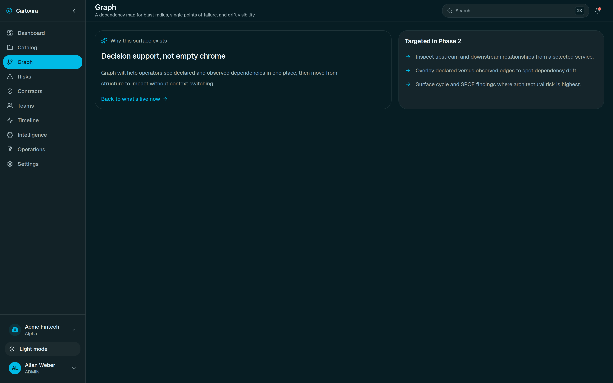

1. **Dependency map** — declared dependencies, D3 force-directed graph, nodes projected from registry events
2. **Impact answers** — blast radius via recursive CTEs, cycle detection, single-point-of-failure scoring, risk aggregation
3. **A map that maintains itself** — observed edges derived from OpenTelemetry spans, declared-vs-observed drift detection and resolution
4. **Public demo** — audit trail, guest read-only mode, seeded demo tenant
5. **Change safety** — OpenAPI/AsyncAPI contract store, structured diffs, breaking-change engine, CI check that blocks merges
6. **Intelligence** — deterministic anti-pattern detection with an LLM narrative layer over the evidence, and guarded natural-language queries

The full plan, with acceptance criteria and phase gates, lives in [`docs/roadmap.md`](../docs/roadmap.md).

---

## Running it locally

```bash
docker compose -f infra/docker-compose/docker-compose.yml up
```

Brings up PostgreSQL, Valkey, Kafka, and the gateway, registry, ingestion, and topology services; the frontend runs with `pnpm dev` in `frontend/`. Each service owns its schema and applies its own Flyway migrations at startup.

---

## About these screenshots

Captured from the real application driven by Playwright, against an **Acme Fintech demo tenant** — twenty services across five teams, including three unowned services and a mix of health states — rather than production data. The Risks, Contracts, and Timeline screens render the shipped UI against placeholder data while their backing services are built; every other screen shown is wired to real APIs.
